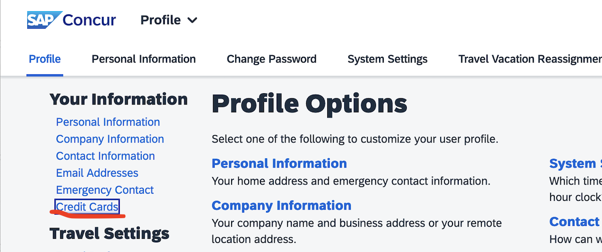

## Adding your Card to Concur

You must do this before submitting reimbursements. This is where Concur will send reimbursements. It is also the cards which Concur will look for **on the receipts** (the last 4 digits on the receipt must match one of the cards on your file).

### Tutorial:
1. Go to my.rutgers.edu > Apps > Concur Travel & Reimbursements

2. Select your profile icon and select "Profile Settings"

3. Scroll down to "Credit Cards" section (or select "Credit Cards")
4. Press "Add a Credit Card"

5. Add in your card information and billing address, and press "Save"

-> Now your card should be in the list of cards. 

