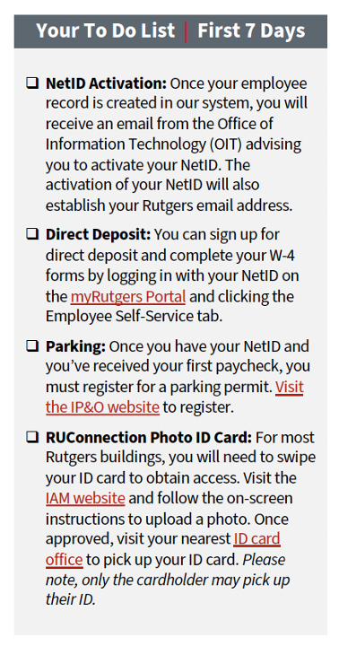
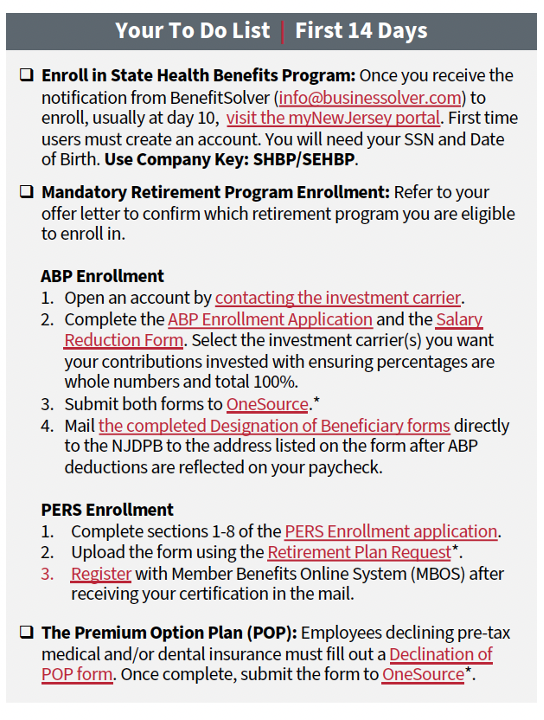

# Hiring & Admin Setup Timeline 
Date: May 1, 2025 1:27 PM
---
**Table of Contents**
1. TOC
{:toc}
---

***Important notes:***

- Healthcare coverage doesn’t start until 2 months after your start date
- Background check process can take up to 15 business days (3 weeks)
- After background check, 1-2 health visits are necessary to do a physical and TB exposure testing, usually in person in New Brunswick (see below)
- Start date isn’t confirmed until all these processes have happened

## Interview / Selection Process (Holmes Lab):

1. Apply to the lab
2. Interviews with Avram (and possibly others in the lab)
3. When asked, send contact information for your references and they'll be contacted
4. Receive notice that you have been selected by the Holmes Lab for the position
5. Holmes Lab notifies HR that a candidate has been selected and sends your contact information
6. Receive application from HR
7. Submit application to HR (including your references and their contact information - they will be contacted again)
8. HR contacts your references
    1. Minimum time this takes: 5 business days
9. Receive notice you have been selected by Rutgers for the position, get email with hiring forms:
    1. Minimum time this takes: ~10 business days

## Hiring Process (after selection):

### Review and return documents from HR 
1.  Contingent Offer Letter 
    Action: Please Review and if acceptable, sign and return to HR.
2. Rutgers Vaccination Portal e-mail confirmation 
    Action: Upload vaccine documentation
3. Staff Information Sheet 
    Action: Complete & Sign, email back to HR. Please note that “National ID” is your Social Security Number.
4.  Confidentiality Agreement 
    Action: Review & Sign, email back to HR.
5. Job Description 
    Action: Review and Sign, email back to HR.
6. Professional Credentials 
    Action: Copies of licenses/certifications required for position if applicable, shouldn't be necessary. 
    
### Background Check process
7. After returning all the above forms, wait to receive an auto-generated background check link from HireRight within 2-5 business days
8. Receive link
    1. Once you receive the link, fill out and submit background check within the stated amount of time to HireRight (including contact information for bosses who can verify 1 year of employment, and three references, who will be contacted to fill out a survey about you)
9. Within 2 weeks of background-check submission, HR should notify you if you've passed the background check
    1. Minimum time this takes: Up to 10 business days

### Pre-placement Health Exam Process
10. Call [EOHSI RBHS Employee Health Services](https://eohsi.rutgers.edu/clinic2021/) at 848-445-0123 or clinic@eohsi.rutgers.edu and schedule a time to go **in person to New Brunswick, NJ*** for a 'pre placement exam' in person.
    Address: 170 Frelinghuysen Road, Piscataway, New Jersey 08854
    1. **If you will be interacting with patients, you will need to make TWO times.** You be required to do a Tuberculosis exposure test, which means you will have to **return to the EOHSI building in ~48 hours to get your test read.** This means you have to schedule your test in a way where you **are available to return ~48 hours later** to Rutgers- New Brunswick in person to get the test read
    2. Schedule physical: They’ve got a lot of opening for this, but you have to find a time you can go in person to New Brunswick either 1 day going in or 2 days spaced 48hrs apart, ie Monday & Wednesday
    **If you are not by New Brunswick, you can schedule with a local clinic, but you'll have to talk to the EOHSI to coordinate doing this at a local clinic where you are!** 

    When you schedule a pre-placement exam, bring:
    - A completed Employee Health Questionnaire. The questionnaire will be given to
    you by Human Resources.
    - A record of your vaccinations (*unless you've already put them in the vaccine portal mentioned above):
        - COVID 19*
        - Measles*
        - Rubella*
        - Varicella*
        - Hepatitis B* if drawing blood or doing procedures that may result in
        bloodborne pathogen exposure
        - Flu* (during flu season either a record of vaccine or declination from)
    - Your job/position description included your unit, institute, or school, and
    department
    - A record of a recent TB skin test (if performed in the last year)*
        - If missing vaccinations or a recent TB skin test, they will be provided.
        
    Please call the clinic at 848-445-0123 to make an appointment for a pre-placement exam. If they
    are unable to answer the phone, please leave a message and they will return your call.
    The clinic hours are 8AM to 4PM. The last patient is scheduled at 3PM

11. After your pre-placement exam (or, after your TB-exposure test has been read 48hrs after your physical, if you interact with patients), the EOHSI will send HR notification that you've received medical clearance, and should send you an email the next day about when you'd like your start date to be.
    1. Time this takes: 1-3 business days

### Start Date & New Employee Orientation
12. Talk to Avram about a start date
13. Propose a start date to HR
    1. Should be a Monday so you can go to a New Employee Orientation
    2. Should be a few days to a week from the date you send the email requesting the start date, so you have time to do the pre-Orientation tasks and get your NetID
14. They will respond with whether that start date is accepted (they have to check with the department of Psychiatry, but it shouldn't take more than a day)
    1. Time this takes: 1 business day
15. Once it is confirmed, you will receive information in your email:
    1. Final Offer Letter (to review, sign and send back)
    2. Your scheduled New Employee Orientation (New Employee Orientation sessions will be held each Monday at 8:30 a.m.- Noon in the University Human Resources Community Room, ASB II on the G.H. Cook Campus.)
16. You'll receive another email about the date of your New Employee Orientation (NEO), with all the relevant New Hire materials and information.
    1. This will be on the closest MONDAY to your start date

## Tasks before New Employee Orientation
1. Let the lab (lab manager or PI [holmes@rutgers.edu](mailto:avram.holmes@rutgers.edu)) know when your New Employee Orientation is scheduled for. If you’re planning on driving, send your car information (make, model, year, license plate) so that the department can issue you a guest parking permit.
    1. If you’re planning on taking public transport, check out [Transit and Transportation on Rutgers NB Campus](https://rutgers.box.com/s/oubs9ulm23qwxuy85ahbe2yvcz7fn46c) document
2. Make sure to upload a photo for your ID to [online photo submission website](https://ipo.rutgers.edu/publicsafety/iam/online-photo-submission)then you will be given your photo ID at orientation
3. Look over benefits information before orientation, so you can ask any questions then
    1. [Benefits for Full-Time Employees](https://uhr.rutgers.edu/benefits/enrolling-benefits-full-time-employees)
4. New employees should complete section I of the I-9 by the end of their first day of employment. A list of acceptable documents needed for the I-9 can be found [here](https://uhr.rutgers.edu/docs/acceptable-documents).
5. Within a few days, you should also receive a link in your email to activate your NetID.
    1. Then activate your [Rutgers NetID](http://netid.rutgers.edu/)
        1. Make sure your password is secure but also memorizable- you have to enter it a LOT

Time this takes: I would give 2 business days minimum for this, including getting and activating NetID and getting parking pass from Holmes Lab.

## Admin Tasks: First Week of Work
1. Attend orientation process, receive ID
2. Register for parking permit if you want to, though many Holmes Lab members park in a nearby residential area as parking is not free or reimbursed by Rutgers. See parking details in this doc: [Transit and Transportation on Rutgers NB Campus](https://rutgers.box.com/s/oubs9ulm23qwxuy85ahbe2yvcz7fn46c)
3. Set up direct deposit to your bank in [My Rutgers Portal](https://my.rutgers.edu/portal/render.userLayoutRootNode.uP?uP_root=root&uP_sparam=activeTab&activeTab=2) on your profile
4. Check out apps and information in [My Rutgers Portal](https://my.rutgers.edu/portal/render.userLayoutRootNode.uP?uP_root=root&uP_sparam=activeTab&activeTab=2)
5. Activate tools in RU Tools [https://tools.rutgers.edu/manage/services](https://tools.rutgers.edu/manage/services)
    1. This includes Zoom, Box, Gmail, VPN
6. Set up email forwarding for 2 email domains:
    1. Exchange-- this is your [netid@rwjms.rutgers.edu](mailto:netid@rwjms.rutgers.edu) email, your [last@rutgers.edu](mailto:first.last@rutgers.edu) email, and any other email name you want to set up for [____@rutgers.edu](mailto:____@rutgers.edu)
    2. Gmail—this is your [netid@scarletmail.rutgers.edu](mailto:netid@scarletmail.rutgers.edu), which you activate on RU Tools
7. Learn how to access the Rutgers VPN: [Connecting to Rutgers VPN](https://rutgers.box.com/s/khcapgqy8po59iibiizrpzuhzfq1rr70)
8. Start setting up access to compute cluster, Amarel: [Amarel Compute Cluster Setup Instructions](https://rutgers.box.com/s/yq0flxz364tb9vnyriemgbbt160fimjg)
9. Make sure you have access to:
    1. BOX Folder of Rutgers Materials: [Rutgers Wiki on Box](https://rutgers.box.com/s/y27w3g4wfbjads691ewq7o83830rs082)
    2. Lab Wiki on PBWorks [https://holmeslab.rutgers.edu/](https://holmeslab.rutgers.edu/) > “Lab Wiki” > Username and Password

## Admin Tasks: Second Week of Work
1. First paycheck
    1. In mail if you haven’t set up direct deposit
    2. Or Direct Deposited
2. Enroll in healthcare/benefits
3. Optional tax savings plans, investment plans, pension plans.
4. Add your personal cards to Concur if you'll do anything which will require reimbursement: [Adding Your Card to Concur](https://holmeslab.github.io/holmeslab/docs/Admin/add-card-to-concur). (Such as, travel, some subject payments, etc)

## After 2 Months of Work
- Healthcare coverage starts