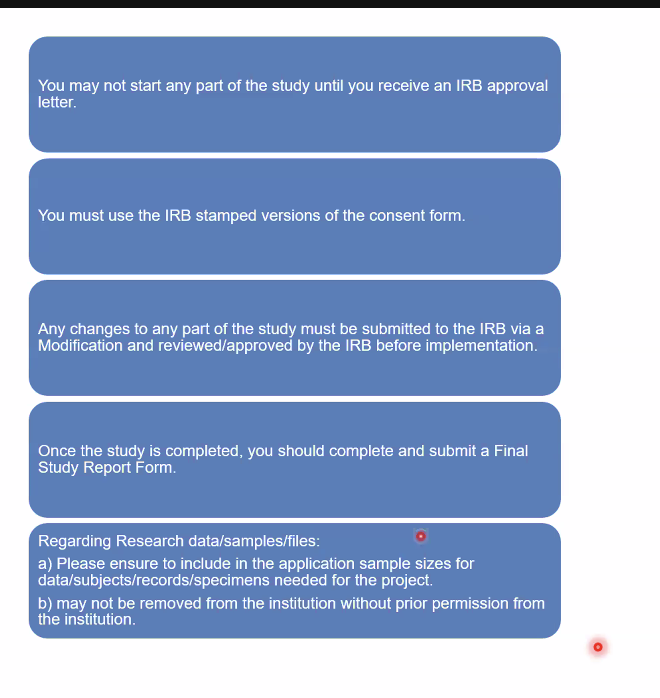

# IRB Submission
### Key Websites: 
- Submitting IRBs: [https://eirb.rutgers.edu/](https://eirb.rutgers.edu/) 
- Single IRB review / multi site IRBs / Reviewing IRBs / Reliance IRBs: [https://smartirb.org/](https://smartirb.org/) 
- Reliance IRBs: [https://reliance.smartirb.org](https://reliance.smartirb.org/)

### Our Active IRBs are listed by protocol number in the box at `Holmes_Lab_Wiki/Active_IRBs`

---
**Table of Contents**
1. TOC
{:toc}
---
    
## Documents Needed for IRBs
- Protocol
    - May be within the application/questions or may be attached as word doc based on structure (new/old) of IRB
- Recruitment
    - ALL flyers/recruitment ads
- Consent forms
    - Consent forms with the exact language used on Qualtrics/online instruments
- Scales
    - ALL scales with the specific questions and mirroring what is seen on Qualtrics/online instruments
- Attachments
    - CITI courses for each person
    - Any relevant data use agreement, approvals, resource information, etc. 
    - Sometimes the grant pdf
    - If necessary: Scientific Review Board approval

## Resources
- IRB Submission Help: [IRBOffice@research.rutgers.edu](mailto:IRBOffice@research.rutgers.edu)
- Tech Support: [eIRB@research.rutgers.edu](mailto:eIRB@research.rutgers.edu)
- Guidance: [Human Subjects Protection Program (HSPP) Toolkit | Rutgers Research](https://research.rutgers.edu/researcher-support/research-compliance/human-subjects-protection-program-toolkit)
- Templates, Forms & Procedures: [HRPP Research Protocol Templates](https://research.rutgers.edu/researcher-support/research-compliance/human-research-protection-program/toolkit)
- [(HRP-103) Investigator Manual: A Guide To Human Subjects’ Protection In Research](https://research.rutgers.edu/sites/default/files/2022-02/hrp-103_-_sop_-_investigator_manual_a_guide_to_hspp_1.21.22.pdf) 
- eCOI [Quick Start Guide](https://uec.rutgers.edu/wp-content/uploads/eCOI-Quick-Reference-Guide53.pdf)
- [eIRB Quick Reference Guide for Investigators](https://research.rutgers.edu/sites/default/files/2021-04/eirb_quick_reference_guide_for_investigators_11.8.16_v2.pdf)
- [eIRB User Manual For Research Staff](https://holmeslab.github.io/holmeslab/docs/Admin/irb-submission/irb/eirb_quick_reference_guide_for_investigators_11.8.16_v2)
- [Smart IRB Learning Center](https://smartirb.org/study-teams/)  
- [sIRB 101: An Introduction to Relying on an External IRB](https://info.advarra.com/sirb101-wbnr-od.html)


## Tips on Submissions
- All documents submitted in ‘clean’ and ‘tracked’ forms
- Clean version of each document and tracked version showing the changes from the last approved version of this document
    - Save as <name>_clean.docx and <name>_tracked.docx
    - Easiest to copy the clean version of the approved document, select Review > “Track Changes” on Word, then make your edits for that amendment. Once you’re ready to submit, duplicate the tracked version and then select Review > “Accept All Changes” to create a clean version with all your updates
    - If you have a clean version of the updated file, create a tracked version of this by going to Review > Compare > Compare Documents. Upload the original version and then the new version, and it will create a new document for you.
- Use lay-person language- IRB staff are not experts in your field
- Don’t use undefined acronyms or jargon
- Don’t use Google docs / excel for data storage or study documents storage - not approved for research purposes
    - If you’re using Rutgers-sponsored application for data storage/software, like MS Office, Box etc, reference that they’re Rutgers
    - If you’re using not Rutgers-sponsored, you must include the app privacy information


## How to Add People to eIRB
1. Sign into with your NetID
    1. Make sure your profile lists the correct affiliation
    2. Make sure you’ve completed your necessary CITI courses (Aka Basic course: social-behavioral research OR Basic Course: biomedical study)
2. First page— select “Rutgers Health and Biomedical Sciences” Because we’re under RWJHS
3. If study staff or co-investigators have completed CITI courses but they weren’t submitted via their Rutgers email and they haven’t transferred over, you can attach the CITI certificate of completion in the “Additional Supporting Documents” page 
    1. See steps below for doing CITI courses
4. If you have Co-investigators, select “Notify co-investigators” in ***My Activities***. They need to accept the invitation to be a co-investigator.
5. Each person (co-investigators, study staff, etc) all must complete and submit a eCOI financial disclosure form (see steps below)
6. If you are ready to submit, the PI must submit the study under his/her ***My Activities*** section. (Study coordinator, staff, collaborators etc. cannot do this, only the single specified PI)
7. If you get reviewer notes, you can find them in the “History” section or “Reviewer Notes” section
    1. You must ‘reply’ to each comment by the reviewer, as well as fixing it
    
### eCOI, Institutional Affiliation, CITI Courses
If anyone listed on the IRB needs to submit an eCOI, Institutional Affiliation or CITI Course, you’ll be emailed an alert. Below are the procedures for each of these steps:

### **eCOI Disclosure**
1. Log into the eIRB with your netID at this link: [eirb.rutgers.edu](http://eirb.rutgers.edu) 
2. If you’re already part of an IRB, select that IRB
3. On the left-hand side, under “My Activities”, select “Submit eCOI Disclosure”
4. Follow the steps to submit the disclosure.
***Helpdesk**: eCOI holds helpdesk sessions on Wednesdays from 1:30pm-2:00pm and Thursdays from 10:00am-10:30am. There is no appointment necessary to join the helpdesk sessions. You can find Zoom links and information by visiting the [eCOI+ FAQs](https://research.rutgers.edu/researcher-support/research-compliance/conflict-interest).*

### **Institutional Affiliation**
1. Have the study staff log into eIRB.
2. Click on the ‘My Profile’ tab on the personal page.
3. Click on the person’s Profile’.
4. Click on the ‘Institutional Status’ tab.
5. Click on ‘Institutional Affiliation’.
6. Select the appropriate Institutional Status.
7. Click on ‘Apply’ (edited)

### **CITI Course Completion**

*Follow these steps to see what action you need to take regarding CITI courses.*
1. Have you completed any CITI course before?
    1. YES – go to Step 2
    2. NO – go to Step 4
2. Is it any of these courses?
- *Log into your account at [citiprogram.com](http://citiprogram.com) to see what courses you’ve taken. (If you’ve taken them at another institution, log into your account with that institution’s login.)*
    - “Biomedical / Clinical Research Investigators **Basic”**
    - “Social & Behavioral Research **Basic”**
    - “Biomedical Research **Basic/Refresher”**
    a.    YES – Go to step 3
    b.    NO – Go to step 4
3. Log into [CITIprogram.com](https://www.citiprogram.org/index.cfm?pageID=14) (Click ‘Log in through my organization’ and specify ‘Rutgers the State University’) with your Rutgers NetID. Are any of the required courses listed under “Completed Courses”?
    1. YES – Go to step 5
    2. NO – You need to link your completed CITI courses with your Rutgers NetID. Let the lab manager know this!
4. Log into [CITIprogram.com](https://www.citiprogram.org/index.cfm?pageID=14) (Click ‘Log in through my organization’ and specify ‘Rutgers the State University’) with your Rutgers NetID.
    1. Complete **one** of these courses:
        - “Biomedical / Clinical Research Investigators **Basic”**
        - “Social & Behavioral Research **Basic”**
        - “Biomedical Research **Basic/Refresher”**
    2. It will take 1-2 hours to complete.
    3. Once you are done, make sure the course is listed under ‘Completed Courses’
5. Check the expiration date on your course(s)— are any of them still active?
    1. YES - if they’re not expired, 

# After getting IRB Approval:


**you must do these things, otherwise you’ll be put on probation

### Reporting to IRB
[**Didn’t Expect that to Happen: Events that must be Reported Promptly to the IRB**](https://info.advarra.com/didnt-expect-that-to-happen-wbnr-od)


## How to Create a Modification
1. Create folder in the relevant IRB folder named by the amendment number (eg `MS3` for Rutgers). 
2.  For the documents you want to edit in this modification, copy the most recent approved version of that doc from the Currently Approved Docs folder
3.  Create a tracking document (text file or word doc) in the folder called `MS#_description_of_changes`.
4.  Rename the document from "_clean" to "_tracked". Open the document to edit and turn on 'tracking changes' (under 'Review' tab).
5.  Create any changes you'd like to make for the modification, with tracking on.
6.  Describe all the changes you make in the  AME#_description_of_changes doc.
7.  Once you've made all the changes necessary, create a clean version of the document by duplicating the "_tracked" document, renaming the copy to "`_clean`", opening the document in word, highlight the whole document with command+A, click Review > Track Changes > Accept all changes. Now there should be a popup saying "there are no tracked changes in your document." Press "OK" and then save the document. Now this document should reflect all the newest changes without any actual 'tracking' marking up the document.
7.  Upload the `_tracked` and `_clean` versions of the document to the modification in eIRB
8.  Copy and paste the description of changes into the relevant field for the modification
9.  When it gets approved, add the ReviewLetter to [`Approval_letters`] folder (if relevant)
10.  Update all the new approved docs in the Currently Approved Docs folder, so that it reflects the most recent docs


## File structure

- Files located at `/Box-Box/Holmes_Lab_Wiki/Active_IRBs`
- Files should be tracked using this structure:
    
    **Original Submission Folder Structure**
    
    ```bash
    ├── orig_ProNUMBER # ProXXXXXX
    │   ├── Protocol 
    │   ├── Scales
    │   ├── Consent 
    │   ├── Attachments 
    
    ```
    
    **Example Amendment Folder Structure**
    
    ```bash
    
    ├── MS3_in_progress #change to 'approved' or 'rejected' when updated
    │   ├──  Attachments
    │   │   ├── CAHBIR MRI Participant Screening Form.pdf
    │   │   └── MGB_Local_Context_Form_IRB_Protocol-Specific.pdf
    │   ├── Consent
    │   │   ├── R01_Consent_Form_250403_clean.docx
    │   │   └── R01_Consent_Form_250403_tracked.docx
    │   ├── CCNP Recruitment Materials
    │   │   ├── Example Reddit Post CCNP.png
    │   │   ├── Flyer CCNP.pdf
    │   │   ├── Holmes_01_CON_Flyer.pdf
    │   │   └── Holmes_01_SCZ_MDD_BP_Flyer.pdf
    │   └── changes_MS3.txt
    ```
    
    **Current Approved Docs folder**
    
    - Put the most current approved versions of docs
    - This is because the updated docs will be scattered across multiple amendment folders making it difficult to keep track of what is the most current form without going to the IRB website or looking through all folders
    
    ```bash
    ├── current_approved_docs
    │   ├── Protocol 
    │   ├── Scales
    │   ├── Consent
    │   ├── Attachments
    ```

