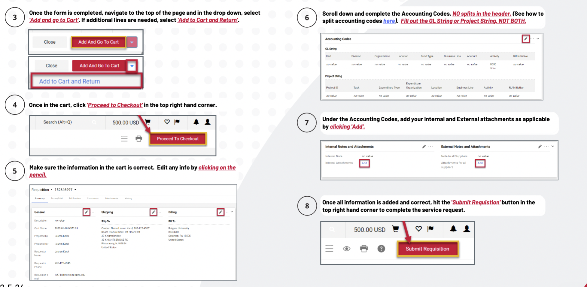

# Check Request Tutorial

Date: March 28, 2024 3:12 PM

### Check for Supplier Contract
1. See if the supplier has a contract
    1. Go to [my.rutgers.com](http://my.rutgers.com) → RU Marketplace (Jaegger) → Suppliers → Search Suppliers
    

### If the supplier has a Rutgers Contract…

1. If they’re in RU marketplace, look up their (supplier contract) name in [https://procurementservices.rutgers.edu/purchasing/](https://procurementservices.rutgers.edu/purchasing/dropbox-inc)
    1. Scroll to ‘Procurement Procedures’ section, it will list the necessary steps / forms
        1. Ex: for Dropbox [https://procurementservices.rutgers.edu/purchasing/dropbox-inc](https://procurementservices.rutgers.edu/purchasing/dropbox-inc) the procurement procedures section says purchasing requires:
            - Using the [Service Request Form](https://solutions.sciquest.com/apps/Router/SAMLAuth/Rutgers)
                - Attaching a “detailed” quote
            - Submitting + attaching a [Third Party Risk Assessment](https://rusecure.rutgers.edu/third-party-security-review-process)
        2. if they don’t have a contract on that site, but they do have a contract in RU Marketplace, I would look up which commodity code you’ll need in this form: [Commodity Codes - Which Forms Are Allowed](https://rutgers.box.com/s/4hdapczpt2l3wklkauijaultrvw9q9zf) (downloaded from Canvas link [List: Commodity Codes)](https://rutgers.instructure.com/courses/561/pages/list-commodity-codes-with-corresponding-forms?module_item_id=6208614) and make sure to use whichever form it says is allowable (ie Goods Request, Service Request or Quick Order)
2. For external attachments, (unless it says otherwise on the procurementservices link above), add a detailed quote and a third-party risk assessment.
    1. Detailed quote = screenshots of website showing cost, item, taxes and shipping
    2. Third Party Risk Assessment
        1. [Process for Third Party Risk Assessment [PDF]](https://rutgers.box.com/s/g1c6zgfegaiagp71wd7m6dsm1zt6wivs)
        2. Fill out [Third Party Risk Assessment Intake Form](https://forms.office.com/Pages/ResponsePage.aspx?id=IystuTVNcEST_2mspmMv_vNV1GTfz6VMtu11uPaiSw5UNjE5SERERlNaSFBMNkE2MjNWQlRKWlBJVSQlQCN0PWcu)
3. Now follow these steps  for Service Request submission, adding in any required documents in the “**External Attachments**” box
    
    
    
    
    

### If the supplier does not have a contract:

1. Find a contact person + email for the supplier company
    1. You’ll have to work with them to get them set up in the Rutgers system as a supplier in PaymentWorks
    2. Send them this information about payment methods
        
        
        
    3. Notify them that an invitation will be coming their way / ask them if they will accept it
2. Follow this Job Aid: [Supplier Onboarding Course Pathway in Canvas](https://rutgers.instructure.com/courses/31949/pages/job-aid-inviting-a-new-supplier-and-checking-onboarding-status?module_item_id=6484653) \
    
    
    
    
    
    1. After you [submit your invitation on PaymentWorks](https://www.paymentworks.com/app), you’ll be able to see the progress on there, as well as get emails
3. This is the email you’ll get when your PaymentWorks invitation has been approved and sent to your supplier
    
    
    
4. This is the email they’ll get from PaymentWorks
    
    
    
    5. This is the email you’ll get when they open/ start registration in PaymentWorks
    
    
    
    6. Once the supplier finishes their PaymentWorks portal, this is what PaymentWorks will look like
    
    
    
    1.  Look up which commodity code you’ll need in this form: [Commodity Codes - Which Forms Are Allowed](https://rutgers.box.com/s/4hdapczpt2l3wklkauijaultrvw9q9zf) (downloaded from Canvas link [List: Commodity Codes)](https://rutgers.instructure.com/courses/561/pages/list-commodity-codes-with-corresponding-forms?module_item_id=6208614) and make sure to use whichever form it says is allowable (ie Goods Request, Service Request or Quick Order)
    2. Now follow these steps  for Service Request submission, adding in a Detailed Quote 
        
        
        
        
        
    

 After it's been processed, it will get a PO and in the invoice tab on the PO, if you click on the invoice, after it's been paid you will be able to see the payment information. You will be able to see that it was mailed and what the check number is.