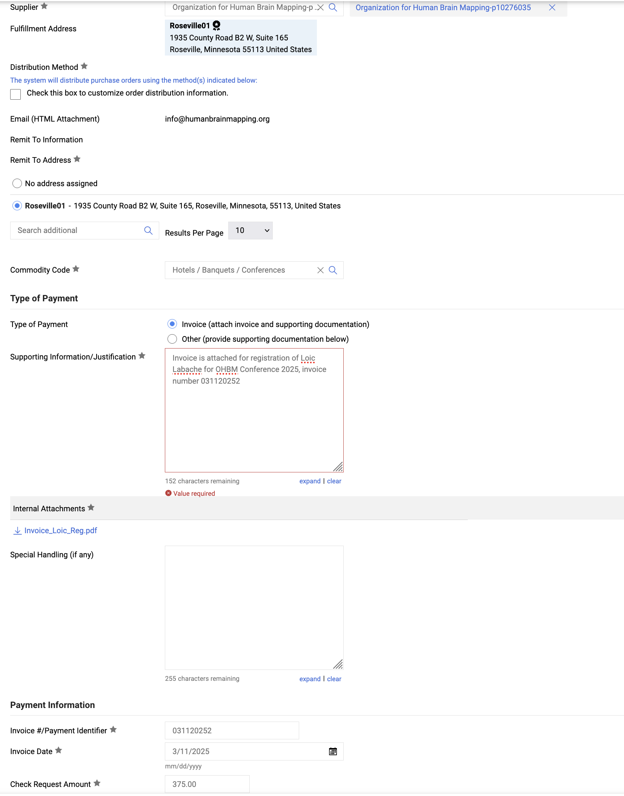

# Paying a Conference Reg Fee

Form: Check request

Expenditure type: 56060 (Travel Conference & Convention Registration Fees)

Commodity code: Hotels / Banquets / Conferences 

> If for OHBM: In payment works OHBM is named “Beau J. Haugen” but the supplier number is 10276035 and will show up as “Organization for Human Brain Mapping-p10276035” on the requisition

1. Check if confrerence is a supplier
2. If not, email conference for supplier setup
3. If so, email conference to make sure their account is correct
4. Email conference for invoice
5. Create check request
    1. Type of payment: Invoice
    2. Supporting information: person, conference and invoice name
        
        Example: “Invoice is attached for registration of Loic Labache for OHBM Conference 2025, invoice number 031120252”
        
    3. Internal attachments: invoice
    
    Filled in example:
    
    