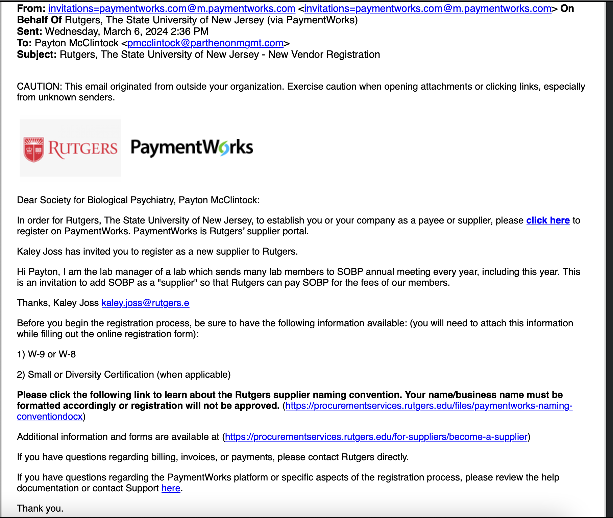

# Purchasing Tutorial

## Overview:
This is an overview of the general purchasing tutorial for non-punchout items. This includes items purchased using a quick order, goods request, service request or check request.
 
♻️
1. Get invoice
2. Upload to quick order (or check request if in Non-PO transaction matrix)
3. Once approved by Rutgers and PO number is created, email invoice to  [accountspayable@finance.rutgers.edu](mailto:accountspayable@finance.rutgers.edu) with the PO number in the subject line, and in the email body, with the invoice attached (also add Rutgers PO number to invoice).
4. Check back periodically to make sure the invoice is paid on time 

# Detailed Process
## 1. Check for Supplier Contract

1. See if the supplier is in RU Marketplace
    1. Go to [my.rutgers.com](http://my.rutgers.com) → RU Marketplace (Jaegger) → Suppliers → Search Suppliers
    2. If they don’t, follow this doc:
    
    [Check Request to New Supplier](https://www.notion.so/Check-Request-to-New-Supplier-1b1cf00eb936815eb0bcc140ad6965a5?pvs=21)
    

## 2. If the supplier has a Rutgers Contract, get invoice

1. Get an invoice from the supplier
2. Get the necessary additional documents from the supplier
    1. If they’re in RU marketplace, look up their (supplier contract) name in [https://procurementservices.rutgers.edu/purchasing/find-products-and-services?category=All](https://procurementservices.rutgers.edu/purchasing/find-products-and-services?category=All) to see any additional docuemnts needed
        1. Scroll to ‘Procurement Procedures’ section, it will list the necessary steps / forms
            1. Ex: for Dropbox [https://procurementservices.rutgers.edu/purchasing/dropbox-inc](https://procurementservices.rutgers.edu/purchasing/dropbox-inc) the procurement procedures section says purchasing requires:
                - Using the [Service Request Form](https://solutions.sciquest.com/apps/Router/SAMLAuth/Rutgers)
                    - Attaching a “detailed” quote
                - Submitting + attaching a [Third Party Risk Assessment](https://rusecure.rutgers.edu/third-party-security-review-process)
    2. if they don’t have a contract on that site, but they do have a contract in RU Marketplace, I would look up which commodity code you’ll need in this form: [Commodity Codes - Which Forms Are Allowed](https://rutgers.box.com/s/4hdapczpt2l3wklkauijaultrvw9q9zf) (downloaded from Canvas link [List: Commodity Codes)](https://rutgers.instructure.com/courses/561/pages/list-commodity-codes-with-corresponding-forms?module_item_id=6208614) and make sure to use whichever form it says is allowable (ie Goods Request, Service Request or Quick Order)
    

## 3. Figure out which form you use to pay for this

1. Try to find your item in the [Non-PO Transaction Matrix sheet](https://rutgers.box.com/s/od35jddjazp5fik32lzs9kt800tp8jjt) 
2. Try to find it in [Commodity Codes - Which Forms are Allowed](https://rutgers.box.com/s/4hdapczpt2l3wklkauijaultrvw9q9zf) 

→ from both these lists choose the best category

→ then see which forms are allowed

- Most common is quick order
    - Make sure you’re not ordering a restricted item (software, computer hardware, standing orders) for quick orders
- Only goods request if it’s over $50k

## 4. Figure out which Account Code (aka Expenditure Type) to use

1. Look in [SAS Recommended Account Codes](https://rutgers.box.com/s/mrnx5wg8w5rhbiixzs9i9mjoternm231) - this is for school of arts and sciences which we are not, but still an applicable reference
2. If you don’t know, ask UPS Helpdesk or Cynthia Duncan Robinson [robinsce@rwjms.rutgers.edu](mailto:robinsce@rwjms.rutgers.edu) (Program Assistant, RWJMS Dept. of Psychiatry Research)

## 5. Fill out and Submit Quick Order (/ other form)…

Go to RU Marketplace → View Forms → [select relevant form]

- Fill out all starred boxes, but don’t worry about any boxes that aren’t starred
- Attach invoice as internal attachment and external attachment, just to be safe
- If sending a physical check (the supplier would have chosen this in paymentworks), you can add special handling to the check in the “Special Handling” box
    - Can ask to send the check to a certain department
    - Include here if any backup documentation is required with the check
    - If you want a specific person noted on the envelope
    - If this payment is an international wire transfer

The PO will be placed and confirmed. 

1. PO created
2. PO approved, ‘sent to supplier’ (sent as an HTML attachment to the email listed in paymentworks)
    1. Payment would still be subject to their net terms. Most suppliers are net45.
- the PO will be sent to the email address listed in PaymentWorks
    - If that email is wrong, and you want the supplier to get the PO directly, it needs to be changed in PaymentWorks, but it’s an annoying process.
- You can just send the PO directly to the supplier via email, by going to the PO, and pressing “print” and saving the printed version as a PDF, and sending that to supplier

## 6. Then, email invoice to [accountspayable@finance.rutgers.edu](mailto:accountspayable@finance.rutgers.edu)

1. Add the PO number to the invoice
2. Send an email [accountspayable@finance.rutgers.edu](mailto:accountspayable@finance.rutgers.edu) with the PO number in the subject line, and in the email body, with the invoice attached. 
    - It’s typically the supplier’s job to do this, but you do NOT have to wait for the supplier. If you have the invoice from the beginning, as soon as the PO number is generated and approved (is ‘sent to supplier’), you can add that PO number to the invoice and email it to [accountspayable@finance.rutgers.edu](mailto:accountspayable@finance.rutgers.edu)
    - The supplier may do this and if so the invoice will be in RU marketplace
    - Email MUST contain PO NUMBER
3. After you send the email, you’ll get an email from [noreply.jaggaer_AP@trustflowds.com](mailto:noreply.jaggaer_AP@trustflowds.com) with whether it was successful.
    - **Example of successful invoice email**
        
        *Thank you for submitting your invoice. This notice confirms that we received your email to [accountspayable@finance.rutgers.edu](mailto:accountspayable@finance.rutgers.edu). All invoices must reference a VALID purchase order number. If there is no valid purchase order number, you will receive a separate rejection notice and the invoice will not be processed.*
        
        *The status of the email attachments is shown below:*
        *Valid Attachments*:
        *1457125461.pdf Attachment Size - 34.632KB*
        
        *Rejected Attachments*:
        *None*
        
        

## 7. Invoice is created and processed, payment is sent

1. Now on your PO/Requisition, Rutgers will create an Invoice under “related documents”, with a Rutgers-unique invoice number (it will not match the supplier’s documentation of that invoice number)
2. The invoice page will list all relevant payment information- and when / whether it’s been paid
    1. Before payment, in the box **Payment Information**, **Payment Date** and **Payment Number** will be blank. Once the payment has been mailed/wired, those fields will be filled in. 
    2. **Pay Status** will also list when it has been paid. 
    - **Example of a fully paid invoice:**
        
        
        

1. Once payment is sent, if the supplier has indicated electronic payment (ACH), the payment is filed through that method. 
    1. if the supplier has indicated physical check, it goes via regular postal mail. The guidance we give is that it could take up to 10 days to arrive.
    2. This choice is done in paymentworks
2. If the supplier doesn’t get the payment, or if you have questions, you can ask UPS (via a ticket) for a screenshot of the payment processing page in Oracle. They’ll be able to send you information about where exactly the supplier’s payment was sent, to what bank, etc. 
    1. Here you can check if there’s any difference between the remittance information indicated on the supplier’s invoice, and the information in the payment details
        

## If the supplier does not have a contract:

1. Find a contact person + email for the supplier company
    1. You’ll have to work with them to get them set up in the Rutgers system as a supplier in PaymentWorks
    2. Notify them that an invitation will be coming their way / ask them if they will accept it
2. Follow this Job Aid: [Supplier Onboarding Course Pathway in Canvas](https://rutgers.instructure.com/courses/31949/pages/job-aid-inviting-a-new-supplier-and-checking-onboarding-status?module_item_id=6484653) 
    1. Choose ‘PO’, ‘ACH’, ‘Web Email PDF’
    2. After you [submit your invitation on PaymentWorks](https://www.paymentworks.com/app), you’ll be able to see the progress on there, as well as get emails
3. This is the email you’ll get when your PaymentWorks invitation has been approved and sent to your supplier
    
    
    
4. This is the email they’ll get from PaymentWorks
    
    
    
    5. This is the email you’ll get when they open/ start registration in PaymentWorks
    
    
    
    6. Once the supplier finishes their PaymentWorks portal, this is what PaymentWorks will look like
    
    
    
    1.  Look up which commodity code you’ll need in this form: [Commodity Codes - Which Forms Are Allowed](https://rutgers.box.com/s/4hdapczpt2l3wklkauijaultrvw9q9zf) (downloaded from Canvas link [List: Commodity Codes)](https://rutgers.instructure.com/courses/561/pages/list-commodity-codes-with-corresponding-forms?module_item_id=6208614) and make sure to use whichever form it says is allowable (ie Goods Request, Service Request or Quick Order)
    