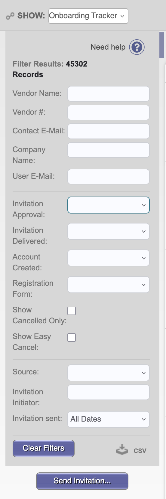
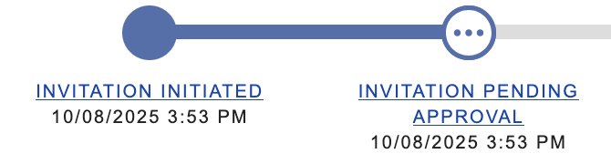
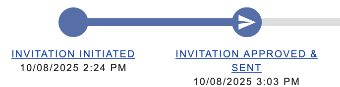
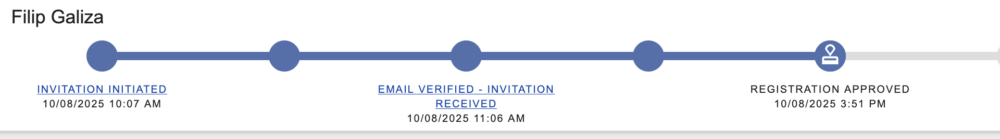
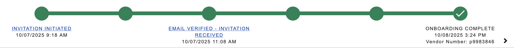

# Invite a New Supplier to PaymentWorks- US/Canada Suppliers

PaymentWorks is the process Rutgers uses to manage and contact suppliers. If you want to pay someone via Rutgers, they have to be set up as a supplier in PaymentWorks.

- There are a few exceptions to this as of Oct 2025. Candex is a third party system that allows for payments to individuals without paymentworks. Candex can be used for the following commodities: Honoraria, Travel reimbursement for external speakers/visitors, Athletic reimbursements.

PaymentWorks is basically the place Rutgers has the contact info for suppliers. It also points the suppliers to Bottomline to put in bank account info, if doing electronic payment. But payment doesn’t go through PaymentWorks. The only thing PaymentWorks does is allow you to have that supplier on the Rutgers requisition, and emails them the Purchase Order (which you can do directly).  

### Note: What to do if the supplier is in PaymentWorks but the contact info is out of date / they can’t access the portal / they don’t have the password information

If the contact information is out of date, you can change the email in PaymentWorks, but it’s an annoying process, and the sales rep/person you’re working with will have to enter a phone number do do 2-factor authentication. This basically ensures that once a new sales person comes into the role, they will not have access to the PaymentWorks account. This is fine, unless the bank account for the supplier is wrong, or unless you need to change the account to use ACH/Physical Check (if the wrong one was selected). If you need to do it, follow these instructions:

[**How To Delete a Supplier Profile**](https://help.paymentworks.com/knowledge-base/how-to-delete-a-supplier-profile)

[In Depth - **PaymentWorks Payment Methods**](https://www.notion.so/In-Depth-PaymentWorks-Payment-Methods-286cf00eb93680bba50bea7921db38d2?pvs=21)

## Ask the supplier if they’re willing to onboard to PaymentWorks

Send them the below email (template), with the information you think they need to make the decision.

- **Email template: PaymentWorks Explanation**
    
    Hi ___, 
    
    I hope you’re doing well. I’m reaching out about purchasing __________. I mapped out the process below for payment through my university, I was wondering if this process is possible for your company?
    
    Our university who is paying for _____ uses a suppliers system called ‘PaymentWorks’ and a payment system setup through [Bottomline](https://www.bottomline.com/us), a platform which allows you to enter in bank information in a secure way and have Rutgers send an e-payment. The process would be that I would send you an invitation to join Rutgers PaymentWorks, someone at your company would fill out the profile on PaymentWorks (~10 mins). Then the university would send you a link to get set up in Bottomline, where someone would input the correct bank information for e-payments into Bottomline (~5 mins). Then I would ask for an invoice from you for the item below, and the university would send you an e-payment fulfilling that invoice.
    
    Payment Information
    
    - Net-45 terms
    - ACH or Physical Check payment
    
    Documents Needed:
    
    - W9 Form
    
    If this seems possible to do at your company, that would be great! Let me know who can work with me on this, and I will send the PaymentWorks invitation along. Also, let me know which payment terms you would like to select. 
    
    [Screenshot 2025-05-12 at 10.18.29 AM.png](cid:F65C5BC8-76FC-431A-A96E-634B9F5D0193)
    
    [Screenshot 2025-05-12 at 10.18.40 AM.png](cid:C708FC84-6EAB-4106-A11E-915A12CA0E2E)
    

## Invite them to PaymentWorks

1. Go to [my.rutgers.edu](http://my.rutgers.edu) > Apps > Supplier Portal > Vendor Master Updates
2. Select “Send Invite”
    - **Image reference**
        
        
        
3. You select options for the supplier in PaymentWorks, and click “send invitation”, and PaymentWorks will send them an invitation to the contact email you provide
    1. You select options like invoicing method, payment method (ACH, Physical check, etc), contact information
    2. PaymentWorks has to approve the invitation before it is sent. This takes a few hours usually. You can see whether the invitation has been sent yet on the PaymentWorks timeline on ‘Vendor Master Updates’, in ‘Onboarding Timeline’ tab
    - **Image reference**
        
        
        
4. Email the supplier explaining to them what to expect and what to do when they get the invitation email
    - **Email template- PaymentWorks Invitation/Registration Explanation**
        
        Hi _____,
        
        I submitted a request to invite you to PaymentWorks, the supplier software we discussed for Rutgers. Once it gets approved it will email you an invite link (from [invitations@paymentworks.com](mailto:invitations@paymentworks.com)), where you can fill out some information. You will need a W9 form to complete registration. 
        
        **Important Notes: PaymentWorks Account Registration**
        
        - The email for the account in PaymentWorks must be one which you can access
        - The phone number for the account in PaymentWorks must be one where you can receive a text message for 2 factor authentication.
        - The address you list must match the remittance address on your checks.
        - **IGNORE / skip any banking information questions**— we do not need this in PaymentWorks, payment goes through a different registration
        - select “Email Invoice PDF” (given you're OK with Net-45 terms) and “ACH” (given you want electronic payment, if you want a check mailed to you, select “Check")
        - Naming conventions:
            - Names of individuals:
                - Capitalize first letter of each word
                - No periods (hyphens and apostrophes are OK)
            - Entity / Business name:
                - Legal name as stated in IRS W9 form
                - Do not spell out full word of limited, incorporated, corporation, or partnership
                - Capitalize first letter of each word
                - Do not use special characters like slashes, parentheses, semicolon, exclamation, quotation, @, %, *, #, ?, etc (The “&”, apostrophe, and “-“(hyphens) sign is allowed)
        
        [Screenshot 2025-05-12 at 10.18.29 AM.png](cid:F65C5BC8-76FC-431A-A96E-634B9F5D0193)
        
        Please let me know if you have any questions or issues!
        
        Best,
        
        Kaley 
        
        [Paymentworks Invitation Email to Supplier-1.pdf](Invite a New Supplier to PaymentWorks- US Canada S 286cf00eb936809791f4dd79719d7f66/Paymentworks_Invitation_Email_to_Supplier-1.pdf)
        
        [PaymentWorks Info for Suppliers.pdf](Invite a New Supplier to PaymentWorks- US Canada S 286cf00eb936809791f4dd79719d7f66/PaymentWorks_Info_for_Suppliers.pdf)
        
5. PaymentWorks approves their invitation. Once the invitation is approved, the icon changes to “invitation approved and sent”
    - **Image reference**
        
        
        
6. They then fill out information for PaymentWorks
    
    (You can see if they’ve opened the email, started registration, etc based on the PaymentWorks timeline)
    
    1. They create an account with that email, and a password, and a phone number to link it to
    2. They have to upload a W9 
    3. If doing ACH, they are directed to [Bottomline](https://www.bottomline.com/us), a platform which allows them to enter in bank information in a secure way and have Rutgers send an e-payment.
7. Their registration is approved by PaymentWorks and Onboarding gets completed
    - **Image reference**
        
        
        
        