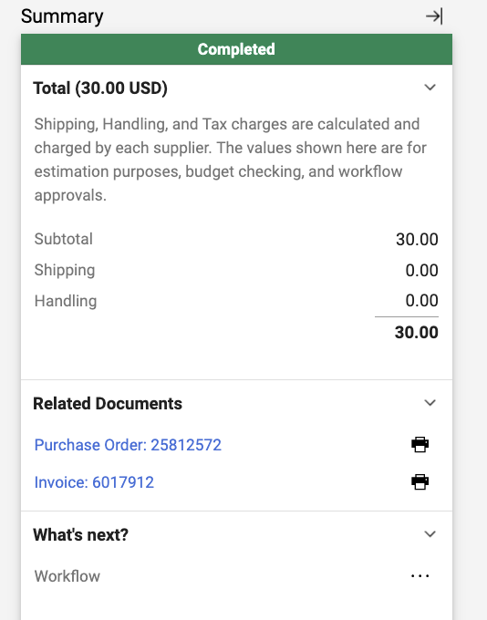
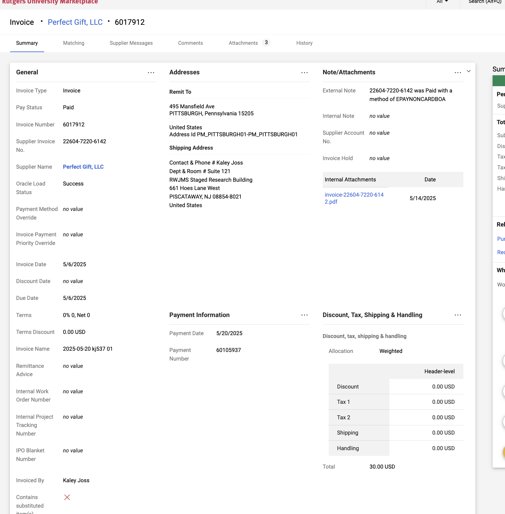
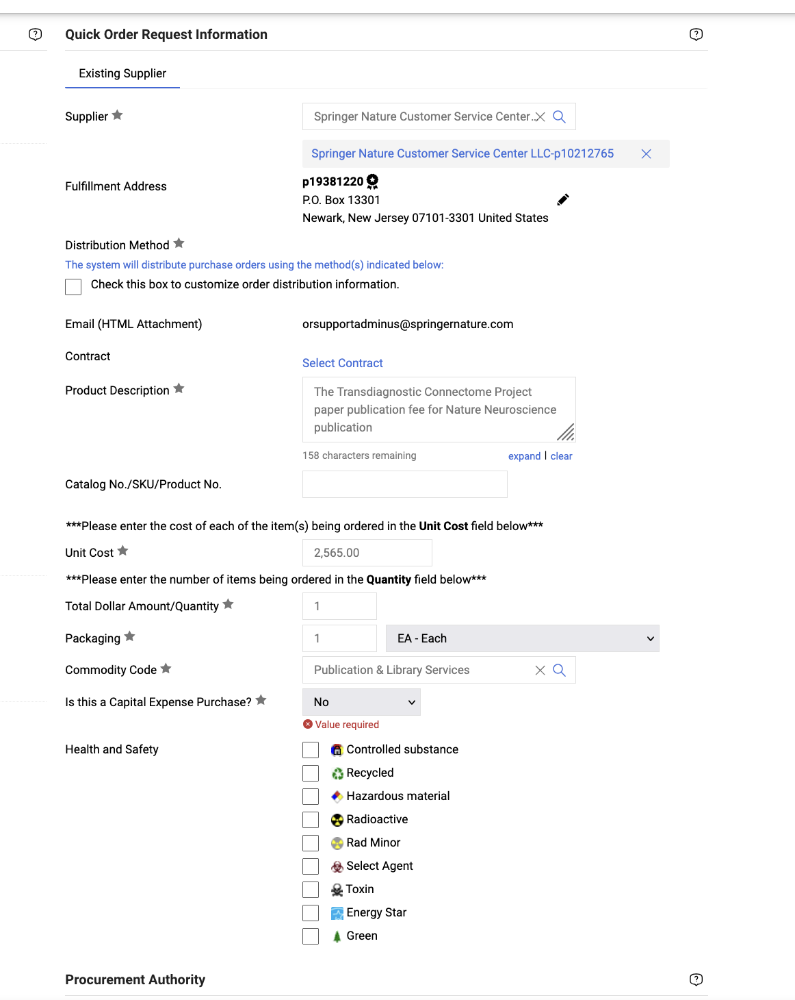
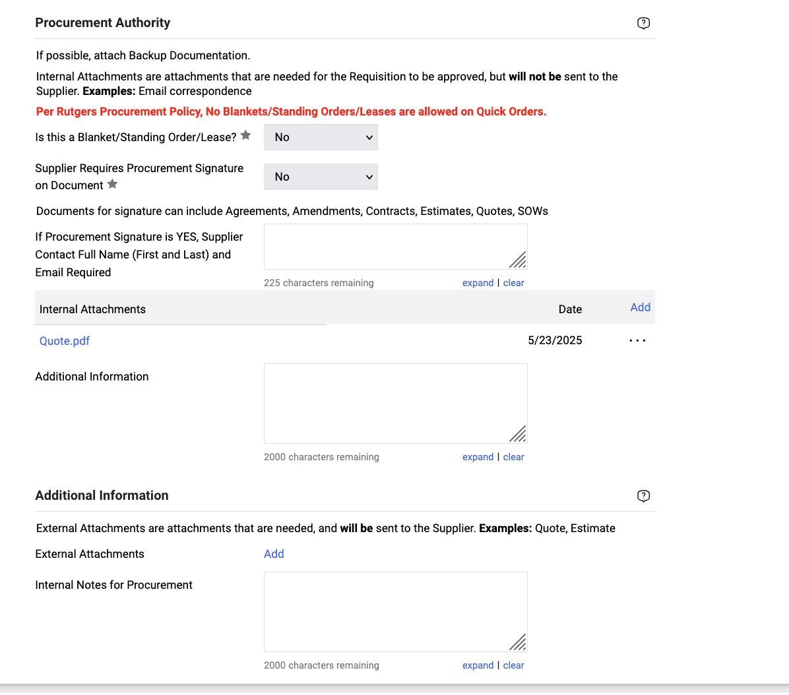
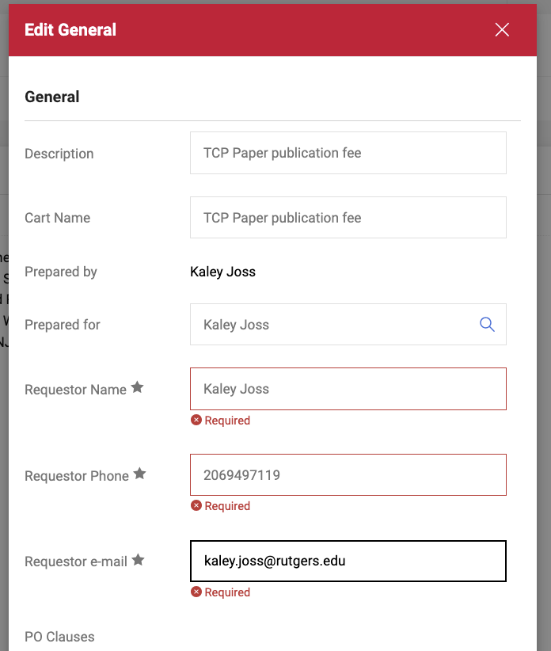
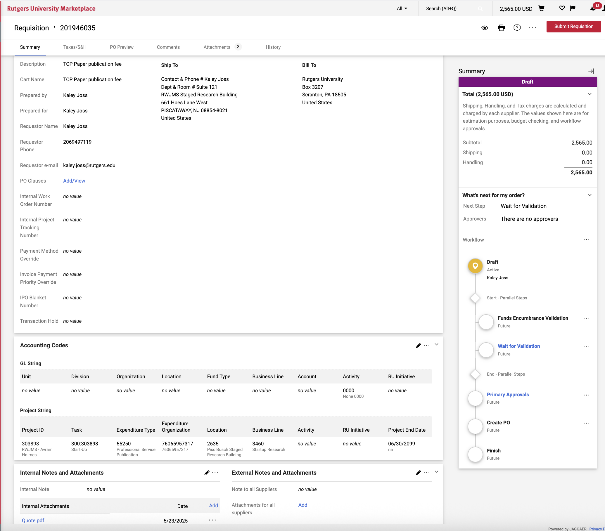

# Paying a Publication Fee

Commodity Code: Publications & Library Services

Expenditure type:  55250 (Professional Service Publication) 

1. Get an invoice or quote for the fee
2. Check if the supplier on the invoice is in PaymentWorks
    1. If not, go through PaymentWorks setup process
3. Create quick order in RU Marketplace
    1. Supporting information: person, conference and invoice name
        - Example: “Invoice is attached for registration of Loic Labache for OHBM Conference 2025, invoice number 031120252”
    2. Commodity code: Publications & Library Services
    3. Expenditure type:  55250 (Professional Service Publication) 
    4. Internal attachments: invoice/quote
4. Once the order is approved, a PO will be created in RU Marketplace. 
5. Once that happens, email the invoice to [accountspayable@finance.rutgers.edu](mailto:accountspayable@finance.rutgers.edu) with the PO number in the email subject and the invoice attached, 
6. You’ll get an email back stating what valid attachments were added to your order
7. That should create an ‘invoice’ on the list of forms attached to the order, for ex:
    
    
    
8. Click on the invoice
9. “payment date” will be filled in once payment has been sent. “Due date” is the date by the system read by the invoice or input by you, approx 3-5 days before this due date, Rutgers will send the payment. If the supplier didn’t get it, send them this information and invoice number

“Add and go to cart”

