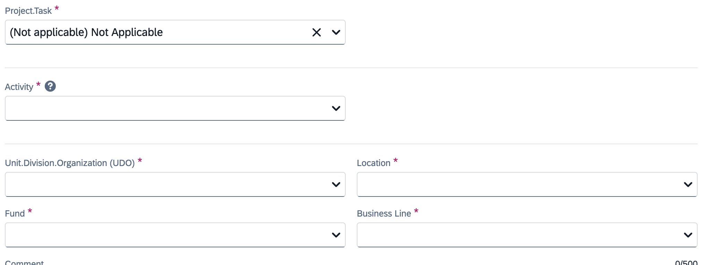
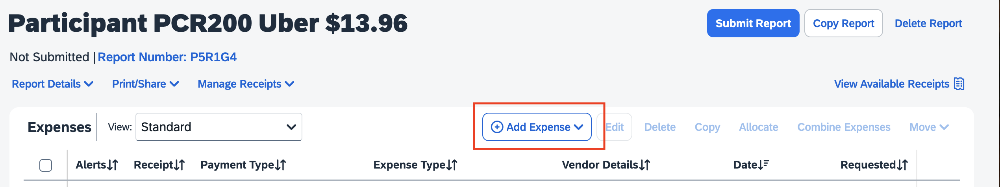

# Submitting Travel Reimbursements in Concur
---
**Table of Contents**
1. TOC
{:toc}
---
Date: April 28, 2025 1:12 PM

🚨 Make sure you have your personal cards set up in Concur (if not, follow this tutorial: [Adding Your Card to Concur](https://holmeslab.github.io/holmeslab/docs/Admin/add-card-to-concur))

## 1. Fill in 
1. Create report  

2. Select "Rutgers Non-Travel Expense Report"

3. Enter in information, including a comment of all relevant information (for example, whether it was for a study, how it was related to work, etc)
### 4. Fill in purchasing codes (use study codes if it was for a study, otherwise ask RA): [Purchasing codes folder at this link](https://rutgers.box.com/s/8ly56weil3wey89dd6n6hw3eoaid06x9) 
(Password to this file is the Holmes Lab general password, ask RA if you don't know it)

5. Add all expenses

    
#### Documentation & Receipt
- A final original receipt/proof of payment must be provided for each expense
- The supporting documents must indicate the date, individual’s name, amount paid, payment method, and last 4-digits of credit card (if paid by card)
- If a receipt does not include all required information, a credit card statement must also be provided as proof of payment (unrelated information may be redacted)
- For lodging, the hotel folio (received upon checkout) with itemized charges and $0 balance must be provided
- A [Lost Receipt Certification Form](https://procurementservices.rutgers.edu/travel_policies_and_forms) must be completed for any missing receipts
- If a receipt indicates another individual’s name, the employee requesting reimbursement must obtain a memo from the person named on the receipt authorizing reimbursement to the employee
