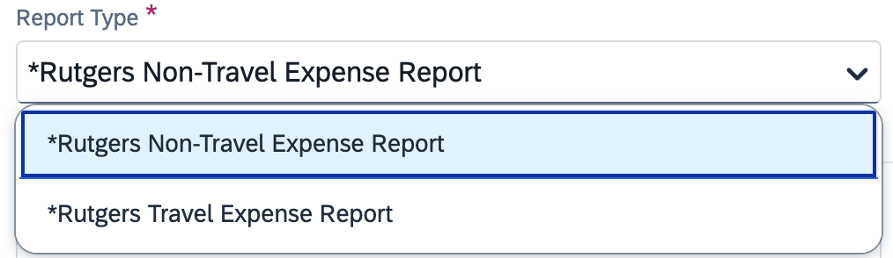
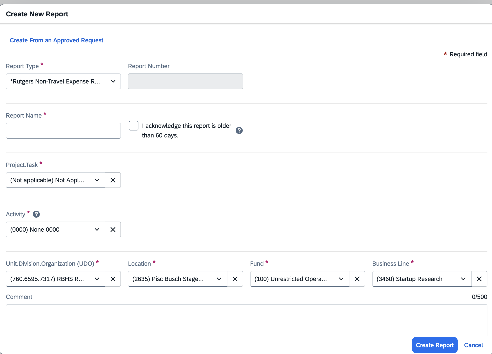
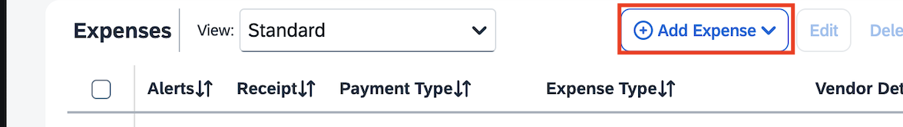
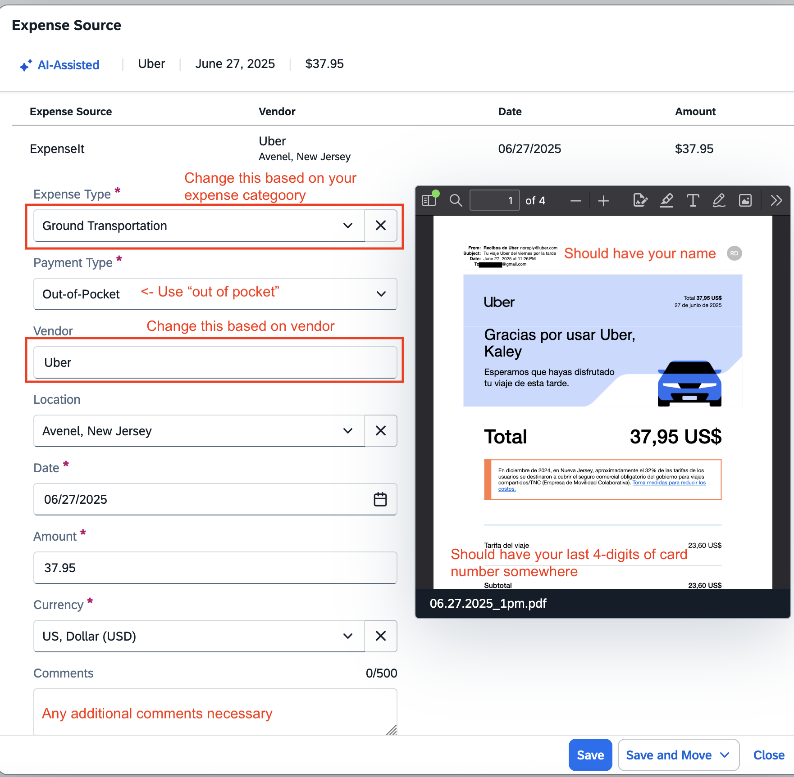

# Submitting Travel Reimbursements in Concur

{: .warning } 
> Note:
Make sure you have your personal cards set up in Concur (if not, follow this tutorial: [Adding Your Card to Concur](https://holmeslab.github.io/holmeslab/docs/Admin/add-card-to-concur))
- You need the card on the receipt/credit card statement to be the same card as one that exists in your account
- This card / bank account will be where the money is reimbursed to 

{: .new-title } 
> If doing for Avram or other person, click here for "How to submit expense reports for another person"

# 1. Create Report
### 1. Create report  

### 2. Select "Rutgers Non-Travel Expense Report"

### 3. Enter in information, including a comment of all relevant information (for example, whether it was for a study, how it was related to work, etc)
### 4. Fill in purchasing codes like below, look in [purchasing codes folder](https://rutgers.box.com/s/8ly56weil3wey89dd6n6hw3eoaid06x9) for Project.Task
*(Password to this file is the Holmes Lab general password, ask RA if you don't know it)*

Copy & Paste:
Location: 2635 (Busch Staged Research Building, Piscataway)
Activity: 0000 (None)
RU Initiative: 000000 (None)
Project End Date: N/A or it will automatically input 06/30/2099

## 5. Add expenses
*For ‘what is reimbursable’, go to section 4.5*

### -> Upload Receipt and it will auto-fill fields. Fill in the rest.

{: .warning } 
> Note:
Payment Type = "Out of Pocket"

    
#### Documentation & Receipt
- A final original receipt/proof of payment must be provided for each expense
- The supporting documents must indicate the date, individual’s name, amount paid, payment method, and last 4-digits of credit card (if paid by card)
- If a receipt does not include all required information, a credit card statement must also be provided as proof of payment (unrelated information may be redacted)
- For lodging, the hotel folio (received upon checkout) with itemized charges and $0 balance must be provided
- A [Lost Receipt Certification Form](https://procurementservices.rutgers.edu/travel_policies_and_forms) must be completed for any missing receipts
- If a receipt indicates another individual’s name, the employee requesting reimbursement must obtain a memo from the person named on the receipt authorizing reimbursement to the employee
