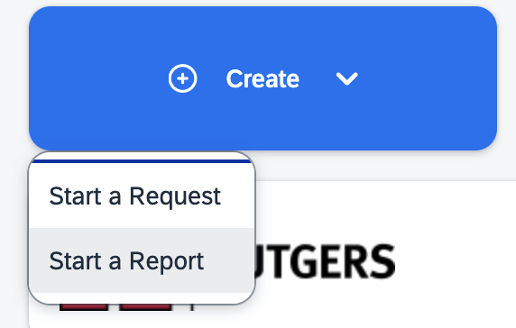

# Submitting Travel Reimbursements in Concur

First:
🚨 Make sure you have your personal cards set up in Concur (if not, follow this tutorial: [Adding Your Card to Concur](https://holmeslab.github.io/holmeslab/docs/Admin/add-card-to-concur))
- You need the card on the receipt/credit card statement to be the same card as one that exists in your account
- This card / bank account will be where the money is reimbursed to 

## 1.Create Report
1. Create report  

2. Select "Rutgers Non-Travel Expense Report"

3. Enter in information, including a comment of all relevant information (for example, whether it was for a study, how it was related to work, etc)
### 2. Fill in purchasing codes (use study codes if it was for a study, otherwise ask RA): [Purchasing codes folder at this link](https://rutgers.box.com/s/8ly56weil3wey89dd6n6hw3eoaid06x9) 
(Password to this file is the Holmes Lab general password, ask RA if you don't know it)

5. Add all expenses

    
### 3. Add Documentation & Receipt
- A final original receipt/proof of payment must be provided for each expense.
**Receipt must include**:
- Date
- Individual’s (your) name
- Amount paid
- Payment method
- Last 4-digits of credit card (if paid by card)
*The last 4-digits of the card should match one that is one of the cards listed in your concur account. If you don't have your cards there, follow this tutorial: [Adding Your Card to Concur](https://holmeslab.github.io/holmeslab/docs/Admin/add-card-to-concur)

**Receipt Issues**
- *If a receipt does not include all required information, a credit/debit card statement must also be provided as proof of payment (unrelated information may be redacted)*
- A [Lost Receipt Certification Form](https://procurementservices.rutgers.edu/travel_policies_and_forms) must be completed for any missing receipts
- If a receipt indicates another individual’s name, the employee requesting reimbursement must obtain a memo from the person named on the receipt authorizing reimbursement to the employee
