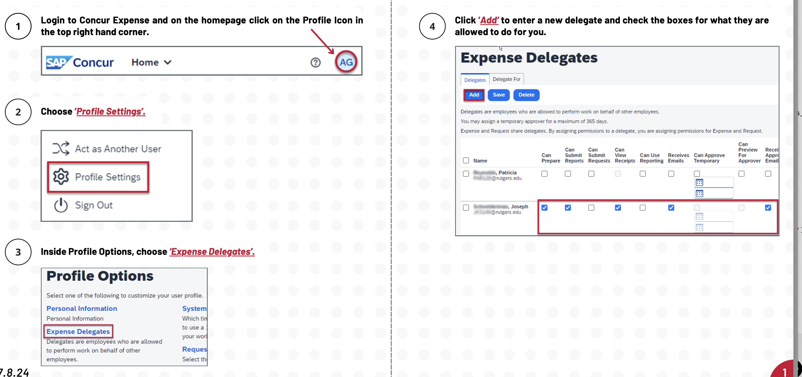

# How to Build Expense Reports or Book Travel for Another Person
NOTE: You can't actually submit expense reports or travel reports for them, but you can build them and then send them a link to the report so they can press "submit"

## Have the person add you as a "delegate" on their Concur account:
From their concur account (Go to my.rutgers.edu -> “Apps” -> “Concur”)...

## On your Concur account, switch to "Act as Delegate"

### Now at the upper right of your account, it should have:

## Now you can act as them, and build reports / book travel. 