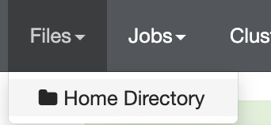
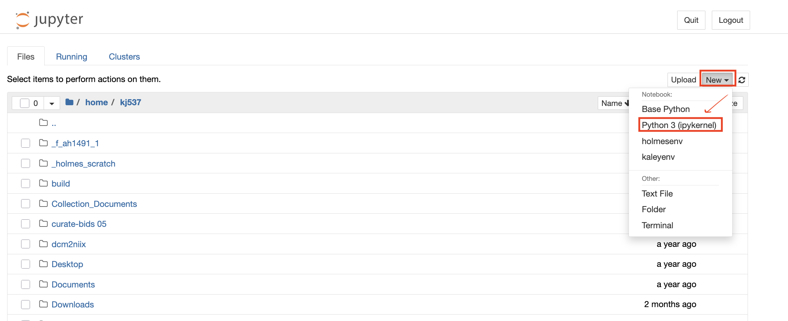

## Set up Amarel
1. Request Amarel account (linked to your netID) by filling out this form: https://oarc.rutgers.edu/amarel-cluster-access-request/
- PI name = Avram Holmes
- Campus = Piscataway
- Department = Center for Advanced Human Brain Imaging Research
2. Request access to our lab partition on Amarel "/projects/f_ah1491_1" and "/scratch/f_ah1491_1" by emailing help@oarc.rutgers.edu and CC'ing Avram and lab manager 
3. Set up VPN if not on Rutgers wifi -- [VPN Setup Tutorial](https://holmeslab.github.io/holmeslab/docs/Amarel/rutgers-vpn/)

## Connect to Amarel 
### Connecting to Amarel in Terminal
1. **Connect to VPN on Cisco Anyconnect App** [Tutorial](https://holmeslab.github.io/holmeslab/docs/Amarel/rutgers-vpn/)

    1. fill in on Cisco Anyconnect app:
        1. [vpn.rutgers.edu](http://vpn1.rutgers.edu) 
        2. NetID password 
        3. DUO mobile password
    2. or webpage: [https://vpn1.rutgers.edu/+CSCOE+/logon.html#form_title_text](https://vpn1.rutgers.edu/+CSCOE+/logon.html#form_title_text) 


2. **Now, in your terminal...**
    1. On terminal or shell scripting application, Enter `ssh netID@amarel.rutgers.edu` (replace with your NetID)
    2. prompts for password- Enter NetID password

3. **Activate Holmes Lab Environment** 
This is optional but enables you to use the packages installed for Holmes Lab scripts. Use to be able to use other Holmes Lab scripts.
```bash
conda activate /projects/community/holmesenv
```


### Connecting to Amarel on your Browser
1. **Connect to VPN on Cisco Anyconnect App** [Tutorial](https://holmeslab.github.io/holmeslab/docs/Amarel/rutgers-vpn/)
2. Go to [https://ondemand.hpc.rutgers.edu](https://ondemand.hpc.rutgers.edu/)
3. Select 'Files' > 'Home Directory' to browse, edit, download, upload and view files on Amarel from your browser


## Use Amarel
### Slurm Jobs
To run computing jobs from the terminal using Amarel resources, the process uses slurm. [Here is a tutorial on how to create and submit slurm jobs.](https://holmeslab.github.io/holmeslab/docs/Amarel/slurm-jobs-tutorial/)
 
### Edit and Run Jupyter Notebooks in Amarel
1. Follow steps 1-2 of **Connecting to Amarel on your Browser**
2. In the toolbar, select 'Interactive Sessions' > 'Personal Jupyter'
3. Fill out these fields for your session:
    - ***`Number of Hours`***: `72`
        - Can be up to 2 weeks, but the longer number of hours, the longer it takes to get approved. Additionally, if Amarel has any scheduled downtime, and your number of hours overlaps with that, the request will stay "Pending" and won't be approved. `72-96` hours gets approved in a few minutes. 
        - To check Amarel scheduled downtime, view the Holmes Lab shared google calendar "Holmes Lab - Out Of Office & Compute Cluster" or go to the [Amarel System Status OARC page](https://oarc.rutgers.edu/amarel-system-status/)
    - ***`Number of Cores`***: `20`
    - ***`Gigabytes of Memory`***: `128`
    - ***`Partition`***: `p_dz268_1`
        - This is the CAHBIR partition
    - ***`conda Path`***: `/projects/community/`holmesenv
  - ***`conda environment`***: `/projects/community/holmesenv`
-> Press "Launch"

4. When it's ready, you'll see in `Interactive Sessions` the blue button that says "Connect to Jupyter...". Click it to begin
5. You'll be directed to a page with your home filesystem (/home/netID)
    - To create a new Jupyter Notebook, click 'New' >  Python 3 (ipykernel)
    
        - The notebook file (.ipynb) will be created wherever you were in the filesystem when you pressed "New"
    - To open an existing notebook (.ipynb) file, just navigate to it in the filsystem and click on it to open

    