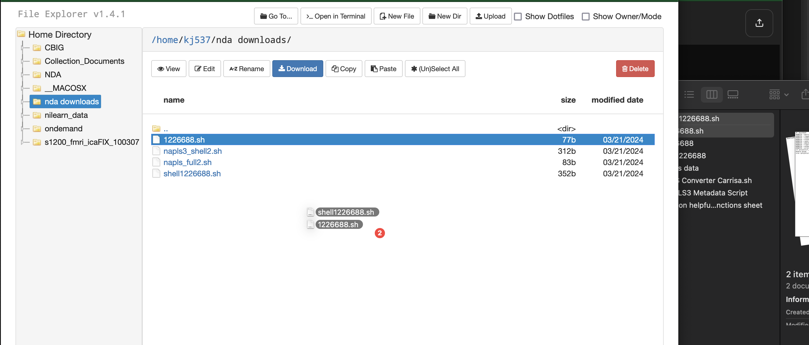
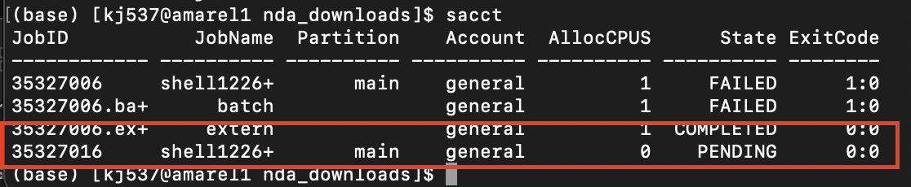

# Slurm Jobs Tutorial - Rutgers
Date: March 27, 2024 2:55 PM
---
**Table of Contents**
1. TOC
{:toc}
---

📌 In-depth Information in:
- [Rutgers AMAREL Cluster User Guide](https://sites.google.com/view/cluster-user-guide)
- [Rutgers Slurm Job / Batch User Guide](https://sites.google.com/view/cluster-user-guide#h.p4379j6lgjuh)


## Quick Tutorial:

```bash
sbatch <filename>.sh #send job
sacct #see your current jobs
sacct -e #see all the variables you can specify to see about your jobs
acct --format=JobId,JobName%50,Partition%15,State,Elapsed,ExitCode,Start,End --starttime=2025-04-01T22:43:21 #example of vars
watch -n 1 squeue -u <netID> #watch your live currently running jobs
     # control + C to exit 'watch'
```

1. export my script as a NAME.sh file (make sure to add #!/bin/bash  at top)
2. Fill in this with your specs

```bash
#! /bin/bash
#SBATCH --partition=p_dz268_1
#SBATCH --job-name=<some job name>.sh 
#SBATCH --requeue
#SBATCH --nodes=1 
#SBATCH --ntasks=1
#SBATCH --cpus-per-task=1
#SBATCH --mem=2000
#SBATCH --time=*48:00:00*
#SBATCH --output=/path/to/folder/<some job name>.out 
#SBATCH --error=/path/to/folder/<some job name>.err

module purge

# Activate the holmesenv virtual environment to use installed packages
# if you need additional packages for your script, install them into /holmesenv/bin/activate
source ~/projects/community/holmesenv/bin/activate

eval "$(conda shell.bash hook)"  # Properly initialize Conda
conda activate /projects/community/holmesenv

bash /path/to/your/file/<filename>.sh    
#OR 
python3 /path/to/your/file/<filename>.py
```

1. then save that whole script as run_NAME.sh (even if the file running is python)
2. then do this to make both files executable
    
    ```bash
    chmod +x NAME.py
    chmod +x run_NAME.sh
    ```
    
3. then run

```bash
sbatch run_NAME.sh
```

### Downloads (in login nodes)

Run all internet downloads on the login node

- 5-7 simultaneous downloads on the login node
- has faster internet connection
- slurm has small internet bandwidth, login has more, but also slurm bandwidth will stop everyone else
- add an ampersand at the end of the download line so that it runs in the background
- and also configure your computer so that it stays active
    - To do this, follow this tutorial: [NoHup Avoid Broken Pipe Error](https://www.baeldung.com/linux/nohup-avoid-input-output-message)

Code Template:

Just out file

```bash
/path/to/my_script.sh 1>/path/to/my_script.out &
```

Out file and error file

```bash
/path/to/my_script.sh 1>/path/to/my_script.out 2>/path/to/my_script.err &

python /projects/f_ah1491_1/open_data/NAPLS3/docs/scripts/bidsconverter/batchscripts/napls_bidsconverter_bysubj_jun11_copy3.py 1>/projects/f_ah1491_1/open_data/NAPLS3/docs/scripts/bidsconverter/batchscripts/out/terminalpytest3.out 2>/projects/f_ah1491_1/open_data/NAPLS3/docs/scripts/bidsconverter/batchscripts/err/terminalpytest3.out &
```

This will run your script in the background (&) and save out the terminal outputs into a file with the same name but a different extension (.out) and the error files into that name but (.err)

projects/f_ah1491_1/Open_Data/HCP_EP/code/ndaDownload/[ep_long.sh](https://ondemand.hpc.rutgers.edu/node/slepner088.amarel.rutgers.edu/36553/edit/_f_ah1491_1/Open_Data/HCP_EP/code/ndaDownload/ep_long.sh) 1> slurm.out 2> slurm.err &

TIPS

- if anything weird comes up can do `scancel <job number>`
- `sacct -e` shows all the variables you could pull up for existing/past jobs
    - —state=failed, running, pending, completed
- try it with one subject, see time, multiply by subjects = time estimate

### NDA download In-Depth Tutorial

1. Open text editor (BBEdit, Textedit, VSCode, etc.) and paste the code you want to run via terminal
    
    (downloadcmd is a command from the package nda-tools)
    
    ```bash
    
    downloadcmd -dp 1225580 -d /projects/f_ah1491_1/Open_Data/NAPLS3 -wt 5
    
    ```
    
    - -wt = the number of files you download in parallel. You should use max 10.
    - change 1225580 to YOUR PACKAGE ID
    - change /projects/f_ah1491_1 to the FOLDER YOU WANT TO DOWNLOAD TO
2. Save this file as a NAME.sh file, and have NAME be relevant to the package you’re downloading
3. Create shell script
    1. Open a new file in text editor (BBEdit, Textedit, VSCode, etc.)
    2. paste this code:
    
    ```bash
    #! /bin/bash
    #SBATCH --partition=main
    #SBATCH --requeue
    #SBATCH --nodes=1
    #SBATCH --ntasks=1
    #SBATCH --cpus-per-task=1
    #SBATCH --mem=2000
    #SBATCH --time=48:00:00
    #SBATCH --output=slurm.%N.%j.out
    #SBATCH --error=slurm.%N.%j.err
    cd /projects/f_ah1491_1
    module purge
    srun /projects/f_ah1491_1 < NAME.sh    
    ```
    
    - Change time=48:00:00 to however much time you think you’ll need. Max to request is 2 weeks, but the more time you request the longer your slurm job will sit in the queue before running.
        - To estimate timing, try downloading 1 subject file and time how long the download takes, then multiply that by number of subjects
    - Change `cd /projects/f_ah1491_1` to whatever filepath you want the data to be downloaded into.
    - Change `srun /projects/f_ah1491_1`  to whatever filepath you want the data to be downloaded to

14. Save this file as a SHELLNAME.sh file, naming it something relevant to the package + shell

1. Make sure both .sh files are in the SAME folder in your home directory, or *somewhere in amarel*, not on your local computer
    
    
    
2. open terminal
    1. run `cd /home/kj537/nda_downloads` ← replace with wherever your .sh files are saved
    2. run `sbatch SHELLNAME.sh`
3. It should prompt you here for your username and password from NDA. Make sure these are the credentials that link to the account where you created the data package!
4. Once the job starts running, you can check it’s running and its progress by entering `sacct`
    1. Your job should be listed in this table like this
        
        
        

Troubleshooting:

- open error files via:
    
    ```bash
    cd /dir/where error file is/
    vi slurm.most.recent.err
    ```
    
    the top line will be the reasoning
    
- check permissions
- check everything is in the right folders

Common Shell Commands
`./` = current directory

`..` = parent directory

**`pwd`=** print working dir

**`cd /'dir'` =** change wd to specified dir

**`cd ..`** = change wd to parent directory

**`cd -`** = will go back to the directory you were last in 

**`ls`** = prints all the files in current dir

**`echo`** = returns whatever is after echo (or in quotes for stuff w spaces in it)

**`cat`** = display contents of files, concatenate (if multiple listed)

**`vim`** or `vi` = displays contents, like cat, but with additional features (scrolling, etc.)

`:q` gets you out of the vim viewer

**`cat ‘file’` =** prints the contents of a file

**`xdg-open** ‘file’` = 

**`~`** = home directory

**`<fn> -l`** = will give you more info on that function

**`ls -l`** = returns the permissions you have on the working directory
**`chmod +x <script.sh`>** = gives execute permissions to script.sh 

**`chmod ugo+rwx <script.sh`>** = change your permissions in a folder to read-write-execute 

**`mv /dir` =** moves a file

**`mkdir`** = make a new directory

**`rm`** = remove file (theres no undo)

**`cp`** 
`rsync [options] <source_file> <destination_directory>` = copy files; [options]: These are optional flags that modify the behavior of `rsync`. Some common options include `-a` (archive mode, preserves permissions and other attributes), `-v` (verbose output), `-r` (recursively copy directories), and `-u` (update only, skip files that are newer in the destination).

- rsync is recommended for larger files

**`>`** = specifies where you want the output of that command to be saved/to go

**`x | y`** = makes the *output* of x the *input* of 

**`sudo`** = runs the next command as the Root / Super User (can’t run multiple commands w/o shell) 

- `sudo su` = run root as shell
- dangerous

**`tee`** = takes its input, and writes it to a (specific?) file, and prints it out

**`tail`** = print __ of the last output

**`tail -n1`** = print the last 1 line of the last output

**`./script.sh`** = will run script.sh in current directory

**`python script.py`** = run script.py in python