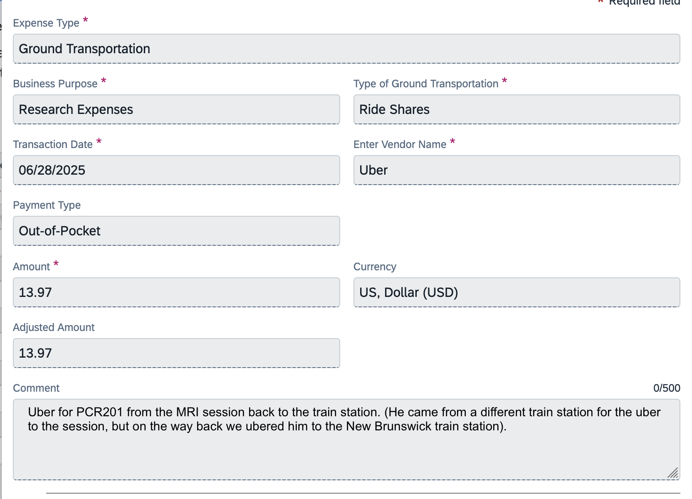

# How to Submit Uber Reimbursements for Participants

This is for if you (as a Rutgers employee) purchase an uber for a participant with your own card, and then submit for reimbursement in Concur. You may do any number of uber payments in one reimbursement request (ie you can aggregate all from a week or two, and submit all together). Make sure the card in your uber is a card which is also added to your Concur profile. If it isn't, follow this tutorial to add it: [Add Your Card to Concur](https://holmeslab.github.io/holmeslab/docs/Admin/add-card-to-concur/)

1. Select "Create Report" in Concur (App on my.rutgers.edu)
2. Use account codes like this:
    1. **Use start-up code numbers for everything except the Project & task**
    2. For the project, fill in the PCX Project.task code
3. Add each expense by clicking “add expense”, “upload from receipt” and uploading the receipt so their AI can scan it
4. Adjust any incorrect information, and fill in the rest of the fields like this:
    
    