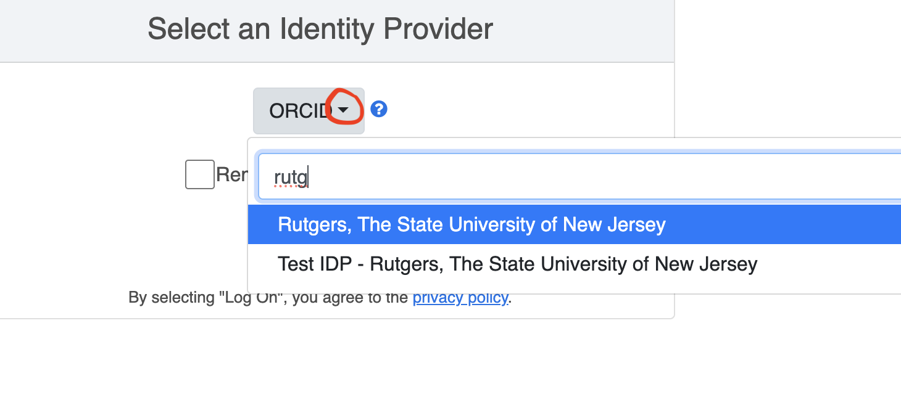

# Flywheel Overview

Flywheel: [https://cahbir-flywheel.rutgers.edu/#/projects](https://cahbir-flywheel.rutgers.edu/#/projects)

**TABLE OF CONTENTS:** 
{:toc}

## Flywheel Storage & Pipeline - only put active CAHBIR center data

- No restrictions for the amount of data
- But we’re charged for the data since it’s stored in the cloud
- Can keep all your active study data on flywheel
    - More likely to stay stable than stuff you take off and put on amarel
- After every session of fMRI scanning at CAHBIR the scan tech is going to automatically send data from the scanner to flywheel
    - multi-band multi-echo will go up but will go up a little later since Jeff has to do another step
    - compress-sensing MP2Rage
- Double check that the information you want in flywheel is being transferred after the data is put into flywheel
    - You should definitely do a test or two with your pipeline

## Log into Flywheel:
1. Go to [https://cahbir-flywheel.rutgers.edu/#/projects](https://cahbir-flywheel.rutgers.edu/#/projects)
2. Choose "University Credentials via CILogin"

3. Choose the dropdown arrow, type in "Rutgers" and select. 

4. Log in with your NetID and password

### Data-Viewer

- Little picture icon on the right of the dicom
- Can also double check that your files are right

### Gear Exchange

- [flywheel.io/gear-exchange/](http://flywheel.io/gear-exchange/)
    - if there’s any there you want and aren’t currently installed on our flywheel, let Wil / CAHBIR-support know, and they’ll ask flywheel to add it
- You can also make requests for flywheel to make a gear, though we don’t know how quickly that might happen

### Questions

- Flywheel has robust documentation
    - [https://docs.flywheel.io/Developer_Guides](https://docs.flywheel.io/Developer_Guides)
- Or email flywheel directly with ‘give us feedback’ (opens up a ticket)


## How to change file names (if necessary):

Tutorial by flywheel devs: [https://docs.flywheel.io/Developer_Guides/dev_bids_curation_2_precuration/](https://docs.flywheel.io/Developer_Guides/dev_bids_curation_2_precuration/) 

1. Go to your Project tab
2. click on Subjects tab and select the subject you’d like to run
3. Go to Analysis tab
4. Click Run analysis gear 
5. Click “Bids Pre-Curation” or “relabel container” (they’re equivalent)
    1. put in no inputs, leave everything blank
6. run gear
7. Go to subjects tab
8. to go “provenance” tab in subject to see the job running
    1. refresh for new update— not live view
    2. if fails, click on the “View Log” button
    3. read the error log to figure out
        1. ask Wil if need be
9. When finished, go to “analysis” tab at the TOP (not within “Subject”)
10. click on the job Bids pre-curate
11. For the files, if you need to make edits, press on the 3 dots and then press “Download”
    
    acquisitions.csv 
    
    sessions.csv
    
    subjects.csv 
    
12. make the edits in excel
13. in flywheel, in the project tab, press “information” tab
14. press ‘upload’ 
15. upload the .csv that you made edits to
- This keeps the version history of all the prior csv versions— so if you upload a document that is wrong, you can just restore an old version

## Ignoring Files

### If you need to ignore 1-3 images into .bidsignore…

Flywheel Tutorial: [Ignoring Certain Images in Bids](https://docs.flywheel.io/user/bids/user_ignoring_certain_images_in_bids/)

1. Go to your Project tab
2. click on Subjects tab and select the subject you’d like to run
3. Go to Sessions tab
4. Make sure you’re on “Acquisitions” tab
5. Optional: Turn on “BIDS View”
    1. click on the 3 dots to the right of the “Run Gear’ button
    2. click on the on-switch for “BIDS View”
6. Click on the file you want to ignore
7. In the popup, go to “Information” tab
8. Scroll down to the small section which says “BIDS” and has a carrot “^”
9. Press on the carrot to expant the BIDS information
10. Scroll down to the line “ignore []” and check the box
11. Press “save” on the popup
12. Repeat steps 6-11 for any files you want to ignore

### If you need to ignore many images based on rules…

1. Click on your project tab
2. Go to “Information”
3. In files find template nordic_extension_template_MMDDYYYY.json
4. Click on the 3 dots in the template row and click “Download” 
5. Open file in an editor
6. In the “initializers":” section, paste in your code

for example, this skips any files which start with “fmap_” or “fmap-” and end with “SBRef” or “Pha”, and skips any files which end with “_e2” or “_e3”

```python
{
          "rule": "reproin_fieldmap_file",
          "where": {
            "acquisition.label": {
              "$regex": "fmap(-|_).*(SBRef|Pha)+$"
            }
          },
          "initialize": {
            "ignore": true
          }
        },
        {
            "rule": "reproin_fieldmap_file",
            "where": {
                "file.name": {
                    "$regex": "_e(2|3)\\.(nii(\\.gz|)|json)$"
                },
                "acquisition.label": {
                    "$regex": "fmap(-|_)"
                }
            },
            "initialize": {
                "Suffix": "echo",
                "ignore": true
            }
        },
```

## Add Additional Documents

- ‘ad-hoc’ upload
- can add any type of file to a dataset
