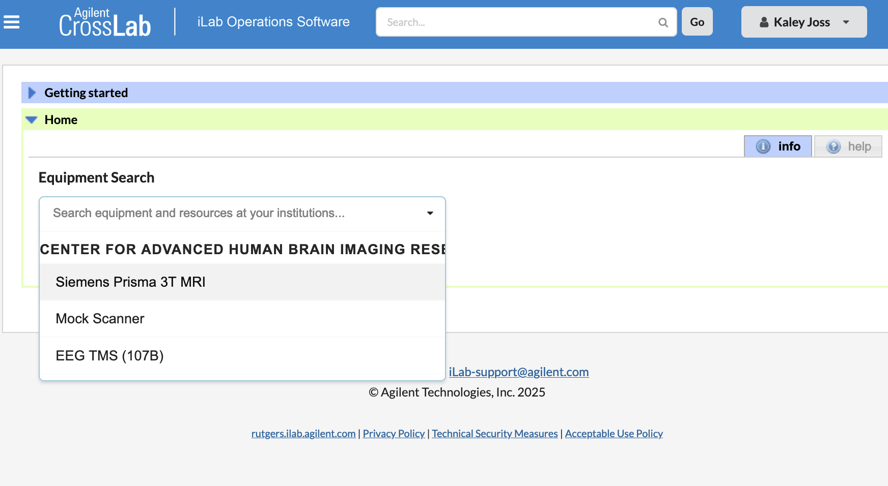

# Scheduling MRI Scans at CAHBIR

Date: January 6, 2025 9:13 AM

- Get [iLab](https://rutgers.ilab.agilent.com/) access: this is where you schedule:
    
    iLab: [https://rutgers.ilab.agilent.com/](https://rutgers.ilab.agilent.com/) 
    
    1. log into ilab (registration link here: [https://rutgers.ilab.agilent.com/landing/196](https://rutgers.ilab.agilent.com/landing/196)) 
    2. Request access from your PI
    3. They allow
    4. Then CAHBIR allows
    5. Then you get access to project codes (Holmes Lab Project Code is Project 836892-800)
    6. Then you can schedule in ilab 

NOTE: make sure your irb allows a verbal phone screening  before participants arrive at CAHBIR. Pre-scan phone screenings are essential. Otherwise many participants may come to your sessions and not be able to be scanned, causing you to lose money and time.

- verbal phone scan: ask about medical implants (any surgeries), claustrophobia, and other general MRI-prohibitive things

- Make a reservation request
    1. Click ‘Rutgers iLab User Login’
    2. Log in with NetID
    3. In the ‘Home’ tab, click on the dropdown arrow for equipment search and scroll to/search for CENTER FOR ADVANCED HUMAN BRAIN IMAGING RESEARCH
        
        
        
    4. Select the item you want to schedule (Siemens Prisma 3T MRI is the MRI scanner) 

- Editing Reservation Requests
    - Labs are now able to cancel a reservation in iLab after it has been approved. Please note that iLab will warn you of a fee even when the reservation is canceled outside of the 24-hour cancelation period. CAHBIR staff will refer to the timestamp provided at the time of cancelation to determine if a fee is warranted. Unfortunately, editing approved reservations is still NOT permitted. Alternatively, you may cancel the original reservation and reserve the correct date/time. Labs are no longer required to submit a request to [cahbir-support@rutgers.edu](mailto:cahbir-support@rutgers.edu) when canceling or editing approved reservations. Please reach out with any questions.

- CAHBIR has a 24-hour cancellation policy— otherwise you pay
    - if you haven’t heard from the participant in 26hrs , just cancel the appt
    - Then if they confirm, put it back on the cal
    - If someone cancels, you can have someone else come in within the same day
        - Have a list of people who can fill in
        - Or cancel prefunctively

- How long to reserve:
    - How long the scan is for the study + 15mins

- Places You can reserve at CAHBIR:
    
    **Free**
    - testing room
    - Observation room
    - Mock scanner
    - Eeg room
    
    **Paid**
    - scanner room
