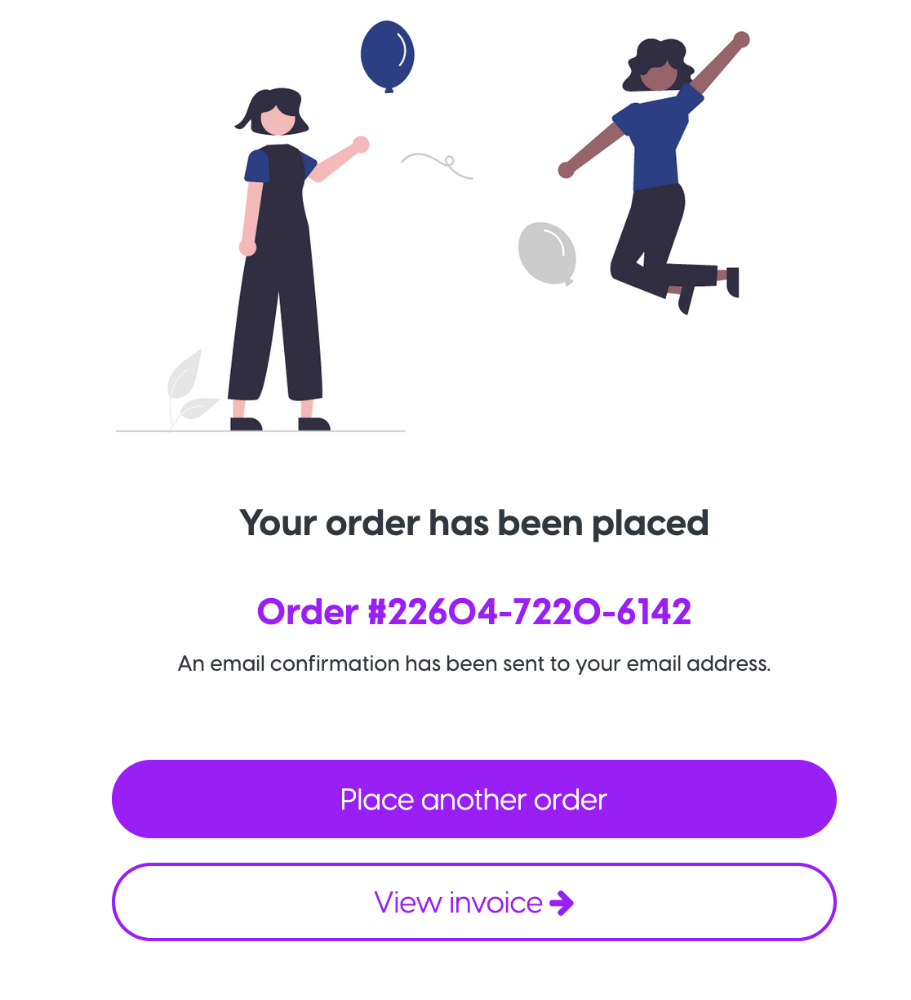
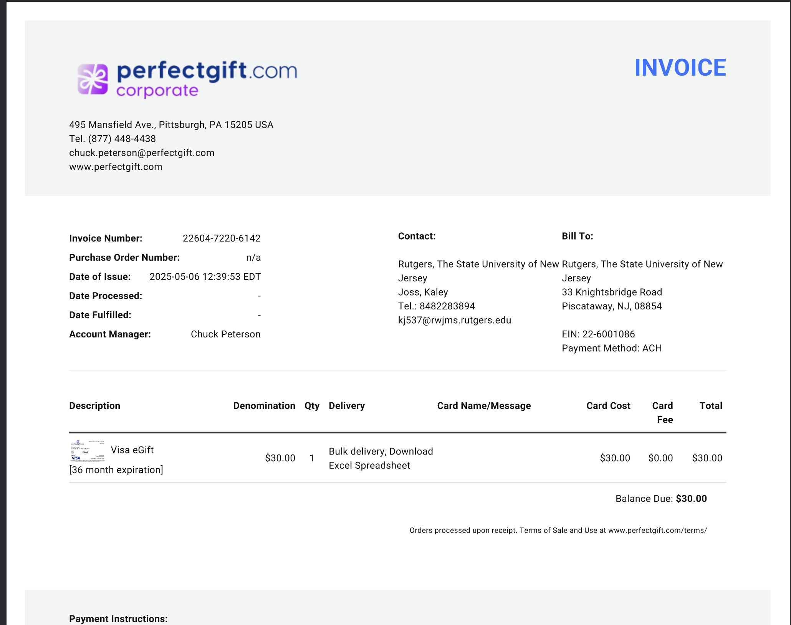
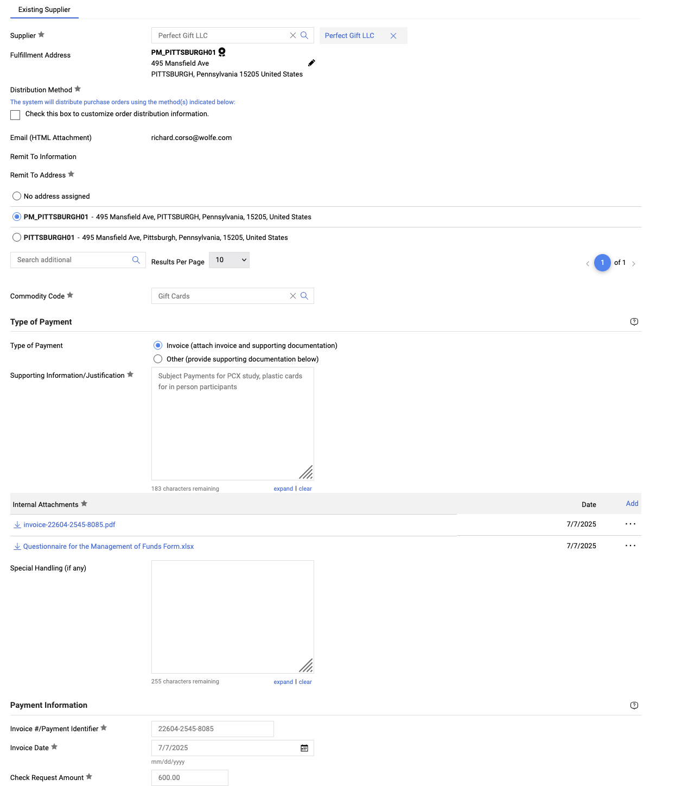

# Tutorial: Buying Gift Cards from PerfectGift

Holmes Lab account in [passwords file](https://rutgers.box.com/s/fbjhcw44tter8pyb4a68mnbbk5086btj)

</aside>

Contact: [rutgers@perfectgift.com](mailto:rutgers@perfectgift.com)  ||  [Rutgers PerfectGift Info Page](https://procurementservices.rutgers.edu/purchasing/perfect-gift-llc) 

### Buying cards from Perfect Gift
After every MindLAMP payment send (monthly), replenish all cards you need. You should try to always have 10 of each MindLAMP amount, 20 $5 for gas, 20 $25 cards and 20 $60 cards digitally. Also 10 $60 physical cards.

1. Go to [corp.perfectgift.com](http://corp.perfectgift.com) and login
2. Select Place Order and then select Visa as the vendor
    1. Choose Digital (Email Delivery)
    2. Choose 36-month Expiration
    3. Download all digital eGifts in one spreadsheet file
    4. Add cards manually
4. Add cards:
    - Quantity to replenish what has been used already
    - Add quantity for each card amount, add to cart, then continue shopping to add other card amounts
    - First and last name doesn't matter, I just put "Thank" "You", but it doesn't show up anywhere
    - No email message
3. Payment method: ACH
4. If buying physical cards, for free shipping: use promotional code “RUTGERS”
5. Submit the order (that will automatically generate a PDF invoice.)
    
    
    
    1. Order number = invoice number
    2. View invoice
        
        
        
    3. Download the invoice and save it to box folder [Perfect Gift](https://rutgers.box.com/s/jx2fmd1xgtbz4e0q7pu33jcgzv21mrby) (in Lab_admin > Purchasing and Reimbursement)
6. Make a folder in /Purchases Tracking/PerfectGift/ named the DATE of this submission. Add the invoice PDF
7. Make a copy of [Questionnaire for the Management of Funds Form](https://rutgers.box.com/s/c6zrpzdx2h9kp0hgjjyn5md8vvnp69hw), fill in DATE and AMOUNT, add it to the folder 
8. Go to Marketplace and create a Check Request  Attach Invoice (from step 5) to Check Request as required backup.
    1. Supplier: Perfect Gift LLC
    2. Commodity Code: Gift Cards
    3. Type of Payment: Invoice
    4. Invoice #/Payment Identifier: Order # from [PerfectGift.com](http://PerfectGift.com) / Invoice Number from invoice  (same number)
    5. ATTACH:
        1. invoice-funds-<number>.pdf
        2. [Questionnaire for the Management of Funds Form](https://rutgers.box.com/s/c6zrpzdx2h9kp0hgjjyn5md8vvnp69hw).xlsx
    
    Image reference:
    
    
    
9. Press ‘add and go to cart’ 
10. Accounting codes (normal, except):
    1. Expenditure type: **54160** (Services Human Subjects)
11. Department and Accounts Payable Check Request team must approve the Check Request. Once approved by all parties, Payment will be released to the provider on the next Payment Run (Tuesday & Thursday every week).
12. Once RU sends the money, PerfectGift will process immediately or next-day
    1. On your perfectgift account, you can see your in progress/submitted orders whether the cards have been shipped
13. Once provider receives payment, the order is fulfilled— you will get an email, and you can download the excel sheet which has this information:

| Product description | Amount | Date Processed | Delivery Link | Secret Code | Card Number | PIN | Expiration Date |
| --- | --- | --- | --- | --- | --- | --- | --- |
1. Move this downloaded sheet into: /Box-Box/(Restricted)_PCR/PCR_Holmes/PerfectGift/PerfectGift Downloads
2. Copy the links and codes into: Box-Box/(Restricted)_PCR/PCR_Holmes/Payment_tracking.xlsx

### Perfect Gift Info

- How to get an account:
    - Contact Perfect Gift, [Chuck Peterson](mailto:Rutgers@perfectgift.com) ([Rutgers@perfectgift.com](mailto:Rutgers@perfectgift.com)) with your name and phone number, for initial setup. Perfect Gift will provide a login and password to their [website](https://www.perfectgift.com/corporate/rutgers) .
- $0 per card fee
- Can send individual cards to participant location
- *Bulk shipping of physical cards needs to go to a Rutgers address*
- Can add greeting cards / flyers / trifolds to carry the plastic card, with messages
- Can have rutgers-branded cards
- Free shipping, even overnight shipping: use promotional code “RUTGERS”
- Card activation:
    - Cart activation for VISA & Mastercard can be by recipient or purchaser (your option).  Merchant cards (i.e. Amazon & target) are shipped already activated so we always request you ship these Overnight Signature Required.  Rutgers shipping is always free.
    - Can bulk activate all cards, or can have them activate their card just from the card number and CVC, or can have an extra activation code which you communicate to all participants
- Merchant gift card funds and card numbers (like Amazon) never expire.  [PerfectGift.com](http://perfectgift.com/) VISA & Mastercard funds never expire;
    - However Visa and Mastercard has expiration on the card number. You may select 3 years expiration. If a person hasn’t used their card in 3 years, they can call perfect gift and perfect gift will reissue the card to them
- Cards can be reloadable, but there is card fee for reloading
- You can send to participant where they can choose to request a physical card, will be $5 less
- Can choose perfectgift+ which sends cards specifically to participants and gives them the choice of WHAT place they want the giftcard for
    - Ex: Visa, suppliers (Target, Starbucks),  or Zelle (bank account)
    - Zelle charges a $5 transfer fee
- Tracking of delivery is available if you choose FedEx.  If you elect USPS First Class the tracking is limited to IMBC (intelligent mail bar code).  Shipping is free so you may typically want to use FedEx over USPS First Class delivery.
    - Same day shipment of bulk plastic cards before 4pm if they have the cards in house
- Can store your gift cards to your digital wallet (Apple wallet and Google wallet)
- Can link through their patented card linking technology to link their card to their debit card, and then
- Visa and MasterCard do NOT have a declining balance each month- no user fees