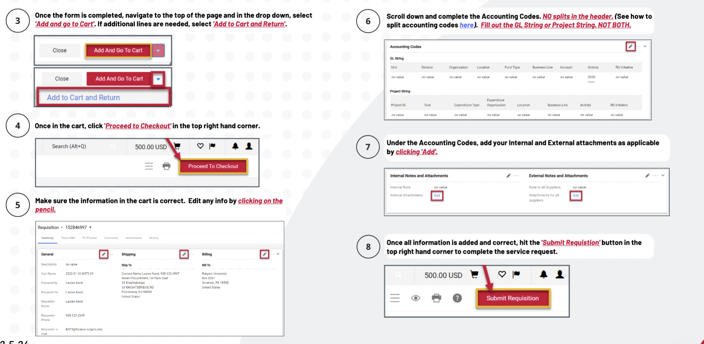
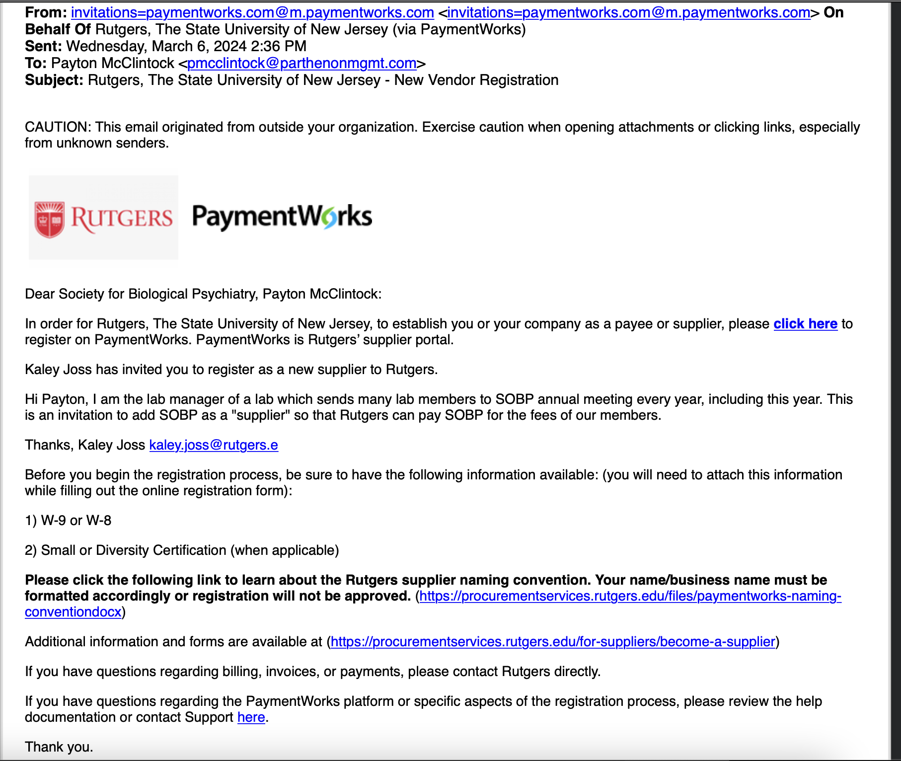
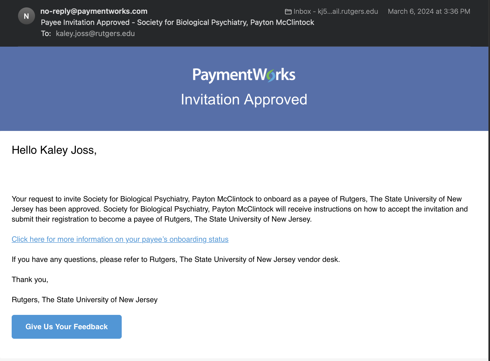
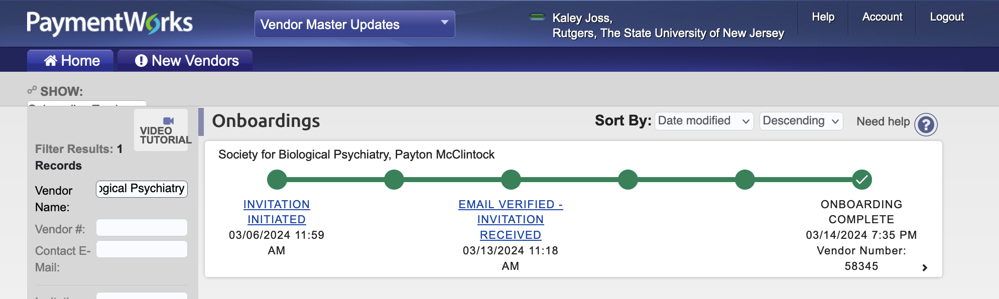

# Service Request Tutorial

Date: April 1, 2024 4:57 PM

# Submitting a Service Request

Created by: Kaley Joss | Mon Apr 1, 2024

<aside>
 Contents

</aside>

### Check for Supplier Contract

1. See if the supplier has a contract
    1. Go to [my.rutgers.com](http://my.rutgers.com) → RU Marketplace (Jaegger) → Suppliers → Search Suppliers
    

### If the supplier has a Rutgers Contract…

1. If they’re in RU marketplace, look up their (supplier contract) name in [https://procurementservices.rutgers.edu/purchasing/](https://procurementservices.rutgers.edu/purchasing/dropbox-inc)
    1. Scroll to ‘Procurement Procedures’ section, it will list the necessary steps / forms
        1. Ex: for Dropbox [https://procurementservices.rutgers.edu/purchasing/dropbox-inc](https://procurementservices.rutgers.edu/purchasing/dropbox-inc) the procurement procedures section says purchasing requires:
            - Using the [Service Request Form](https://solutions.sciquest.com/apps/Router/SAMLAuth/Rutgers)
                - Attaching a “detailed” quote
            - Submitting + attaching a [Third Party Risk Assessment](https://rusecure.rutgers.edu/third-party-security-review-process)
                - Questions? Submit to [Information Security Risk Assessment Contact Form](https://it.rutgers.edu/information-security/contact-risk-assurance/)
        2. if they don’t have a contract on that site, but they do have a contract in RU Marketplace, I would look up which commodity code you’ll need in this form: [Commodity Codes - Which Forms Are Allowed](https://rutgers.box.com/s/4hdapczpt2l3wklkauijaultrvw9q9zf) (downloaded from Canvas link [List: Commodity Codes)](https://rutgers.instructure.com/courses/561/pages/list-commodity-codes-with-corresponding-forms?module_item_id=6208614) and make sure to use whichever form it says is allowable (ie Goods Request, Service Request or Quick Order)
2. For external attachments, (unless it says otherwise on the procurementservices link above), add a detailed quote and a third-party risk assessment.
    1. Detailed quote = screenshots of website showing cost, item, taxes and shipping
    2. Third Party Risk Assessment
        1. [Process for Third Party Risk Assessment [PDF]](https://rutgers.box.com/s/g1c6zgfegaiagp71wd7m6dsm1zt6wivs)
        2. Fill out [Third Party Risk Assessment Intake Form](https://forms.office.com/Pages/ResponsePage.aspx?id=IystuTVNcEST_2mspmMv_vNV1GTfz6VMtu11uPaiSw5UNjE5SERERlNaSFBMNkE2MjNWQlRKWlBJVSQlQCN0PWcu)
3. Now follow these steps  for Service Request submission, adding in any required documents in the “**External Attachments**” box
    
    
    
    
    

### If the supplier does not have a contract:

Option 1: Fill out additional forms ([listed here based on category](https://procurementservices.rutgers.edu/purchasing/non-contracted-suppliers)), 

(and then use a a [Goods or Service Request Form](https://solutions.sciquest.com/apps/Router/SAMLAuth/Rutgers) in RU Marketplace, or a Quick Order if applicable)

1. Contact UPS at UPS Self Service Helpdesk and ask for guidance for what forms are needed—whether you need to submit a goods or service request form or quick order form, which additional documents or approvals you need, etc.
2. If it’s a software purchase, Contact OIT at OIT help desk [help@oit.rutgers.edu](mailto:help@oit.rutgers.edu) to see if the purchase is okay
    1. OIT <[help@oit.rutgers.edu](mailto:help@oit.rutgers.edu)> will respond with whether you can go ahead with purchase
3.  fill out this form: [Accessibility Purchase Form](https://forms.office.com/Pages/ResponsePage.aspx?id=IystuTVNcEST_2mspmMv_qSd-yezokxOv-1SsQuQ30VUOVRNU05SQUNHWTk2Nk5JVlVMRElNT01NTyQlQCN0PWcu)
    1. Look up the company’s accessibility statement, download VPAT if they have one, attach it to form
    2. Accessibility Support <[accessibility-support@rutgers.edu](mailto:accessibility-support@rutgers.edu)> will respond saying whether you need an accessibility audit
4. If it involves Personal Health Information, you’ll need to fill out a [Business Associate Agreement (BAA)](https://uec.rutgers.edu/forms/)
5. After all those are done, fill out [Third Party Vendor Risk Assessment Form](https://forms.office.com/Pages/ResponsePage.aspx?id=IystuTVNcEST_2mspmMv_vNV1GTfz6VMtu11uPaiSw5UNjE5SERERlNaSFBMNkE2MjNWQlRKWlBJVSQlQCN0PWcu)
    1. Questions? Submit to [Information Security Risk Assessment Contact Form](https://it.rutgers.edu/information-security/contact-risk-assurance/) 
6. Then, go to RU Marketplace > View Forms > Service Request, goods request or quick order (depending on what UPS said) and fill out relevant information 
7. Attach to requisition, if applicable:
    1. Third Party Vendor Risk Assessment Form
    2. Screenshot of OIT approval
    3. Screenshot of UPS approval
    4. Screenshot of Accessibility support approval
    5. Business Associate Agreement
8. Submit requisition

Option 2: Add them as a supplier

1. Find a contact person + email for the supplier company
    1. You’ll have to work with them to get them set up in the Rutgers system as a supplier in PaymentWorks
    2. Notify them that an invitation will be coming their way / ask them if they will accept it
2. Follow this Job Aid: [Supplier Onboarding Course Pathway in Canvas](https://rutgers.instructure.com/courses/31949/pages/job-aid-inviting-a-new-supplier-and-checking-onboarding-status?module_item_id=6484653) 
    1. After you [submit your invitation on PaymentWorks](https://www.paymentworks.com/app), you’ll be able to see the progress on there, as well as get emails
3. This is the email you’ll get when your PaymentWorks invitation has been approved and sent to your supplier
    
    
    
4. This is the email they’ll get from PaymentWorks
    
    
    
    5. This is the email you’ll get when they open/ start registration in PaymentWorks
    
    
    
    6. Once the supplier finishes their PaymentWorks portal, this is what PaymentWorks will look like
    
    
    
    1.  Look up which commodity code you’ll need in this form: [Commodity Codes - Which Forms Are Allowed](https://rutgers.box.com/s/4hdapczpt2l3wklkauijaultrvw9q9zf) (downloaded from Canvas link [List: Commodity Codes)](https://rutgers.instructure.com/courses/561/pages/list-commodity-codes-with-corresponding-forms?module_item_id=6208614) and make sure to use whichever form it says is allowable (ie Goods Request, Service Request or Quick Order)
    2. Now follow these steps  for Service Request submission, adding in a Detailed Quote 
        
        
        
        