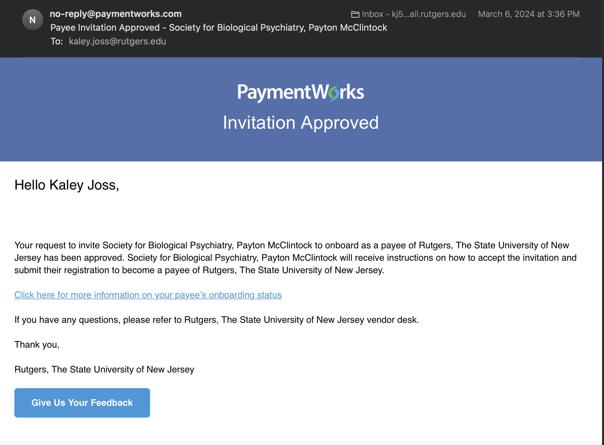

# Software Purchasing

Date: January 30, 2024 10:02 AM

### Quick Links ⛓️

---

🌐 [RU Software Portal](https://software.rutgers.edu/index/)

🛍️ [RU Marketplace](https://solutions.sciquest.com/apps/Router/Home?tmstmp=1694597164716)

🗺️ [RU Purchasing Guide](https://ithelp.rutgers.edu/sp?id=kb_article_view&sysparm_article=KB0011673&sys_kb_id=50a361e91b079510227f84ccdd4bcbea&spa=1)

- Walks you through purchasing software on the Software Portal

## Purchasing Software *NOT* in Software Portal

---

<aside>
☎️ RUWare ([ruware@oit.rutgers.edu](mailto:ruware@oit.rutgers.edu)) provides consulting services, procurement assistance, and follow-up on tech purchases for RBHS and Rutgers–Newark.

</aside>

1. Email RUWare ([ruware@oit.rutgers.edu](mailto:ruware@oit.rutgers.edu))
    
    “Our lab (PI: Dr. David H. Zald; Psychiatry) would like to purchase the following software license.
    
    <URL>
    
    - Name of software
    - Quantity and price
    
    Please let me know if any additional information is required.
    
    It does not look like the software is in the Rutgers software portal. Guidance on how to best proceed would be greatly appreciated.
    
    Many thanks”
    

2. It is possible you need to loop in [software@rutgers.edu](mailto:software@rutgers.edu) or Barry Wise ([wiseba@njms.rutgers.edu](mailto:wiseba@njms.rutgers.edu)) or Rutgers IT Help [servicenow@rutgers.edu](mailto:servicenow@rutgers.edu)

- **Example: IRTPro Software**
    
    Hello,
    
    Our lab (PI: Dr. David H. Zald; RWJMS Psychiatry) would like to renew our license for the following software license set to expire 3/4/23.
    
    IRTPro Academic: [https://store.vpgcentral.com/irtpro-academic](https://nam02.safelinks.protection.outlook.com/?url=https%3A%2F%2Fstore.vpgcentral.com%2Firtpro-academic&data=05%7C01%7Cnjd130%40rwjms.rutgers.edu%7Cddd7646231e84d8ea1c608db1a7cc17c%7Cb92d2b234d35447093ff69aca6632ffe%7C1%7C0%7C638132895344265676%7CUnknown%7CTWFpbGZsb3d8eyJWIjoiMC4wLjAwMDAiLCJQIjoiV2luMzIiLCJBTiI6Ik1haWwiLCJXVCI6Mn0%3D%7C3000%7C%7C%7C&sdata=niVeuxTrKDuRIrBn0qnBpgZHDV3dOHLWyGTLiOJ4U3s%3D&reserved=0)
    
    1 license renewal
    
    The software is not in the Rutgers software portal, but we previously completed this process last January 2022 with the assistance of Barry Wise. Guidance on how to best proceed would be greatly appreciated.
    
    - Attach previous quote if applicable

****Some software RUWare doesn’t work with. If so, follow below*********

---

### Purchasing Software / License that RUWare doesn’t work with

Two options: 

1. Pay and submit for reimbursement 
2. Submit a service request
    1. Service request, not quick order, because in “
    

### Submitting a Service Request

1. See if the supplier has a contract
2. Look up supplier contract in [https://procurementservices.rutgers.edu/purchasing/](https://procurementservices.rutgers.edu/purchasing/dropbox-inc)
    1. Under ‘Procurement Procedures’, it will list the necessary steps / forms
        1. Ex: Dropbox at [https://procurementservices.rutgers.edu/purchasing/dropbox-inc](https://procurementservices.rutgers.edu/purchasing/dropbox-inc) requires:
            - [Service Request Form](https://solutions.sciquest.com/apps/Router/SAMLAuth/Rutgers)
                - with detailed quote
            - [Third Party Risk Assessment](https://rusecure.rutgers.edu/third-party-security-review-process) form submission
3. If the supplier does not have a contract:
    1. Find a contact for the supplier
    2. Notify them that an invitation will be coming their way / ask them if they will accept it
    3. Follow this Job Aid: [Supplier Onboarding Course Pathway in Canvas](https://rutgers.instructure.com/courses/31949/pages/job-aid-inviting-a-new-supplier-and-checking-onboarding-status?module_item_id=6484653) 
        1. After you [submit your invitation on PaymentWorks](https://www.paymentworks.com/app), you’ll be able to see the progress on there, as well as get emails
    4. This is the email you’ll get when your invitation has been approved and sent to your supplier
        
        
        
    5. This is the email they’ll get from PaymentWorks
        
        
        
        f. This is the email you’ll get when they open/ start registration in PaymentWorks
        
        
        
        g. Once the supplier finishes their PaymentWorks portal, this is what PaymentWorks will look like
        
        
        
        h. Now you will be able to follow the instructions above, for submitting a service request to this supplier, as they are now in the Rutgers system
        

## Purchasing SPSS/Software *in* Software Portal

---

This is a general guide to purchasing software that can expand to other software found in the RU software portal

1. DZ will place an order in the RU software portal
    1. Have him send a copy of the receipt to attach to the request form.
    - **Example Photo**
        
        [Mail+-+Nicholas+Dennis+-+Outlook.pdf](Software Purchasing - Sharable fc68c5ec5a5141989de8c3d0222903d2/Mail-NicholasDennis-Outlook.pdf)
        
2. Go to RU Marketplace and input “IPO: OIT CCS Site Licensed Software” into the search bar in the Shop tab
    - **Image Reference**
        
        
        
3. Select “View Form” in the box that says “IPO: OIT CCS Site Licensed Software (#50).” It should be the only item on the page. Listed for $1.00
    - **Image Reference**
        
        
        
4. In the form, fill out the “Product Description,” “Total Dollar Amount/Quantity,” “Commodity Code,” and the “Quote #.”
    
    
    1. **Product Description:** Software Order XXXX
        1. Replace XXXX with order # obtained from DZ
    2. **Total Dollar Amount/Quantity:** $$$$
        1. **TOTAL** cost of the order!
    3. **Commodity Code:** IT Software Licenses and Subscriptions
    4. **Quote #:** XXXX
        1. Re-input the order # obtained from DZ
    
    - **Image Reference**
        
        
        
5. Then click “Add And Go To Cart.” In the cart, notice in the Summary box on the right who is listed in the “For” category. Then, add a 1-2 word description at the end of the cart name for easier querying in the future!
    1. If this is your first requisition, the “For” category will show up with your name which you will need to change in the next step!!
        1. As a general rule you want to make sure the “For” category is listed as “David Zald”
    2. Cart names are automatically populated with the Date (YYYY-MM-DD) and your RU NetID. Feel free to keep that and just add the 1-2 word description at the end!
    - **Image Reference**
        
        
        
6. Click “Proceed To Checkout” located in the top right corner to move to the requisition page.
    1. First, go to the “General” section and edit the Description as well as the Prepared For (if that was incorrect).
        1. To do that, click on the pencil next to the 3 dots in the “General Section”
        2. In the Description, add a brief blurb about what the purchase is.
        3. If needed, change the Prepared For to David Zald.
        4. **Click Save.**
        - **Image Reference**
            
            
            
    2. Next, fill out the Accounting Codes section.
        1. If purchasing for general lab purchases (that will be used across projects), use the Zald Lab Start-up Code
            1. True as of 9/14/23. If this is much later, do check in with DZ to ensure using right business line.
            - **Presets for this type of purchase**
                
                **Project ID:** XXXXXX
                
                **Task:** XXX:XXXXXX
                
                **Expenditure Type:** 74103 - MUST BE THIS CODE!!
                
                **Expenditure Organization:** XXXXXXXXXXX
                
                **Location:** XXXX
                
                **Business Line:** XXXX
                
                **Activity:** 0000
                
                **RU Initiative:** 000000
                
                - **Image Reference**
                    
                    
                    
        2. If purchasing for a project related to a grant/subaward. Reach out to DZ for the project ID #.
            1. Presets will vary for each project but make sure to use 74103 for the Expenditure Type!!!
            - **Presets for General Factor Grant**
                
                **Project ID:** 829407
                
                **Task:** 800:829407
                
                **Expenditure Type:** 74103 - MUST BE THIS CODE!!
                
                **Expenditure Organization:** 76065957317
                
                **Location:** 2635
                
                **Business Line:** 3100
                
                **Activity:** 0000
                
                **RU Initiative:** 000000
                
                - **Image Reference**
                    
                    
                    
    3. Attach a pdf of the order receipt that you obtained at the [**beginning](https://www.notion.so/Software-Purchasing-Sharable-fc68c5ec5a5141989de8c3d0222903d2?pvs=21)** to the **Internal** Notes and Attachments section.
7. After the above steps are complete, click “Submit Requisition.”