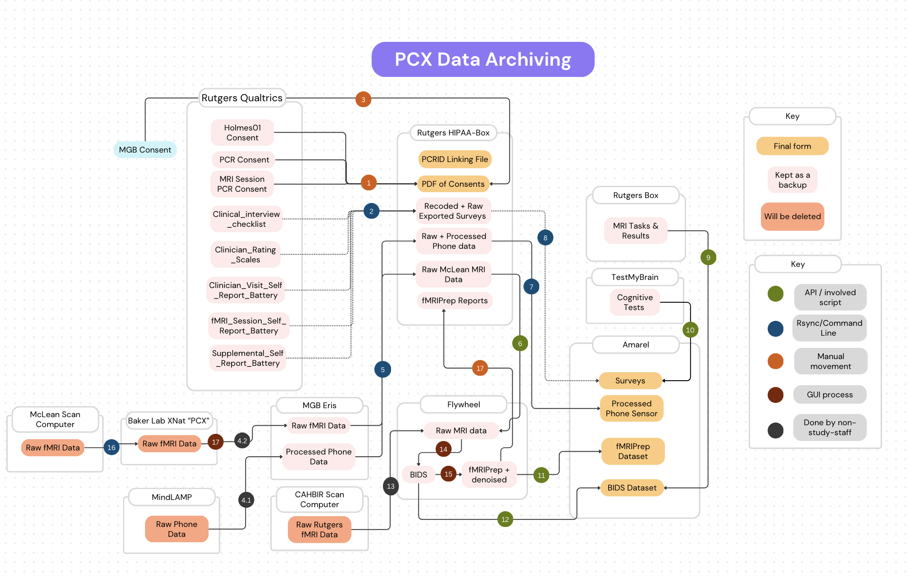

# Overview of Data Pipeline

### Locations/Processes
**Not in a specific order, the numbers are just references, these steps can be done mostly independently

1. Manually download from qualtrics
2. Download qualtrics data to amarel using the Qualtrics API
    1. Log into amarel
    2. Navigate to `~/Library/CloudStorage/Box-Box/Holmes_Lab_Wiki/PCX_Round2/Data_processing/download_qualtrics.ipynb`
    3. Run the notebook
3. TBD - do we need this? Brien would have to maybe upload to PCX Box?
4. Lochness (run every 12 hours on MGB server. Maintained by Habib)
5. **MindLAMP Data**
    
    1. Be on a computer at Rutgers so it’s on Rutgers wifi
    2. VPN into Eris (MGB HPC)
    3. Run (replace ‘kj110’ with your MGB netID)
    `rsync -avz kj110@eristwo.partners.org:'/data/sbdp/PHOENIX/GENERAL/PCX/PC*' '/Users/demo/Library/CloudStorage/Box-Box/(Restricted)_PCR/PCX/mindlamp_mri_data/data'`
    
6. On CAHBIR scan computer, download mindlamp_mri_data McLean subjects from Box and Jeff's script will push them to Flywheel. (Not yet working) 
7. 
    1. Connect to Rutgers VPN (to access HPC Amarel)
    2.  Run `rsync -avz '/Users/demo/Library/CloudStorage/Box-Box/(Restricted)_PCR/PCX/mindlamp_mri_data/data/**/phone' kj537@amarel.rutgers.edu:'/scratch/f_ah1491_1/internal_data/PCX'`
8. 
    1. Log into amarel
    2. Navigate to `/projects/f_ah1491_1/analysis_tools/qualtrics/download_qualtrics.ipynb`
    3. Run the notebook
    4. Check the data has appeared in `/scratch/f_ah1491_1/internal_data/PCX/behavioral`
9. **Task Data**
When you run tasks from files in Box (through Psychopy), the data saves to the same Box location in the /data folder. 
Send task data from Box to Amarel in BIDS format using this script: `~/Library/CloudStorage/Box-Box/Holmes_Lab_Wiki/PCX_Round2/Data_processing/create_bids_files.ipynb`
10. 
    1. Sign into TestMyBrain ([https://studies.testmybrain.org/rutgerspcx/data_portal/](https://studies.testmybrain.org/rutgerspcx/data_portal/)) with the credentials in the Passwords sheet on the Box
    2. Download all data to CSV
    3. Move CSV into '/Users/demo/Library/CloudStorage/Box-Box/(Restricted)_PCR/PCX/behavioral/test_my_brain_data'
    4. Upload to Amarel
11. Download fMRIPrep data using this tutorial:
[https://holmeslab.github.io/holmeslab/docs/PCX/download-mri/](https://holmeslab.github.io/holmeslab/docs/PCX/download-mri/)
12. Move BIDS and fMRIPrep data to Amarel using this tutorial:
[https://holmeslab.github.io/holmeslab/docs/PCX/download-mri/](https://holmeslab.github.io/holmeslab/docs/PCX/download-mri/)
13. Finish + Publish Page: CAHBIR Scans to Flywheel (Run + maintained by Jeff)
14. Process data from Raw to BIDS using this tutorial:
[https://holmeslab.github.io/holmeslab/docs/Experiments/flywheel-bids/](https://holmeslab.github.io/holmeslab/docs/Experiments/flywheel-bids/)
15. Process BIDS data to fMRIPrep using this tutorial: [https://holmeslab.github.io/holmeslab/docs/Experiments/flywheel-fmriprep/](https://holmeslab.github.io/holmeslab/docs/Experiments/flywheel-fmriprep/)
16. Process on [https://holmeslab.github.io/holmeslab/docs/PCX/eris-xnat/](https://holmeslab.github.io/holmeslab/docs/PCX/eris-xnat/) 
17. Manually download from flywheel into '~/Library/CloudStorage/Box-Box/(Restricted)_PCR/PCX/fmriprep_reports’