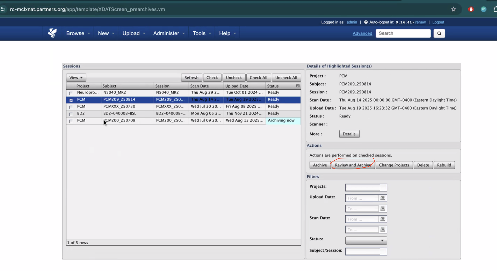
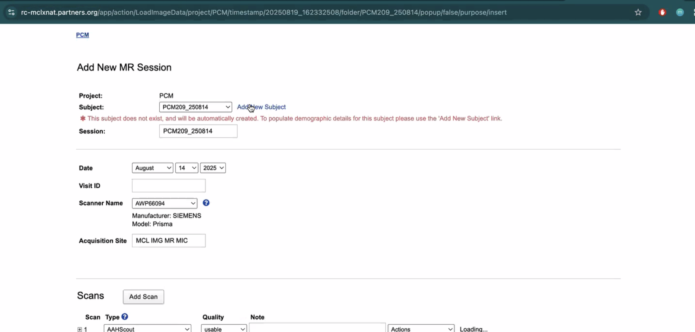
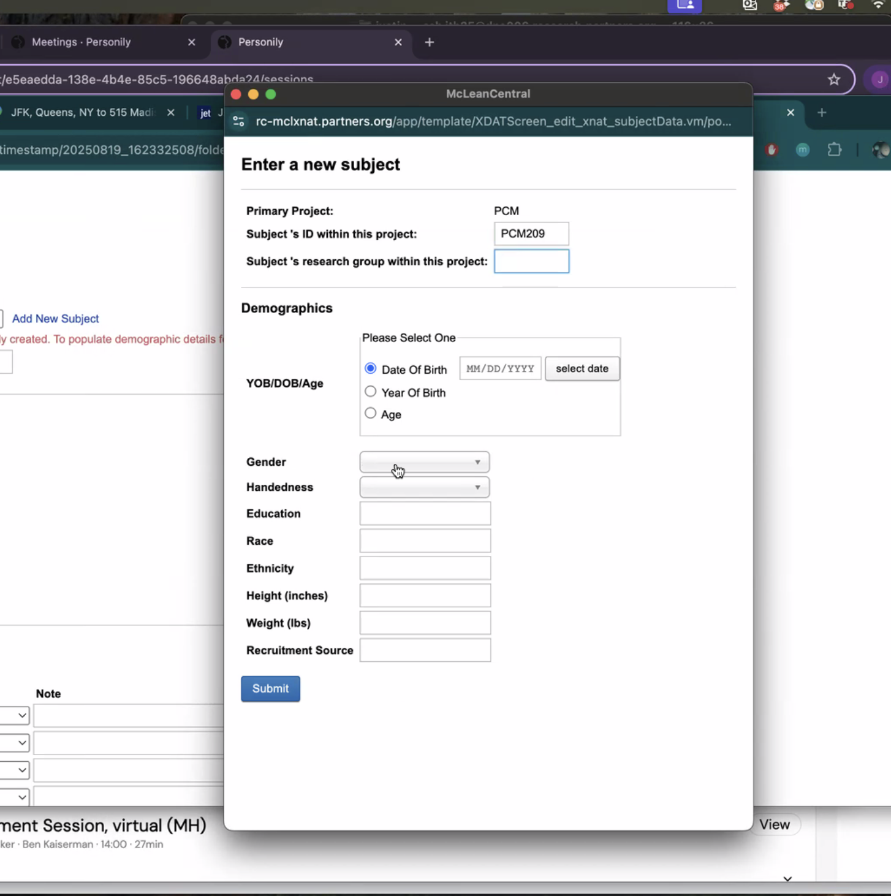
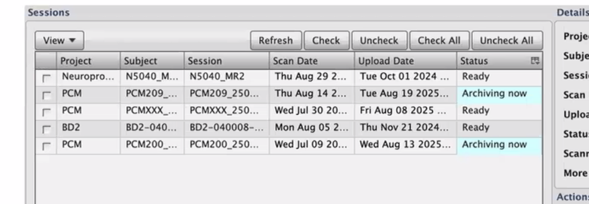

# Protocol: Raw MRI files from scan computer -> Xnat -> Eris

This is the process for McLean lab managers to pull data from the scan computer, move it to XNat, and mark it on XNat so that it gets automatically downloaded by Habib’s script. 

## Overview:

1. Use iris-transfer command to transfer each subject to the PCM project in XNat
2. Create each subject in XNat - Making sure that the subject ID lines up with subject IDs in the PCM metadata.csv file
3. Mark each subject into ‘Archive’ so that it will be downloaded by Habib’s script
4. Once you go through all these steps, Habib’s script will pull the raw image files for each subject to: `/data/sbdp/PHOENIX/GENERAL/PCX/PCRXXX/mri/processed`
    - If you don’t have access to this location, ask Justin to add you to these Eris groups: sbdp, mcl-sbdp-1

## Steps

1. McLean Research Assistant sends this command in the terminal for each participant:

`iris-transfer E59389618 PCMXXX_250730 PCM`

With XXX being the ID number for the participant, and _250730 being the date string of the scan

1. Go to [https://rc-mclxnat.partners.org](https://rc-mclxnat.partners.org/) & sign in with your McLean credentials
    1. If you don’t have an account, click “Register” to create an account
    2. If you don’t have access to the project “PCM”, ask Justin to add you
2. On rc-mclxnat.partners.org, click Upload tab > Pre-archive
3. Review and archive participants
    1. You’ll see this – click the checkbox next to the participant you would like to archive and hit “Review and Archive”

1.  Then you’ll see the participant page

1. Choose all scans, or uncheck some scans, for the participant
2. Then hit “Add New Subject”
    1. Enter in their subject ID (without date string)
    2. Press “Submit”

Then it will go back to this page and say “archiving now

Then it will pull with the API nightly