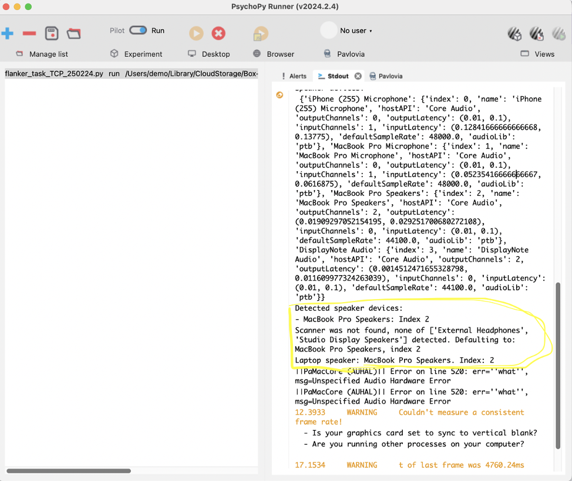
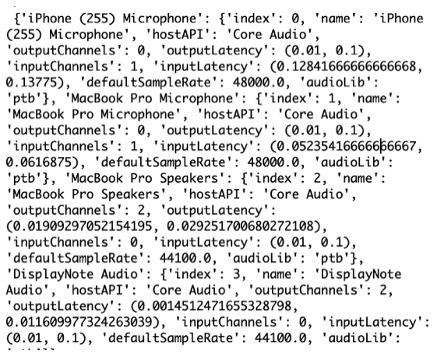
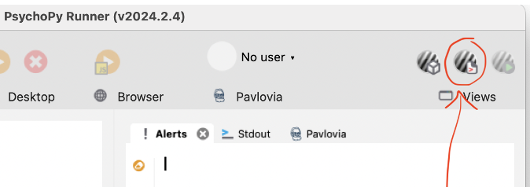
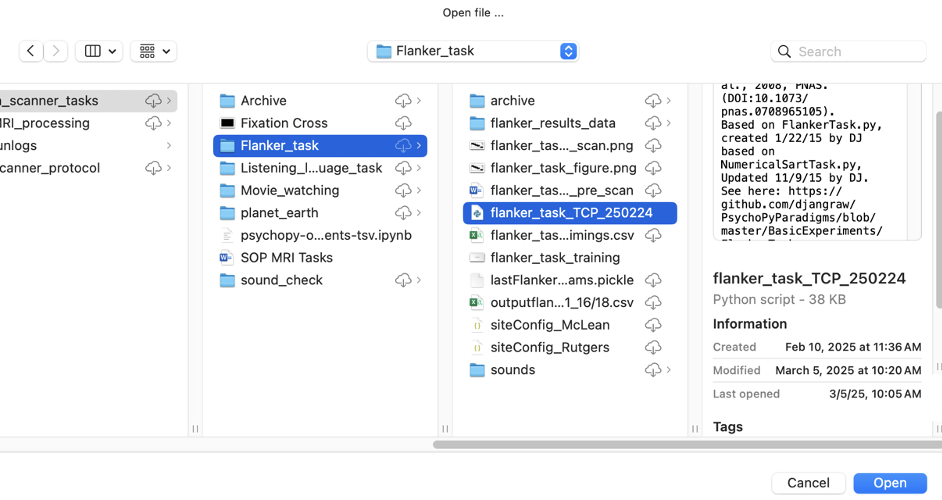
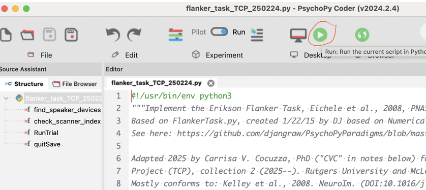

# Tasks Overview
**Table of Contents**
1. TOC
{:toc}
---
## Tasks Explanation: 
### Sound_check
- A script which will play short beeps to check how the participant’s audio levels are for subsequent tasks

### Flanker task: cognitive control task
- Summary: Participants see 4 arrows facing the same direction (called ‘flanker’ arrow), with a blank spot in the middle, and then a 5th arrow (called ‘target’ arrow) appears in the middle of the other 4. 
- The target arrow may be facing the same direction as the initial 4 flankers (congruent) or facing the opposite direction (incongruent). 
- Participants respond on the button box based on which direction the target arrow faces. 
    - Goal of this task: Instigate cognitive control networks in the brain
    - Sound Output: If the participant gets the arrow direction correct, you’ll hear a ‘click’ on your laptop. If the participant gets the arrow wrong, you’ll hear a ‘beep’ on your laptop. If the participant doesn’t respond in time, you’ll hear a ‘buzz’ on your laptop. Listen to the sounds in the /sounds folder.
    - Data output: in /data folder

### Listening Language Task: language regions task
- Summary: Participants see a quick image (1s), and then the screen is a black fixation cross (+). They then hear either a sentence related to that image, or a unrelated list of common words. When participants hear the audio stop, they press the button box. The fixation cross (+) will turn into a star (⛤) upon button press. Then they wait another second or two, and the star (⛤) will turn into a square (■). When they see that happen, they respond by pressing the button box again. 
    - Goal: Map the areas of the brain active when hearing and understanding sentences in context. Uses the lists of common words to regress out the impact of hearing words, and familiar words. Uses the second button press to regress out the motion effects of pressing the button.
    - Sound Output: If the participant responds to the star and the square, you’ll hear a ‘click’ on your laptop. If the participant doesn’t respond in time to one or both, you’ll hear a ‘buzz’ on your laptop. Listen to the sounds in the /sounds folder.
    - Data output: in /data folder

### Movie Tasks
- The Elevator: short film, just start the task and let it play
    - Data output: in /data folder
-	Momentous: short film, just start the task and let it play
    - Data output: in /data folder

## Tasks - Paper References
- Original flanker paper 1974: Eriksen, B. A., & Eriksen, C. W. (1974). Effects of noise letters upon the identification of a target letter in a nonsearch task. Perception & Psychophysics, 16(1), 143–149. [https://doi.org/10.3758/bf03203267](https://doi.org/10.3758/bf03203267)
- A general info page on flanker with a demo: https://www.psytoolkit.org/experiment-library/flanker.html
- A more recent paper on flanker/cognitive control: Gratton, G., Cooper, P., Fabiani, M., Carter, C. S., & Karayanidis, F. (2018). Dynamics of cognitive control: Theoretical bases, paradigms, and a view for the future. Psychophysiology, 55(3). [https://doi.org/10.1111/psyp.13016](https://doi.org/10.1111/psyp.13016)
- Another more recent paper on flanker/cognitive control (with a more critical view): Lee, H.J., Smith, D.M., Hauenstein, C.E. et al. Precise individual measures of inhibitory control. Nat Hum Behav 9, 1613–1630 (2025). [https://doi.org/10.1038/s41562-025-02198-2](https://doi.org/10.1038/s41562-025-02198-2)

## Psychopy Scripts:
Filepath: Box-Box/Holmes_Lab_Wiki/PCX_Round2/MRI/In_scanner_tasks/<task_name>
- sound_check.py
- flanker_task_TCP_250407.py
- language_task.py
- PlayTheElevator.py
- PlayMomentous.py

Scanning Protocol
•	Total time: 01:13:17
•	Full doc Rutgers: [https://rutgers.box.com/s/u5zlr6hktxrqej7wcdf94j1gg2exw0gd](https://rutgers.box.com/s/u5zlr6hktxrqej7wcdf94j1gg2exw0gd)


# Setup for Running Tasks
There are 4 tasks:
-	Flanker task
-	Language task
-	The Elevator (Movie task)
-	Momentous (Movie task)

## Step 1: Download
- Download the tasks to your scan computer locally. All tasks are located in this box folder: [https://rutgers.box.com/s/qkqr45kfk22q1a3s32qxj8r15022n7ig](https://rutgers.box.com/s/qkqr45kfk22q1a3s32qxj8r15022n7ig) 
## Step 2: Psychopy
- If you don’t have psychopy on the scanning computer, you can download based on your operating system on: [https://www.psychopy.org/download.html](https://www.psychopy.org/download.html) 
- You should move the PsychoPy application to your applications folder. 
if immediately crashing, try searching for your hidden folders in /Users/yourusername and delete folders called .psychopy3 .psychopy2

## Step 3: Site Configurations
- In the Box folder of tasks, go into one of the folders and click on ‘siteConfig_McLean’ (or ‘siteConfig_Rutgers’ based on your site)
- Here you can edit site specific configurations:
- *** If you change any, you can test it in that task. Once you’re satisfied, copy/replace that siteConfig doc to EACH of the task folders. All the task folders have a siteConfig doc which needs to be updated with any changes.

```bash
"scan_trigger": ["5"],
-	  "scanner_speaker_index": 0.0,
-	  "scanner_speaker_names": ["External Headphones", "Studio Display Speakers"],
-	  "laptop_speaker_index": 2.0,
-	  "laptop_speaker_names": ["MacBook Air Speakers", "MacBook Pro Speakers"],
-	  "scanner_volume": 1,
-	  "laptop_volume": 2.0,
-	  "button_keys": ["1", "2"],
-	  "text_size": 2.5,
-	  "star_size": [1,1],
-	  "square_size": [3,3],
-	  "image_size": [30,30],
-	  "mirror_screen": "False",
-	  "researcher_key": "space",
-	  "screenToShow": 1,
-	  "isFullScreen": "True"
-	}

```

## Step 4: Speaker Settings
- Go through steps 1-4 of the ‘Running a Task’ 
- Then press ‘esc’ key to exit the task 
- Find the window that says “PsychoPy Runner”
- Make sure the speakers detected by the script are as you would want them – they’re correctly detecting the scanner speaker output and the laptop speaker output


- If not, look above at the list of  all speaker/audio outputs. Find the name of the one which is the scanner/laptop, and add it to the siteConfig for your site (step 3). 


## Step 5: Button Box Keys
- While the scan laptop is connected  to the button box in the scanner room (as in, the scan laptop is hooked up how it would be to run tasks), open up any text file (could be Microsoft word, a note, etc) and press the button keys. If it starts typing letters, you’re hooked up.
- Now press your index finger, and see what key gets typed into your file.
- Do the same for your middle finger. 
- These will be your two fingers for the tasks. 
- In your siteConfig file, replace this line but changing “1” to whatever key goes its typed with your index finger, and “2” to whatever key is typed with your middle finger

# Running Tasks
## Step 1:  Open PsychoPy
Open PsychoPy Application. If you have an older computer, you should quit all other processes running (psychopy can be very buggy, especially when other things are taking up computer memory). 
## Step 2: Open Coder View
Open the coder view by clicking on this icon:

## Step 3: Open Script
Click the “Open” button to import a file
Go to the place you saved the Psychopy scripts
Open the folder of the task you want to run
 Click on the file in the task folder which is a python script
-	It’s extension is “.py”
-	It says “python script” 

## Step 4: Run Task
- Click the green button to run the script 

- Enter in the subject’s name and site location 


# If giving problems, try the following things:
-	If on a Mac, go to System Preferences → Security & Privacy → Privacy tab, then for ‘Accessibility’ and ‘Input Monitoring’, add Psychopy as an app who can access
-	Install brew install portaudio, brew install libsndfile, brew install portmidi, brew install liblo and then brew install —cask psychopy and then brew install pipx
-	pipx install psychopy-sounddevice, pipx install psychopy-ptb, pipx install psychopy-pyo
-	Ended up also having to install git, gitpython, libsndfile, curl, pipx, and then trying to install psychopy from the command line instead of from the standalone since i was still getting dependency issues
-	if needed to change preferences, go to builder and click the grey ‘gear’ icon to alter settings. cannot alter settings of already-built scripts via this— this is just how you alter stuff for building scripts.
-	make it all in a virtual environment pythonenv using python 3.11


# Data Output from Tasks
Data output from tasks are saved in a subfolder from the folder where the script is, called /data, and a folder for each participant
- So for example, Flanker task data is stored in Box-Box/Holmes_Lab_Wiki/PCX_Round2/MRI/In_scanner_tasks/Flanker_task/data
- Within /data you'll see a folder for each participant
    - /PCR200, /PCM201, ...
- Within each /PC*** folder, you'll have 3 files per each run (more if you run multiple times)
    - Log file ending in .log
    - CSV document with the actual data
    - A 'document' unreadable
    - Sometimes a CSV with 'trials' in the name that has a lot less info than the normal CSV

    - Once a subject is run through [Step 9 of the PCX Data Pipeline](https://holmeslab.github.io/holmeslab/docs/PCX/data-pipeline/), there will also be a TSV file which is BIDS-valid, where the first column is "onset" and second column is "duration"
