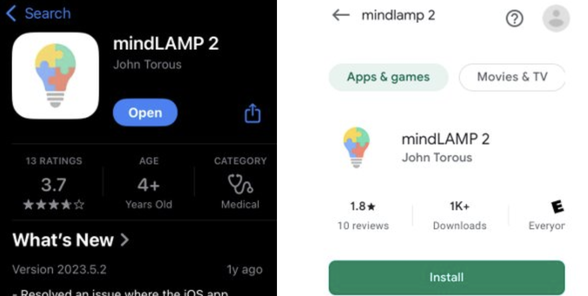

Subject: 

Your MRI session has been confirmed for Wednesday, `[ENTER DATE, TIME]`. In this email you will find more information about your upcoming MRI visit.
 
 **Reminders for this visit:**    
The visit begins at `[ENTER DATE, TIME]` with check-in at the Center for Advanced Human Brain Imaging Rutgers University in Piscataway, NJ. We will go over the consent form and practice the two tasks you will be asked to perform during the MRI using a button box. You will be given some questionnaires to fill out about your daily behaviors and history, lasting about 30mins. The MRI will last approximately 1.5 hours, followed by a short computer task. This visit will be approximately 3h 15mins. 

**Before the visit:** 
If you are interested in participating in the smartphone app portion of the study, with additional opportunities for payment over the next 6 months, please download the app "MindLAMP 2" before arriving. Additionally, please try to sign in with the following credentials:
Server:
Username:
Password:

**What to Wear:**
If you wear glasses, please wear contacts or be aware of your prescription so we can fit you for MRI safe glasses. Wear comfortable clothing, remove any piercings or hair extensions if you have any and there will be a locker to put your personal belongings. Any removable accessories or items, including hearing aids, insulin patches or dentures will have to be removed prior to scanning. If you wear a wig, we will ask you to remove it, but we will have bouffant caps available to wear. There can be not metal in the MRI, but pants with metal zippers/buttons are fine. 

**MRI Information**
I’ve attached additional MRI information- what an MRI is and what happens during an MRI procedure. If you’ve never had an MRI before, or you are curious about the procedure, please read it over. And don’t hesitate to reach out with any questions or concerns! I’m happy to talk it through with you before the session, as well as during the session. 

[MRI Information](https://holmeslab.github.io/holmeslab/docs/PCX/interview-session/email1/MRI_Information.pdf)

**Cancellation:**
If you cannot make your visit, please let us know as soon as possible and we will try to reschedule. If you have any questions, feel free to respond directly to this email or by giving me a text or call at (848) 228-3894.   
 
Thank you again for your participation in our research study, and we look forward to seeing you at your MRI visit.  

