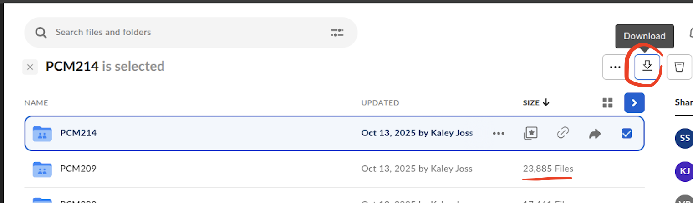
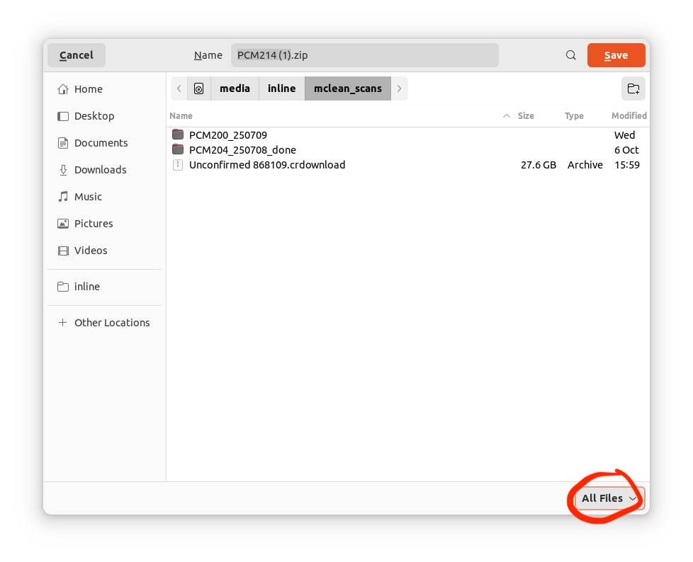
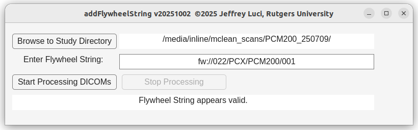
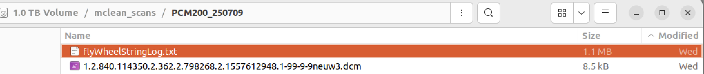
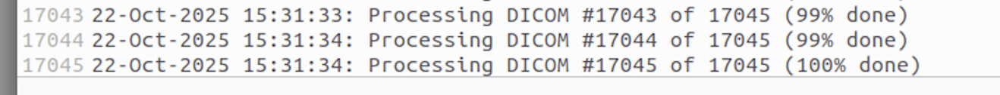

# McLean Scans Process

## To Download McLean Scans from Eris to Box

1. Connect to McLean Eris VPN ([Tutorial](https://holmeslab.github.io/holmeslab/docs/PCX/accessing-eris/))
2. On your local computer, in the terminal, (NOT connected via ssh): run this command:

```python
#Copy over mclean mri and phone data: 
rsync -avzP kj110@eristwo.partners.org:'/data/sbdp/PHOENIX/GENERAL/PCX/PC*' '/Users/demo/Library/CloudStorage/Box-Box/(Restricted)_PCR/PCX/mindlamp_mri_data/data'
```

## To Download

### On the desktop next to the scanner computer, not scanner computer

1. Log into box drive on the browser
2. Navigate to /Restricted_(PCR)/PCX/mindlamp_mri_data/data
3. Press ‘size’ to see who has a scan— the people with scans will have 15,000+ files
4. Download the mclean scan folder from box drive online — navigate into the folder that’s formatted PCM2xx_MMDDYYYY
    
    
    
    1. takes ~4hrs per folder (i think? Tbd?), can queue multiple at once
    2. *if you can* select the location to download to:
        
        select /Z:/inline/mclean_scans ***& select ‘All Files’ on the lower right***
        
        
        
5. Open matlab &  command line (Look for ‘>>’ to find the command line)
    1. Type into ‘>>’ the word ‘addFlywheelString’
        
        ```python
        >> addFlywheelString
        ```
        
    2. Press enter
    3. The gui should pop up
    4. Select the folder with .dcm s (PCM2xx_MMDDYYYY) where `2xx` is subject ID
    5. write this flywheel string: `fw://022/PCX/PCM2xx/001` where `2xx` is subject ID
        
        
        
    6. press ‘Start Processing DICOMs’
    7. should take about 45mins 
6. Check log file to make sure the addFlywheelData script has completed
    1. Go to the folder, sort by ‘Modified’ or ‘Name’ and click that and there should be a file called flywheelStringLog.txt which has the log of the process
        
        
        
    2. Open log and make sure the end of the file looks like this
        
        
        
    3. then DELETE the log file before importing to the scanner computer (below)

### On scanner computer

1. Go to “import” (right next to “Export” on the patient browser)
2. Select “Z” / “inline” folder
3. Select the PCM2xx_MMDDYYYY folder you want
4. Press “Import”
    1. takes ~5mins

<aside>
🚨

NOTE: Do NOT do this while someone is running an MBME scan! This should only be down when people are not running MBME scans afterwards for the next few hours. Holmes and Zald protocols are MBME, other protocols tend not to be MBME (Konova is not, etc)

</aside>

→ Once ‘imported’, now you need to Export to flywheel

1. Press “export”
2. Select participant
3. Select “Network” tab
4. Check box for “Flywheel”
5. Press “export”
    1. takes ~45mins