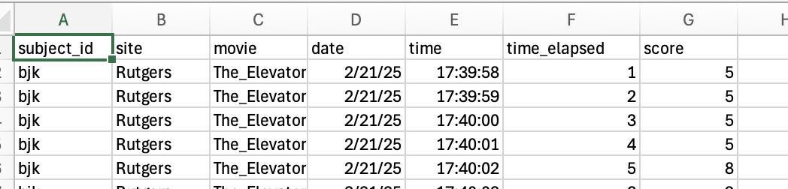
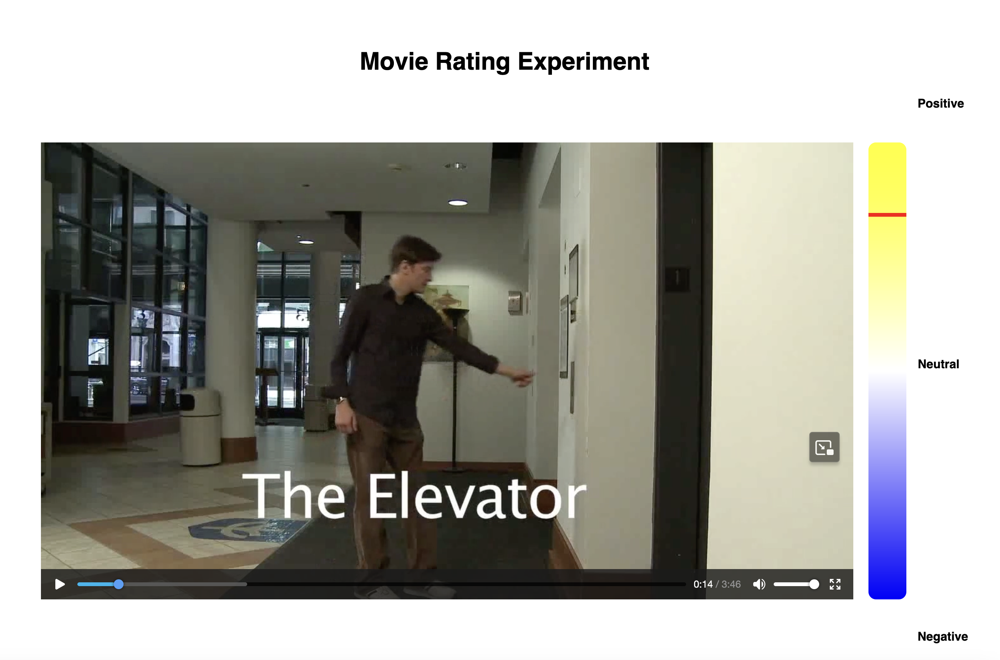

# Movie Rater Application
Created by Kaley Joss, Feb 2025

This is a web app to be used for the Psychiatric Connectomics project. It can also be used for other projects by adding additional movies. 


## Overview

This application allows users to rate movies during an experiment by interacting with a slider. It is a simple web-based app built using Flask that allows data collection while watching  movie clips. As your participant watches movie clips, the app will record the position of the participant’s mouse on the slider to the right (records position every second)

Data will be saved into the same directory where movie_rater.py is located, under /data/{subject_id}/{subject_id}_{date}_{time}.csv

Data will have these fields. (’time_elapsed’ is seconds since the video started)

subject_id, site and movie are all things you choose when you open the app. 



💡Important notes:
- Do NOT change the folder names or file names of anything in this folder! It will mess up the scripts. Movies must be in folders which start with /static




### File Structure

```python
movie_rater_task/
│
├── movies/                   # Contains the movie files for the experiment
│   ├── Momentous.mp4         # Movie clip 'Momentous'
│   └── The_Elevator.mp4      # Movie clip 'The Elevator'
│
├── templates/                # Folder containing HTML templates for the web page
│   └── website_script.html   # Main page of the experiment (UI for rating)
│
├── movie_rater.py            # Python file that runs the Flask web server
├── readme.md                 # This file explaining the project
└── data/                     # Folder where experiment data (CSV files) will be saved
```

## Using `movie_rater`

### Prerequisites

Before running the application, ensure you have Python installed (preferably Python 3.7 or newer). To check if you do, run this:

```python
python3 --version
```

If it returns a version number, you’re good. If it doesn’t, download python3 from this page: [https://www.python.org/downloads/](https://www.python.org/downloads/) 

You also need to install the required libraries:

1. Flask (Web framework)
2. Other dependencies (if needed)

To install Flask, run the following command in your terminal or command prompt:

```python
pip install Flask
```

1. **Set Up the Files:**
    - Make sure the `movie_rater.py` file, the `movies` folder (containing `Momentous.mp4` and `The_Elevator.mp4`), and the `templates` folder (containing `website_script.html`) are all located in the same directory.
2. **Run the Server:**
    - Open your terminal or command prompt.
    - Navigate to the `movie_rater` directory using the `cd` command.
        - [movie_rater_task is at this link in Box online](https://rutgers.box.com/s/qs9x036pbjeoaaftg795i6zp7kwf73uk)
    - Run the Flask app by executing the following command:

```python
cd /path/to/Box/PCX_Round2/Procedures/movie_rater_task
python3 movie_rater.py
```

→ The server will start running locally on your computer. By default, Flask runs on `http://127.0.0.1:5000/`.

1. **Open the Web Interface:**
    - Open a web browser and go to `http://127.0.0.1:5000/`.
    - You should see the "Movie Rating Experiment" page. This page allows you to enter the subject ID, select the site (Rutgers or McLean), and select the movie (either "The Elevator" or "Momentous").
2. **Start the Experiment:**
    - Fill in the required information (Subject ID, Site, and Movie).
    - Click the "Submit" button to start the experiment. This will trigger the experiment to begin, and the movie will start playing.
3. **Rate the Movie:**
    - As the movie plays, use the slider to rate how positive or negative you feel about the movie at any point. The slider has three labels: "Positive", "Neutral", and "Negative".
    - The slider will collect data as you interact with it.
4. **Data Logging:**
    - The experiment data, including the subject ID, site, movie name, time elapsed, and rating score, will be saved in CSV files under the `data` folder.
    - The CSV files are named by subject ID and timestamp, and will contain the collected data in rows as the experiment progresses.
5. **End of Experiment:**
    - After the experiment is completed, the application will stop recording data. You can then view the CSV file in the `data` directory for the logged information.

### Folder Details

- **`movies/`**: Contains the movie files that are played during the experiment. You can add more movies here if needed, but be sure they are in `.mp4` format.
- **`templates/`**: Contains the HTML template for the web page, which is used to present the user interface to the participants.
- **`movie_rater.py`**: The backend script that starts the Flask server and handles incoming requests (e.g., starting the experiment and logging data).
- **`data/`**: This folder will automatically be created by the app if it doesn't exist already. It will store CSV files with the recorded data.

### Troubleshooting

- If you encounter any issues, check the terminal where you ran `python movie_rater.py` for error messages. Flask will provide helpful information if something goes wrong.
- Ensure that the movies are in the `movies` folder and are named exactly as referenced in the web interface ("Momentous.mp4" and "The_Elevator.mp4").