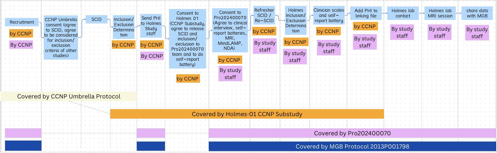

---
**Table of Contents**
1. TOC
{:toc}
---

For an overview of the Psychiatric Connectomics project, see here: [Psychiatric Connectomics]({{site.baseurl}}/docs/Projects/PCX/study-overview)

### **IRB Numbers**:
**Mass-General Brigham (IRB of Record / sIRB / Parent site)**
- Protocol Number: #2013P001798
- Amendment naming: AMEXX

**Rutgers (Child site)**
- Protocol Number: #Pro2024000070
- Amendment naming: Modification2025XXXXX

**Holmes 01 CCNP Substudy:** 
- Protocol Number: #Pro2025000031


## IRB Structure
There are 3 IRBs at Rutgers which make up the Psychiatric Connectomics IRB structure.

The IRB which covers this project is a Reliance IRB, with the Reviewing/Single IRB located at Mass General Brigham, McLean Hospital. Rutgers University is a child site to the MGB IRB. This means, Rutgers IRB submissions are categorized as "Administrative Review", [instructions here for administrative review guidance](https://rutgers.box.com/s/8t0s45ppe61dj1tmeg6ipadi2uga47kv).

**Structure Visual**


> Rutgers Protocol, SmartIRB Number Note: MGB IRB team has told us "we don’t utilize the SMART IRB Reliance portal so there isn’t a cede determination letter". This means we don't have a 'SmartIRB Number'. So in the Rutgers IRB, we say "No" to the SmartIRB question, so that we don't have to provide a number, but we are using SmartIRB. We just upload the SmartIRB reliance to the forms on question 1.5.4 where it says "Upload SMART IRB Acknowledgement, or If sIRB the IRB authorization Agreement" 

## How to Create a Modification
1. Create folder in [MGB IRB](https://rutgers.box.com/s/libf346niv6tt8fqinypz1csmpkk0oxo) or [Rutgers IRB](https://rutgers.box.com/s/2fmmfxno0s2jz7fu25ixjdpd9rj8jt66) folders, named by the amendment number (eg `AME68` for MGB or `MS3` for Rutgers). 
    a. if it's an MGB local site amendment for Rutgers, add "`_Rutgers`" to the end, (eg `AME69_Rutgers`)
2.  For the documents you want to edit in this modification, copy the most recent approved version of that doc from the Currently Approved Docs folder
3.  Create a tracking document (text file or word doc) in the folder called `AME#_description_of_changes`.
4.  Rename the document from "_clean" to "_tracked". Open the document to edit and turn on 'tracking changes' (under 'Review' tab).
5.  Create any changes you'd like to make for the modification, with tracking on.
6.  Describe all the changes you make in the  AME#_description_of_changes doc.
7.  Once you've made all the changes necessary, create a clean version of the document by duplicating the "_tracked" document, renaming the copy to "`_clean`", opening the document in word, highlight the whole document with command+A, click Review > Track Changes > Accept all changes. Now there should be a popup saying "there are no tracked changes in your document." Press "OK" and then save the document. Now this document should reflect all the newest changes without any actual 'tracking' marking up the document.
7.  Upload the `_tracked` and `_clean` versions of the document to the modification in Insight (for MGB) or eIRB (for Rutgers)
8.  Copy and paste the description of changes into the relevant field for the modification
9.  When it gets approved, add the ReviewLetter to [`Approval_letters`](https://rutgers.box.com/s/z0roc2ekqfm9umo7a8sq57w8l7ndonbx) folder
10.  Update all the new approved docs in the Currently Approved Docs folder, so that it reflects the most recent docs


## File structure

**MGB**

- Files located at `/Box-Box/Holmes_Lab_Wiki/PCX_Round2/PCM_Regulatory/IRB`
- Files should be tracked using this structure:
    
    **Original Submission Folder Structure**
    
    ```bash
    ├── orig_IRBNUMBER # At Rutgers, this is ProXXXXXX. At McLean it's
    │   ├── Protocol 
    │   ├── Scales
    │   ├── MGB_Consent 
    │   ├── MGB_attachments 
    │   ├── MGB_recruitment
    │   ├── Rutgers_consent
    │   ├── Rutgers_attachments
    │   ├── Rutgers_recruitment
    
    ```
    
    **Example Amendment Folder Structure**
    
    ```bash
    
    ├── AME69_in_progress 
    │   ├── McLean Consent #Only include folders of edited documents
    │   │   └── McLean_Consent_Form_250328_clean.docx
    │   │   └── McLean_Consent_Form_250328_tracked.docx
    │   ├── Rutgers Attachments
    │   │   ├── CAHBIR MRI Participant Screening Form.pdf
    │   │   └── MGB_Local_Context_Form_IRB_Protocol-Specific.pdf
    │   ├── Rutgers Consent
    │   │   ├── Rutgers_Consent_Form_250403_clean.docx
    │   │   └── Rutgers_Consent_Form_250403_tracked.docx
    │   ├── Rutgers Recruitment Materials
    │   │   ├── Example Reddit Post CCNP.png
    │   │   ├── Flyer CCNP.pdf
    │   │   ├── Holmes_01_CON_Flyer.pdf
    │   │   └── Holmes_01_SCZ_MDD_BP_Flyer.pdf
    │   └── tracked_changes_AME69.rtf
    ```
    
    **Current Approved Docs folder**
    
    - Put the most current approved versions of docs
    - This is because the updated docs will be scattered across multiple amendment folders making it difficult to keep track of what is the most current form without going to the IRB website or looking through all folders
    
    ```bash
    ├── current_approved_docs # At Rutgers, this is ProXXXXXX. At McLean it's
    │   ├── Protocol 
    │   ├── Scales
    │   ├── Consent
    │   ├── MGB_attachments 
    │   ├── Rutgers_attachments
    ```
    

**Rutgers**

- Files located at `/Box-Box/Holmes_Lab_Wiki/PCX_Round2/PCR_Regulatory/IRB`
- Files should be tracked using this structure:

## Documents Necessary for Submission

**General notes:**

- All documents submitted in ‘clean’ and ‘tracked’ forms
- Clean version of each document and tracked version showing the changes from the last approved version of this document
    - Save as <name>_clean.docx and <name>_tracked.docx
    - Easiest to copy the clean version of the approved document, select Review > “Track Changes” on Word, then make your edits for that amendment. Once you’re ready to submit, duplicate the tracked version and then select Review > “Accept All Changes” to create a clean version with all your updates
    - If you have a clean version of the updated file, create a tracked version of this by going to Review > Compare > Compare Documents. Upload the original version and then the new version, and it will create a new document for you.

**At MGB:**

Files

- Protocol (MGB protocol)
- Consent form: MGB consent form (based on Model Consent Form created by MGB staff)
- Instrument/Questionnaire
    - Add all scales as individual files per scale
        - Qualtrics/Redcap — any scales administered online but where we already have field-standard copies of the scale in a PDF can be uploaded as the PDF. We don’t have to be the screenshots/exact online version since they say “will be implemented in Qualtrics/Redcap”
        - Download from Qualtrics/Redcap and add any custom scales
        - MindLAMP — Just as a word doc of all the questions
    - All tasks
        - Can be screenshots of a few example images from each task
        - Descriptions of movies
- NSR Information
    - MGH_DataSamplesAgreement
- Adverse Event Log
    - Continuing Review Adverse Event Attestation
- Flyer
    - Example recruitment flyers Rutgers
    - Example recruitment online posts Rutgers
    - Example recruitment flyers McLean
    - Example Rally Ad McLean
- Other
    - RISOapproval
    - Survana_IT_Approval
    - MGB IRB Site Staff Delegation Log (from template)
    - Determination Letter
    - Notification of IRB Review
    - LOA and Flex Addendum
    - MindLAMP Brochure
    - Privacy_report_email
- Child sites: Rutgers
    - Local Context Supplement:
    - Rutgers Consent form (based on Model Consent Form created by MGB staff)

**At Rutgers:**

NOTE: all of the documents at Rutgers MUST be the documents (with the same names) which appear on the approval letter from MGB (which lists all the documents included in the version of the IRB which got approved). 

- All + Exactly the same docs as MGB
- Any CITI certificates for Rutgers staff
- Approval letter for CCNP umbrella IRB
- Approval letter for CCNP Holmes 01 IRB

### Contents of the IRB Docs

- Consent Form
    - The consent form is created by MGB IRB staff from our protocol. We submit the protocol, then they generate a ‘model consent form’ which has all protocol activities and space for site-specific information (names, contact info, addresses, etc.). If you update the protocol, make sure they give you an updated model consent with which to use for your consent + child site consent
- Protocol
    - Protocol should be written generally in language general enough to encompass all activities at McLean and Rutgers, but not so strict about this.
    - Strict about including McLean specific language for all McLean activities, and the phrase “child sites will follow site-specific policies as detailed in their local context supplement” for sections which have McLean/Rutgers differences.
- Local context form
    - Add all the Rutgers local site-specific protocols in the Local Context Form in the question 14.A.

## Updating the IRB

**Process - Updating Study Protocol**

NOTE: Any updates to the protocol at McLean or Rutgers must be submitted at the McLean IRB (staffing is different, see section below). 

- Create new amendment at MGB
    - If it’s just for Rutgers, make the amendment specific to the Rutgers child site
- Using the latest approved version of the protocol, turn on ‘track changes’, and add your changes.
- Make a clean version of the updated protocol
- Submit as an amendment
- If it affects the recruitment, inclusion/exclusion or clinical interview session at Rutgers, tell CCNP and onboard their staff to the changes

**Process - Updating Staff**
NOTE: Staff at Rutgers do not have to do the MGB-required trainings, and vice versa. Staff only have to be listed + do the trainings for their site.

NOTE: Rutgers staff, even those with POI status who do all the trainings, cannot be added to Insight. Only the MGB staff can be on Insight (as of Apr 2025).

- At Rutgers, submit an amendment and add staff to the ‘Study Staff’ section of the protocol
- At McLean, submit an amendment with the added staff and an updated version of the MGB_Delegation_log