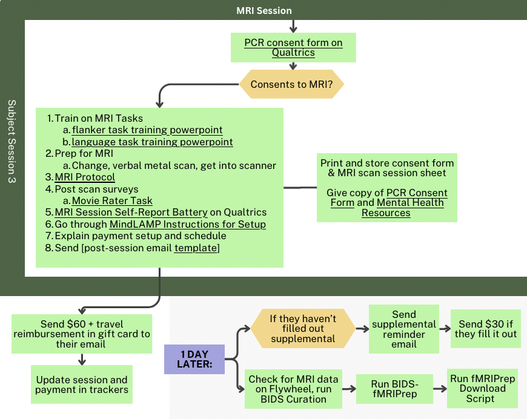

# Full PCX Statement of Procedure
Last Updated: Apr 28, 2025  
---
**Table of Contents**
1. TOC
{:toc}
---

*If you’re looking for an overview of the study grant and aims, please go to [PCX Study Overview](https://www.notion.so/PCX-Study-Overview-18fcf00eb936804e9d49dbfab844e3da?pvs=21)*

## Overview - Recruitment and CCNP Sesssion

## Recruit for Clinical Interview Session

Recruitment flyers and example posts are in [/PCX_Round2/Procedures/Recruitment Flyers](https://rutgers.box.com/s/c6v6x63oa6az0bcjvkau879zql6klwtf)

## Clinical Interview Session
Participants get do SCID, refresher SCID or no SCID based on most recent SCID date.

Follow this script for the session (includes links and instructions):
[Script for Clinical Interview Session](https://holmeslab.github.io/holmeslab/docs/Projects/PCX/interview-session/)

General Overview + Links:
1. Do CCNP-Holmes01 consent forms [Holmes 01 Consent (CCNP Consent)](https://rutgers.ca1.qualtrics.com/jfe/form/SV_byE8zSL9wiv3PLM) 
2. Do [PCR_Consent](https://rutgers.ca1.qualtrics.com/jfe/form/SV_8vK8CJMuW2iNcmG) form. (The consent form will automatically send them a copy of the consent form + responses)
3. Enter this subject into the sheet in Box located at `/(Restricted)_PCR/PCR_Shared_with_CCNP/PCR_Linking_ID_CCNP.xlsx`, assigning them a PCRID and a qualtrics ID.
4. Administer the clinical ratings survey [PCX_ClinicalVisit_ClinicianRatings](https://rutgers.ca1.qualtrics.com/jfe/form/SV_6tBSwRN0CukilQG) 
    - Filling in their qualtrics ID
5. Fill out [this email](https://holmeslab.github.io/holmeslab/docs/Projects/PCX/interview-session/email1/) and send an email to the address they provided. It has the link to the self-report battery and NJ mental health resources link. 
    - Add their qualtrics ID
6. Ask them to open the Self-Report Survey link from their email, and to share their screen if on Zoom 
7. Have them fill out the self-report survey while their screen is shared, so you can see that they're filling it out. You can be off camera and muted, but be there to answer any questions they may have. 
8. Once they've submitted, send them their payment.

**LINKS**

- [Holmes 01 Consent (CCNP Consent)](https://rutgers.ca1.qualtrics.com/jfe/form/SV_byE8zSL9wiv3PLM)
- [PCR_Consent](https://rutgers.ca1.qualtrics.com/jfe/form/SV_8vK8CJMuW2iNcmG)
- CCNP/Holmes PCR Identifying Information Sheet (Restricted Access)  located at /(Restricted)_PCR/PCR_Shared_with_CCNP/PCR_Linking_ID_CCNP.xlsx
- [Clinician Ratings Surveys](https://rutgers.ca1.qualtrics.com/jfe/form/SV_6tBSwRN0CukilQG)
- [Clinical Visit Self-Report Surveys](https://rutgers.ca1.qualtrics.com/jfe/form/SV_78QRYTSOnegCSjQ)
- [Holmes Group MRI Screening Form](https://rutgers.ca1.qualtrics.com/jfe/form/SV_6M462seOVvuYD5k)

## MRI Session Scheduling

1. Check the file in /Box/(Restricted)_PCR/PCR_Shared_with_CCNP/
PCR_Linking_ID_CCNP.xlsx (restricted access- must be invited to the sheet to view) for any new participants
2. Copy over new participants to  /Box/(Restricted)_PCR/PCR_Holmes/PCR_Linking_ID_Holmes.xlsx  (restricted access- must be invited to the sheet to view)
4. Look in iLabs for 3-5 upcoming MRI slots available on different days 
    
    Don’t know how? Read [Tutorial: Booking MRI in iLabs](https://www.notion.so/Scheduling-MRI-Scans-at-CAHBIR-173cf00eb9368082b3c1ec7c9d39c66e?pvs=21)
    
5. 📟 Email the participant, using this template:  [MRI_Scheduling_Email](https://rutgers.box.com/s/nl34g17f6kjcor4c0jtfdn1k1re3bva7) 
6. 📟 Log responses + scheduled time
7. 📟 If the participant needs an uber, check how much time it will take to get from the participant’s pickup/dropoff locations and reserve the pickup Lyft for the date/time which will allow the participant to get there in time
8. Send the participant a confirmation + info email
    [MRI Confirmation Email](https://rutgers.box.com/s/h3er1pb6c77q03cu1obq7c87aok8qfdg)
    
9. Schedule the reminder emails for 2-days out (and 5-days out if the scan is far in advance)
    [Appointment_Reminder_2days](https://rutgers.box.com/s/h3er1pb6c77q03cu1obq7c87aok8qfdg)
    
10. Set a reminder for yourself to text the participant 36hrs before the scan time if they haven’t confirmed after the 2days-before email

1. **24hrs before MRI Session:** 
    If the participant hasn’t confirmed, cancel the slot. If the participant confirms day-of, you can always rebook the slot as it will rarely be booked after you cancel. But if the participant doesn’t show, you will still have to pay for the scan
    [Tutorial: Cancelling MRI Scans in iLabs](https://www.notion.so/Scheduling-MRI-Scans-at-CAHBIR-173cf00eb9368082b3c1ec7c9d39c66e?pvs=21)
    

## MRI Session + Supplemental Battery

**Session Day:**
1. 📟 Open up subject log for that participant and log the fields during the study
2. Follow the script for this session
[Scanning Session Script Rutgers]({{site.baseurl}}/docs/PCX/scan-session)

1. EMAIL the task files to yourself from the scanning computer, or save them to BOX
2. Add up the additional payments for the subject, including gas costs, parking/tolls costs, uber/lyft costs and overtime costs, and do the calculations in the subject log sheet for how much the subject is owed. Then put in an order to PerfectGift for that amount, rounding to the nearest dollar. 
    [Tutorial: Purchase gift cards from PerfectGift](https://www.notion.so/Tutorial-Buying-Gift-Cards-from-PerfectGift-1c2cf00eb93680c0b6d6fa7ed18985df?pvs=21)

**1 Day Post-Session:** 
1. Check if yesterday’s subject has filled out the supplemental survey, if not, send them [Supplemental Survey Reminder Email](https://rutgers.box.com/s/30wdozbmtsyfob49s57938ctq5etsf47)
2. Follow [Tutorial: MRI to BIDS in Flywheel](https://www.notion.so/Flywheel-Tutorial-MBME-Scans-134cf00eb936804ca6a0d364fcfd7266?pvs=21) to convert the subject’s data to BIDS
3. Follow [Tutorial: BIDS to fMRIPrep in Flywheel](https://www.notion.so/Flywheel-Tutorial-MBME-Scans-134cf00eb936804ca6a0d364fcfd7266?pvs=21) to run the subject through fMRIPrep

**2 Days Post-Session:**
1. Once fMRIPrep has finished, follow this tutorial to move the data from Flywheel to Amarel 
    
    [Tutorial: fMRIPrep in Flywheel to Amarel](https://www.notion.so/Flywheel-Tutorial-MBME-Scans-134cf00eb936804ca6a0d364fcfd7266?pvs=21) 
    
    [Tutorial: BIDS in Flywheel to Amarel](https://www.notion.so/Flywheel-Tutorial-MBME-Scans-134cf00eb936804ca6a0d364fcfd7266?pvs=21) 
    

**LINKS**

- [Session Docs on Box](https://rutgers.box.com/s/n3jowubh3tbjb9kzyyp73o7sfpxeam8e)
- [Holmes 01 Consent](https://rutgers.ca1.qualtrics.com/jfe/form/SV_byE8zSL9wiv3PLM)
- [PCR_Consent](https://rutgers.ca1.qualtrics.com/jfe/form/SV_8vK8CJMuW2iNcmG)
- [PCX_fMRIVisit_SelfReport](https://rutgers.ca1.qualtrics.com/jfe/form/SV_0UqGfGjgsl2nklU)
- [MindLAMP Instructions for Researcher](https://rutgers.box.com/s/02c2rqj7gym6vfkzhxrca3i15be8gbbh)
- [MindLAMP Instructions for User](https://rutgers.box.com/s/57h007shwx09wapkhvrg5dcdaumzeltq)
- [PCX_ClinicalVisit_RatingsInterview](https://rutgers.ca1.qualtrics.com/jfe/form/SV_1TaMc3VH59wEeZo)
- [PCX_ClinicalVisit_ClinicianRatings](https://rutgers.ca1.qualtrics.com/jfe/form/SV_bpUc7WXekERE7Cm)
- On Qualtrics: [PCX_ClinicalVisit_SelfReport](https://rutgers.ca1.qualtrics.com/jfe/form/SV_78QRYTSOnegCSjQ)
- CAHBIR screener on Qualtrics: [Holmes Group Screening Form](https://rutgers.ca1.qualtrics.com/jfe/form/SV_6M462seOVvuYD5k)

## Monthly Data Storage & Maintenance

**Qualtrics → Box**  

- Monthly, download from Qualtrics to have the most updated data backed up outside of Qualtrics
- Use this script: [download_qualtrics.ipynb](https://rutgers.box.com/s/gbyxw8so3ygo9hb3lzd19sc1ermga4vo)

**RedCAP → Amarel**  

- TBD, pulling from Eris, Kaley waiting for permissions

**MindLAMP → Amarel**  

- TBD, pulling from Phoenix, Kaley waiting for permissions
- But it will be something like:
    1. Be on a computer at Rutgers so it’s on Rutgers wifi
    2. VPN into Eris (MGB HPC)
    3.  run `scp /path/to/output/folder KJ110[@eristwo.partners.org](mailto:mgb_username@eristwo.partners.org):/path/to/files . ` 

**Psychopy files → BIDS → Box → Amarel**  

- Email files to yourself from the scanning computer
- Upload them to box in [/PCX_Round2/Procedures/fMRI_tasks](https://rutgers.box.com/s/qkqr45kfk22q1a3s32qxj8r15022n7ig)/<task name>/data
    - Saved as sub-PCRID_task-taskName_xxxxx.csv

**Use this script to**  

1. Convert files from psychopy outputs to BIDS events.tsv
2. Send files from local/box machine to remote server (Amarel)

[/PCX_Round2/Procedures/fMRI_tasks/create_bids_files.ipynb](https://rutgers.box.com/s/2ko0vive5aegeplaqabd8go4ug0e0g6h)

## MindLAMP Payments

- Each month at the end of the month, add up the number of surveys each subject did, and use this payment matrix to assign the amount they’re owed

📟  Track this in the [PCR_Tracker.xlsx](https://rutgers.box.com/s/i5jaa225v6fz6czlj1bbakar79xtrvng) 

- Send participants who are in MindLAMP an email based on this template:
    
    Monthly MindLAMP Email Template
    

**LINKS**

[MindLAMP Admin Page](https://dashboard.lamp.digital/#/)
[MindLAMP Instructions for Researcher](https://rutgers.box.com/s/02c2rqj7gym6vfkzhxrca3i15be8gbbh)

