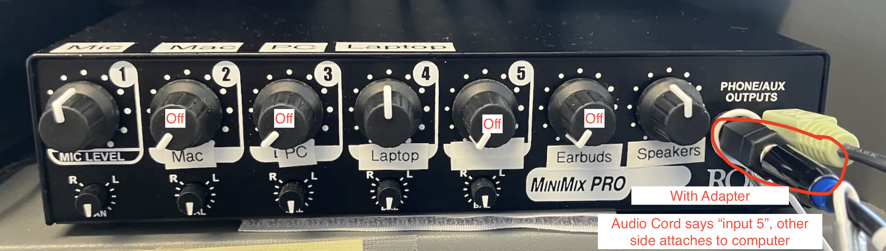
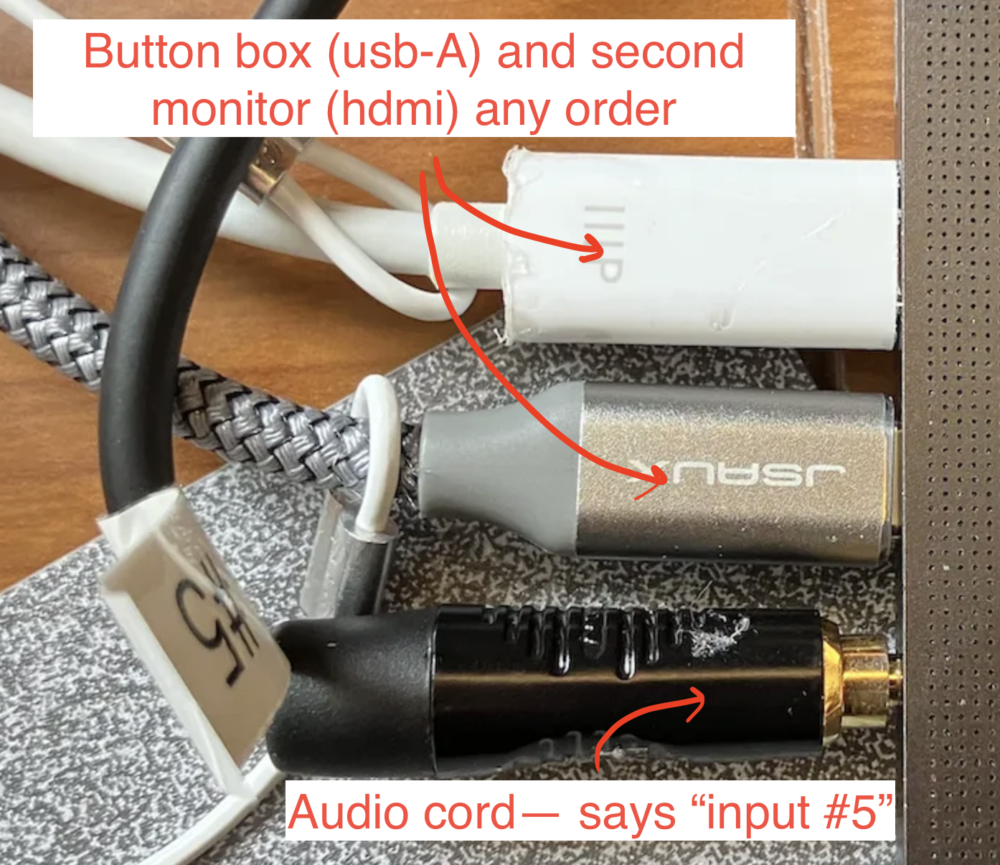
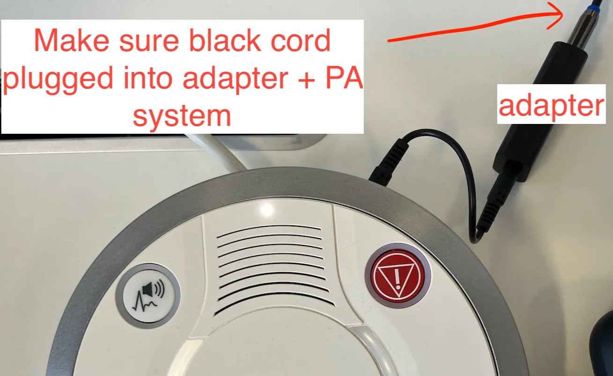
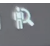
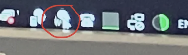
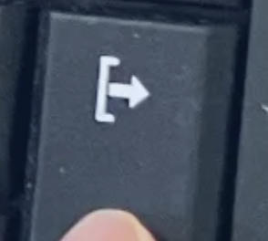

# Scanner Operating Checklist PCX

## SETUP

**Before entering scanner room:**

- Glasses?
- Nothing in pockets?
- Bra off?
- Belt off?
- No wig, hair extensions, retainers, piercings?
- No patches/injectables on skin? No surgeries? Nothing not mentioned on the form?

**Tell participant:** 

- Show scanner view, PA system = like radio
- Emergency ball
- No feet/hands/barelegs touching
- No feet crossing, hands crossing
- Scanner = old camera
    - Moving feet/hands = head moves

**In scanner room:**

- Button box attached
- Head coil 64channel (smaller one)
- HEAD COIL PLUGGED IN
- emergency ball in hand, button box in hand
- earbuds plugged in
- Monitor on and plugged in
- Make sure participant can see monitor in mirror

**Set up scan**

- Register participant
    - Last name = PCRID
    - fw address goes in “Study Description”
    - Head first supine
    - any polarization
    - Holmes protocol
    - Height, weight, sex

**Volume Settings for Siemens (not sensimetric) earbuds:**

- Volume: half volume
- Inroom settings: Audio + Speaker at FULL VOLUME

**Button box setup:** 

- HID User 12345
    - if all 4 lights are lit up after auto-reconfigure, go in and reattach button box

**Computer setup:**

- Press “3” / “LAP” → should see the extension of your laptop screen

**Task computer settings**

- Volume: half volume
- “No sleep” mode
- Plug in charger
- Open all relevant .py scripts / shut down computationally expensive programs

## SCANNING

- Sound check!
- Run AAScout
    - Move to cover nose, skull, neck as much as possible
- Run anat T1
    - After shimming, move the yellow box to cover brain as much as possible
- Copy slices and adjustment volume to all func / fmap scans (except fmap-b0)
- Copy adjustment volume to fmap-b0, dwi
- Run REST-1
    - CHECK rest-1 in MRI View and Go
- Run rest of scanning procedure
    - Take NOTES on Subject_tracker_PCR!

## DATA

**Sent to Flywheel**

Press key magnifying glass guy

- Exam → Participant locker → Export → Network → “Flywheel” checked → Export

**Logging** 

- fill out log fields on clipboard:
    - start time = time partient ended control room/scan room, not first scan
    - add if you go over by doing “+15” “+30” etc
    - can initial for whether you sent to flywheel
    - iLabs is for jeff, don’t initial
    - session notes = anything different that happened, including participant squeezing ball, scan repeated, scan out of order

## Starting up and shutting down

- Click on the picture button
    - This turns the scanner on
- Click on the computer power
    - This turns the computer and system on
- Don’t touch the scanner or system while it’s booting up. Don’t touch the scanner
- No password
- Home page will show up
- Click on this:
    
    
    
- Message will say ‘machine is booting’
- Once the message goes away, the system is good to go

## Shut down

- if you’re the last person, close your windows page:
- TAB + DELETE + EXPORT
    - syngo RM will pop up really quick and og away
    - no password
- homepage
- power button
- “shut down system”
- takes a few mins
- will come down to a blank screen that looks like windows
    - this means you’ve shut down SIEMENS, not windows
- then on the windows page, press CTRL+ALT+DELETE go to power button, press ‘shut down’
- Turn off monitor

### To open windows menu for files, SyngoMR, etc

- TAB + DELETE + EXPORT
    
    
    

Username: medadmin

Password: adm$pwd$4$med$

No domain

→ Then the windows key will work