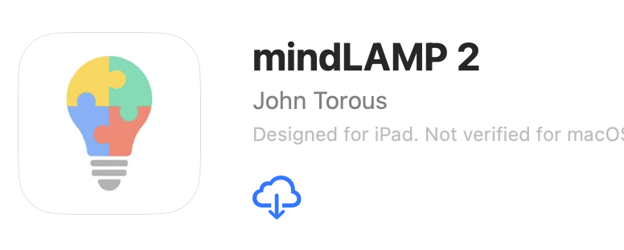
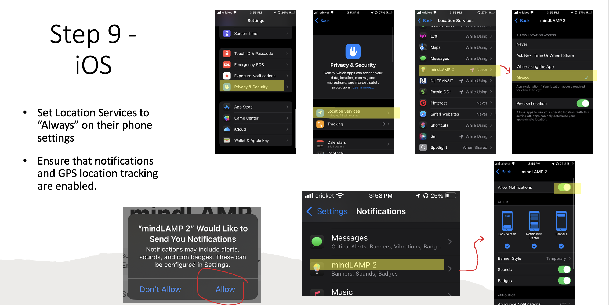
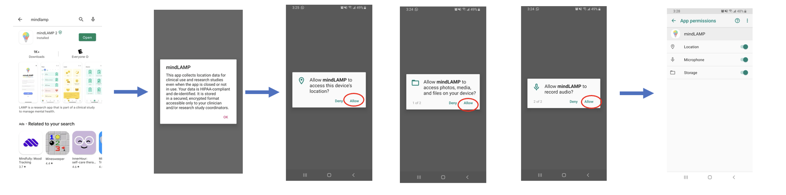
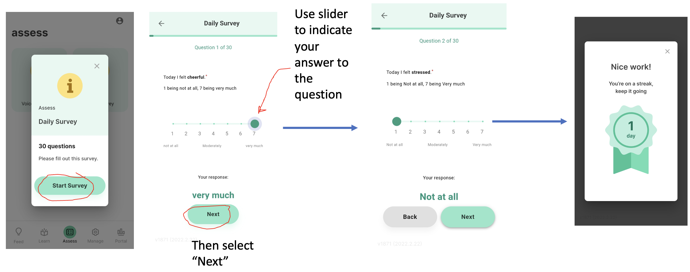

Dear   ,

Thank you so much for attending the MRI session at the Holmes Lab! We really appreciate your time.  

Here are the instructions for the MindLAMP App: 
1. Download the app: MindLAMP app  

2. Use these credentials for your MindLAMP login:
Server address: api.mindlamp.itpmclean.org 
Username: 
Password: 

3. Allow location services and push notifications
- On iPhone:
 
- On Android:

4. Fill out surveys daily to get payment!

PAYMENT DETAILS: 
For smartphone tracking payment, we'll pay monthly in the second week of the month. For example, the payment for the month of May will come the second week of June, and so on. The maximum number of months you can participate in this section is 6 months. If you would like to stop at any time, send us an email or text.  

This is the payment schedule, based on the amount of days you complete surveys. (Completing 15 surveys in the same day only = 1 day of payment):
	• $5 for 5-9 surveys completed during the month 
	• $10 for 10-14 surveys completed during the month 
	• $15 for 15-19 surveys completed during the month 
	• $30 for 20-24 surveys completed during the month 
	• $35 for 25+ surveys completed during the month 

The payments are Visa gift cards, which means they can be used just like a debit card. They can be added to your apple wallet/google wallet to be used with tap-to-pay, and can also be used for any payment online. 

Let me know if you have any questions or concerns!
