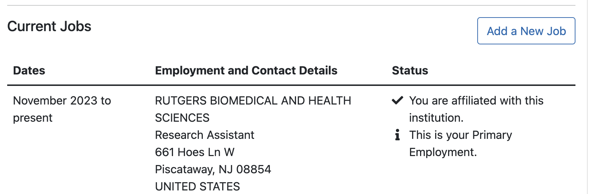

# General Onboarding Tasks
This is an overview/example of onboarding tasks for new members of the lab. This may be lab managers, PhD students or new undergrad RAs. Some of it is administrative, other is for lab content. This is a living document and may change -- check with Avram or your advisor to see what the most current onboarding timeline looks like.  

Last updated: Sep 2025

## Technical onboarding
- Join Holmes slack and possibly CAHBIR slack

- Download box drive and request to be added to lab box (or, if you're an undergrad, ask your advisor for what folders to be added to)

- Broadly overview our lab wiki https://holmeslab.github.io/holmeslab/

- Get card access for CAHBIR building -- email `cahbir-support#rutgers.edu` and ask for access, cc lab manager & Avram (and mention your role in the lab, e.g., RA, PhD student, etc.)
- Request Amarel account (linked to your netID) by filling out this form: https://oarc.rutgers.edu/amarel-cluster-access-request/
    - PI name = Avram Holmes
    - Campus = Piscataway
    - Department = Center for Advanced Human Brain Imaging Research
    After you have an Amarel account...
    - Request access to the group `g_ah1491_1` and our lab partition on Amarel `/projects/f_ah1491_1` and `/scratch/f_ah1491_1` by emailing [help@oarc.rutgers.edu](mailto:help@oarc.rutgers.edu) and CC’ing Avram and lab manager -- ask Avram to 'confirm' your access as the owner of the resources
    - Request access to the CAHBIR partition group (`g_dz268_1` and `p_dz268_1`) by emailing [help@oarc.rutgers.edu](mailto:help@oarc.rutgers.edu) and CC’ing Avram, David Zald and the lab manager -- ask David Zald to 'confirm' your access as the owner of the resources

- Set up VPN if not on Rutgers wifi – [VPN Setup Tutorial](https://holmeslab.github.io/holmeslab/docs/Amarel/rutgers-vpn/)

- Do CITI certificates -- information here [CITI Courses for Rutgers](https://holmeslab.github.io/holmeslab/docs/Admin/citi/) 
    - Send CITI certifications to lab manager
    - After this, lab manager can add you to our IRBs

- Complete any necessary trainings in RU Learning ([https://rulearning.rutgers.edu](https://rulearning.rutgers.edu/))

- Get access to NDA and other open source data 
    1. First, update your eRA Commons account. Log into [https://public.era.nih.gov/commons/](https://public.era.nih.gov/commons/) and click on "Personal Profile" and select "Employment". Go to "Edit" > "Employment" > "Add a New Job". Add your job, including your job title and your start date. NOTE: Make sure to use the affiliation "RUTGERS BIOMEDICAL AND HEALTH SCIENCES" -- there are many RBHS/Rutgers organizations listed, it's important that this spelling matches exactly.
    
    - If you do not have an eRA account, ask the lab manager to email the signing official (currenlty [Gregory Werhner](mailto:gw266@research.rutgers.edu) as of 2025) and request that he make you an eRA account, with the affiliation "RUTGERS BIOMEDICAL AND HEALTH SCIENCES".
    2. If you're an undergrad -- ask your advisor which open source data you should be added to. Then ask lab manager to add you to those. 
    3. If you're a full-time RA, PhD student or Postdoc, ask lab manager to add you to all the open-source data agreements.

- Add relevant lab calendars to your google calendar ([see here](https://holmeslab.github.io/holmeslab/docs/Policies/software-we-use/#shared-calendars-google-calendar))

- Sign up for relevant listservs / Email lists ([see here](https://holmeslab.github.io/holmeslab/docs/Policies/software-we-use/#shared-calendars-google-calendar))

- Set up a reference/citation/paper manager if you don’t have one already. Free (or covered by RU) options = EndNote, Zotero. Other = Paperpile. All will have browser extensions.

### If you're a lab manager:
- Email RWJMS IT ([rwjnbhelp@rwjms.rutgers.edu](mailto:rwjnbhelp@rwjms.rutgers.edu)) cc'ing Avram and Kaley to be added to the lab's outlook email 'holmeslab@rwjms.rutgers.edu'
    - Download outlook & add the lab email to your outlook (Select File > Open > Shared Mailbox > type in 'holmeslab@rwjms.rutgers.edu')

- Ask lab manager if you should be added to Eris (McLean Hospital's filesystem). If so, follow the instructions here: [Accessing Eris (MGB Server)](https://holmeslab.github.io/holmeslab/docs/PCX/accessing-eris/)
- Ask lab manager if you should be added to Princeton cluster with a guest ID. 

- Ask lab manager to be added to flywheel- lab manager messages Wil (Software engineer) or another CAHBIR admin, asking to add you (specifying project, or group-- 022 is Holmes Lab), and incuding your netID.

- Email [cahbir-support@rwjms.rutgers.edu](mailto:cahbir-support@rwjms.rutgers.edu) and ask to be added to the Holmes Lab iLab account

- Sign into Qualtrics ([rutgers.yul1.qualtrics.com](rutgers.yul1.qualtrics.com)) with your Rutgers NetID and password. Then email [cahbir-support@rwjms.rutgers.edu](mailto:cahbir-support@rwjms.rutgers.edu) with your full name, Rutgers NetID, name of your PI (Avram Holmes) and ask to be added to the "Holmes Lab Screening Form"

- Message Wil Rohlill or [cahbir-support@rwjms.rutgers.edu](mailto:cahbir-support@rwjms.rutgers.edu) and ask to be added to be to Flywheel (with your netID in the message)

- Complete Procurement 200 and procurement 400 in RULearning ([https://rulearning.rutgers.edu](https://rulearning.rutgers.edu/))
    - Then have Avram email Cherry Lee ([cherry.lee@rutgers.edu](mailto:cherry.lee@rutgers.edu)), or anyone current in the Research Financial Operations for RWJMS Psychiatry, and request to be added as a requestor  to RU Marketplace. (Last updated 2025)
    - Example email: 
    - "I am the PI for the Holmes Lab, a new lab in the department of psychiatry. I’m writing to ask if you can assign our lab manager [NAME] (cc’d) as a ‘Procurer’ for our group on RU marketplace? We are setting up our procurement process, and heard from a neighboring lab that we should request this, since they will be handling purchasing for the lab. Their netID is [  ] and their email is  [ ]."

They’ve finished Procurement 200 and 400 modules on RU learning. Let me know if there is anything else they need to complete before being added. 

- Email [help@canvas.rutgers.edu](mailto:help@canvas.rutgers.edu) and request access to the following courses in Canvas
    - Expense Management Course Pathway
    - PaymentWorks Supplier Onboarding
    - Procurement Course Pathway

---

## Lab Training
- If full-time: Set up a meeting with each of the graduate students and postdocs in the lab to hear about their research!

- Go through [Lab Policies Manual](https://holmeslab.github.io/holmeslab/docs/Policies/policies/) on lab wiki

- Go through [Amarel Computing section](https://holmeslab.github.io/holmeslab/docs/Amarel/) on lab wiki

- Set up time for L1 training for fMRI scanner (See [CAHBIR MRI Suite section](https://holmeslab.github.io/holmeslab/docs/Experiments/mri/) under Running Experiments in lab wiki & [sign up here](https://sites.rutgers.edu/cahbir/level-1-training-signups-open/))

- See lab wiki Resources section for materials on coding, grant writing, etc.; decide what’s relevant for you

- You may be asked by your advisor to go through some initial literature review papers, such as those recommended below. This will depend on your role in the lab and your advisor.
    - If you're an undergrad starting out, or don't have much neuroscience background, the following format may be requested. Talk to your advisor about what how in-depth they're expecting your read-throughs to be! A more in-depth literature review may involve reading each paper 1-3 times and taking notes, including questions to talk with your advisor about. A more surface-level review may involve skimming the abstract, intro and discussion and taking notes on the main points.

    Example schedule for reading papers, if you're new to neuroscience/ the lab:
    - Pick 1-2 papers from the list below to read each week
    - For each paper, write a brief summary (1-2 paragraphs) of the main points, methods, results and implications
    - Write down any questions you have about the paper or concepts you don't understand
    - Discuss the paper and your questions with your advisor during your next meeting

---

## Literature review: Recommended Readings (talk with your advisor about which are relevant for you)
- The TCP data collection paper (which we’re collecting ‘part 2’ of right now) just got published:
    - The Transdiagnostic Connectome Project: an open dataset for studying brain-behavior relationships in psychiatry. Scientific Data, 12(1), 923. https://doi.org/10.1038/s41597-025-04895-z 
- These 2 papers are good examples of the basic connection between ‘functional connectivity’ and various clinical/developmental factors which people analyze in the lab.
    - Orchard ER Protective role of parenthood on age-related brain function in mid- to late-life. *PNAS.* https://www.pnas.org/doi/10.1073/pnas.2411245122
    - Qu Y, "Distinct brain network features predict internalizing and externalizing traits in children, adolescents, and adults." *Nature Mental Health.*  [pdf](https://holmeslab.rutgers.edu/wp-content/uploads/2025/04/Qu2025_NatNeuro.pdf)
- This paper combines a bunch of different methods used in the lab. 
    - The human cortex possesses a reconfigurable dynamic network architecture that is disrupted in psychosis. *Nature Communications*. https://www.nature.com/articles/s41467-018-03462-y 
    - Similar to Carrisa’s current work, and much of Avram’s interest. Looking at individuals with Psychosis, network and network reconfigurations and states using various methods.

--- 
### Big papers in the field:
- Cocuzza, C. V., Chopra, S., Segal, A., Labache, L., Chin, R., Joss, K., & Holmes, A. J. (2025). Brain network dynamics reflect psychiatric illness status and transdiagnostic symptom profiles across health and disease. In bioRxiv (p. 2025.05.23.655864). https://doi.org/10.1101/2025.05.23.655864 
- Chopra, S., Cocuzza, C. V., Lawhead, C., Ricard, J. A., Labache, L., Patrick, L. M., Kumar, P., Rubenstein, A., Moses, J., Chen, L., Blankenbaker, C., Gillis, B., Germine, L. T., Harpaz-Rotem, I., Yeo, B. T. T., Baker, J. T., & Holmes, A. J. (2025). The Transdiagnostic Connectome Project: an open dataset for studying brain-behavior relationships in psychiatry. Scientific Data, 12(1), 923. https://doi.org/10.1038/s41597-025-04895-z 
- Reinen, J. M., Chén, O. Y., Hutchison, R. M., Yeo, B. T. T., Anderson, K. M., Sabuncu, M. R., Öngür, D., Roffman, J. L., Smoller, J. W., Baker, J. T., & Holmes, A. J. (2018). The human cortex possesses a reconfigurable dynamic network architecture that is disrupted in psychosis. Nature Communications, 9(1), 1157. https://doi.org/10.1038/s41467-018-03462-y 
- Bassett, D. S., & Sporns, O. (2017). Network neuroscience. Nature Neuroscience, 20(3), 353–364. https://doi.org/10.1038/nn.4502 
Betzel, R. F., & Bassett, D. S. (2017). Generative models for network neuroscience: prospects and promise. Journal of the Royal Society, Interface / the Royal Society, 14(136). https://doi.org/10.1098/rsif.2017.0623 
- Laumann, T. O., Snyder, A. Z., & Gratton, C. (2024). Challenges in the measurement and interpretation of dynamic functional connectivity. Imaging Neuroscience, 2, 1–19. https://doi.org/10.1162/imag_a_00366 
Lurie, D. J., Kessler, D., Bassett, D. S., Betzel, R. F., Breakspear, M., Kheilholz, S., Kucyi, A., Liégeois, R., Lindquist, M. A., McIntosh, A. R., Poldrack, R. A., Shine, J. M., Thompson, W. H., Bielczyk, N. Z., Douw, L., Kraft, D., Miller, R. L., Muthuraman, M., Pasquini, L., … Calhoun, V. D. (2020). Questions and controversies in the study of time-varying functional connectivity in resting fMRI. Network Neuroscience (Cambridge, Mass.), 4(1), 30–69. https://doi.org/10.1162/netn_a_00116 
- Buckholtz, J. W., & Meyer-Lindenberg, A. (2012). Psychopathology and the human connectome: toward a transdiagnostic model of risk for mental illness. Neuron, 74(6), 990–1004. https://doi.org/10.1016/j.neuron.2012.06.002 
- Parkes, L., Satterthwaite, T. D., & Bassett, D. S. (2020). Towards precise resting-state fMRI biomarkers in psychiatry: synthesizing developments in transdiagnostic research, dimensional models of psychopathology, and normative neurodevelopment. Current Opinion in Neurobiology, 65, 120–128. https://doi.org/10.1016/j.conb.2020.10.016 
- Kotov, R., Krueger, R. F., Watson, D., Achenbach, T. M., Althoff, R. R., Bagby, R. M., Brown, T. A., Carpenter, W. T., Caspi, A., Clark, L. A., Eaton, N. R., Forbes, M. K., Forbush, K. T., Goldberg, D., Hasin, D., Hyman, S. E., Ivanova, M. Y., Lynam, D. R., Markon, K., … Zimmerman, M. (2017). The Hierarchical Taxonomy of Psychopathology (HiTOP): A dimensional alternative to traditional nosologies. Journal of Abnormal Psychology, 126(4), 454–477. https://doi.org/10.1037/abn0000258 
- Cole, M. W., Repovš, G., & Anticevic, A. (2014). The frontoparietal control system: a central role in mental health. The Neuroscientist: A Review Journal Bringing Neurobiology, Neurology and Psychiatry, 20(6), 652–664. https://doi.org/10.1177/1073858414525995 
- McTeague, L. M., Goodkind, M. S., & Etkin, A. (2016). Transdiagnostic impairment of cognitive control in mental illness. Journal of Psychiatric Research, 83, 37–46. https://doi.org/10.1016/j.jpsychires.2016.08.001 
- Podcast recommendation from Kaley: “A great intro to basic network neuroscience concepts is this podcast episode: The Brain as a Complex System (I’m not sure your level of familiarity, but if not familiar, this gives a great intro into what people mean when they say ’network’, ’node’, etc etc):”