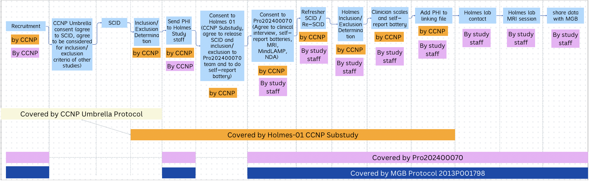

### IRBs

There are 3 IRBs at Rutgers which make up the Psychiatric Connectomics IRB structure. 

**Mass-General Brigham (IRB of Record / sIRB / Parent site)**

- Protocol Number: #2013P001798
- Amendment naming: AMEXX

**Rutgers (Child site)**

- Protocol Number: #Pro2024000070
- Amendment naming: Modification2025XXXXX

**Holmes 01 CCNP Substudy:** 

- Protocol Number: #Pro2025000031

