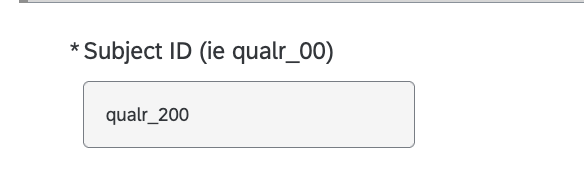

# Script for Clinical Interview Session
---
**Table of Contents**
1. TOC
{:toc}
---

## Introduction
Hi! Thank you for coming in today. I’m going to be reading from a script to make sure each participant has a similar experience.

You are being invited to participate in a research study on individual differences in how the brain functions. We hope that this data will allow us to better understand the bigger questions of how people vary in their behavior, and how those variations come about.

 I'll give you a brief overview of our procedures, and then you can read more specifics in the consent form. 

# 1. Consents
## 1.1 Clinical Interview (Holmes 01) Consent Form
The first thing we’re going to do is go over the consent forms. This study is being led by Dr Avram Holmes, who is a faculty member in the department of Psychiatry. Their study consists of this session today and a second session with an MRI scan. The first consent form is a consent for the activities we’ll ask you to do today, which include a structured clinical interview, which will take 20min-2hours. This is exactly like the interview you did with us when you first came into CCNP, we’re just doing it again to make sure the diagnosis is up to date. After that, I may ask you some more questions about your symptoms specifically in the last two weeks. The third thing we’d do today is an online survey. I would send you the link and you would fill it out yourself. This is expected to take around 1 hour. Signing this consent form confirms that you are willing to do these activities and willing to have your information shared with the study staff at Dr Avram Holmes’ lab, so they can schedule with you the MRI scanning session. I’ll let you read through the consent form now, let me know if you have any questions. 

[Holmes 01 Consent Form](https://rutgers.ca1.qualtrics.com/jfe/form/SV_byE8zSL9wiv3PLM) (Qualtrics)

## 1.2 MRI & Smartphone Session (PCR) Consent Form
The second consent form is for the MRI scanning session. If you sign this form today, you’ll also be asked to sign the same form when you go in for the MRI scan. You can always decide not to participate, even if you sign it today. This consent form goes over the activities you would do in this session and the second session. These include some more surveys, a 90 minute MRI scan and some optional components. The optional components are adding your data to the data repository, and a smartphone-app tracking study. 

**Signature Boxes:**
The first signature box is allowing us to use your de-identified data in the datasets we upload to data sharing sites, so that other researchers can use it. This is an optional component.
The second signature box is for the smartphone app portion of the study, where you could earn additional money to answer daily questions on your smartphone for up to 6 months. This is an optional component.

The third signature is the main part of the study which is the surveys today, the supplemental survey, and the MRI scan. It also involves allowing us to share your private health information, including identifiable information such as your name, with only the groups listed.

(Note: “Medical history and medications”  which we collect only pertains to study data we collect - no additional medical records)

I’ll let you read through the consent form now, let me know if you have any questions. 

[PCR Consent Form](https://rutgers.ca1.qualtrics.com/jfe/form/SV_1GQDBN2Y4DHxSse) (Qualtrics)

Do you have any questions for me? [*Participant must print, sign, and date*] This signed copy is for us to keep, and the survey has emailed you a blank copy of this consent form.

## Note: Post-Consent Email
An email gets automatically emailed to the participant through Qualtrics after they sign the consent forms, with a copy of their signed consent forms.

## 2. Enter Participant into ID-Linking Sheet
First, go the sheet in Box located at `/(Restricted)_PCR/PCR_Shared_with_CCNP/PCR_Linking_ID_CCNP.xlsx`.  
Enter this subject, assigning them a PCRID and a qualtrics ID.

### 2.1 Send this email to participantL
1. Email template to send to participant for self-report surveys: 
    - [Email template](https://holmeslab.github.io/holmeslab/docs/Projects/PCX/interview-session/email1/)
2. Fill in template with their name and qualtrics ID
3. Email has self-report battery link, CAHBIR screener link and mental health resources sheet

# 3. Surveys
## 3.1 Clinician Rating Survey
Go to the clinical ratings survey [PCX_ClinicalVisit_ClinicianRatings](https://rutgers.ca1.qualtrics.com/jfe/form/SV_bpUc7WXekERE7Cm) on Qualtrics and enter in the subject's qualtrics ID and dates.  
{ width=100 height=200 }

> If you've started the survey before and the URL is saving your responses, but you now want to go back to the original front page / delete your old responses, use [this link](https://rutgers.ca1.qualtrics.com/jfe/form/SV_bpUc7WXekERE7Cm?Q_R_DEL=1) 

Go through the first 2 pages of questions until you get to "PANSS". From PANSS questions on (surveys: PANSS, MADRS, BPRS, YMRS, possibly CSSRS), the questions (listed in purple) are not mandatory. They are all just guidance in case you don't feel you have enough information from the SCID to rate the participant on a specific symptom. 

Note:
- This survey has display logic to display questions based on answers. Specifically, suicidality questions will be displayed or skipped based on answers. 
- There is also suicidality procedure information in the displayed answers based on how the participant responds to the questions.

## 3.2 Self-Report Survey
After finishing the clinician interviews, Ask them to open the Self-Report Survey link from the email, and to share their screen if on Zoom.

Tell them or email them their qual_id so that they enter it correctly. (ie qualr_01)

Have them fill out the self-report survey while their screen is shared, so you can see that they're filling it out. You can be off camera and muted, but be there to answer any questions they may have. 

# 4. Payment
Once they've submitted, send them their payment.

--- 
---

If the participant has questions or would like you to explain additional informaiton, here is a selection of study information: 
# Protocol Overview
### Payment
- $20/hour for today's session, wihch is expected to last 2-3 hours. We will pay you via a gift card at the end of the session
- The rest of the sessions would be run by a collaborating group, who will pay you in Visa gift cards emailed to you at the end of each session
    - $60 for the MRI Scan session, which is expected to last around 3 hours
    - $30 for an optional additional set of online surveys, wnich would take around 1hr
    - An optional smartphone tracking component, where you would be paid based on the number of daily surveys you complete:
        - $5 for 5-9 surveys completed 
        - $10 for 10-14 surveys completed
        - $15 for 15-19 surveys completed
        - $30 for 20-24 surveys completed
        - $35 for 25+ surveys completed
    For up to 6 months ($210 total for the smartphone component)  

### **Scan Session Overview**
At the scaning session, this is what will happen: 

First, you're going to fill out a collection of surveys online, which will take about an hour, asking you about your mood, emotions and history.

After that, they'll take you through some of the tasks that we're going to be doing just on my computer here, so that you'll know what to expect when we get into the MRI room.

After that, you're going to walk down to the MRI room. You're going to have you change into a scrub top, but you can keep your pants - anything from the waist down. You'll also take off your shoes before going into the scanner. 

The large, donut-shaped machine in the room down the hall is the MRI scanner, which uses a magnetic field (***not*** ionizing radiation) to take pictures of your brain. The MRI scanner is like a really old camera, so you have to stay really still because it takes pictures of your brain over time. And so if you move, then the pictures will be blurry.

During the MRI study, they'll run a few different scans -- during these scans, you'll try to lie as still as possible. You will also play do some simple tasks that we’ll go over in just a second. You'll also watch some short films, and a planet earth episode. 

After the scan they're going to have a few more questionnaires which will take about 20 minutes.

We anticipate that the MRI session will take no more than 3 hours. You’ll be compensated with $60.

### **Additional Sessions**

 There are a few more parts to the study where you can get additional compensation, after the MRI session happens. You'll be onboarded to these at the MRI session, if you opt in. If you don't opt in today, you can always change your mind at the MRI session.  

1. One of those is a supplemental questionnaire where they'll send you a link to do about one more hour of questionnaires at home whenever it is convenient for you within the next 48 hours. If you finish those, you'll be sent an additional $30.

(**Smartphone tracking is not required to participate in the study**)
2. You can opt into a smartphone tracking research that we're doing. Basically it will be on your phone - it's an app. It won't take any of your cellular data but it will occasionally (every 3 minutes or so) check your GPS location and it will also check things like how fast you're moving using the accelerometer. It will also check how many times your phone turns on and off. 
This will give us an idea of things like your activity during the day, how much you're sleeping, how much you're moving, how much exercise you're doing.
The other part of the app is daily surveys where it will ask you about 10 questions every day. It'll pop up at 6pm but we can change that specific time. Then you'll answer questions about your mood and what you've been doing during the day.
The reason that we are interested in this is because it can give us an insight into how people's behavior affects their mood and how different people with different brain profiles may have different activity patterns or mood relationships that we can investigate with this long-term data.
For that portion of the study, you'll be paid based on how many survey days you complete. So if you complete 25 or more survey days, you'll be paid $35/month. If you complete 15 survey days, you'll be paid $20/month. The specifics are in the consent form. !! add!!
This will run for a maximum of six months, but if you would like to leave the study at any time during that period, you can always uninstall the app and it will stop collecting data. 

### **Data Privacy**

All of the data we collect in this study will be de-identified and stored securely in our lab, to protect your privacy. So instead of your name, all your data will be associated with a numerical ID, and the link to your name is stored on a protected, HIPAA-compliant document. So even when sharing with collaborators or other researchers, we'll never disclose your personal information.  The only people who could see things like your name, your birthday, your email, would be people who are directly staffed in this lab. 

Your participation in this study is totally voluntary, so you’re free to stop participating at any point; just let us know.

## Suicidality Procedures
If a participant endorses suicidality, the study-staff (trained post-baccalaureate, postdoctoral researcher, and/or graduate student member(s) of the research team) will conduct a thorough suicide risk assessment. If the study-staff assesses imminent risk to the participant or to others, and the participant is unwilling to contact his/her current treatment provider to arrange for a prompt crisis session and to engage in suicide contracting, the study-staff will contact UBHC Psychiatric Emergency Services. The study staff escort the at-risk study participant to UBHC Psychiatric Emergency Services, one building over from the lab space (671 Hoes Lane Piscataway, NJ 08854). If a participant that the study-staff has assessed to be imminently at risk leaves the debriefing session without first contacting a provider and making arrangements that reduce risk, the study-staff will contact Rutgers Security and provide the name and contact information of the at-risk individual. The Director of Clinical Training and the IRB will also be contacted in such an incident. The study-staff will consult with the study PI, Dr. Avram Holmes immediately following each suicide assessment and before a participant has left the lab. Together, the study-staff and the consulting faculty member will determine the participant’s risk status and appropriate course of action.

If the participant is judged not to be an imminent risk to him/herself and/or others, the study-staff will debrief with the participant, in which s/he will discuss the participant’s extreme score, provide psycho-education about depression and/or anxiety, discuss any distress they may be experiencing, and suggest referrals to local treatment providers.

Regardless of risk status, each participant with extreme scores will be strongly encouraged to contact their mental health treatment provider, if they do not have one, or to make an appointment with a new provider. They will also be offered the option of being contacted by Dr. Avram Holmes, a Professor in the Rutgers Psychiatry Department. If participants desire, Dr. Avram Holmes will be contacted and provided with the participant’s name and email address, and will follow up the participant within 24 hours whenever possible with the following email message:

“I am a professor affiliated with Rutgers University - From your answers to one of the questionnaires in a psychology research study, you seemed to be feeling quite down and blue/anxious. You were provided with some information about counseling services at the end of your participation in the study, but I wanted to follow up and offer to provide any other referral information you might want. If you would prefer to discuss this over the phone, please send me your phone number and some preferred times and I will do my best to reach you at a time that is convenient for you."