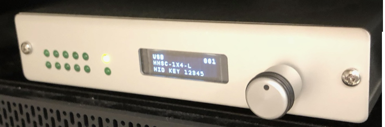
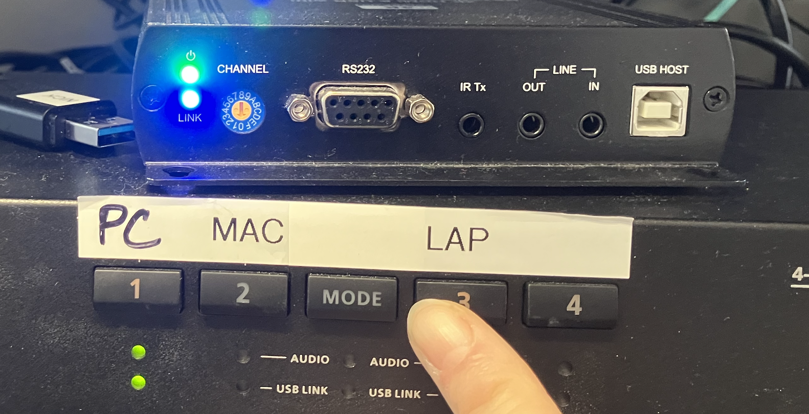
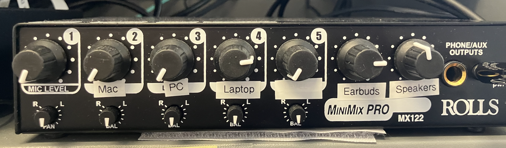
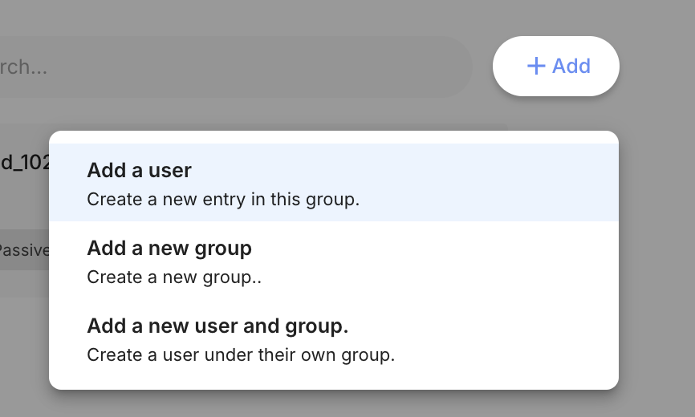
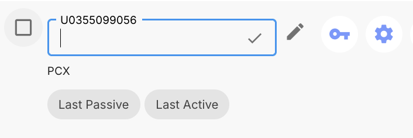
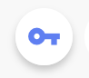
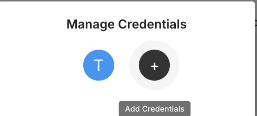

# Script: Scanning Session
Updated: April 28, 2025
---
**Table of Contents**
1. TOC
{:toc}
---

## **MRI Full Session — Brief Overview**

1. [PCR consent form](https://rutgers.ca1.qualtrics.com/jfe/form/SV_8vK8CJMuW2iNcmG) on Qualtrics 
2. Train on MRI Tasks
    1. [flanker task training powerpoint](https://rutgers.box.com/s/fxwl23n2mdwpp7l784946we6cmu7po1x) 
    2. [language task training powerpoint](https://rutgers.box.com/s/fmifnrlyfphs74nlsc2hdf6gdpmb3e32)  
3. Prep for MRI 
    1. Change, verbal metal scan, get into scanner
4. [MRI Protocol](https://rutgers.box.com/s/9cgfscxixyd7ja5gah5t9tmdu8ib8gzt)
    - **MRI Protocol outline**
        
        
        | **Name** | **Scan name on protocol** | **Time** | **On screen for participant** |
        | --- | --- | --- | --- |
        | Head align | AAHead_Scout | 00:00:14 | Nothing |
        | T1 | anat-T1w_acq-MPRAGE | 00:05:21 | Black fixation |
        | Setter | anat-mpm_acq-setter | 00:00:01 | Black fixation |
        | Localizer | anat-T2w_acq-mgh-navSPACE | 00:02:37 | Black fixation |
        | Resting state 1 | func-epi_BOLD_NORDIC_run-01 | 00:06:53 | Black fixation |
        | Fmap epi AP | fmap-epi_dir-AP_BOLD_NORDIC_run-01 | 00:00:25 | Black fixation |
        | Fmap epi PA | fmap-epi_dir-PA_BOLD_NORDIC_run-01 | 00:00:25 | black fixation |
        | Resting state 2 | func-epi_BOLD_NORDIC_run-02 | 00:06:53 | Black fixation |
        | Fmap fieldmap  | fmap-fieldmap_acq-B0 | 00:02:21 | Black fixation |
        | Flanker task | func-epi_task-flanker_BOLD_NORDIC_run-01 | 00:06:41 | flanker task |
        | Language Task | func-epi_task-language_BOLD_NORDIC_run-01 | 00:06:51 | language task |
        | The Elevator (movie task) | func-epi_task-theElevator_BOLD_NORDIC_run-01 | 00:04:08 | the elevator |
        | Diffusion Weighted Imaging | dwi-dwi_acq-CMRR-118-dir | 00:07:12 | second planet earth |
        | Fmap phasediff AP | fmap-phasediff_dir-AP | 00:00:55 | Black fixation |
        | Fmap phasediff PA | fmap-phasediff_dir-PA | 00:00:55 | Black fixation |
        | Momentous (movie task) | func-epi_task-momentous_BOLD_NORDIC_run-1 | 00:06:49 | momentous |
        | Resting state 3 | func-epi_BOLD_NORDIC_run-03 | 00:06:53 | black fixation |
        | Resting state 4 | func-epi_BOLD_NORDIC_run-04 | 00:06:53 | black fixation |
        |  |  |  |  |
        |  |  |  |  |
5. Post scan surveys
    1. [Movie Rater Task](https://rutgers.box.com/s/v3n80mn5xuigav4g9r0cy903k2autn48) 
6. [MRI Session Self-Report Battery](https://rutgers.ca1.qualtrics.com/jfe/form/SV_0UqGfGjgsl2nklU) on Qualtrics
7. If subject consented to MindLAMP: Go through [MindLAMP Instructions for Setup](https://rutgers.box.com/s/nl4emov6zjv5089vakdbib2l0nw5ras2) 
8. Explain payment setup and schedule
9. Send [post-session email [template](https://rutgers.box.com/s/5y7wsd6m2ch9stcpwoq2yupgwuy02jzh)]

Subject leaves, done.

---

# MRI Session — Instructions Script

🔑

This Script:
*Italic Text*       is your speaking
[Bracketed text]      is actions/links

## **SECTION 0: BEFORE PARTICIPANT ARRIVES**

To do

- Get together scan bag with the following items:
    - Charged scanner laptop with all adapters and charger
    - Binder with consent form copies, MRI log copies, script copy, button box picture, task instructions.
- On your laptop
    - Open up [PCRID Linking sheet](https://rutgers.box.com/s/habtubduu0w3am4bb09npgxttliyl6wc) at Rutgers 
    - Open [Subject_tracker_PCR](https://rutgers.box.com/s/i5jaa225v6fz6czlj1bbakar79xtrvng)
        - FOR BOTH: Filter to only their row so you can check information with them without showing any other participants
- Have printed copies of [Mental_health_resources_NJ](https://rutgers.box.com/s/wdzm85lp57errgwe3msyy8jelainem8s) & consent form if you want to give to participant along with consent form -- though Qualtrics automatically sends participants a copy of their consent in their email. 
- On scanning computer
    - Open up [the fixation cross image](https://rutgers.box.com/s/bq3vkqlc7ff1iv3psm0eifldz8hcitet)
    - Make sure the computer settings is set to not sleep
    - Open up Flanker task in PsychoPy
    - Open up Language task in PsychoPy
- On testing computer
    - Open up [PCR consent form](https://rutgers.ca1.qualtrics.com/jfe/form/SV_1GQDBN2Y4DHxSse) on Qualtrics
    - Open MRI Session [Self-report battery survey](https://rutgers.ca1.qualtrics.com/jfe/form/SV_0UqGfGjgsl2nklU) on Qualtrics
    - Open the [flanker task training powerpoint](https://rutgers.box.com/s/fxwl23n2mdwpp7l784946we6cmu7po1x)
    - Open the [language task training powerpoint](https://rutgers.box.com/s/fmifnrlyfphs74nlsc2hdf6gdpmb3e32) in powerpoint

---

## **SECTION 1: Consent**

Welcome to imaging session of our study!

Before we start, I want to ask, did you drive yourself today? If so, did you have to pay any tolls or parking fees? [Record amounts of any fees, +$5 offset for gas costs, into subject log]

Just to let you know, today I’ll be reading to you from a script, so we can make sure that all our participants are getting the same exact instructions. The first thing that we’ll do today is complete some paperwork. I’ll walk you through the consent form, which explains what the study is about and what you can expect. Feel free to ask questions at any point. If everything sounds good, then I’ll ask you to sign the form, and we’ll proceed with the experiment.

You are invited to participate in a research study on individual differences in how the brain functions. We hope that this data will allow us to better understand the bigger questions of how people vary in their behavior, and how those variations come about.

 I'll give you a brief overview of our procedures, and then you can read more specifics in the consent form. 

### **Protocol Overview**

First, we're going to give you a collection of surveys, which will take about an hour, asking you about your mood, emotions, history, those types of things.

*After that, I'll take you through some of the tasks that we're going to be doing just on my computer here, so that you know what to expect when we get into the MRI room.*

*After that, we're going to walk down to the MRI room. I'm going to have you change into a scrub top, but you can keep your pants - anything from the waist down. You'll also take off your shoes before going into the scanner.* 

*During today’s study, we’ll run a few different scans -- during these scans, we’ll ask you to lie as still as possible. You will also play do some simple tasks that we’ll go over in just a second. You'll also watch some short films, and a planet earth episode. 
*
*After the scan we're going to have a few more questionnaires which will take about 20 minutes.*

*We anticipate that today’s session will take no more than 4 hours. After you’re all done today, you’ll be compensated with $60.*

*If you want to stop at any time, just let me know.*

## Sign PCX Consent Form (2nd time, have already signed before interview session)

*Now we'll have you sign the same consent form again, as you signed before.* 

*For these sessions, you'll be paid in e-gift cards, which you can use with venmo, as a debit card on your phone (by adding it to your wallet), or as a debit card for any online purchse. You cannot transfer directly to your bank.*

*You'll be paid $60 for the 2.5 hours of MRI and surveys at the MRI session, and will receive a link to do an additional 1hr of surveys at home, for an additional $30*

*There is also an optional smartphone tracking component, where you would be paid based on the number of DAILY surveys you complete:*
        - $5 for 5-9 survey days completed 
        - $10 for 10-14 survey days completed
        - $15 for 15-19 survey days completed
        - $30 for 20-24 survey days completed
        - $35 for 25+ survey days completed
*This would last for up to 6 months ($210 total for the smartphone component). However, you can uninstall the app at any time if you would like to leave the study.*

**Signature Boxes:**
*The first signature box is allowing us to use your de-identified data in the datasets we upload to data sharing sites, so that other researchers can use it. This is an optional component.*

[Have them read the first page and sign]

*The second signature box is for the smartphone app portion of the study, where you could earn additional money to answer daily questions on your smartphone for up to 6 months. This is an optional component.*

*The tracking will be on your phone. It won't take any of your cellular data but it will occasionally (every 3 minutes or so) check your GPS location and it will also check things like how fast you're moving using the accelerometer. It will also check how many times your phone turns on and off.*

*This will give us an idea of things like your activity during the day, how much you're sleeping, how much you're moving, how much exercise you're doing*.

*The other part of the app is daily surveys where it will ask you about 10 questions every day. It'll pop up at 6pm but we can change that specific time. Then you'll answer questions about your mood and what you've been doing during the day.*

*The reason that we are interested in this is because it can give us an insight into how people's behavior affects their mood and how different people with different brain profiles may have different activity patterns or mood relationships that we can investigate with this long-term data.*

**[Have them read the second page and sign]**

*Then the form discusses risks and benefits. Then the third signature is the main part of the study. It involves the surveys today, the supplemental survey, and the MRI scan. It also involves allowing us to share your private health information, including identifiable information such as your name, with only the groups listed.*

**[Have them read the third page and sign]**

### **Data Privacy**

*All of the data we collect in this study will be de-identified and stored securely in our lab, to protect your privacy. So instead of your name, all your data will be associated with a numerical ID, and the link to your name is stored on a protected, HIPAA-compliant document. So even when sharing with collaborators or other researchers, we'll never disclose your personal information.  The only people who could see things like your name, your birthday, your email, would be people who are directly staffed in this lab.* 

---

## **SECTION 2: Self-Report Surveys

*Now we're going to go to the first selection of surveys, which will take about 30 minutes. I'm going to set you up on this computer here, and then I'll leave the room. You can fill out the surveys, and I'll be right next door, so let me know if you have any questions or if you want any clarification on any of the questions.* 

[Open [Self-Report Surveys](https://rutgers.ca1.qualtrics.com/jfe/form/SV_0UqGfGjgsl2nklU) (Qualtrics)]

First, I'll help with this first page. I'm going to tell you your de-identified study code that you'll enter in right here so that the survey isn't associated with your name. It's [qual_XXX]. 

**[Leave room and go into room next door while they complete the survey]**

## **SECTION 3: Tasks Instructions, MRI overview**

*Now, I'm going to go over with you the tasks that we're going to do in the fMRI scanner so that you're familiar with them before we actually get into the scanner. Then, I'm also going to go over what exactly the MRI process will look like.*

### **Flanker Task**

Open up the flanker task in psychopy and have them try out doing the task.

### **Language Task**

Open up the language task in psychopy and have them try out doing the task.

Training powerpoint if needed: [Language Task Training Powerpoint](https://rutgers.box.com/s/fmifnrlyfphs74nlsc2hdf6gdpmb3e32)

## **SECTION 4: MRI Prep and Explanation**

 I'm going to explain what we're going to do when we head over to the MRI room, so that you can ask any questions now and not be caught off guard! 

Changing room

- You will be asked to change into a scrub top, and to take off your shoes, but you can keep your clothes on from the waist down (pants etc).
- You will be asked to remove jewelry, eyeglasses, hearing aids, wigs, hairpins, removable dental work or other objects that may interfere with the procedure.
- You will put all your items into a locked locker during the MRI
- You will be given MRI-safe prescription eyeglasses if you wear them

Have you ever had an MRI before? 

If YES, take them to the scanning room.

If NO:

*I'll briefly explain the procedure:.*
*- The MRI is like an old camera. It takes pictures of your brain very slowly. So if you move even a bit, the pictures will be blurry. So we'll ask you to stay very still during the scans. You'll have breaks every 7 minutes or so where we'll check in with you, and you'll be able to do thigs like adjust your mouth or be a little less still*   
*- You will lie on a scan table that slides into a circular opening of the scanning machine. Pillows and a headrest will be used to prevent movement during the procedure. There will be a strucuture over your head a few inches from your face which will hold the mirror so you can see the screen.*
*- We will then insert some MRI-safe earbuds into your ears and put some inflatable padding by your head so that both your earbuds stay in place, your head stays in place, and so that the sound from the scanner is muffled*
*- The technologist will be in another room where the scanner controls are located. However, you will be in constant sight of the technologist through a window. Speakers inside the scanner will enable the technologist to communicate with and hear you. You will have a communication ball so that you can let the technologist know if you have any problems during the procedure. The technologist will be watching you at all times and will be in constant communication.*
*- During the scanning process, a clicking noise and other sounds will sound. The scanner will also lightly vibrate at some points. The scanner is quite loud and we do everything we can to muffle sounds.*
    - Here’s an example of the sounds you’ll hear: [MRI Audio Sounds](https://rutgers.box.com/s/hm6yyhqclbyngto8zhvno5hk9ibmusgo)
*- It will be important for you to remain very still during the examination, as any movement could cause distortion and affect the quality of the scan.*

*Any questions?*

## **SECTION 5: Going into the Zone 2 of the MRI center**
*First, I'm going to have you go into this room here, and there are scrub tops where you can change into them. Please take off all clothes on the top half of your body (including bra), but you can leave your pants, shoes and socks on. Please take off all glasses, hats, jewelry, hair extensions, wigs, and removable devices. You'll leave your shoes on, and take them off in the scanning room.*

*There are  lockers in here for your clothes and things.*

*You can lock it with the key, and then there are transparent cubbies in the scanner room where you'll put the key.*

*There's also a restroom right here.*

## **Researcher setting up Control Room**

[While participant changes, go into scanner control room and set everything up]

### In Scan Room:
- Attach correct button box 
- Make sure correct head coil is out
- Put bed into "Home" position
- Turn on MONITOR/computer in back of the room, make sure it's in line with scanner
- Dim the lights, potentially (limit glare)

### Glasses:
- if the participant needs glasses, take the glasses box out of the cabinet and take out the eye test sheet.

### Button box - control room:

- On silver control box mounted in the computer rack, press button and go through mode options to set the configuration:
    - click dial -> change mode? Yes, Autoconfig, USB, HID Key **12345**
    - if it’s stuck on something and wont change, go to the back and pull out the power cord, wait a second, and plug back in
- Make sure console reads the following:
    - USB 001 [NOT FLASHING]
    - HHSC-1x4 - L
    - HID KEY 12345”
- ‘USB’ will be flashing on the screen if it’s not registering (will flash if computer is turned off or goes to sleep)

Test button box:
- Ensure button box/keyboard 1 is paired with computer on AV system
- Open Notepad on computer
- Pair computer with monitor inside scan room (so that you can see the computer screen inside the scan room)
- Go in magnet room (REMOVE ALL METAL) and press blue, yellow, blue, yellow, blue, yellow on the button box
- In Notepad, you should see 121212
- Once this is tested and working, close Notepad

### Setup Computer system:
- Plug in scan laptop to the MRI-room computer cables
    - **BOTH USB-C AND AUDIO JACK**
- Click “LAP”

- Set up volume levels
    
    
- Check box for having discarded acquisitions for each task

### On Scanning Computer
**For details on the explanation, overview and setup of tasks, and running fMRI tasks for the first time, see this tutorial: [SOP Running fMRI Tasks](https://rutgers.box.com/s/m8wlwxw0vnl45fs0o3k6jb3my5dc91my)**

- OPEN ALL PsychoPy Scripts in Coder view
    Filepath: [Box-Box/Holmes_Lab_Wiki/PCX_Round2/MRI/In_scanner_tasks](https://rutgers.box.com/s/qkqr45kfk22q1a3s32qxj8r15022n7ig)/<task_name>
    - [sound_check.py](https://rutgers.box.com/s/7vb8o2k0jbopamg3zukksjcxy1aiqktk)
    - [flanker_task_TCP_250407.py](https://rutgers.box.com/s/cpomqh7ehr7zcbdtiwutdqqgp2j6a56l)
    - [language.py](https://rutgers.box.com/s/947kr3dfstppfna4y0dlgcvir3yuxu25)
    - [PlayTheElevator.py](https://rutgers.box.com/s/comr04gp5quujiudreoef8ci35qke96d)
    - [PlayMomentous.py](https://rutgers.box.com/s/comr04gp5quujiudreoef8ci35qke96d)
    
- Cancel any other processes or apps running on the scanning laptop
- Make sure it’s set to no-sleep
- Have it on charger

- OPEN [fixation cross image](https://rutgers.box.com/s/jbkipzmw6pusy9b8421t77s30pgb9l3h) in full screen on the monitor

### **Once the participant arrives to control room:**

Verbally scan participant:
- You have no implants, other than [list any approved ones from the screener sheet]? 
- No medical patches? 
- No insulin patches or medicine pumps? 
- No chance of pregnancy? 
- You've taken out any hearing aids, removable dental things, dentures, hair extensions? 
- You don't have anything in your pockets?

If they need glasses: 
- Have them try differetn prescriptions from the glasses box
- Test them on the eye test sheet. 

## **SECTION 6: Situating the participant in the scanner**

- Have them leave their shoes by the door

*As a reminder, we’re using the scanner to take pictures of your brain, it is super important that you remain as still as possible while the scans are in progress; if you move too much, the images will be blurry and unusable. And of course, regular breathing and swallowing is totally fine.*

*For further hearing protection, and so we can communicate with you in between scans, we have this set of headphones for you to wear. You’ll be able to hear us and any audio related to the experiment through these headphones, and there’s also a microphone that you can use to talk to us in between scans. However, because the scanner is very loud while it’s running, we won’t be able to hear you during a scan.*

*If you’re in the middle of scan and need to communicate with us urgently (for example, if you begin to feel sick), you can squeeze this bulb to stop the scan and trigger an alert so we can talk to you. We just ask that you only hit that button in case of an emergency- if you need to go to the bathroom or would like us to reposition your headphones, you can always ask us once the current scan has finished. Remember, each scan is only 1-8 minutes. Here’s the button box that you’ll be using to respond to the experiment.*

- Have them try the squeeze ball so they know it works

If you don’t mind, I’m going to place my hand behind your head and guide you down so that you’re perfectly centered in this headrest. Hold your headphones against your ears like this (mime motion), and here we go (guide head down). Great! How does that feel? If it’s at all uncomfortable, definitely let me know- you’re going to be in here for around an hour and we want you to be as comfortable as possible.

We’re also going to grab a sheet and blanket since it’s quite cold in here.

[Grab sheet and blanket from tall cabinets. Put sheet and blanket up to their waist so it doesn’t get too hot.]  We put the blanket and sheet only up to your waist because the MRI machine will heat up slightly on your chest and head, so that part we don't want to get too warm 

How are you feeling? I can also grab you some padding for your arms and legs if that would make you more comfortable. Okay- last thing to do before sending you in is to put on the top piece of this mask, which will help you stay still while in the scanner and see the screen that will be displaying the actual experiment. I’m going to put it on now, you should hear a click when it locks in place. Can you see the screen clearly, and is it roughly centered in your field of view?

1. a) Tell the participant to close their eyes then move them back slightly and turn on the laser. **Don’t tell them to open their eyes until laser is off.
2. b) Make sure the head is straight in the coil. (walk around the back to see their eyes in the mirror) Make sure the subject can see most of the screen. Make sure the participant’s eyes are not covered.
3. c) **64 head coil always

## **SECTION 7: Sound Check**

[Run: momentous.py]

Hi ________, can you hear me alright? If you’d like me to raise or lower the volume on your headphones, just let me know.

[open Notepad]

First we’re going to check the sound and the button box. Can you try pressing your left finger?  [should see 1 on the notepad]

And now your right finger? [should see 2 on the notepad]

Ok great! That’s working. We’re now going to do a sound check. I’m going to play some audio and we can adjust the volume as needed. [play 3 seconds of audio]

How was that? Could you hear it?

Would you prefer it louder/quieter?

[keep testing until you find a good level]

## **SECTION 8: The first scans**
⚠️ NOTE: When talking through the intercom - its a PA system outside of the scanner, not through the earbuds. So make sure you face the speaker when you talk, talk slowly and clearly, and ask the participant if they heard you correctly    
    

*Ok, if you’re feeling comfortable, then we’ll get started with the first scan, which should only take about 15 seconds (AAHead_Scout). Remember, when the scanner is running, I won’t be able to hear you, so in the case of an emergency, you’ll have to push the button on your headphones to communicate with me. And one last reminder to stay as still as possible while the scan is in progress. Here we go!*

*Hi _____ are you still ok? The next scan will be around 5 minutes. Feel free to have your eyes open or closed. *  (anat-T1w_acq-MPRAGE)

*Hi _____, how was that? The next scan will be around 3 minutes. Feel free to have your eyes open or closed.* (anat-mpm_acq-setter, anat-T2w_acq-mgh-navSPACE)

*This next run is about 7 minutes long. Please keep your eyes open and look at the cross.* 
**Bold run 1: func-epi_task-rest_BOLD_NORDIC_run-01**

*This next run is also about 10 minutes. Please keep your eyes open and look at the cross.* 

**FMAPS: fmap-epi_dir-AP_BOLD_NORDIC_run-01, fmap-epi_dir-PA_BOLD_NORDIC_run-01** 
**Bold run 2: func-epi_task-rest_BOLD_NORDIC_run-02**

**SECTION 8: Running the Flanker Task**

[Select on psychopy: 250210_flanker_task_TCP.py]

[Press “Run” and enter info into dialogue box]

[PRESS ON THE SECOND MONITOR SCREEN so that the computer is on the screen of the task, not any other window]

Hi _______, how are you doing?

*Great, we have the first structural/task/rest scan coming up for you. It should take about 7 minutes* (func-epi_task-flanker_BOLD_NORDIC_run-0).

*Before you get started, let’s practice pressing the buttons and doing the task for the direction of each arrow. Remember, you'll press based on the direction of the arrow which appears in the center. *  
*Press your pointer finger for left.*  
*Press your middle finger for right.*  
*Pointer finger for left.*  
*Middle finger for right.*  
*Now press the key for left.*  
*Press the key for right.*   
*Left.*  
*Right.*  
*Left.*  
*Right.*  

*Great job! We are now ready to start the task. It will be just like the practice, but longer at about 7 minutes. I want to remind you that it is imperative to keep your head and body completely still throughout the entire task, from the very first image to the very last image. Do you understand?*

Run: func-epi_task-flanker_BOLD_NORDIC_run-0

## **SECTION 9: Running the Language Task**

[Open psychopy builder, open language.py]

*Hi _______, how are you doing?*

*We’re now going to have another task. This is the task where you listen to audio and press the button when it’s over. Can you repeat to me at what points you press the button to respond?*

(Correct answer: after the audio finishes, after the square appears.)

*It will be about 7 minutes.*
    
Run: func-epi_task-language_BOLD_NORDIC_run-01

## **SECTION 10: Running the movie task: The Elevator**

*Alright, that’s finished. How do you feel? Next we’ve got a short film. There are no button presses here, just watch the movie. It’s about 3 minutes long. Please do your absolute best to keep as still as possible during the movie.*

Run: func-epi_task-theElevator_BOLD_NORDIC_run-01

## **SECTION 11: Running Diffusion**

*Great, we have another scan coming up for you. On this one you may feel slight vibrations of the scanner. This is because it's a different type of scan. Please try to stay as still as possible. It's about 8 minutes.*

Run: dwi-dwi_acq-CMRR-118-dir

## **SECTION 12: Movie task: Momentous**

*How was that? Now we have a few short scans which won’t vibrate, for about 1 minute.* 

Run: fmap-phasediff_acq-dir-AP, fmap-phasediff_acq-dir-PA

*Now we have another short film, this one is around 7 minutes long.*

Run: func-epi_task-momentous_BOLD_NORDIC_run-01

## **SECTION 13: Final rest runs**

*Now we have the final 2 runs of the session, around 14 more minutes. Please keep your eyes open and look at the cross*

*Ok, starting the  run, 7 minutes*
Run: func-epi_task-rest_BOLD_NORDIC_run-03

*Ok, here is the final 7 minutes. Sound good?*  
Run: func-epi_task-rest_BOLD_NORDIC_run-04,
Run: fmap-epi_dir-AP_BOLD_NORDIC_run-02

*Alright, you’re finished! Feel free to move now. I’m coming into the room now to help you out*.

## **SECTION 14: In control room after the scan session**

Take out participant

- Double-check no metal on your person before entering the scan room
- Go directly to the left side of the bed (facing the bore) and say (with an enthusiastic smile), **“Great job!! You are all done!”**
- Bring bed out slowly and say, **“I’m going to move the bed out now”**
- Remove mirror and top of head coil and place on countertop
- Remove headphones and padding (subject can throw his/her own earplugs away)
- Ask participant to sit up slowly and take a second before getting up. It’s normal to be dizzy.
- Tell them they can grab their shoes and walk back to the console room

## **SECTION 15: Post-scan Movie-rater task in testing room

### While they do the task, clean up scan room.

Clean up magnet room
- Clean headphone covers, head coil/cage, and mic filter using sanitary wipes in top black cabinet
- Return headphones and mic to their drawers (follow wires, be sure not to wind fiber optic cables too tightly)
- Return mirror to the counter
- Return small head cushions to the dark red cabinet
- Remove sheets and bring into console room, place in laundry cut-out bin in left lower cabinet
- Grab the top of the head coil place on countertop
- Press HOME (house icon button) on magnet to bring bed to home position
- Grab a towelette from the black upper cabinet and wipe down anything the participant (and you) came in contact with: the head coil, button box, headphones, mic (only wipe the side and cord), GSR clips)
- Return button box to light blue drawer
- Ensure all cables are in drawers and not too tightly wound
- Double check for any trash/anything you might be forgetting
- Take sheets and exit magnet room
- Tightly shut door until you hear airlock engage (lock if no one scanning after you)
- Turn off the lights in the magnet room

Transfer data
- MRI Tech (bernadette) transfers the MRI data

Before leaving
- Double-check that you have all of your belongings, room looks clean
- If applicable: Turn off lights in console room and close the door on your way out

## **SECTION 16: Payment Setup**

*Ok, final questions! First, we have digital cards we can send to your email, which will come with a card number so you can use the card like any other card for online purchases.*

*Did you have any transportation reimbursement to request?*

- Check their email on the PCRID Identifiers Linking sheet, change if there’s a better one
- Open **payment tracking sheet** with the gift card links
- Copy the link + password to a $60 card, and put in the PCRID and current time in recipient fields
- Add transportation reimbursement amount into 

Put info into THIS template: [Post-MRI Scan Email Template](https://rutgers.box.com/s/5y7wsd6m2ch9stcpwoq2yupgwuy02jzh): 
    - MindLAMP credentials (if applicable) from [Subject_tracking_PCR](https://rutgers.box.com/s/i5jaa225v6fz6czlj1bbakar79xtrvng)
    - Payment links 

SEND EMAIL!

## **SECTION 17: MindLAMP Setup (if applicable)**

### Add Participant to MindLAMP
- Open up https://dashboard.lamp.digital/#/ 
- Input admin credentials (follow [Researcher Instructions MindLAMP](https://rutgers.box.com/s/02c2rqj7gym6vfkzhxrca3i15be8gbbh))

- Add new user

- Rename them to their qual-id

- Press key icon

- Fill in "name" and "role" as qual-id, fill in email and password as assigned. 
 

### Configuration
*We currently have daily survey’s set up to alert you at 6pm for the survey. Does that work? We could have it ding you anytime between 5pm-10pm, is there a time that would be best?*
- If they note a time, put it in their participant file and change it on MindLAMP

### I sent you an email, which contains:
- The instructions I’m going to go over now, for the smartphone app, in case you forget
- The username and password to the smartphone app
- The link to a [Supplemental Survey](https://rutgers.ca1.qualtrics.com/jfe/form/SV_08nF8tsZ4NU0rWe)
, which I’ll explain after this
- The ID to input in the supplemental survey
- Blank version of the consent form
- Blank [PCR consent form](https://rutgers.ca1.qualtrics.com/jfe/form/SV_1GQDBN2Y4DHxSse)
- [Mental_health_resources_NJ](https://rutgers.box.com/s/wdzm85lp57errgwe3msyy8jelainem8s)

### Set up MindLAMP with participant
- [Then go through this setup powerpoint to take the participant through download and setup: [MindLAMP Instructions for User](https://rutgers.box.com/s/57h007shwx09wapkhvrg5dcdaumzeltq)]

## **SECTION 18: Supplemental survey**

*In your email is the link to the supplemental survey. If you do it within 48hours, we'll send you an additional $30.*

*Would you like to fill it out now, here, or do it at home?*

(If here, take them back to the testing room and set them up on the computer.)

## **SECTION 18: Goodbye**

The debriefing should be short and say something like (Whether this is over email or verbally): “We are using neuroimaging methods to identify biological pathways and functional differences associated with psychiatric illnesses. We really appreciate you taking the time to participate in our study, and we hope to see you again soon!”

*If they do not complete the supplemental on a lab computer, make sure to email them the link to it within 24 hours.*

## SECTION 19: Once Participant Leaves

1. EMAIL the task files to yourself from the scanning computer
2. Add up the additional payments for the subject, including gas costs, parking/tolls costs, uber/lyft costs and overtime costs, and do the calculations in the subject log sheet for how much the subject is owed. Then put in an order to PerfectGift for that amount, rounding to the nearest dollar. 
    
    Tutorial: Purchase gift cards from PerfectGift