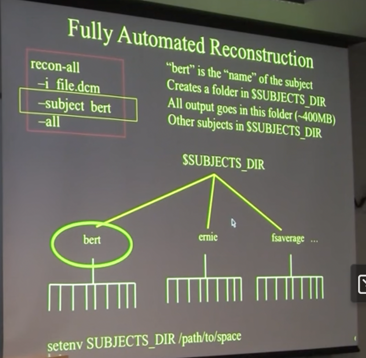
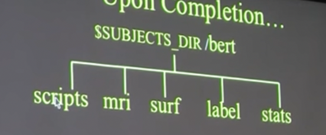

# FreeSurfer Overview
Date: January 16, 2024 1:15 PM

---
### Table of Contents
1. TOC
{:toc}
---

***Freesurfer is a neuroimaging software package. More information at [https://surfer.nmr.mgh.harvard.edu/](https://surfer.nmr.mgh.harvard.edu/)* 

### Function of FreeSurfer

- Takes your T1 weighted image from fMRI or MRI → Labelled brain and stats
- will completely label the anatomy of the brain
    - output an array of measures of anatomy (5-10hrs of analysis)
    - automated— go check for artifacts if it’s relevant to your results
    - cortex flattened out
    - subcortical organs
- does cortex-surface-based analysis & volumetric analysis
- multi-modal integration
    - fMRI (task, rest, retinopy)
    - diffusion data
    

### Download and Install FreeSurfer

[FreeSurfer 7 Download](https://surfer.nmr.mgh.harvard.edu/fswiki//FS7_mac) ← Installation Walk Through

Installation Demo Video for MacOS:

[https://surfer.nmr.mgh.harvard.edu/fswiki/DownloadAndInstall?action=AttachFile&do=get&target=installFS_demo.mp4](https://surfer.nmr.mgh.harvard.edu/fswiki/DownloadAndInstall?action=AttachFile&do=get&target=installFS_demo.mp4)

Source: [FreeSurfer Download and Install](https://surfer.nmr.mgh.harvard.edu/fswiki/DownloadAndInstall)

### FreeSurfer Tutorials

[All Tutorials](https://surfer.nmr.mgh.harvard.edu/fswiki/FsTutorial?action=fullsearch&context=180&value=linkto%3A%22FsTutorial%22) || [Tutorials by Version](https://surfer.nmr.mgh.harvard.edu/fswiki/Tutorials) 

Overview

- [Introduction to Free Surfer video series](https://www.youtube.com/playlist?list=PLIQIswOrUH6_DWy5mJlSfj6AWY0y9iUce)
- [FreeSurferAnalysisPipelineOverview](https://surfer.nmr.mgh.harvard.edu/fswiki/FreeSurferAnalysisPipelineOverview)
- [FreeSurferBeginnersGuide](https://surfer.nmr.mgh.harvard.edu/fswiki/FreeSurferBeginnersGuide)
- [FreeSurferWorkFlows](https://surfer.nmr.mgh.harvard.edu/fswiki/FreeSurferWorkFlows)
- [FreeSurferApplications](https://surfer.nmr.mgh.harvard.edu/fswiki/FreeSurferApplications)
- [FreeSurferCommands](https://surfer.nmr.mgh.harvard.edu/fswiki/FreeSurferCommands)

Basics

- [Introduction to FreeSurfer Output](https://surfer.nmr.mgh.harvard.edu/fswiki/FsTutorial/OutputData_freeviewV6.0) ([slides](http://surfer.nmr.mgh.harvard.edu/pub/docs/fsrecon.sep2022.pptx), [video](https://www.youtube.com/watch?v=8Ict0Erh7_c))
- [Practice Working with Data](https://surfer.nmr.mgh.harvard.edu/fswiki/FsTutorial/PracticeV6.0)
- [Troubleshooting FreeSurfer Output](https://surfer.nmr.mgh.harvard.edu/fswiki/FsTutorial/TroubleshootingDataV6.0) ([slides](http://surfer.nmr.mgh.harvard.edu/pub/docs/freesurfer.troubleshooting.sep2022.ppt), [video](https://www.youtube.com/watch?v=gf0BC0xs0tM))
- [Group Analysis](https://surfer.nmr.mgh.harvard.edu/fswiki/FsTutorial/GroupAnalysisV6.0) ([slides](http://surfer.nmr.mgh.harvard.edu/pub/docs/GLM.pptx), [video](https://www.youtube.com/watch?v=EJewud8obuo))
- [Multiple Comparisons via command-line (Permutation)](https://surfer.nmr.mgh.harvard.edu/fswiki/FsTutorial/MultipleComparisonsV6.0Perm) ([slides](http://surfer.nmr.mgh.harvard.edu/pub/docs/GLM.pptx))
- [Qdec Group Analysis via GUI](https://surfer.nmr.mgh.harvard.edu/fswiki/FsTutorial/QdecGroupAnalysisV6.0)
- [ROI Analysis](https://surfer.nmr.mgh.harvard.edu/fswiki/FsTutorial/AnatomicalROIV6.0) ( [slides](http://surfer.nmr.mgh.harvard.edu/pub/docs/fs.roi.EB_wiki.pptx), [video](https://www.youtube.com/watch?v=n5QkCwZZPko))
- [Multimodal Analysis](https://surfer.nmr.mgh.harvard.edu/fswiki/MultiModalTutorialV6.0) ([slides- Part 1](http://surfer.nmr.mgh.harvard.edu/pub/docs/fs.multimodal1_2018.pptx), [slides- Part 2](http://surfer.nmr.mgh.harvard.edu/pub/docs/fs.multimodal-integration.Part2.pptx), [video](https://www.youtube.com/watch?v=gRl6bYF06hg))

Specialized topics:

- [Longitudinal Processing, Edits and Post-Processing](https://surfer.nmr.mgh.harvard.edu/fswiki/FsTutorial/LongitudinalTutorial) ([slides](http://surfer.nmr.mgh.harvard.edu/pub/docs/fs.longitudinal.pptx), [video](https://www.youtube.com/watch?v=vxJODPBLd3M))
- [Diffusion Analysis](https://surfer.nmr.mgh.harvard.edu/fswiki/FsTutorial/DiffusionV6.0) ([slides](http://surfer.nmr.mgh.harvard.edu/pub/docs/dmri,fs.ppt), [video](https://www.youtube.com/watch?v=BKjBdeWYllk))
- [TRACULA](https://surfer.nmr.mgh.harvard.edu/fswiki/FsTutorial/Tracula) ([slides](http://surfer.nmr.mgh.harvard.edu/pub/docs/tracula,fs.ppt), [video](https://www.youtube.com/watch?v=LpdYbe4pJK0))
- [FS-Fast - fMRI Analysis](https://surfer.nmr.mgh.harvard.edu/fswiki/FsFastTutorialV6.0) ([slides](http://surfer.nmr.mgh.harvard.edu/pub/docs/fsfast.ppt))

Other:

- [Multiple Comparisons via command-line](https://surfer.nmr.mgh.harvard.edu/fswiki/FsTutorial/MultipleComparisonsV6.0) ([slides](http://surfer.nmr.mgh.harvard.edu/pub/docs/multiplecomparisons.ppt), [video](https://www.youtube.com/watch?v=EJewud8obuo))

### Running Full Anatomical Analysis on FreeSurfer

**Running**

Open terminal **→** 

```jsx
recon-all \
  -i  <one slice in the anatomical dicom series> \
  -s  <subject id that you make up> \
  -sd <directory to put the subject folder in> \
  -all
```

- will take 5-20 hours

“-i file.dcm”

- only need to say 1 file in the set of ~180, it will find automatically the rest
- you can also use .nii files
- add “-i file2.dcm” if you have two series of diff scans you want to run

“**bert**” 

- use whatever name you want it to be, maybe subject ID



**Upon completion…**

Will create folder with subfolders:

~400 MB

mri=volume analysis

surf, label =surface analysis

stats = txt files with stats for all the other files in other folders



**To check for errors/ debug:**

scripts/recon-all.log     ← shows all the terminal commands that ran, log

**What happens inside this full processing?**

All commands: [Recon-All Dev Table](https://surfer.nmr.mgh.harvard.edu/fswiki/ReconAllDevTable)

- This shows you the command, function and output for each step

<aside>
🌟 FreeSurfer is accessed using terminal shell scripting. For background on shell scripting, see:

[Shell Scripting Primer](https://www.notion.so/Shell-Scripting-Primer-19449342248b4747a588eefa84ef97e3?pvs=21)

</aside>

### Terms

- **anatomically derived defect**
    
    A topological defect in the cortical surface that arises from a feature
    of normal neuroanatomy to be distinguished from defects arising entirely from segmentation errors. See topological defect
    
- **artifact**
    
    A feature that appears in an image but is not actually present in the imaged object.
    
- **average convexity**
    
    The signed distance that a vertex moves during the inflation process.
    
- **brain volume**
    
    The T1 volume after the skull and other non-brain structures have been removed. This volume can be viewed using tkmedit.
    
- **canonical surface**
    
    Surface-based atlas constructed from the cortical surfaces of 40 normal individuals (used for inter-subject averaging).
    
- **conversion/averaging**
    
    Process of converting and averaging multiple structural acquisitions from the native magnet format into the native [FreeSurfer](https://surfer.nmr.mgh.harvard.edu/fswiki/FreeSurfer) format (see COR files).
    
- **COR files**
    
    The native file format used by [FreeSurfer](https://surfer.nmr.mgh.harvard.edu/fswiki/FreeSurfer) to store 3D structural image data.
    
- **Euler number**
    
    After Leonhard Euler (1707-83). A topological invariant of a surface that can be computed from the number of edges, vertices and faces in a polygonal tessellation (command [mris_euler_number](http://surfer.nmr.mgh.harvard.edu/fswiki/mris_euler_number) ). The Euler number of a sphere will equal 2; the Euler number of a surface with n handles is 2 – 2n.
    
- **filled volume**
    
    The wm volume after separation of the left and right hemispheres and
    filling of each hemisphere. This volume can be viewed using tkmedit.
    
- **flattening**
    
    Producing a planar (flat) representation of a patch of the cortical surface that has minimal metric distortion.
    
- **gyrus**
    
    A fold or convolution of brain tissue (an outward folded region).
    
- **hypointensities (wm)**
    
    Dark white matter on a T1-weighted image.
    
- **hypointensities (non-wm)**
    
    Dark gray matter on a T1-weighted image.
    
- **inflated surface**
    
    The smoothwm surface after inflation. This surface can be viewed using surfer.
    
- **inflation**
    
    The process of smoothing the cortex while minimizing metric distortion, so
    that all sulci are fully visible and surface distances are apparent to
    visual inspection.
    
- **intensity**
    
    Measured amount of magnetic field at a given spatial location, represented by a
    voxel (higher SNR signal to noise ratio means voxels will have a higher
    intensity relative to the background noise, and appear brighter).
    
- **label**
    
    A particular region of interest. e.g. in tksurfer the label would be a
    region of interest in the surface. In tkmedit a label is a region of
    interest in the volume.
    
- **morphing**
    
    Computer graphics technique whereby a mapping is computed that smoothly transforms one image or surface into another.
    
- **morphometrics**
    
    The study of geometric properties of the human brain.
    
- **motion correction**
    
    Processing multiple structural volumes so that the effects of subject movement are minimized. This is typically done by aligning multiple images/volume to an initial image/volume (see conversion/averaging).
    
- **MRI volume**
    
    The three dimensional volumetric data set collected from a MRI scanner.
    
- **orig volume**
    
    The original MRI volume. This volume can be viewed using tkmedit.
    
- **orig surface**
    
    The first surface constructed by covering the labeled voxels in the filled volume. This surface can be viewed using surfer.
    
- **pial**
    
    Pertaining to the delicate pia mater which envelops the brain (gray matter). Also, the model of the pial surface (?h.pial).
    
- **pial surface**
    
    The refined estimate of the gray/CSF boundary (pial surface). This surface can be viewed using surfer.
    
- **region growing process**
    
    An algorithm that groups voxels or sub-regions into larger regions.
    
- **RF-field inhomogeneities**
    
    Spatial variations in the Radio Frequency (RF) excitation pulse. These
    variations result in changes in the measured intensity for a given
    tissue class that are related to the spatial location of the voxel.
    
- **segmentation**
    
    Labeling of tissue classes from MRI data (e.g. white matter).
    
- **smoothing**
    
    Process of producing a relatively even and regular cortical surface.
    
- **smoothwm surface**
    
    The orig surface after smoothing. This surface can be viewed using surfer.
    
- **sulcus**
    
    A groove or furrow in brain tissue (an inward folded region).
    
- **supertessellated icosahedron**
    
    Polygonal approximation to a sphere.
    
- **T1**
    
    Longitudinal relaxation constant.
    
- **T1 volume**
    
    The MRI volume after intensity normalization. This volume can be viewed using tkmedit.
    
- **T1 Weighted Image**
    
    A magnetic resonance image where the contrast is predominantly dependent on T1.
    
- **T2 Weighted Image**
    
    A magnetic resonance image where the contrast is predominantly dependent on T2.
    
- **T2**
    
    Transverse relaxation constant.
    
- **Talairach coordinate**
    
    The corresponding location in the Talairach atlas for a given point in a
    brain that has been coregistered with the atlas (Talairach et al, 1967).
    
- **tessellation**
    
    Covering of a surface by repeated use of a single shape.
    
- **topology**
    
    The properties of a surface related to its connectivity that are unaffected by geometric (i.e. rubber sheet) transformations.
    
- **topological defect**
    
    A portion of a surface that results in the surface topology differing from that of a sphere.
    
- **volume**
    
    A 3-D data set that typically contains either intensity information
    derived from the original MRI, or the results of segmenting this data
    into tissue classes.
    
- **voxel**
    
    The basic element of an MRI volume (analogous to a pixel in a 2-D image). The volume of a structural voxel is approximately 1 mm3.
    
- **white surface**
    
    The refined estimate of the gray/white boundary. This surface can be viewed using surfer.
    
- **wm volume**
    
    The brain volume after white matter segmentation. This is also the volume
    that is manually edited. This volume can be viewed using tkmedit.