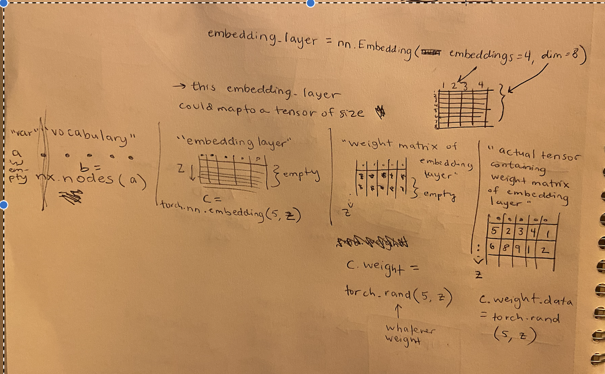

# NetworkX and PyTorch Basics

Date: December 14, 2023 12:55 PM

[CS224W | Home](http://snap.stanford.edu/class/cs224w-2020/)

[PyTorch Manual](https://pytorch-geometric.readthedocs.io/en/latest/)

[NetworkX Functions](https://www.notion.so/NetworkX-Functions-0b48ae7220284b96995de23c9950ac57?pvs=21)

**italics* indicates what is a placeholder name/replaceable

## Basics of NetworkX

```jsx
import networkx as nx
```

if our Graph is labeled as *G*…

`nx.draw(*G*, with_labels = True)` this draws the graph

`*G*.number_of_edges` or `_nodes` this returns the number

`nx.average_clustering(*G*)` returns average clustering

`*G*.nodes()` returns a keyiterator dict of the Nodes so you can easily loop it

## Basics of PyTorch

```jsx
import torch
import torch.nn as nn
import matplotlib.pyplot as plt
from sklearn.decomposition import PCA
```

**tensor** = name for a collection of numbers in dimensions; could be 0d, 1d, 2d, etc. Includes scalars (0d), vectors, matrices, and high-dimensional arrays

**embedding layer** = a secondary structure to lay on top of a tensor that logs weights/special characteristics of each number in the tensor

**embedding layer weights** = the actual numbers in the emb layer which are the extra info 

**tensor**(of your stuff) **+ embedding layer**(weighted) **= weighted tensor** (can be learned)

### Tensors and Embedding Layers! How do they relate?

example using a network of nodes in networkX

| name of what you’re cataloguing | *a* |
| --- | --- |
| contents of what you’re cataloguing | *a*.nodes() |
| how much stuff do you want to catalogue about each of these? | *dim* |
| how many things are in the catalogue | *num* = nx.number_of_nodes(*a*) |
| empty structure of of your embedding layer | *embedding_layer* = torch.nn.embedding(*num, dim*) |
| creating weight matrix for your embedding layer | torch.rand(*num, dim*) |
| assign that weight matrix to your embedding layer as the data | *embedding_layer*.weight.data = torch.rand(*num, dim*) |



### Functions:

`*embedding_layer*.weight.data.numpy()` = to convert a PyTorch tensor to a NumPy array 

`pca.fit_transform(*embedding_layer*.weight.data.numpy())` = to PCA the tensor

### Create node-embedding matrix for the graph we have:

```jsx
torch.manual_seed(1)

def create_node_emb(num_node=34, embedding_dim=16):
	emb = 0
	emb = nn.Embedding(num_node, embedding_dim)
	emb.weight.data = torch.rand(num_node, embedding_dim)
	return emb

emb = create_node_emb()
ids = torch.tensor([0, 3], dtype=torch.long)

print("Embedding: {}".format(emb))
print(emb(ids))
```

### Now, to train a model to predict the embedding layer…

STEPS:

### 1. Define the Model and Loss Function:

### Model Definition:

- Define a PyTorch model class (`NodeEmbeddingModel` in the example).
- The model should include an embedding layer (`emb`) to learn node representations

```python
class NodeEmbeddingModel(nn.Module):
    def __init__(self, num_node=34, embedding_dim=16):
        super(NodeEmbeddingModel, self).__init__()
        self.emb = nn.Embedding(num_node, embedding_dim)

    def forward(self, x):
        return self.emb(x)
```

Here is a basic breakdown of a PyTorch model class:

1. **Inheriting from `torch.nn.Module`:**
    - A PyTorch model class should inherit from the `torch.nn.Module` base class. This base class provides functionality for managing model parameters, serialization, and other useful features.
    
    ```python
    import torch.nn as nn
    class MyModel(nn.Module): def __init__(self, other_arguments): super(MyModel, self).__init__() # Define your model architecture here
    ```
    
- **Initialization in the `__init__` method:**
    - The `__init__` method is used to define and initialize the layers and components of the neural network.
    - This is where you define the layers, embedding layers, recurrent layers, etc., that constitute your model.
        - `input_size`: The number of unique tokens or categories in your input data. For example, if you are dealing with word embeddings, the input size could be the size of your vocabulary.
        - `hidden_size` ****The dimensionality of the embedding space. Each input token is represented as a vector in this space.
        - `hidden_size` for the linear layer = same as dimensionality of embeddings, because it takes the output of the embedding layer as input.
        - `output_size` for the linear layer might be 2 if you are performing binary sentiment classification (positive or negative), or it could be the number of classes for multi-class sentiment classification (e.g., 3 for positive, neutral, negative).
- **Forward Pass in the `forward` method:**
    - The `forward` method is where you specify how input data flows through the layers of your model.
    - This method is automatically called when you pass input data through an instance of your model.

```python
class MyModel(nn.Module):
    def __init__(self, input_size, hidden_size, output_size):
        super(MyModel, self).__init__()
        self.embedding = nn.Embedding(input_size, hidden_size)
        self.linear = nn.Linear(hidden_size, output_size)

    def forward(self, x):
        embedded = self.embedding(x)
        output = self.linear(embedded)
        return output
```

### Loss Function:

- Choose an appropriate loss function. In this case, `nn.BCEWithLogitsLoss()` is used, which combines sigmoid activation and binary cross-entropy loss.

```python
criterion = nn.BCEWithLogitsLoss()
```

Other loss functions:

1. **Mean Squared Error (MSE):**
    - Used for regression problems.
    - Measures the average squared difference between the predicted and actual values.
    
    ```python
    criterion = nn.MSELoss()
    ```
    
- **Binary Cross-Entropy Loss:**
    - Used for binary classification problems.
    - Measures the binary cross-entropy between the predicted probabilities and the true binary labels.
    
    ```python
    criterion = nn.BCELoss() 
    ```
    
- **Categorical Cross-Entropy Loss:**
    - Used for multi-class classification problems.
    - Measures the cross-entropy between the predicted probabilities and the true class labels.

```python
criterion = nn.CrossEntropyLoss()
```

- **Binary Cross-Entropy Loss with Logits:**
    - Similar to binary cross-entropy but more numerically stable when working with logits (raw model outputs) before applying the sigmoid activation.

```python
criterion = nn.BCEWithLogitsLoss()
```

- **Custom Loss Functions:**
    - You can also define custom loss functions based on the specific requirements of your task. For example, you might want to create a custom loss function for tasks with specific constraints or objectives.

```python
def custom_loss(output, target): # Define your custom loss calculation return loss
```

During the training process, the loss is computed for each batch of data, and the model's parameters are adjusted to minimize this loss through backpropagation and gradient descent. The choice of an appropriate loss function is critical and depends on the nature of the problem you are trying to solve.

### Optimizer:

- Choose an optimizer (e.g., Stochastic Gradient Descent - `optim.SGD`).
- Pass the model parameters and set the learning rate.

```python
optimizer = optim.SGD(model.parameters(), lr=0.01)
```

### 2. Data Preparation:

- Prepare your training data, including the training edges (`train_edges`) and corresponding labels (`labels`).
- Ensure your data is in the appropriate format, and you may want to use PyTorch DataLoader for efficient batching.

### 3. Training Loop:

- Set the number of epochs and iterate over the data.
- Forward pass the training data through the model.
- Compute the dot product between node embeddings (`dot_product`).
- Apply the sigmoid activation to obtain predictions (`preds`).
- Compute the loss between predictions and ground truth labels.
- Backpropagate the gradients and update the model parameters.

```python
num_epochs = 10
for epoch in range(num_epochs):
    embeddings = model(train_edges)
    dot_product = torch.matmul(embeddings, embeddings.t())
    preds = torch.sigmoid(dot_product)
    loss = criterion(preds, labels.float())

    optimizer.zero_grad()
    loss.backward()
    optimizer.step()
```

### 4. Evaluate Accuracy:

- Implement an accuracy function based on your task.
- Compare the rounded predictions with ground truth labels.

### 5. Print Results:

- Print the loss and accuracy for each epoch to monitor the training progress.

```python
accuracy = accuracy_function(preds, labels)
print(f"Epoch {epoch + 1}/{num_epochs}, Loss: {loss.item()}, Accuracy: {accuracy}")
```

### Important Python Basics

Initializing a Model:

By calling `super(NodeEmbeddingModel, self).__init__()`, you are essentially initializing the `nn.Module` part of your `NodeEmbeddingModel`. This is important because `nn.Module`
 provides functionality for managing the model's parameters, 
serialization, and other features. Initializing the superclass is a 
standard practice when defining a new class that inherits from another 
class in Python.