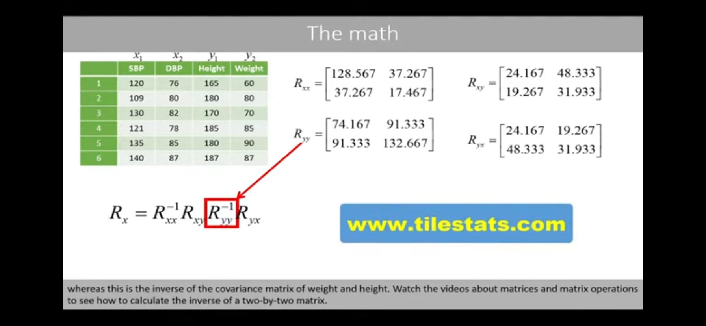
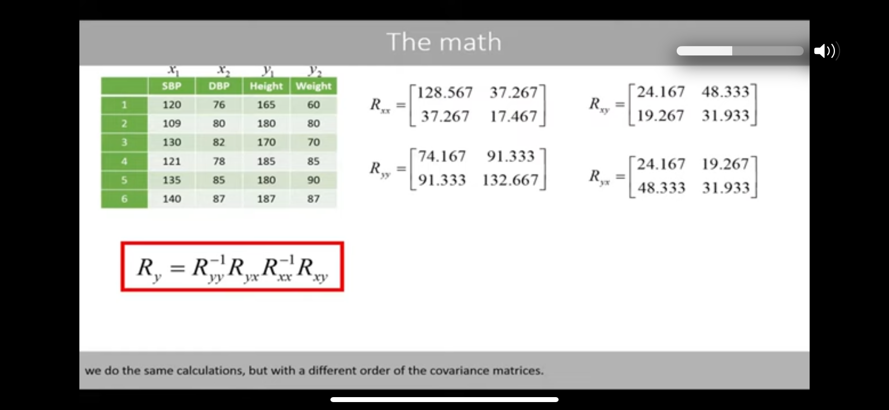
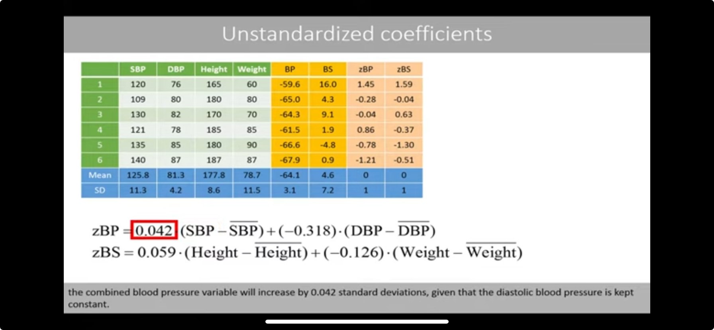
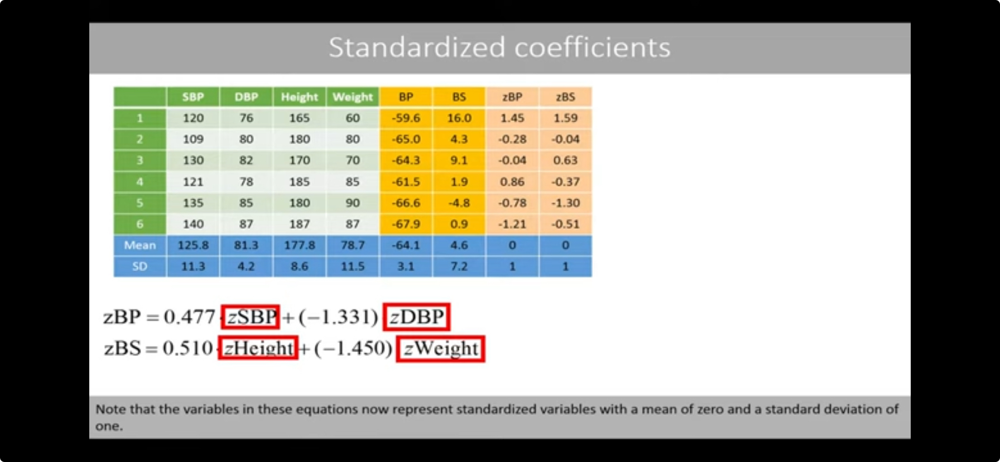
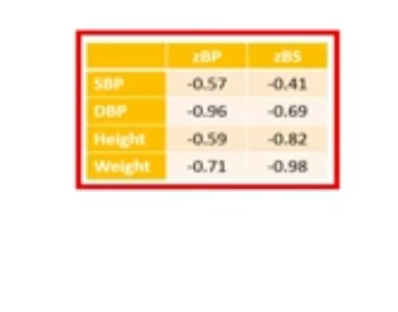
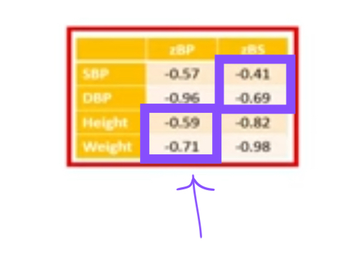
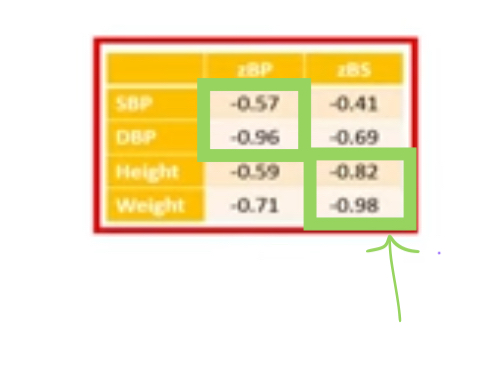
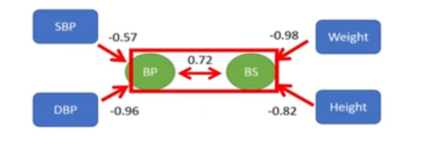

# Canonical Correlation Analysis

Date: February 5, 2024 2:15 PM

CCA is a method for determining the correlation between 2 sets of variables. 

Differs from regular correlation or pearson’s correlation, because you can have multiple vectors of values in each set. Pearson would correlation between 2 vectors of variables. This could be 3 vectors in one group and 5 vectors in the other, etc.

Essentially, it creates a weighted formula to add all of the values for one row across the vectors in each group. This allows you to then do a correlation across 2 vectors, where the 2 vectors are amalgamations of values from entire sets of data

Method for “Unstandardized Coefficients”

1. (as seen below) compute covariance matrix for x1, x2 by x1, x2
2. (as seen below) compute covariance matrix for y1, y2 by y1, y2
3. (as seen below) compute covariance matrix for x1,x2 by y1, y2
4. (as seen below) transpose that matrix to get y1, y2 by x1, x2
5. (as seen below) compute product of these 4 matrices

1. Compute eigenvectors and eigenvalues of this ^^ matrix Rx
    1. the first eigenvector holds the weights for x1 and x2
    2. the second eigenvector is irrelevant
2. the sqrt of the largest eigenvalue of this matrix Rx = the pearson correlation coefficient between the two sets of variables, 0.72
3. (as seen below) Compute the product of a different order of matrices for matrix Ry

1. eigenvectors and eigenvalues of this ^^ matrix Ry
    1. the first eigenvector holds the weights for y1 and y2
    2. don’t use the second (or other) eigenvector— this would be seen as a ‘rest’ covariate and would give you incorrect correlation coefficients
        1. unless you have a LOT of vectors/variable sets in eahc group
        2. then you could kinda take the 2nd eigenvector/value, 3rd, etc. until they’re small/residual, and look at it kind of like PCA
    3. sqrt of eigenvalue of Ry is also 0.72
2. compute the mean and standard deviation of the scores for each group (for X and Y, *not* x1x2y1y2)
3. standardize the scores by:
    1. subtracting the mean of that column from the first instance of that column (ie, X value in row 1 - mean(X)) 
    2. divide by standard deviation
    3. do that for each of the cells
4. rescale the weights for the weighted equation
    1. divide the original weights for X cols (weight for x1x2, found by the above matrices calculation and the eigenvector) by the standard deviation of the X column
    2. divide the original weights for Y col s(weight for y1y2, found by the above matrices calculation and the eigenvector) by the standard deviation of the Y column

1. Interpret the coefficients
    1. for example the coefficient for x1 aka SBP is 0.042, which means that if the SBP raises by 1 (say 120 to 121), the total score for X (aka weighted x1+x2) would increase by 0.042 standard deviations, given that the x2 variable (aka DBP) remains constant
    
    
    

Method for “Standardized Coefficients”

1. Standardize the scores before doing the correlation matrices
2. Do the above process step 1-10
3. (as seen below) interpret the (different) coefficients
    1. If you increase the zx1 variable (aka SBP) by one standard deviation the standardized combined blood pressure will be increased by 0.477 standard deviations, given that the zx2 variable (aka DBP) is kept constant
    
    
    

Loadings:

- (as seen below) Table of standardized correlation coefficients for each of the 4 variables (x1x2 y1y2) to the two **sets/groups** of variables (X and Y)
    
    
    
    - Interpret the coefficients, aka Loadings:
        - if we would calculate the Pearson correlation coefficient between the x1 values (aka SBP) and standardized X-set (weighted x1 + x2) values (aka zBP), the correlation coefficient is -0.57

- these values might be negative, even though they’d actually add to the group value positively
    - this happens when the correlation of X and Y is positive

**“Cross-Loading”** = in CCA, the pearson correlation coefficient between each variable and the *Other* grouped set, ie the group of variables it’s not a part of and is theoretically independent from (means the amount the one variable influences/correlates with the other whole set)

- this method is not the best for showing variable relationship

- these values might be negative, even though they’d actually add to the group value positively
    - this happens when the correlation of X and Y is positive

**”Canonical Loadings”** = in CCA, the pearson correlation coefficients between each variable and its’ corresponding grouped set, the sum set of variables that it adds to in a weighted form (dependent relationship) (means the amount to which it influences that group set) 

- this method is not the best for showing variable relationship

Interpretations

- if you want to make real-life conclusions about how x1 is related to X or Y, just go back to the basic correlation matrix
- These loadings can be interpreted similar to PCA analysis
- Can create this kind of figure (see below), to show how the variables and groups correlate with each other
    
    
    
    - Mostly use the two groups correlation, 0.72