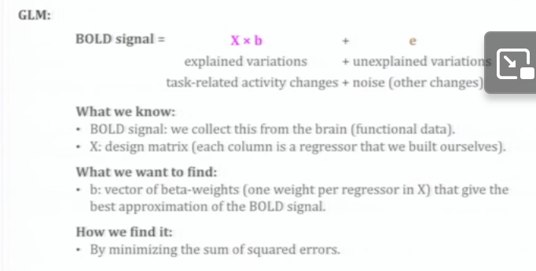

# General Linear Model for Analyzing fMRI Data

Date: December 20, 2023 10:05 AM

From this course: [General Linear Model for Analyzing fMRI Data](https://www.youtube.com/playlist?list=PLyGKBDfnk-iA2c90e62zJTwIrCh7T1Y_I) by Idan Blank

Summary: Theoretical and conceptual basis for General Linear Model fMRI analysis on a single participant, how to execute it in matlab

Example Experiment

Question: which brain regions are engaged in the decoding of semantics, syntax and meaning from sentences?

Test: Reading sentences

Control: Reading nonwords with the same number of words as the sentence

Basic T-test:

T = experiment signal, the brain signal during test condition

C = control signal, brain during control condition

t = mean(T) - mean(C) 

           noise                       

noise = standard deviation ish, based on SSE

want to get a T value that is very big

Predicting signal:

- time series during task vs nontask, convolved to replicate the BOLD signal

Comparing signals:

called “predictors”:

- function of baseline (straight line)
    - beta 1
- function of what you expect a voxel’s BOLD signal  to look like if it’s activated by the system you’re looking for
    - beta 2
- function of what you expect a voxel’s BOLD signal  to look like if it’s not activated by system you’re looking for
    - beta 3

This is the X matrix

- add these three functions together at different weights to approximate what you see in that voxel signal
    - say weight = w for each
    - this weighted sum = appx signal of that voxel
        - b1w1 + b2w2 + b3w3 = approximation(v)
    - difference in weights between nonword signal vs word signal, show you how likely its part of a language system or no
        - w2 - w3
        - comparison of betaweights is called a ‘**contrast**’
            - formally, a vector indicating which beta weights we are interested in
- difference between approximation of that voxel and real signal of that voxel is error
    - signal(v) - approximation(v) = error(v)
        - positive error = your approximation is below the real signal, neg error = your appx is above the real signal

GLM:

Formula: 

b = regress(BOLD_signal, X)

Noise minimization- add more predictors which are approximations of noise functions:

- adds a matrix of potential head movement
- adds a matrix of time derivatives
- etc. other movement/noise functions
- can add these to approximate the signal better