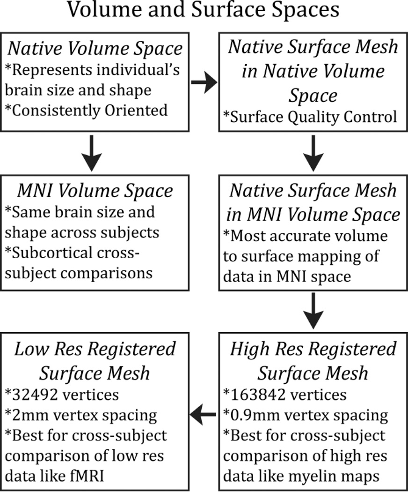
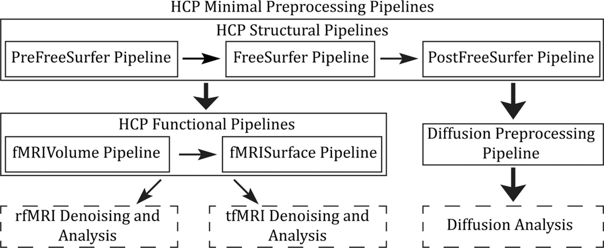
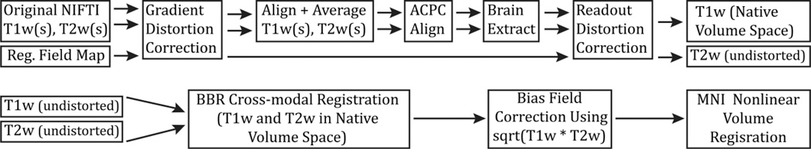

# Using HCP Pre-Processing Pipeline for fMRI Data

Sources: Glasser/HCP Preprocessing
[A multi-modal parcellation of human cerebral cortex](https://www.nature.com/articles/nature18933)
[The Minimal Preprocessing Pipelines for the Human Connectome Project](https://www.ncbi.nlm.nih.gov/pmc/articles/PMC3720813/)

**other common pre-processing pipeline is fMRI Prep

### Function of the Preprocessing Pipeline

1) To remove spatial artifacts and distortions

2) To generate cortical surfaces, segmentations, and myelin maps

3) To make the data easily viewable in the Connectome Workbench visualization software

4) To generate precise within-subject cross-modal registrations

5) To handle surface and volume cross-subject registrations to standard volume and surface spaces

6) To make the data available in the CIFTI format in a standard “grayordinates” space (see below)

### Benefits of the Preprocessing Pipeline

- Combines information from architecture, function, connectivity and topography to parcellate
    - complementary and confirmatory information
- Allows greater computational efficiency from 100,000 voxels to 50-200 ROIs, to enable large-scale research projects with fMRI data
- Combines literature-documented areas/ROIs and automated algorithmic approaches
- Aligned cortical data using myelin content and rs networks, instead of cortical folding alignment, which are ‘more closely tied to cortical areas’

### Data:

Three surface spaces in HCP data:

1. The native surface mesh for each individual (~136k vertices/voxels, most accurate for volume to surface mapping)
2. The high resolution Conte69 registered standard mesh (~164k vertices, appropriate for cross-subject analysis of high resolution data like myelin maps) 
3. Low resolution Conte69 registered standard mesh (~32k vertices, appropriate for cross-subject analysis of low resolution data like fMRI or diffusion).

- The 91,282 standard grayordinates (CIFTI) space is made up of a 
standard subcortical segmentation in 2mm MNI space (from the Conte69 subjects) and the 32k Conte69 mesh of both hemispheres/

### Software:

---

## **Structural Pipeline**

### PreFreeSurfer Pipeline

***produce an undistorted “native” structural volume space for each subject (used for tractography, most accurate to physical brain)***

1. Correct for gradient nonlinearity distortion using a customized version of the `gradient_nonlin_unwarp` package available in FreeSurfer
2. calculates an FSL-format warpfield that represents the spatial distortion of the image by using a proprietary Siemens gradient coefficient file (available on the scanner used to acquire the images) and the mm coordinate space of the image (including the rotation between image matrix space and scanner axes – that is, the oblique portion of the sform, where the sform is the matrix that relates the voxel coordinates to the mm coordinate space of the scanner, as defined by the NIFTI standard).
3. Align with a 6 degrees of freedom (DOF) rigid body transformation using FSL’s `FLIRT`
4. For greater robustness, the images are internally cropped to a smaller FOV to remove the neck (150mm in z in humans,) using FSL’s automated `robustfov` tool, and aligned with a 12 DOF (affine) `FLIRT` registration to the MNI space templates

***align the T1w and T2w images***

1. "ACPC alignment step”: 
    1. Align to the MNI space template (with 0.7mm resolution for the HCP data) using a rigid 6 DOF transform (aligns the AC, the AC-PC line and the inter-hemispheric plane)
2. `robustfov` used to make sure reg is robust and transform is applied with spline interpolation
3. Robust initial brain extraction is performed using an initial linear (`FLIRT`) and non-linear (`FNIRT`) registration of the image to the MNI template
4. This warp is then inverted and the template brain mask is brought back into the acpc-alignment space
5. Removing readout distortion:(corrected by the same means as EPI distortion)”
    1. For fieldmap preprocessing, a standard gradient echo fieldmap, having two magnitude images (at two different TEs) and a phase difference image, is converted into fieldmap (in units of radians per second) using the `fsl_prepare_fieldmap` script. 
    2. Then the mean magnitude and fieldmap images are corrected for gradient nonlinearity distortion (just as for the T1w and T2w images). 
    3. The fieldmap magnitude image is warped according to the readout distortion and registered, separately, to the T1w and T2w images using `6 DOF FLIRT`.
    4.  The fieldmap is then transformed according to these registrations and used to unwarp the T1w and T2w images, removing the differential readout distortion present in them.
    
    *→ This outputs the subject’s "undistorted native volume space"*
    

***Perform a B1 (bias field) correction***

(Bias field *F* is estimated from the square root of the product of the T1w and T2w images after thresholding out non-brain tissues)

1. Dilating the thresholded bias-field estimate (*F*) to fill the FOV
2. Bias field smoothed with a sigma of 5mm

***Register the subject’s native structural volume space to MNI space** (*useful for comparison across subjects)

1. Registered to MNI space with a FLIRT 12 DOF affine and then a FNIRT nonlinear registration
→ Producing the final nonlinear volume transformation from the subject’s native volume space to MNI space

- Output
    - T1w folder: native volume space images    
    - MNINonLinear folder: MNI space images

### *FreeSurfer* Pipeline

Run FreeSurfer `recon-all`

****limitation of recon-all: cannot handle images of higher than 1mm isotropic resolution or structural scans of greater than 256 × 256 × 256 voxels → downsample to 1mm isotropic (RAS) space aka “FreeSurfer space”****

Output:

1. To segment the volume into predefined structures (including the subcortical parcels used in CIFTI)
2. Reconstruct white and pial cortical surfaces
3. Perform FreeSurfer’s standard folding-based surface registration to their surface atlas (fsaverage)

### *PostFreeSurfer* Pipeline

1. Take the outputs of FreeSurfer that are in FreeSurfer proprietary formats and convert them to standard NIFTI and GIFTI formats

    **NIFTI**
    1. The three full subcortical volume parcellations are converted to NIFTI label files
    
    **GIFTI**
    1. The white, pial, spherical, and registered spherical surfaces are all converted to GIFTI surface files
    2. Thickness, curvature, and sulc are all converted to GIFTI shape files
    3. The three FreeSurfer cortical parcellations are converted to GIFTI label files 
    4. One of these volume parcellations, the wmparc, is binarized, dilated three times and eroded twice to produce an accurate subject-specific brain mask of grey and white matter, which serves as the final brain mask that is used in any subsequent functional or diffusion processing.
2. Return data to the native volume space from the FreeSurfer 1mm RAS space

→ These steps produce all of the NIFTI volume and GIFTI surface files necessary for viewing the data in Connectome Workbench,

**Anatomical Masks**
1. Applying the surface registration (to the Conte69 surface template ([Van Essen et al., 2012b](https://www.ncbi.nlm.nih.gov/pmc/articles/PMC3720813/#R61)))
2. Downsampling registered surfaces for connectivity analysis
3. Creating the final brain mask
4. Creating myelin maps.

---

## **Functional Pipelines**

### fMRIVolume Pipeline

*Preparation for fMRIVolume Pipeline**:** Completion of HCP structural pipelines (PreFreeSurfer, FreeSurfer, and PostFreeSurfer). Correction of gradient-nonlinearity-induced distortion.*

- **Motion Correction:**
    - Realignment of timeseries to correct for subject motion with 6 DOF `FLIRT` registration.
    
    → Output of motion parameters in a twelve column text file.
    
- **Distortion Correction:**
    - Correction of distortion in phase encoding direction using `fieldmap` or spin echo EPI scans.
    - Alignment of distorted spin echo EPI images to distorted gradient echo EPI single-band reference image.
    - Concatenation of registration with topup-derived distortion field for undistorting fMRI images.
- **Registration to T1w Image:**
    - Registration of single-band reference image to T1w image using `FLIRT` with `BBR cost` function and `BBRegister` for fine tuning.
- **Final Steps:**
    - Concatenation of all transforms for each registration and distortion correction into a single nonlinear transformation.
    - Transformation of each fMRI timepoint directly to MNI space with single spline interpolation.
    - Removal of bias field calculated from structural images.
    - Masking of data by final brain mask from PostFreeSurfer pipeline and normalization to a 4D whole brain mean of 10000.

→ **Outputs:**

- NIFTI volume timeseries in MNINonLinear/Results/fMRIName in 2mm MNI space.
- Single-band reference image in 2mm MNI space.
- Jacobian file representing intensity modulations of distortion correction.
- Original and demeaned/de-trended motion parameters for conventional volume-based fMRI analyses.

### fMRISurface Pipeline

- **Partial Volume Weighted Ribbon-Constrained Volume to Surface Mapping:**
    - Use of white and pial surfaces to define grey matter ribbon.
    - Calculation of weighted average intensity for each surface vertex.
    - Handling of voxels partially inside grey matter ribbon.
- **Exclusion of Voxels with High Coefficient of Variation:**
    - Exclusion of voxels with locally high coefficient of variation.
    - Masking of brain voxels not excluded by coefficient of variation threshold.
- **Surface Timeseries Resampling:**
    - Resampling of surface timeseries from high-resolution native mesh to registered downsampled 32k_fs_LR mesh.
    - Masking of medial wall vertices.
    - Smoothing of fMRI timeseries on surface (2mm FWHM).
- **Geodesic Gaussian Surface Smoothing Algorithm:**
    - Calculation of geodesic distance for each vertex.
    - Correction for differences in triangle areas associated with each vertex.
    - Multiplication of weights by vertex area within each smoothing kernel.
- **Volume Voxels Resampling:**
    - Resampling of volume voxels onto standard mesh for corresponding voxels across subjects.
    - Parcel-constrained atlas smoothing/resampling process.
    - Combination of surface and subcortical volume timeseries into a single data matrix.
- **Output:**
    - CIFTI dense timeseries representing grey matter timeseries data.
    - Regeneration of hemisphere surface and parcel-constrained subcortical volume timecourses from CIFTI dense timeseries using Connectome Workbench’s commandline utilities.

**Diffusion Analysis**

- **Intensity Normalization and EPI Distortion Estimation:**
    - Normalization of mean b0 image across six diffusion series.
    - Use of phase encoding direction reversed b0 pairs to estimate EPI distortion.
    - Estimation of distortion field using "topup" tool in FSL5.
- **Distortion Correction and Motion Estimation:**
    - Correction of distortions and estimation of eddy-current induced field inhomogeneities and head motion using Gaussian Process predictor.
    - Correction of distortions in single resampling step using "eddy" tool in FSL5.
- **Gradient Nonlinearity Correction:**
    - Calculation of gradient nonlinearity correction warpfield for diffusion data.
    - Distortion correction of mean b0 image.
    - Calculation of effects of gradient nonlinearity on diffusion encoding magnitudes and directions.
- **Order of Corrections:**
    - Explanation of the order of distortion corrections within the diffusion pipeline.
- **Registration to Structural Space:**
    - Registration of mean b0 image to T1w structural image using boundary-based registration.
    - Transformation of diffusion data to native structural volume space.
    - Masking of data with final brain mask from PostFreeSurfer.
- **Transformation of Gradient Vectors and Field Tensor:**
    - Rotation of gradient vectors according to rotational component of b0 to T1w registration.
    - Transformation of gradient field tensor using b0 to T1w registration.
- **Visualization and Further Analysis:**
    - Visualization of diffusion data with structural space surfaces and images in Connectome Workbench.
    - Potential use of structural space diffusion data for fiber orientation estimation with FSL’s multi-shell spherical deconvolution toolbox.
