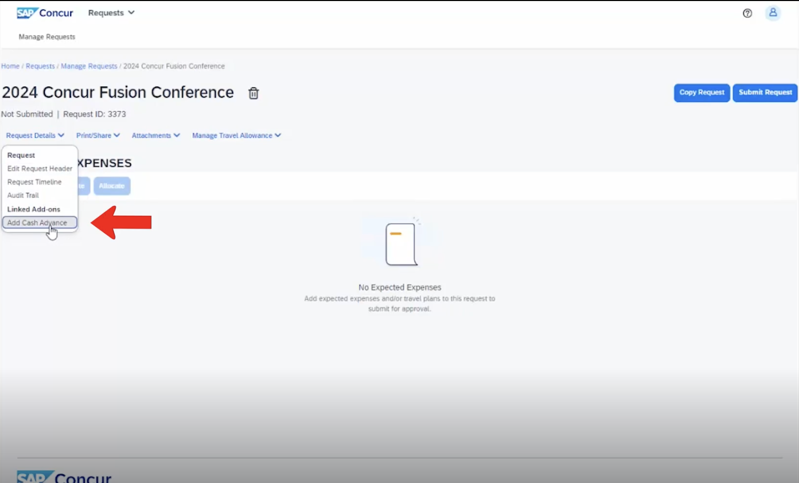
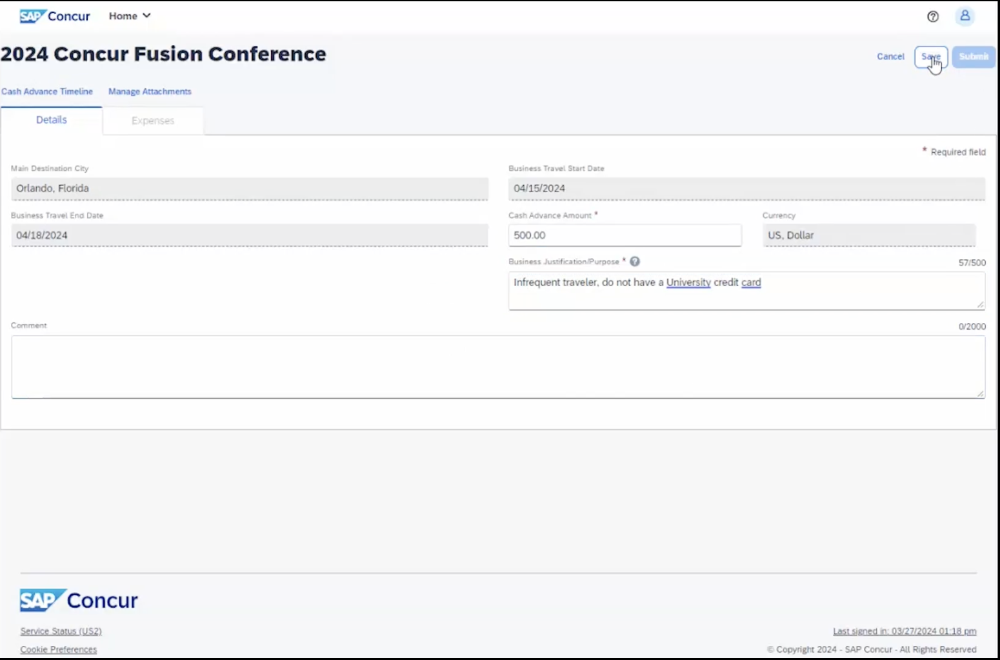
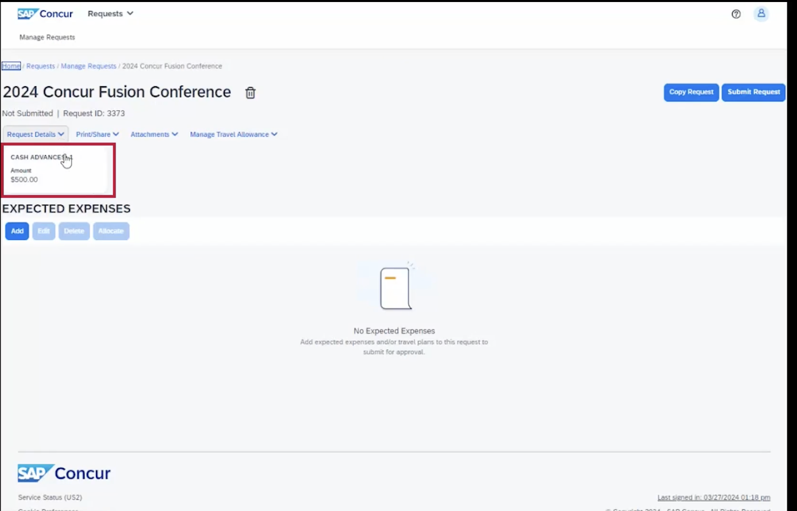

# Cash Advances
Cash advances are direct deposits into your linked bank account/reimbursement location in Concur. These are requested for a particular approved trip. It is often used to request the per-diem amount for the city you're travelling to. Then, you can get that money deposited into your account without having to pay out of pocket and wait for reimbursement. Any cash advance over $100/day needs special approval. 

You should request the cash advance **at the time of the pre-travel request**, at least a few weeks before your trip, and it will be deposited 2 weeks before your trip. You can try to submit it within 2 weeks of leaving, it's just not guaranteed that it will be approved/deposited. 

If you have already created and submitted the pre-travel request, you will not be able to add cash advances later. In order to add cash advances later you will have to delete your pre-travel request and make a new one. 

# Creating and editing a cash advance in Concur

## 1. Open SAP Concur
- Go to my.rutgers.edu
- Go to 'Apps'
- Select 'Concur Travel & Expense'

## 2. If you haven't already made a pre-travel request, follow [this tutorial](./travel) to do so

## 3. Create cash advance
Once you have created your travel request under the request details, in the drop down select Add Cash advance.

You'll notice that the main destination city, business travel start date, and business travel end date autocopy from your request header.

Enter the cash advance amount that you believe that you'll be needing and enter a justification as to why you're requesting a cash advance and click Save.

## 4. Confirm and see approval
You'll know you've successfully attached a cash advance because the cash advance box will now appear underneath the request details.

If at any point you need to edit or delete the cash advance, simply click on the cash advance box.
You can adjust your cash advance amount up or down, or edit your comments.
Or if you wish to delete the cash advance as it's no longer needed, simply click on the trash can next to the request name, confirm that you would like to delete it, and will detach and delete from your travel request.

## 5. Get money
If you
