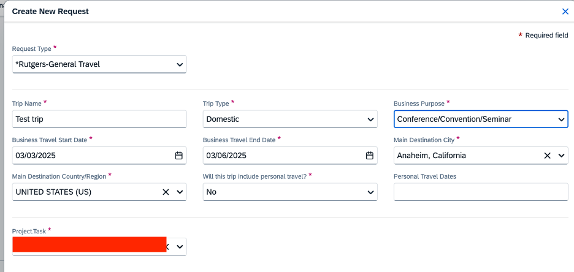

# Create a Pre-travel Request
Date: April 28, 2025 1:55 PM

## **Timeline**:
0. Make sure you have your personal cards set up in Concur (if not, follow this tutorial: [Adding Your Card to Concur](https://holmeslab.github.io/holmeslab/docs/Admin/add-card-to-concur))
1. Create & submit a travel request in Concur for your dates, estimated expenses, per diem, etc.
    1. The purpose of this is for your finance office to approve that your account has the funds necessary to fund this trip, not for the office to look for reimbursable expenses, etc.
2. The finance approver (for Holmes Lab it’s John Nguyen-Cleary's office) has only 24 hours to look over and reject the travel request (will only reject it in extreme circumstances, when your lab has no funds or something)
    1. If he doesn't review within 24 hours, they are automatically approved. This is because with the Concur system, you are only offered travel options that are already compliant with university policy. His review is basically to check allowability on the identified funding source. But we don't hold up travel reservations due to the risk of losing seat-holds, etc., and because we can always transfer expenses after the fact if they are applied to the wrong funding source.
3. After your request is approved OR after 24h from submission, you can go into Concur and book your hotels/flights

* If your trip expense report (applying for reimbursement after the trip has finished) is within 10% of the original approved ‘Expected Expenses’, your reimbursement will be approved and submitted automatically!

## **Tutorial**

### 1.  Go to my.rutgers.edu and login, click “Apps” and click “Concur Travel & Expense”, or go to [https://us2.concursolutions.com/home](https://us2.concursolutions.com/home)
### 2. Click ‘Start a Request’

### 3. Enter in trip/lab information
**Fill in purchasing codes (use study codes if it was for a study, otherwise ask RA): [Purchasing codes folder at this link](https://rutgers.box.com/s/8ly56weil3wey89dd6n6hw3eoaid06x9)**
(Password to this file is the Holmes Lab general password, ask RA if you don't know it)

### 4. **Adding flights and other expenses:** 

1. Select the item you’d like to add
    - Fill in the boxes with estimates of the costs of these items
        1. You can look at flights/hotels on Concur for those dates to create estimates, but do not book them yet!
        2. The benefit of doing a close estimate is that if your reimbursement request post-trip is within 10% of your Pre-Travel Request, your reimbursement will be auto-approved. But it does **not** need to be within 10%, you can put estimates and your actual expenditure may be different.

### 5. **Adding Attachments**

When adding attachments, add things that will help justify your expenses to your business manager. There are no required documents/attachments, but things like conference agendas, meeting plans, screenshots of flight costs and hotel costs, etc. may help the finance office approve your travel request quicker / without sending it back to you for more information.

### 6. **Adding Per Diem**
1. Click ‘Manage travel allowance’ > ‘Add Travel Allowance’
2. Add in your city or cities in your trip, and your start and end locations/times
3. It will automatically calculate your per-diem amounts based on the city you chose and which days are travel days (travel days are only 75%)
    1. If there are days where you’re doing personal travel, exclude those days/meals by checking the box

Per diem notes (automatic):
- When the trip includes more than one location and the cities involved have different per diem rates, the rate for each day (beginning at 12:01 am) is the rate for the location where the traveler obtained lodging that night
- The per diem must be reduced to prorate for provided meal(s) included with a hotel rate or at a meeting or conference
- The per diem rate must be prorated for the date of departure and date of return at 75% of the per diem rate.

