# Submitting Travel Reimbursements in Concur
---
**Table of Contents**
1. TOC
{:toc}
---
Date: April 28, 2025 1:12 PM

🚨 Make sure you have your personal cards set up in Concur (if not, follow this tutorial: [Adding Your Card to Concur](https://holmeslab.github.io/holmeslab/docs/Admin/add-card-to-concur))

## 1. Fill in trip information

1. Create request  
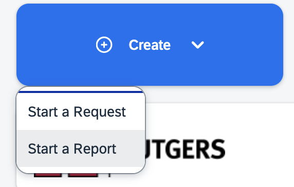
2. Click **“create from an approved request”** and LINK it to your **pre-travel request**
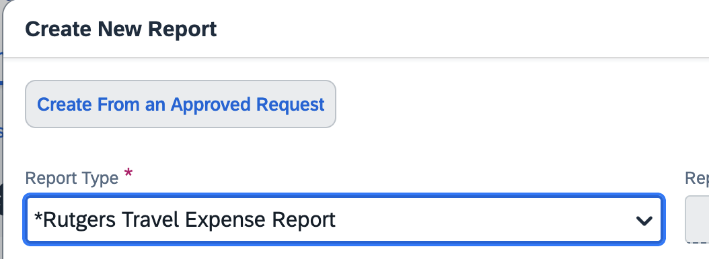
### 3. Fill in purchasing codes (use 'Start Up' codes unless otherwise directed): [Purchasing codes folder at this link](https://rutgers.box.com/s/8ly56weil3wey89dd6n6hw3eoaid06x9) 
(Password to this file is the Holmes Lab general password, ask RA if you don't know it)
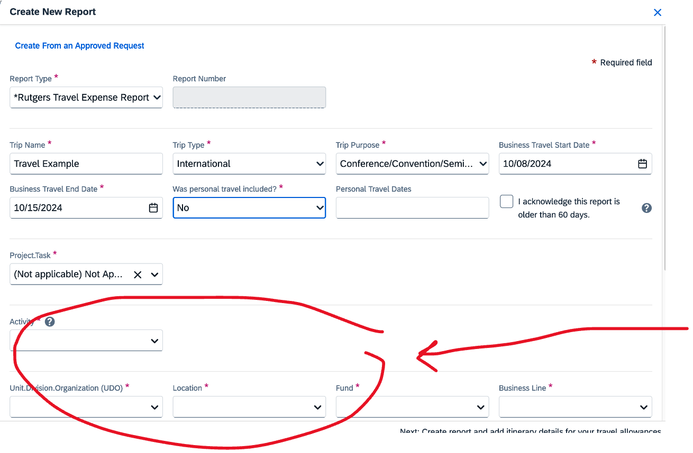

## 2. Add per-diem expenses 
Fill in destinations (if not autofilled from your pre-travel request)
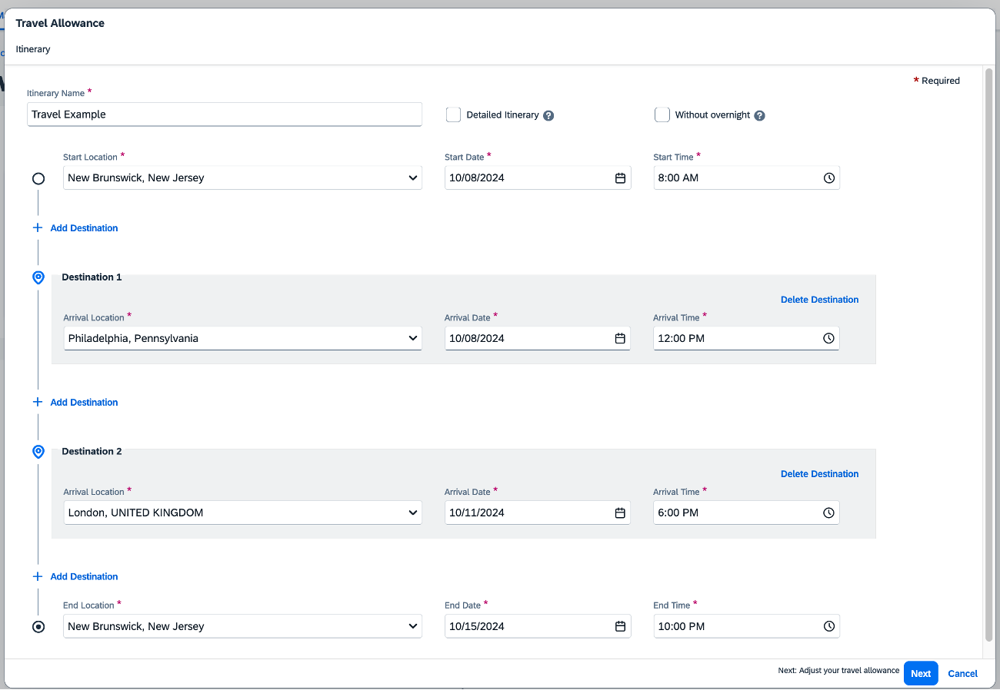
- If your report is still missing a travel allowance, you can add it here:
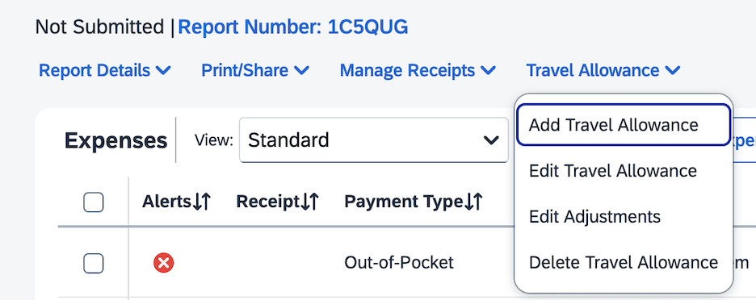

### Select meals to EXCLUDE from reimbursement -- ie what days, if any, meals were provided FREE to you by the conference/seminar, and you would like to NOT ask for reimbursement  (if not autofilled from your pre-travel request)
-  Breakfast is 20% of daily per-diem amount, lunch is 40% and dinner is 40%.
    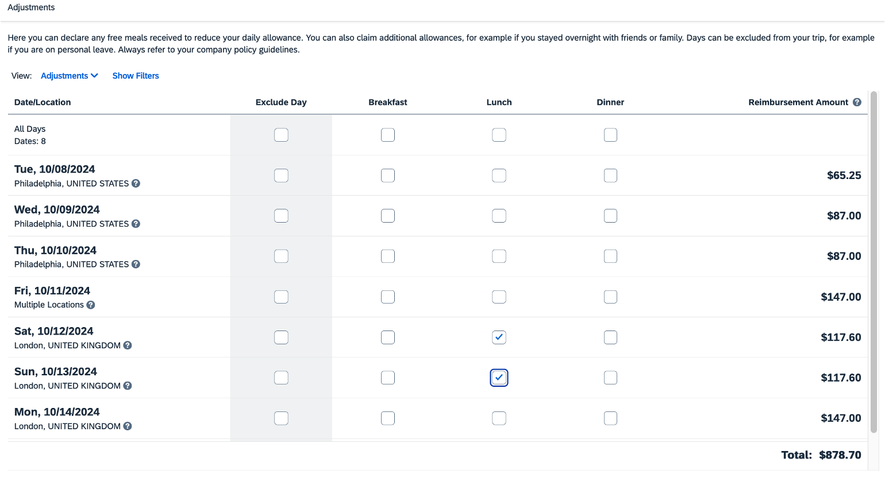
    
## 3. Add expenses
*For ‘what is reimbursable’, go to section 4.5*
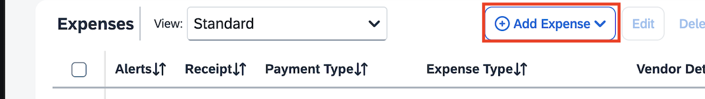

### Fill in all fields
For specific item examples, go to that section (hotel/lodging, mileage, airfare)
    
#### Documentation & Receipt
- A final original receipt/proof of payment must be provided for each expense
- The supporting documents must indicate the date, individual’s name, amount paid, payment method, and last 4-digits of credit card (if paid by card)
- If a receipt does not include all required information, a credit card statement must also be provided as proof of payment (unrelated information may be redacted)
- For lodging, the hotel folio (received upon checkout) with itemized charges and $0 balance must be provided
- A Lost Receipt Certification Form must be completed for any missing receipts
- If a receipt indicates another individual’s name, the employee requesting reimbursement must obtain a memo from the person named on the receipt authorizing reimbursement to the employee

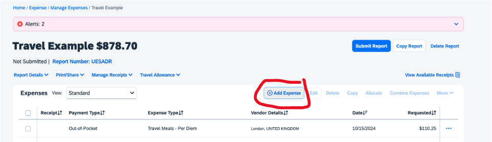

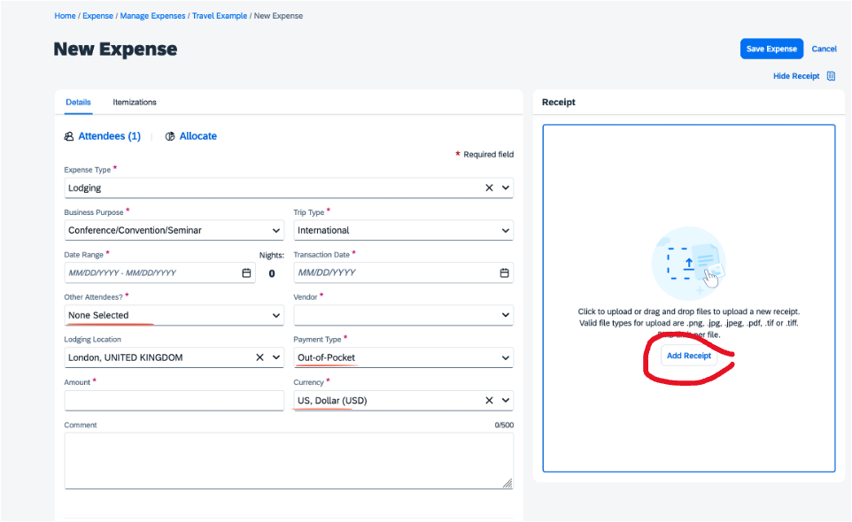

## 4. Add lodging expenses
- Make sure to upload an *itemized* receipt for lodging, so that the different expenses (nightly room cost, taxes, any room charge, etc) are all listed in separate lines (more info
- If your hotel vendor is not an option in the 'Vendor' list, contact your lab manager or University Procurement Services
1. Itemizing receipts
- Add room and taxes
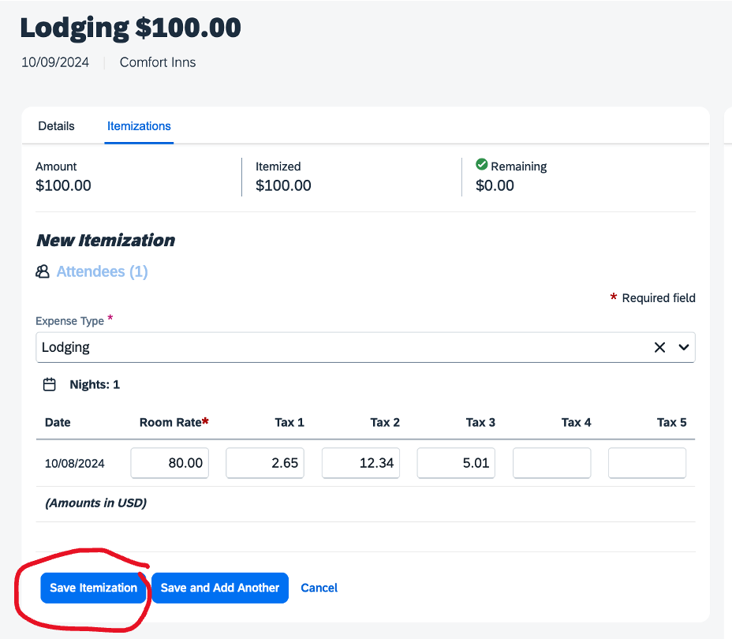
    
- If you have other line items other than room rate and taxes (for example: valet/car parking, wifi payment, etc.), add it in a new itemization by clicking "Save and Add Another" & selecting a new "Expense Type"
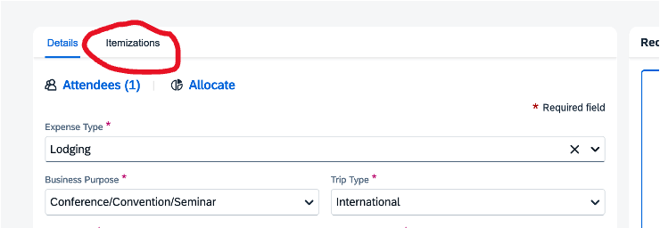

## 5. Adding car mileage

1. Select type of mileage:
- Local = driving around within conference area
- Mileage in-lieu of Air = driving instead of flying to destination
- Travel Mileage = Travel between destinations

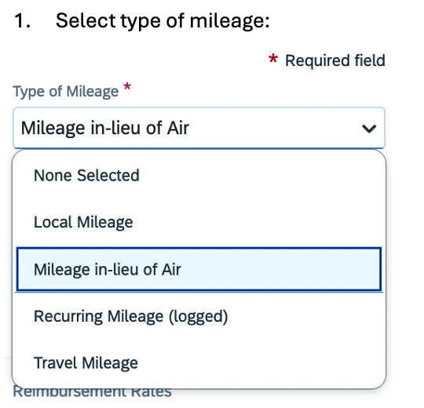

b. Add in your general information

c. Select “Mileage Calculator”

1. Add in your destinations/addresses. This will calculate mileage for you
2. Select 'Make Round Trip' if you went there & back
3. Then press 'Add Mileage to Expense'

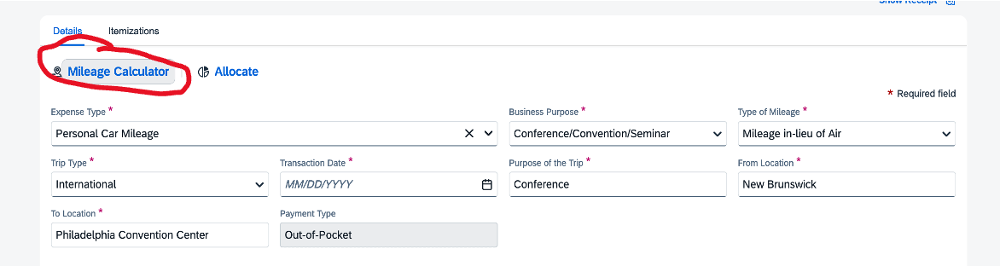

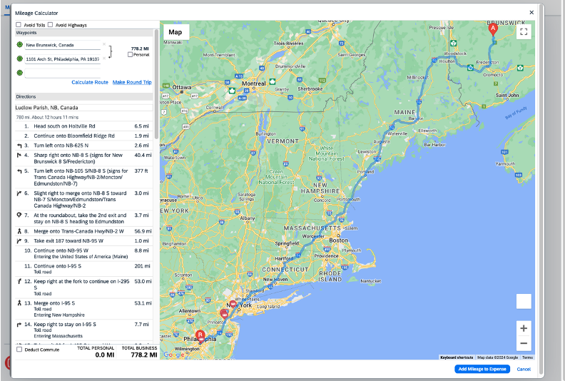

## 6 Adding flights

- If you've done a 'Pre-Travel Request' for this trip including airfare, your flight should be in the system, and you then add it to your expense report
- Even though Rutgers already paid for it, they still want you to add it to a report, so make sure its linked to your report and shows up as an expense. If it’s not linked, you can add it as an expense, listing cost and a screenshot of your booking. Concur just won’t reimburse you for it since it was paid by Rutgers already
- NOTE: For overnight travel, reimbursement may generally be provided for up to one day before and one day after the start/end of the conference.
- Any additional costs resulting from combining personal travel with University business travel are the responsibility of the traveler. If extending travel for a non-business reason (on either the front or back end), a comparison transportation quote is required to confirm if any additional cost was incurred. Contact UPS for further details (contact info below).
