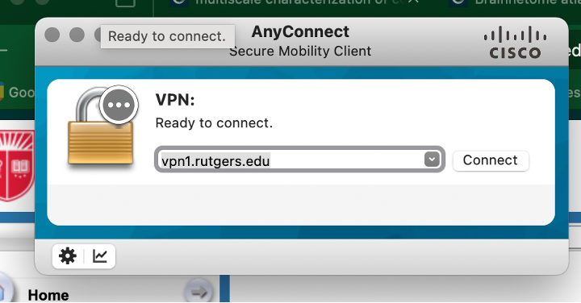
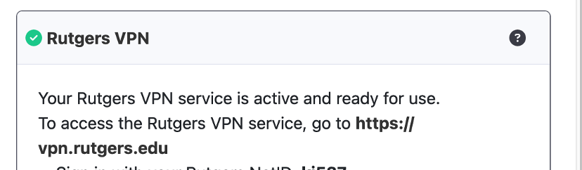
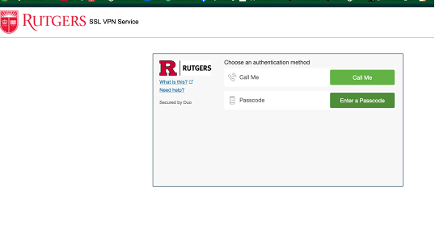
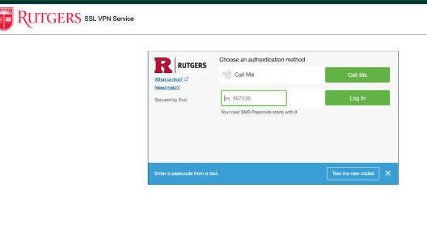
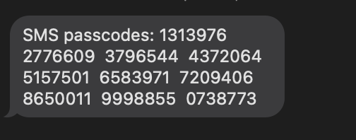
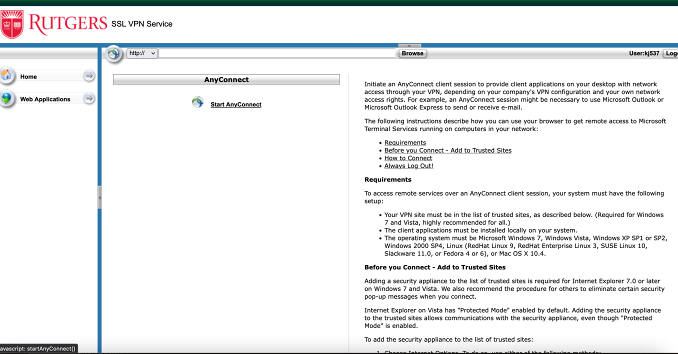
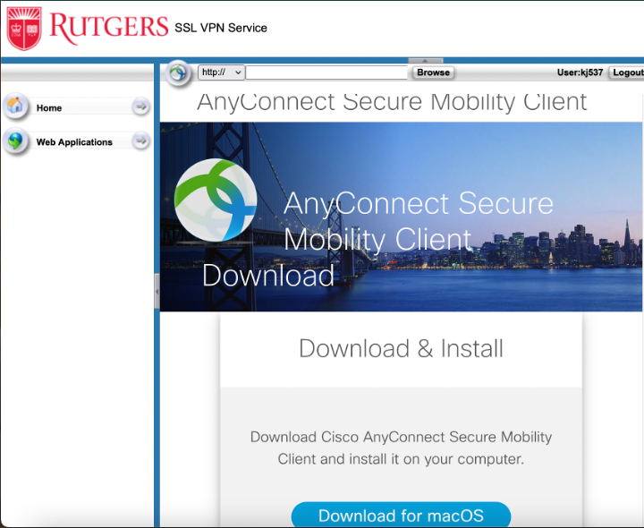

# Connecting to Rutgers VPN

Date: April 20, 2025 10:12 PM

- *If you’re connecting for the first time, scroll down to “Downloading VPN” section on page 3

**CONNECTING TO RUTGERS VPN:**

1. Open Cisco AnyConnect Secure Mobility Client app
2. Enter this URL & press “Connect”

1. Enter
    1. Username: enter your NetID
    2. Password: enter your NetID password
    3. Second password: enter the next password from the 10 duo passwords you were sent
        1. If you’re out of Duo passcodes, go to step 5
    4. Press “OK”
2. If it connects, you’ll see a message like this in the top right corner of your screen:

1. If it doesn’t work, try using the next Duo passcode.
2. How to get new Duo Passcodes:
    1. Enter your NetID & NetID password like usual into the Cisco AnyConnect Secure Mobility Client app, but where it says ‘Duo Action’, type “sms” (no quotation marks)
    2. You’ll get a text like this:
    3. Copy these codes to a safe place to save

**CONNECTING / DOWNLOADING VPN APP FOR THE FIRST TIME**

1. Go to [Tools Self-Service Rutgers](https://tools.rutgers.edu/manage/services)
    1. Scroll down to the box that says “Rutgers VPN” and press “Activate VPN”

1. Go to [https://software.rutgers.edu/product/3605](https://software.rutgers.edu/product/3605) and download the appropriate software for your computer
2. On this page, press “Enter a Passcode” button

1. Press “Text me new codes”

And enter your phone number

1. You’ll get a text like this:

1. Copy the first code (ie in the example message it would be “1313976”)
2. Enter this into the website and press “Log In” OR go to vp1.rutgers.edu
    1. Username = your netID (ie kj537 NOT kj537@rutgers.edu)
    2. Password = your netID password
    3. Duo action: your first code from your text, for example “1313976” from above text
    4. NOTE: If you don’t have any duo action codes or they don’t work, in the “duo action” box type ‘sms’ (no quotes) and hit ‘enter’. It should text you 10 new codes. Use the first one.
3. When you get in, you should get to a page that looks like this. Press “Start AnyConnect”

1. This should bring you to a page like this. Press “Download” (for whatever Operating System you have) and download the app **Cisco AnyConnect Mobility Client Secure** to your computer

Install the package. Detailed instructions here (start at Step 4): [https://www.cisco.com/c/en/us/support/docs/smb/routers/cisco-rv-series-small-business-routers/smb5642-install-cisco-anyconnect-secure-mobility-client-on-a-mac-com-rev1.pdf](https://www.cisco.com/c/en/us/support/docs/smb/routers/cisco-rv-series-small-business-routers/smb5642-install-cisco-anyconnect-secure-mobility-client-on-a-mac-com-rev1.pdf)