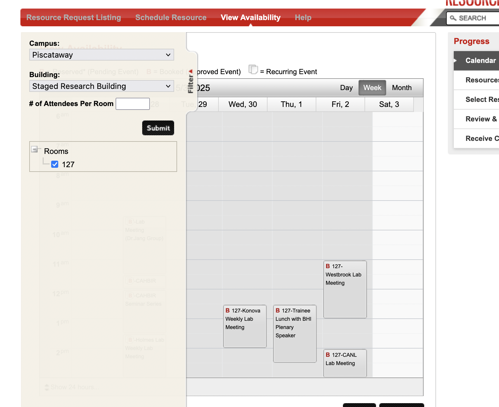
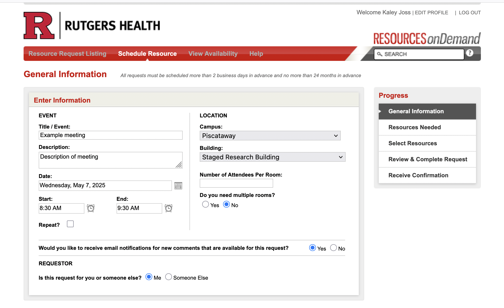
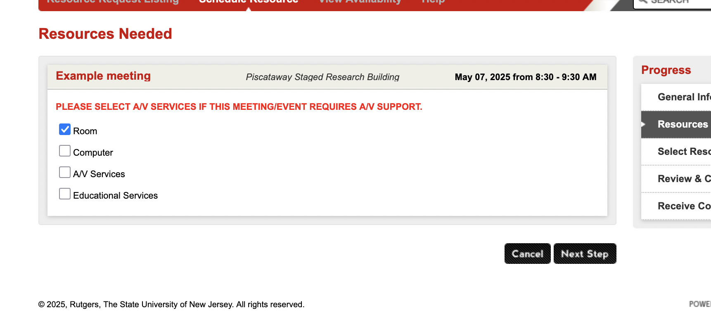
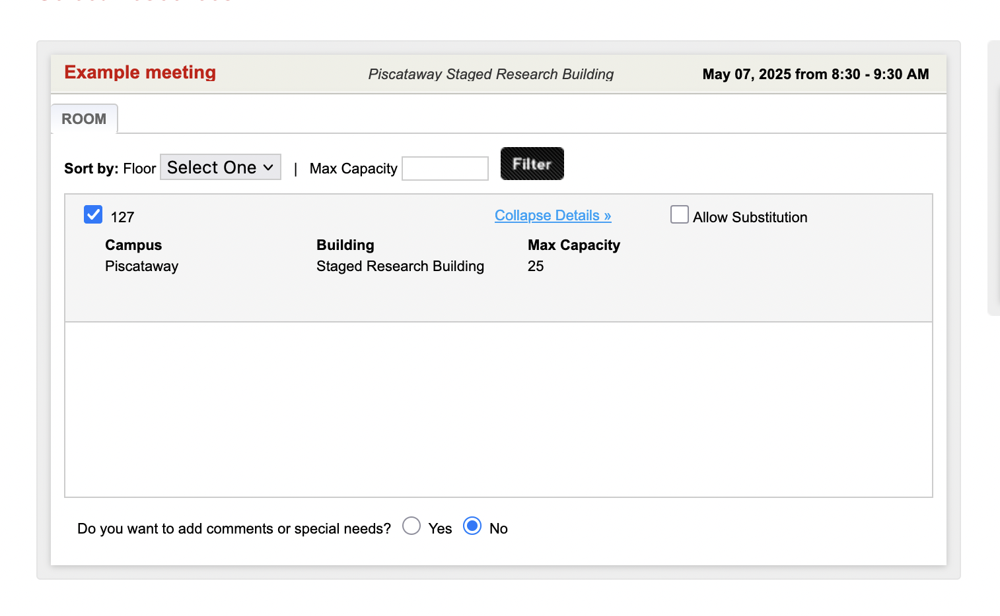
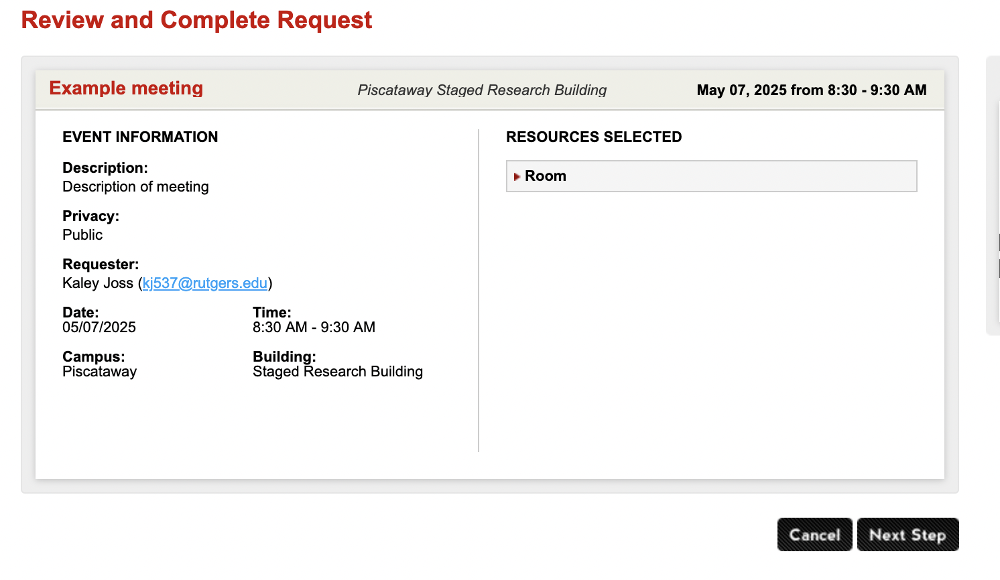
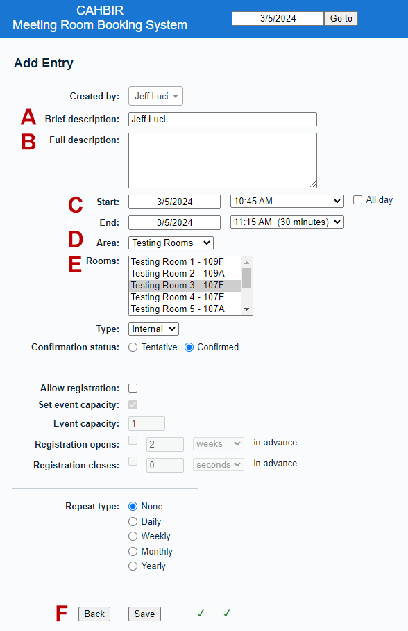

# Booking Rooms in CAHBIR
Date: April 30, 2025 3:12 PM
---
1. TOC
{:toc}
---
## Booking the CAHBIR Conference Room (SRB-127):

**Viewing Schedule**
To view the room availability schedule, go to: [https://rod.rwjms.rutgers.edu/VA_Calendar.aspx](https://rod.rwjms.rutgers.edu/VA_Calendar.aspx)   

**Campus**: Piscataway
**Building**: Staged Research Building  
**Room**: 127 (select the dropdown carrot by ‘Rooms’ to see 127)

**Booking Conference Room**
To book the conference room, go to: [https://rod.rwjms.rutgers.edu/SR_GeneralInfo.aspx](https://rod.rwjms.rutgers.edu/SR_GeneralInfo.aspx) 

And fill out the information for your meeting, selecting **Campus**: Piscataway and **Building**: Staged Research Building

On the next page select “Room”

Select the box for 127

Review your request and press “Next Step” to submit

## Booking Huddle Rooms and Testing Rooms:

The scheduling system for huddle and is now online at [https://cahbir.rutgers.edu/scheduling/](https://cahbir.rutgers.edu/scheduling/) (need to be on Rutgers VPN)

You do not need an account to look at the schedules, but you ***DO*** need one in order to reserve a room. Each research group has been issued a login and password. If more granular credentialing is needed within a group, you may request more accounts for your group.

Since the system is served by the same web server we use for our ticketing system and wiki, the same requirement to be connected to the RU network exists. So, please make sure you are either connected to a Rutgers network or are [using the VPN service](https://vpn.rutgers.edu/).

Here are the tentative guidelines we will use for room scheduling. If these work, we will make them permanent, but I suspect some degree of tweaking will be necessary to make sure things are fair for everyone.

- All training and huddle room use must be booked on this system.
- All reservations must include the name of the person reserving the room (see instructions below).
- The MRI training room should only be reserved for work that takes place immediately before or after an MRI scan.
- The Observation training rooms may only be booked as a pair, and then only when observation is necessary.
- All uses of training rooms that do not need the MRI or subject observation should use one of the other rooms.
- “Standing” reservations are not allowed. For instance, you may not book Wednesday at 10am for the rest of the month/semester/year/etc. You may only book a room when you have an actual subject confirmed at that time.

There are a few things to keep in mind when using the system:

- E-mail notifications are not used right now. In the unlikely event you need to contact someone with a reservation on the calendar, you should e-mail the person directly.
- Use of the rooms is free, but everyone is expected to book only the times they can use, and cancel promptly any reservation that will go unused (e.g. due to cancelation).
- The mock scanner will stay on iLab for now. If it makes sense to move it over, we will consider doing so at a later time.

Reserving rooms is simple.

1. Go to [the scheduling site](https://cahbir.rutgers.edu/scheduling/), and log in with your group’s credentials. 
Our passwords are listed at /Lab_admin/Passwords.xlsx
2. From the pulldown menu, select testing or huddle rooms as appropriate.
3. Navigate to the day you need, and select the starting time for the room you want in the grid.
4. In the menu that appears, fill out A) Your name; B) Any description you would like to show on the calendar (optional); C) The start and end times; D) the area (which should already be correctly populated); E) the room you want (again, should be populated); and finally, F) click save.

That should be all you need to make a reservation. (You don’t even need to find and use a fourth bullet type for a list in a mass e-mail!) Selecting a reservation from the grid view will allow you to cancel if your group made the reservation.

Please let us know if you have any problems or if you would like a demonstration by e-mailing[cahbir-support#rutgers.edu](mailto:cahbir-support@rutgers.edu).

Booking MRI Scans: