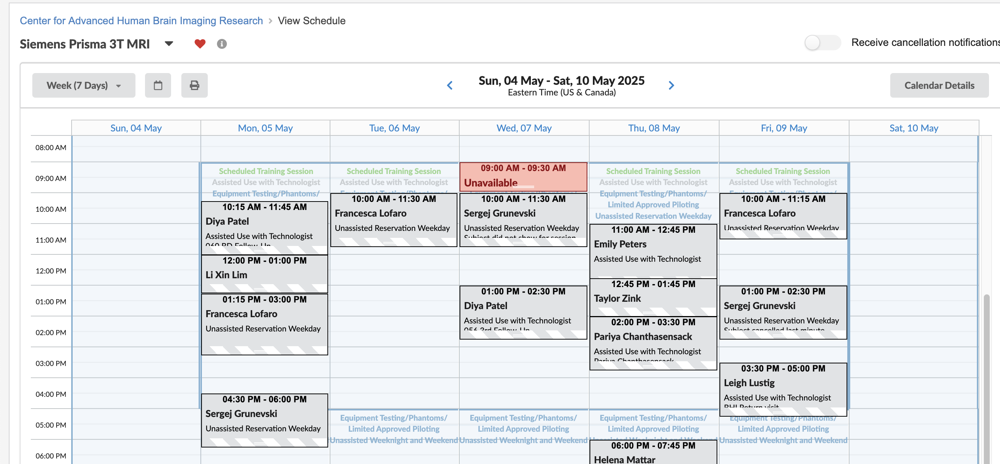
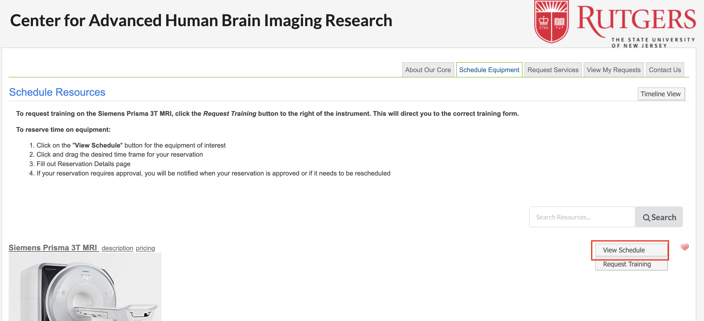
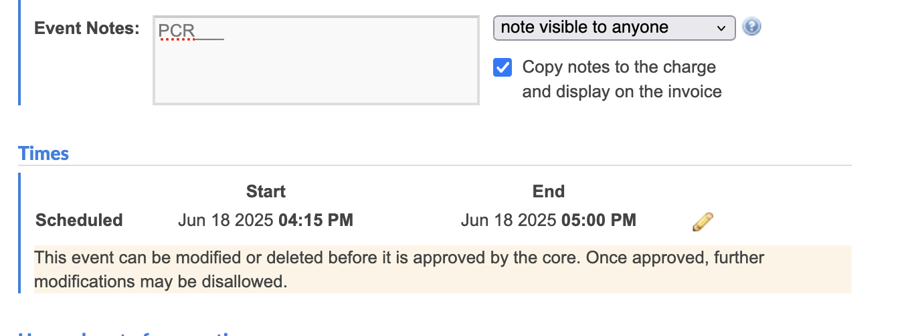
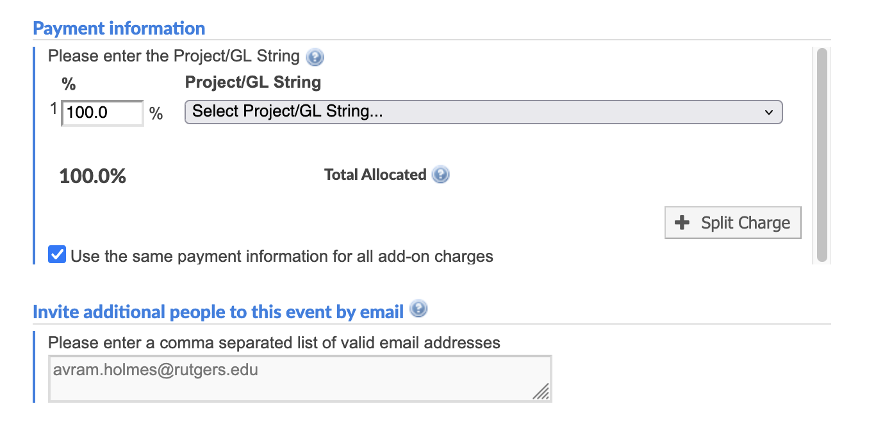
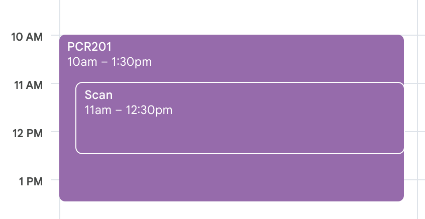

- Get [iLab](https://rutgers.ilab.agilent.com/) access: this is where you schedule:
    
    iLab: https://rutgers.ilab.agilent.com/ 
    
    1. log into ilab (registration link here: https://rutgers.ilab.agilent.com/landing/196) 
    2. Request access from your PI
    3. They allow
    4. Then CAHBIR allows
    5. Then you get access to project codes 
    6. Then you can schedule in iLabs 

- Make a reservation request
    1. Click ‘Rutgers iLab User Login’
    2. Log in with NetID
    3. In the ‘Home’ tab, click on the dropdown arrow for equipment search and scroll to/search for CENTER FOR ADVANCED HUMAN BRAIN IMAGING RESEARCH
    
    4. Select the item you want to schedule (Siemens Prisma 3T MRI is the MRI scanner) & click "View Schedule"
    
    5. See when the scanner is available. 
    
    6. Click anywhere to create a new reservation. Edit the time by clicking the pencil icon, and add in your subject number into "Event Notes"
    
    7. Select the appropriate grant for the payment string (if your grant isn't listed, ask Avram to add it to iLabs and add you to it.). Also, add Avram's email to the reservation, so he gets an email when a scan is scheduled.
    
    8. Add the scan to our ["Holmes Lab - Subjects"](https://calendar.google.com/calendar/u/0?cid=ODU0ODcwMzk1ZWEwNzEzNWNmYTg0YzA4NjNlM2ZiMzIyNTUxZjk4ZmNjMzAwOGQzZmU2NTI3MjY2NWY1NDk5ZUBncm91cC5jYWxlbmRhci5nb29nbGUuY29t) calendar. 
    

- Editing Reservation Requests
    - Labs are now able to cancel a reservation in iLab after it has been approved. Please note that iLab will warn you of a fee even when the reservation is canceled outside of the 24-hour cancelation period. CAHBIR staff will refer to the timestamp provided at the time of cancelation to determine if a fee is warranted. Unfortunately, editing approved reservations is still NOT permitted. Alternatively, you may cancel the original reservation and reserve the correct date/time. Labs are no longer required to submit a request to [cahbir-support@rutgers.edu](mailto:cahbir-support@rutgers.edu) when canceling or editing approved reservations. Please reach out with any questions.

- CAHBIR has a 24-hour cancellation policy— otherwise you pay
    - if you haven’t heard from the participant in 26hrs , just cancel the appt
    - Then if they confirm, put it back on the cal
    - If someone cancels, you can have someone else come in within the same day
        - Have a list of people who can fill in
        - Or cancel prefunctively

- How long to reserve:
    - How long the scan is for the study + 15mins

- Places You can reserve at CAHBIR:
    
    Free
    
    - testing room
    - Observation room
    - Mock scanner
    - Eeg room
    
    Paid
    
    - Scanning room