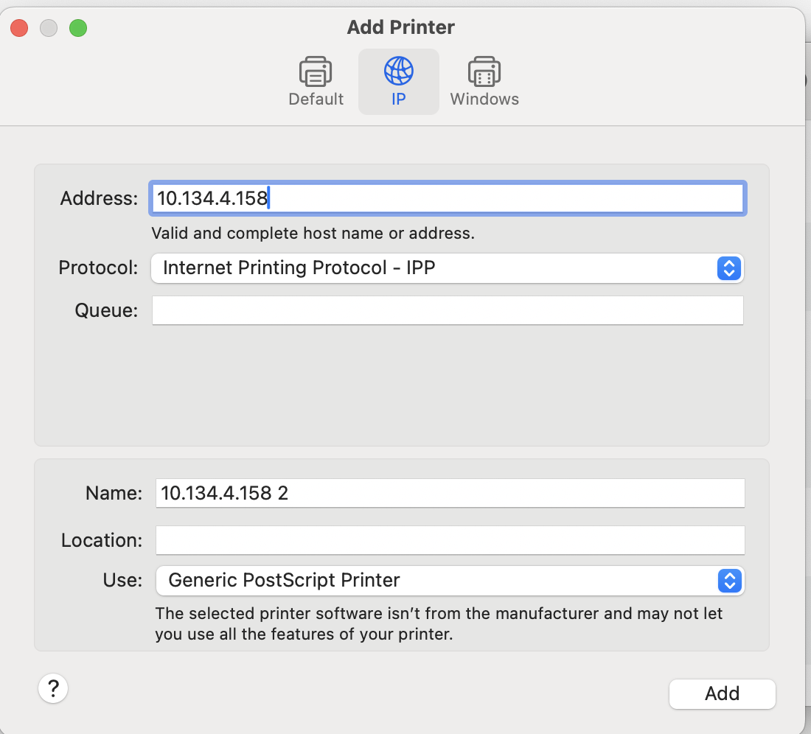
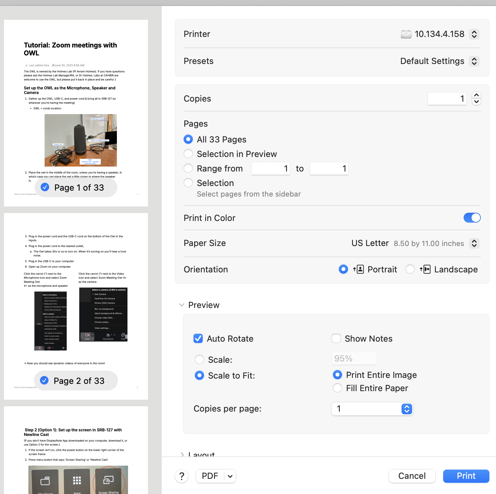

# Print from CAHBIR printer

Date: July 9, 2025 11:34 AM

On Mac

1. Search for application “Print Center”
2. Press “+” in lower left corner
3. Go to tab “IP” and enter in IP address: 10.134.4.158
    
    
    

5. Select “Add”

1. Now it should show up on the left hand bar as a printer

1. When you go to a document, select “print” and this printer should be an option
    
    