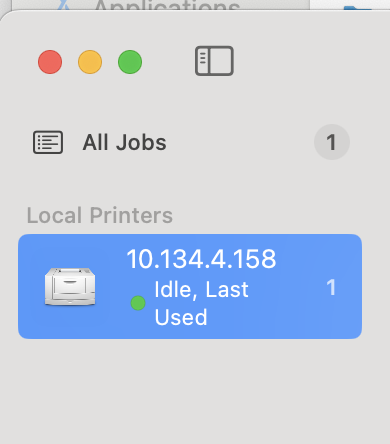
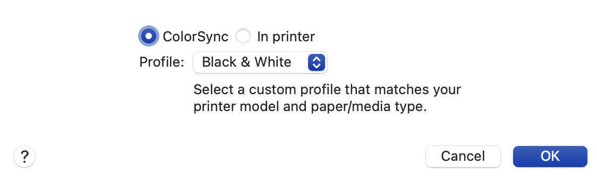

# Print from CAHBIR printer

This printer is located in Dr. Zald’s lab suite, aka Suite #119, in the hallway near Jeff Luci and Wil Rohlhill’s offices. 

### Add Printer On Mac

1. Search for application “Print Center”
2. Press “+” in lower left corner
3. Go to tab “IP” and enter in IP address: 10.134.4.158
    
    
    

5. Select “Add”

1. Now it should show up on the left hand bar as a printer

### Printing

1. When you go to a document, select “print” and this printer should be an option

### To print in Black and White:

- Scroll to “Printer Options” > “Color Matching”
    
    
    
- Choose Profile: Black & White

