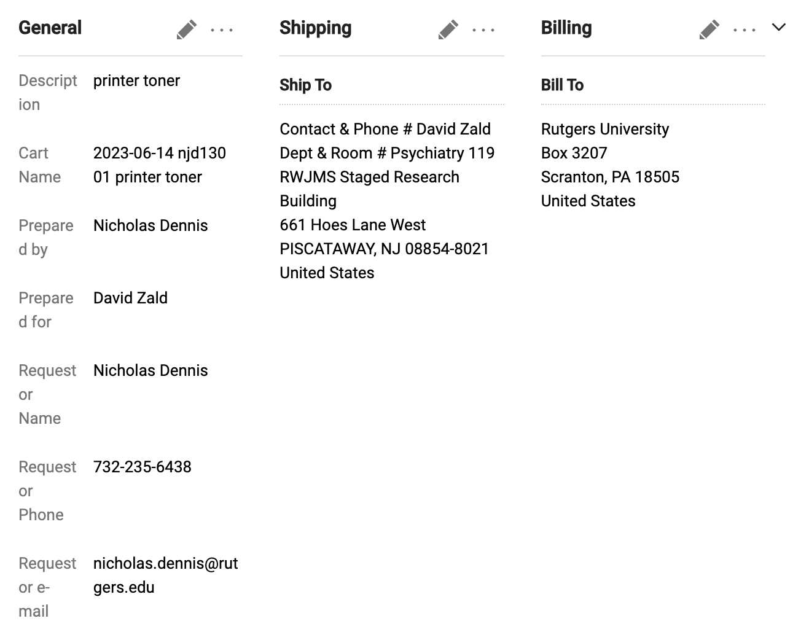

# Printer Supplies

Date: January 30, 2024 10:03 AM

**Machine:** Brother HL-L8360CDW

When any of the printer supplies are low (four toner colors for the printer, inkjet paper, etc), order from RU Marketplace:

1. In Marketplace, search for Brother HL-L8360CDW toner and you will see which supplier currently has a contract for toner (likely ODP solutions aka Office Depot)
2. Click on the ODP punchout
3. Find items out of listed supplies below:
    1. Brother(R) TN433BK High-Yield Black Toner Cartridge
    2. Brother(R) TN433 Series High-Yield Toner Cartridge, Cyan, TN433C
    3. Brother(R) TN433 Series High-Yield Toner Cartridge, Magenta, TN433M
    4. Brother(R) TN433 Series High-Yield Toner Cartridge, Yellow, TN433Y
    5. Office Depot(R) Brand Inkjet and Laser Print Paper, Letter Size (8 1/2 x 11), 24 Lb, 500 Sheets Per Ream, Case Of 3 Reams
4. Checkout from punchout
5. Save cart
6. Make the following edits
    
    