# Parking Permits

Date: January 30, 2024 10:04 AM

## Helpful Links ⛓ï¸

---

🚘 [Parking Portal](https://rudots.nupark.com/portal/Account/Login)

🅿ï¸Â [Dots Website](https://ipo.rutgers.edu/dots)

🛒 [RU Marketplace](https://solutions.sciquest.com/apps/Router/Home?tmstmp=1694597164716)

ğŸ«Â [Visitor Permits Page](https://ipo.rutgers.edu/dots/permits/visitor-parking)

🗃ï¸Â [CANL Box](https://rutgers.app.box.com/folder/142221900764?s=j9z1yw88k65ql28b20oekogx5xmvo2ae)

ğŸŒÂ [BHI Staff Page](https://brainhealthinstitute.rutgers.edu/about-us/staff/)

- For when contacts need to be updated due to turnover.

### NuPark Info

---

**CANL:** XXXXXX

## General DOTS SOP

---

- Depending on which department you are trying to set up your account for, different steps will apply.
- You should ONLY be doing this if you are the lab requestor!

<aside>
 Permits only last **3 months** and do NOT roll over so do make sure to buy only what you think you need!

</aside>

- **Adding a New Member to CANL Departmental Account**
    1. Go to the Rutgers DOTS website ([here](https://ipo.rutgers.edu/dots)) and click on the “DOTSHelp.rutgers.edu†hyperlink found under the “Contact Information†section on the left hand side of the page.
        - **Image Reference**
            
            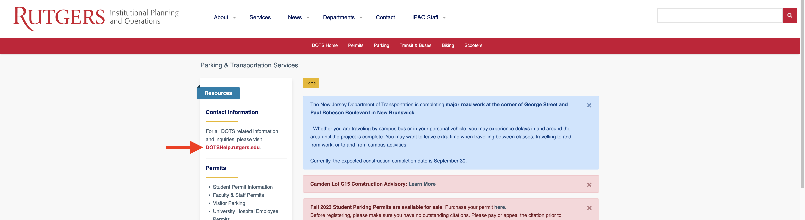
            
    2. Click on the “Request Forms†block. Once there, in the “Categories†section click on the “Permitting†tab and then select “One-Day Parking Permit.â€
        - **Image Reference**
            
            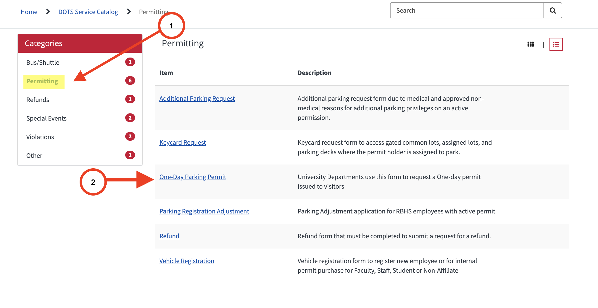
            
    3. Fill out the One Day Parking Permit Form as outlined below. Then click “Submit†found in the top right corner.
        - **Form Inputs**
            1. **Campus:** RBHS - New Brunswick
            2. **Nupark Account Number:** XXXXXX
            3. **Department requesting One-day Permit: “**RWJ-Psychiatry Researchâ€
            4. **Order Quantity:** N/A
                1. Only if you are adding people **without** also purchasing new passes.
            5. **Purchase Order Number:** N/A
                1. Only if you are adding people **without** also purchasing new passes.
            6. **Purchase Order Amount:** N/A
                1. Only if you are adding people **without** also purchasing new passes.
            7. **Additional Comments:**
                1. [Full Name] ([NetID]) needs access to ePermits.
                    1. e.g., Sara Van Tuerenhout (sv707) needs access to ePermits.
                2. If batch adding:
                    1. Needs access to ePermits:
                        1. [Full Name 1] ([NetID 1])
                        2. [Full Name 2] ([NetID 2])
                        3. [Full Name 3] ([NetID 3])
            8. **Add Attachments:**
                1. Access the document “Parking PO - New Member.pdf†in the CANL Box in the “Procurement Docs†folder.
                    1. Attach this to the form.
                2. If for whatever reason you cannot access the above pdf:
                    1. Create a word document and type:
                        1. Purchase Order not Applicable for this request. Solely looking to add another team member to a departmental account.
                    2. Save as a PDF and attach to form.
    4. If all goes well, DOTS should reach back out in **1-2 days** with confirmation that the new people have been added to the account.
- **Steps for Adding Yourself to CAHBIR Departmental Account**
    - Talk to Rose Smith (Business Liaison for BHI) to add you the CAHBIR parking department account.
        - Email: [rs1771@bhi.rutgers.edu](mailto:rs1771@bhi.rutgers.edu)
        - If Rose Smith no longer works for BHI, you can email Louise Petrone who is the Program Coordinator for BHI
            - Email: [lp544@bhi.rutgers.edu](mailto:lp544@bhi.rutgers.edu)
    - If none of the above people still work for Rutgers, go to the [BHI Staff Page](https://brainhealthinstitute.rutgers.edu/about-us/staff/) and look for the Business Liaison for CHABIR and reach out!
- **Buying One Day Parking Permits**
    
    <aside>
     This guide assumes you are already set up in DOTS with a departmental account
    
    </aside>
    
    1. Go to Ru Marketplace and and in the search bar type “**IPO: RBHS One Day Parking Permit**.†Hit Return or Enter depending on computer type.
        - **Image Reference**
            
            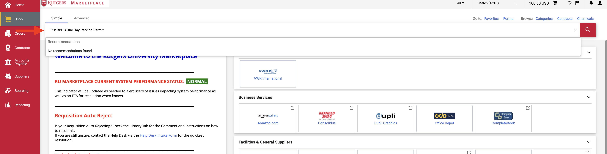
            
    2. Click on the “**View Form**†on the only option that shows up (it will be “I**PO: RBHS One Day Parking Permit (#3623**)â€). The price on the form will list “1.00 USD.â€
        - **Image Reference**
            
            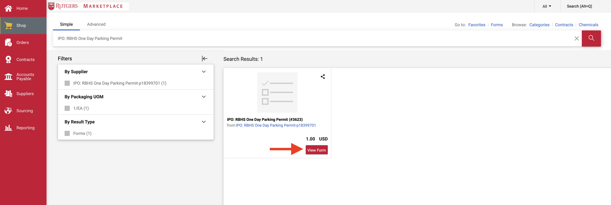
            
    3. In the form fill out the required fields and then click “**Add and Go To Cart**†found in the top right corner.
        - **Specified Fields**
            1. **Product Description:** One Day parking permits for research participants partaking in research conducted by the Clinical and Affective Neuroscience Lab run by Dr. David Zald.
            2. **Total Dollar Amount/Quantity: ##**
                1. You will put the dollar amount here. Parking passes are $5/permit.
                2. e.g., 100
            3. **Commodity Code:** Parking Mgmt.
            4. **Department Name:** RWJMS Psychiatry
            5. **Department Address:** 675 Hoes Lane West, Piscataway, NJ 08854
            6. **Campus:** Busch Campus
            7. **Contact Person:** YOUR NAME - [MUST BE LAB REQUESTOR!!!]
            8. **Contact Phone Number:** YOUR OFFICE PHONE #
                1. If you do not have a lab phone number, make sure to purchase a phone for yourself
            9. **Contact Email:** YOUR RUTGERS EMAIL
            10. **Quantity @5/permit:** ##
                1. Put number of permits desired.
                    1. Whatever value you inputted in the “Total Dollar Amount/Quantity†box, divide that by 5 and put that number here.
                    2. e.g., **Total Dollar Amount/Quantity:** 100 —> **Quantity @5/permit:** 20
            - **Image Reference**
                
                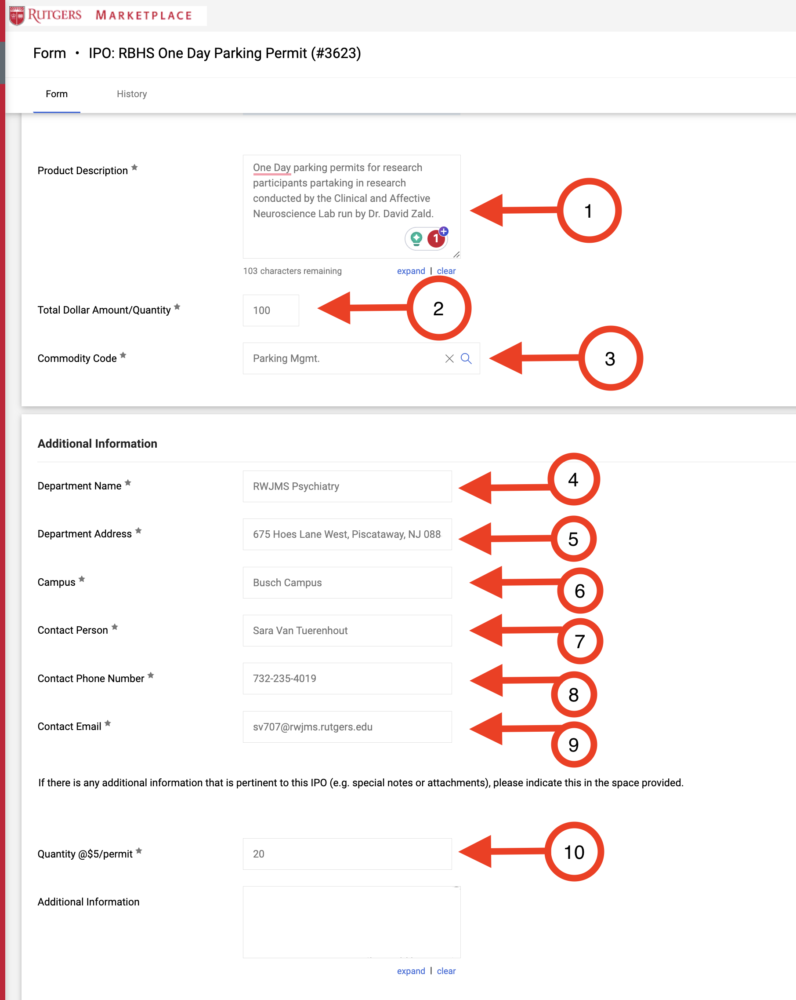
                
    4. In the cart, check the Summary section to see 1) who it is prepared for [make sure it is David Zald] and 2) add a brief description to the cart name. Then click “**Proceed to Checkout.**â€
        1. Example cart name addition: “canl parkingâ€
        - **Image Reference**
            
            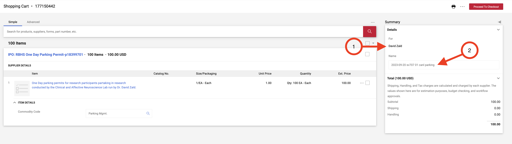
            
    5. In the Checkout section fill out the **General** tab as well as the **Accounting Codes**. Then select “**Submit Requisition**†found in the top right corner.
        - **General Tab**
            1. Click on the pencil found next to the General tab to edit a few properties in this section.
            2. Add a brief description of the purchase in the “**Description**†box
                1. E.g., “CANL 1-day parking permitsâ€
            3. If not correctly specified, update the “**Prepared For**†section to be David Zald instead of your name.
            4. If you forgot to give your cart name a brief descriptive name, add that now.
                1. e.g., “canl parkingâ€
            5. Click “**Save**†at the bottom of the screen!!
            - **Image Reference**
                
                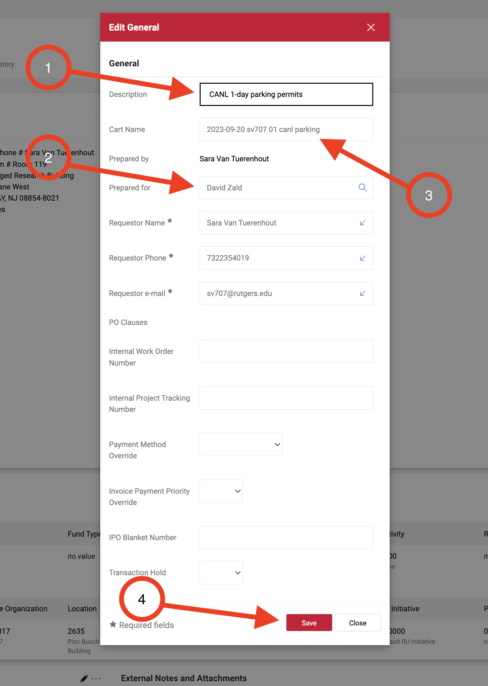
                
        - **Accounting Codes**
            
            <aside>
             **Reminder these permits are to be used for general lab projects not funded on a grant or other sub-award!!**
            
            </aside>
            
            1. Click on the pencil in the **Accounting Codes** tab to edit the required fields. If not already made as your presets, here are the accounting values you need to input:
                1. **Project ID:** XXXXXX
                2. **Task:** XXX:XXXXXX
                3. **Expenditure Type:** 74105
                4. **Expenditure Organization:** XXXXXXXXXXX
                5. **Location:** 2635
                6. **Business Line:** XXXX
                7. **Activity:** 0000
                8. **RU Initiative:** 000000
                - **Image Reference**
                    
                    
                    
            2. Click “**Save**†in the bottom right corner.
    6. Once requisition is approved, get the purchase order number which can be found in the email sent to you when the requisition is approved. 
        1. If you have not set up email alerts do so using the instructions below.
            - **Email Alert** **Instructions**
                1. Click on the user button located in the top right corner next to the notification bell button.
                    1. In this tab, click on “View My Profileâ€
                2. In your profile, click on the “Notification Preferences†section on the sidebar.
                3. Go to the “Shopping, Carts & Requisitions†section and have the following settings:
                    - **Image of Settings**
                        
                        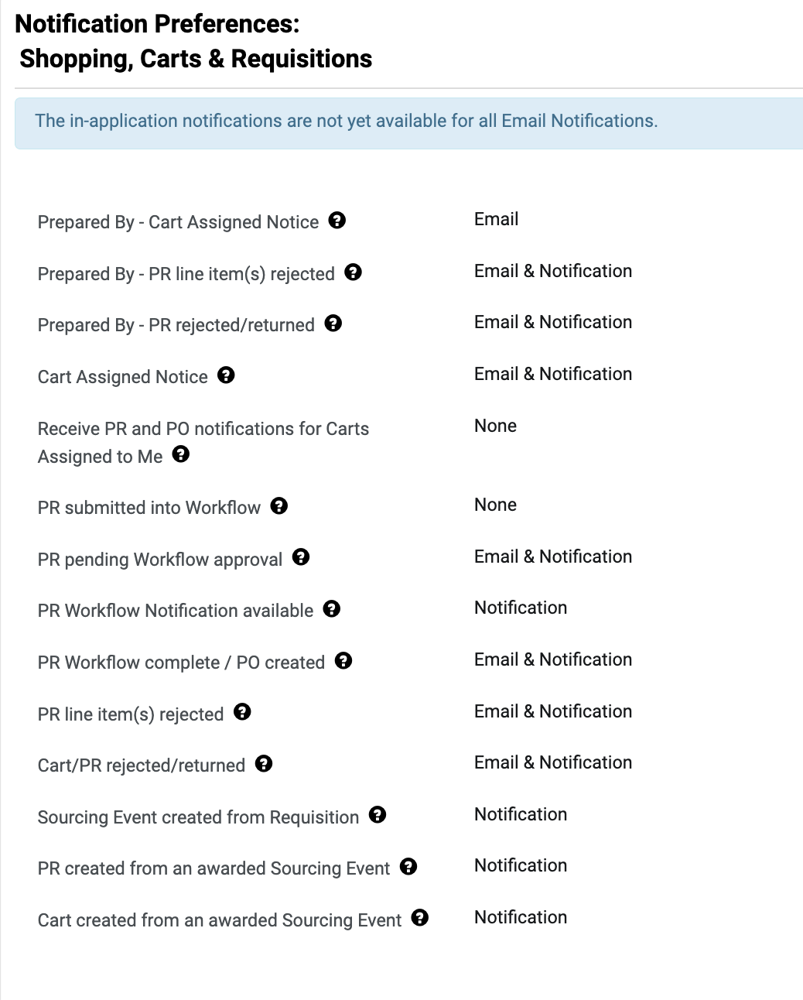
                        
                4. Go to the “Purchase Orders†section and have the following settings:
                    - **Image of Settings**
                        
                        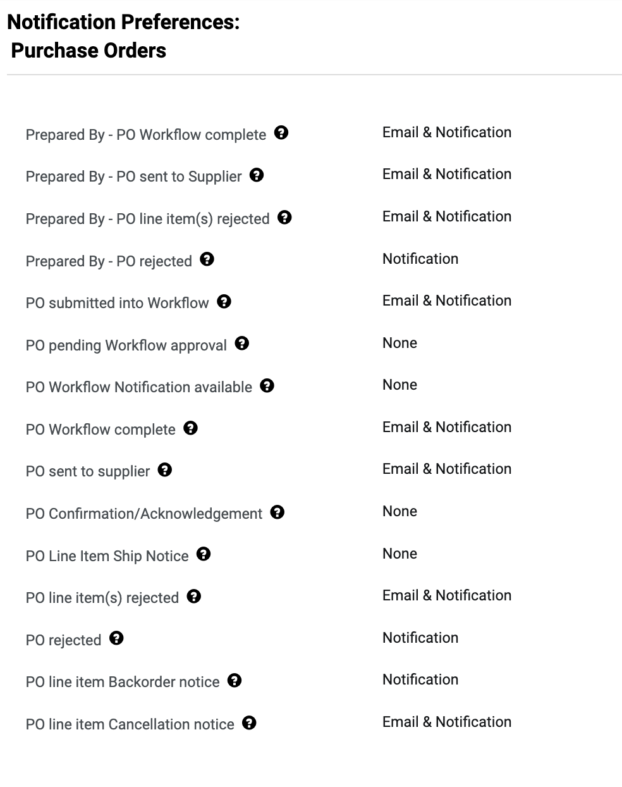
                        
            - You can then find the purchase order number by going to “Orders†> “My Purchase Orders†> deleting “PO Owner:†filter > typing your name into search bar.
                - **Image References**
                    
                    
                    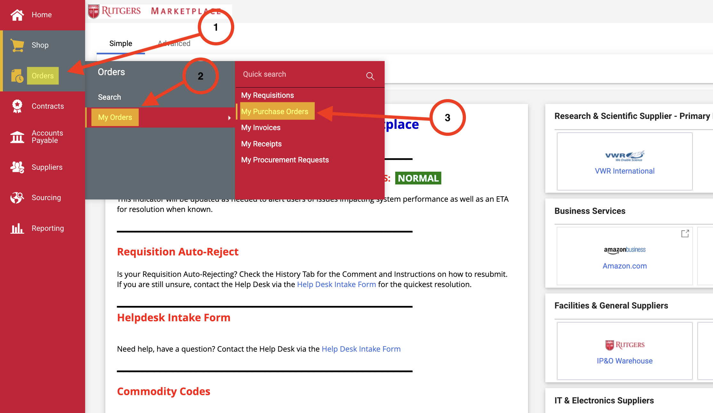
                    
                    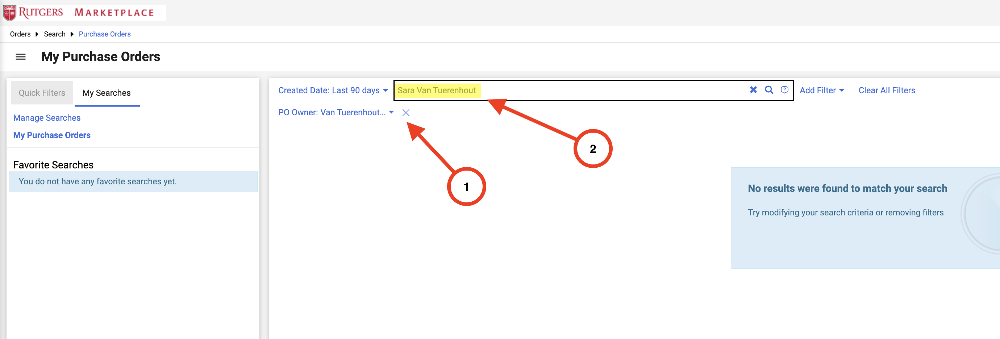
                    
                    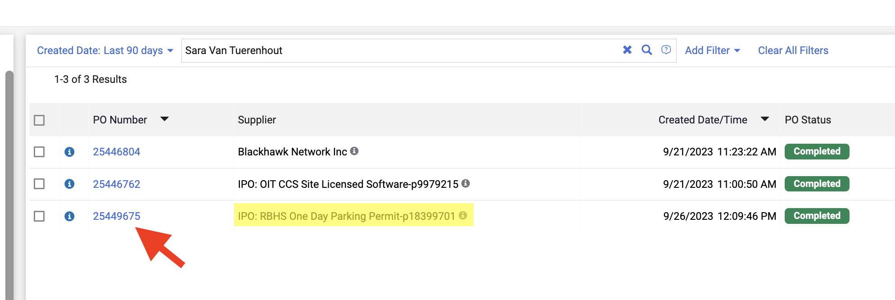
                    
        2. If you have set up email alerts, the purchase order # will be in the email you get when you get notified that the Purchase Order has been approved.
    7. Go to the Rutgers DOTS website ([here](https://ipo.rutgers.edu/dots)) and click on the “DOTSHelp.rutgers.edu†hyperlink found under the “Contact Information†section on the left hand side of the page.
        - **Image Reference**
            
            
            
    8. Click on the “Request Forms†block. Once there, in the “Categories†section click on the “Permitting†tab and then select “One-Day Parking Permit.â€
        - **Image Reference**
            
            
            
    9. Fill out the One Day Parking Permit Form as outlined below. Then click “Submit†found in the top right corner.
        - **Form Inputs**
            1. **Campus:** RBHS - New Brunswick
            2. **Nupark Account Number:** Leave blank
            3. **Department requesting One-day Permit:** RWJ - Psychiatry Research
            4. **Order Quantity:** # of passes listed in the requisition.
                1. e.g., 20
            5. **Purchase Order Number:** ###
                1. Found in RUMarketplace
            6. **Purchase Order Amount:** ###
                1. e.g., 100 [do not include the $ sign!]
            7. **Add Attachments:** Add a PDF of the Purchase Order.
                1. To get a PDF of the purchase order, follow the steps below:
                    - **PDF Steps**
                        1. Go to the specific purchase order page in RU Marketplace.
                            1. If you don’t know how to find it, reference the steps [here](https://www.notion.so/Parking-Permits-eb5f3e20f6054212a61f399a043afa6c?pvs=21).
                        2. On the page, click the print icon found in the top right corner next to the text bubble with the question mark to create the pdf.
                            - **Image Reference**
                                
                                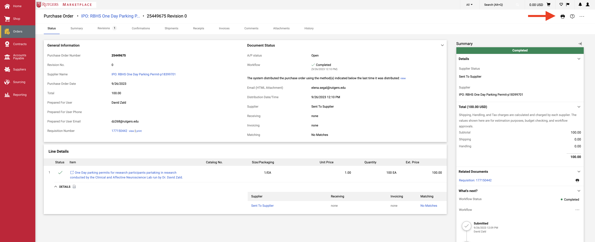
                                
                        3. Save PDF with the name given.
            - **Image Reference**
                
                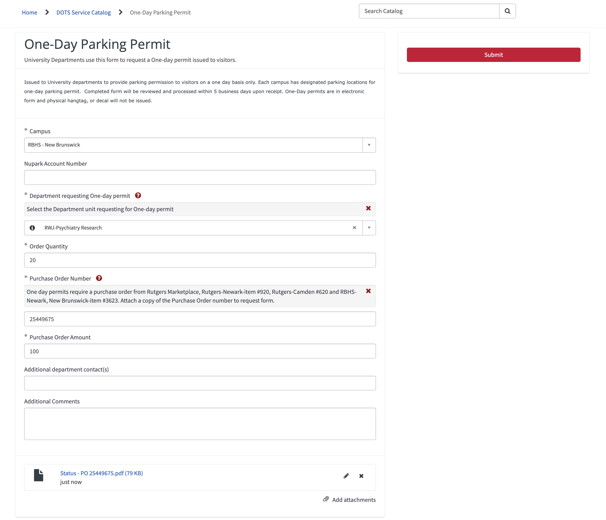
                
    10. Assuming all goes well, you will receive a confirmation email from DOTS saying that the new permits have been assigned to the department.
        1. You can verify by going to the parking portal ([here](https://rudots.nupark.com/v2/portal#/customer)) > clicking the “My Department†tab > Selecting the “Available Permits†tab.
            - **Image Reference**
                
                
                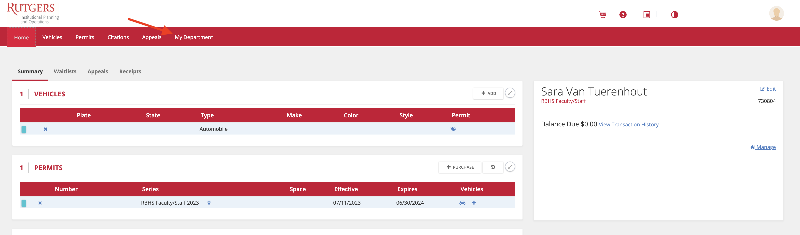
                
                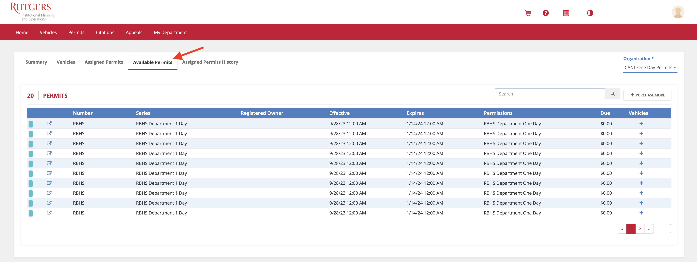
                
- **Issuing One Day Permits**
    
    <aside>
     Important to note that only **one vehicle** can be registered at a time!!
    
    </aside>
    
    - **Rutgers Instruction PDF**
        
        [QUICK GUIDE Department Accounts Assign One Day ePermit Visitors New Parking.pdf](Parking Permits eb5f3e20f6054212a61f399a043afa6c/QUICK_GUIDE_Department_Accounts_Assign_One_Day_ePermit_Visitors_New_Parking.pdf)
        
    1. Go to the Rutgers DOTS Parking portal ([here](https://rudots.nupark.com/v2/portal#/customer)) and select the “My Department†tab.
        - **Image Reference**
            
            
            
    2. In the “My Department†tab, select the “Vehicles†tab and then click the “+ ADD†button found on the far right side to add the subject’s vehicle information.
        - **Image Reference**
            
            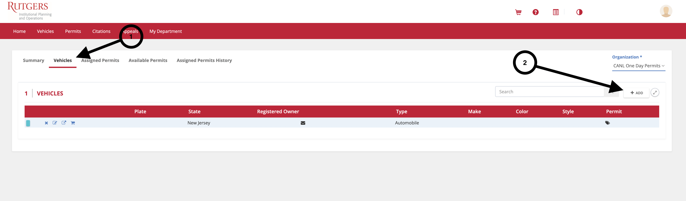
            
        - If there is already a vehicle (for another subject/person) in the “Vehicle†tab, make sure to remove it **BEFORE** clicking the “+add†button.
            - This is done by selecting the “x†button found on the far left side next to the vehicle description.
                - **Image Reference**
                    
                    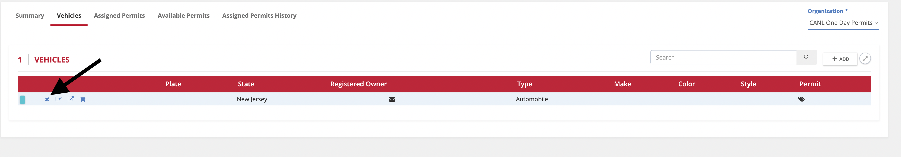
                    
    3. Fill out the appropriate vehicle and owner information
        1. Will need the State, License Plate #, Subject’s name, and email.
        2. **NEED TO ADD IMAGE REFERENCE!!!**
    4. Once the vehicle has been added to the department, head to the “Available Permits†tab and select the “+†button next to an available permit.
        - **Image Reference**
            
            
            
    5. Once you’ve selected the “+†button next to the available permit, you need to select the vehicle by clicking on it, assign the appropriate date, and then click “Saveâ€.
        - **Image Reference**
            
            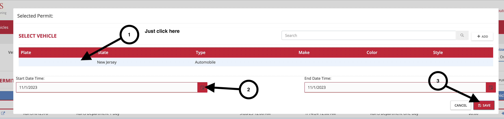
            
    6. After you have clicked “Save†you should be able to confirm that the permit has been assigned by going to the “Assigned Permits†tab.
        - **Image Reference**
            
            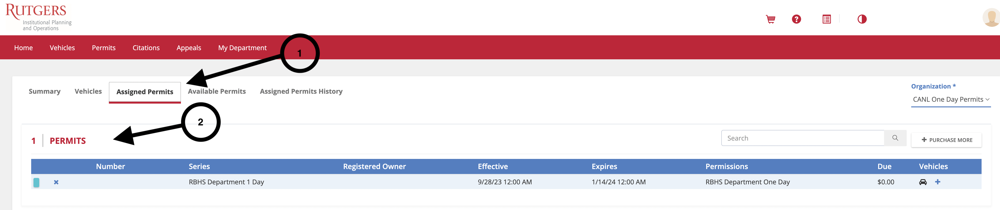
            

---

### Archived Knowledge

**Creating a Brand New Department Account**

- **Instructions**
    1. Go to Ru Marketplace and and in the search bar type “**IPO: RBHS One Day Parking Permit**.†Hit Return or Enter depending on computer type.
        - **Image Reference**
            
            
            
    2. Click on the “**View Form**†on the only option that shows up (it will be “I**PO: RBHS One Day Parking Permit (#3623**)â€). The price on the form will list “1.00 USD.â€
        - **Image Reference**
            
            
            
    3. In the form fill out the required fields and then click “**Add and Go To Cart**†found in the top right corner.
        - **Specified Fields**
            1. **Product Description:** One Day parking permits for research participants partaking in research conducted by the Clinical and Affective Neuroscience Lab run by Dr. David Zald.
            2. **Total Dollar Amount/Quantity: ##**
                1. You will put the dollar amount here. Parking passes are $5/permit.
                2. e.g., 100
            3. **Commodity Code:** Parking Mgmt.
            4. **Department Name:** RWJMS Psychiatry
            5. **Department Address:** 675 Hoes Lane West, Piscataway, NJ 08854
            6. **Campus:** Busch Campus
            7. **Contact Person:** YOUR NAME - [MUST BE LAB REQUESTOR!!!]
            8. **Contact Phone Number:** YOUR OFFICE PHONE #
                1. If you do not have a lab phone number, make sure to purchase a phone for yourself
            9. **Contact Email:** YOUR RUTGERS EMAIL
            10. **Quantity @5/permit:** ##
                1. Put number of permits desired.
                    1. Whatever value you inputted in the “Total Dollar Amount/Quantity†box, divide that by 5 and put that number here.
                    2. e.g., **Total Dollar Amount/Quantity:** 100 —> **Quantity @5/permit:** 20
            11. **Additional Information:**
                1. “Looking to set up a departmental account for the Clinical and Affective Neuroscience Lab run by Dr. David Zald to issue one-day permits for research participants. These permits would be preferably for Lot 58c on the Busch Campus. This account will be managed by myself, [YOUR NAME] ([YOUR NETID]), on behalf of Dr. David Zald.
                2. This is optional but might be good if this is your first time doing this.
            - **Image Reference**
                
                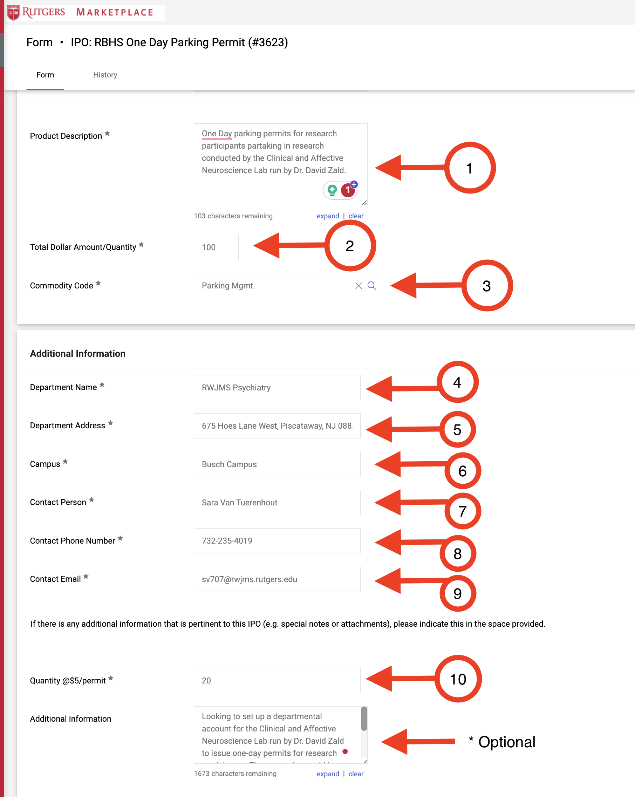
                
    4. In the cart, check the Summary section to see 1) who it is prepared for [make sure it is David Zald] and 2) add a brief description to the cart name. Then click “**Proceed to Checkout.**â€
        1. Example cart name addition: “canl parkingâ€
        - **Image Reference**
            
            
            
    5. In the Checkout section fill out the **General** tab as well as the **Accounting Codes**. Then select “**Submit Requisition**†found in the top right corner.
        - **General Tab**
            1. Click on the pencil found next to the General tab to edit a few properties in this section.
            2. Add a brief description of the purchase in the “**Description**†box
                1. E.g., “CANL 1-day parking permitsâ€
            3. If not correctly specified, update the “**Prepared For**†section to be David Zald instead of your name.
            4. If you forgot to give your cart name a brief descriptive name, add that now.
                1. e.g., “canl parkingâ€
            5. Click “**Save**†at the bottom of the screen!!
            - **Image Reference**
                
                
                
        - **Accounting Codes**
            
            <aside>
             **Reminder these permits are to be used for general lab projects not funded on a grant or other sub-award!!**
            
            </aside>
            
            1. Click on the pencil in the **Accounting Codes** tab to edit the required fields. If not already made as your presets, here are the accounting values you need to input:
                1. **Project ID:** XXXXXX
                2. **Task:** XXX:XXXXXX
                3. **Expenditure Type:** 74105
                4. **Expenditure Organization:** XXXXXXXXXXX
                5. **Location:** XXXX
                6. **Business Line:** XXXX
                7. **Activity:** 0000
                8. **RU Initiative:** 000000
                - **Image Reference**
                    
                    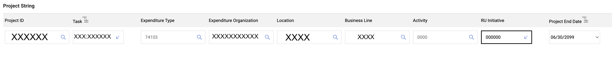
                    
            2. Click “**Save**†in the bottom right corner.
    6. Once requisition is approved, get the purchase order number which can be found in the email sent to you when the requisition is approved. 
        1. If you have not set up email alerts do so using the instructions below.
            - **Email Alert** **Instructions**
                1. Click on the user button located in the top right corner next to the notification bell button.
                    1. In this tab, click on “View My Profileâ€
                2. In your profile, click on the “Notification Preferences†section on the sidebar.
                3. Go to the “Shopping, Carts & Requisitions†section and have the following settings:
                    - **Image of Settings**
                        
                        
                        
                4. Go to the “Purchase Orders†section and have the following settings:
                    - **Image of Settings**
                        
                        
                        
            - You can then find the purchase order number by going to “Orders†> “My Purchase Orders†> deleting “PO Owner:†filter > typing your name into search bar.
                - **Image References**
                    
                    
                    
                    
                    
                    
                    
                    
        2. If you have set up email alerts, the purchase order # will be in the email you get when you get notified that the Purchase Order has been approved.
    7. Go to the Rutgers DOTS website ([here](https://ipo.rutgers.edu/dots)) and click on the “DOTSHelp.rutgers.edu†hyperlink found under the “Contact Information†section on the left hand side of the page.
        - **Image Reference**
            
            
            
    8. Click on the “Request Forms†block. Once there, in the “Categories†section click on the “Permitting†tab and then select “One-Day Parking Permit.â€
        - **Image Reference**
            
            
            
    9. Fill out the One Day Parking Permit Form as outlined below. Then click “Submit†found in the top right corner.
        - **Form Inputs**
            1. **Campus:** RBHS - New Brunswick
            2. **Nupark Account Number:** Leave blank
            3. **Department requesting One-day Permit:** RWJ - Psychiatry Research
            4. **Order Quantity:** # of passes listed in the requisition.
                1. e.g., 20
            5. **Purchase Order Number:** ###
            6. **Purchase Order Amount:** ###
                1. e.g., 100 [do not include the $ sign!]
            7. **Additional Comments:**
                1. I am looking to set up departmental access for my ([YOUR NET ID]) parking account to issue one-day parking permits for research subjects. These subjects are participating in research at the Clinical and Affective Neuroscience lab run by Dr. David Zald. Our lab is under the RWJMS Psychiatry umbrella. The parking access would be for Lot 58c on the Busch Campus. **Despite Dr. Zald’s connection to BHI, we are looking to create a separate department and do NOT want to assign these parking permits to BHI.**
                    1. Sentence in bold was added post-hoc as not including that caused parking to assume to permits were for BHI would make it so that everyone who has access to BHI would have access to our permits!!
            8. **Add Attachments:** Add a PDF of the Purchase Order.
                1. To get a PDF of the purchase order, follow the steps below:
                    - **PDF Steps**
                        1. Go to the specific purchase order page.
                            1. If you don’t know how to find it, reference the steps [here](https://www.notion.so/Parking-Permits-eb5f3e20f6054212a61f399a043afa6c?pvs=21).
                        2. On the page, click the print icon found in the top right corner next to the text bubble with the question mark to create the pdf.
                            - **Image Reference**
                                
                                
                                
                        3. Save PDF with the name given.
            - **Image Reference**
                
                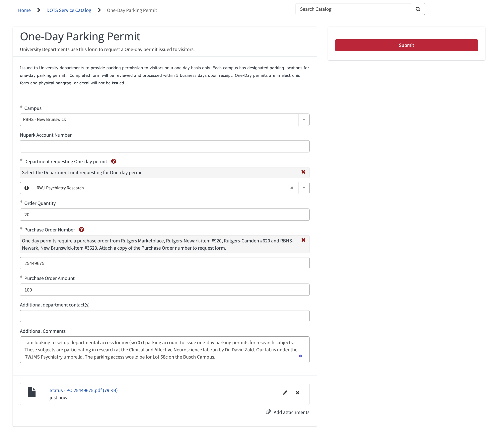
                
    10. Assuming all goes well, DOTS will reach out in **1-2 days** with a Nupark Account # which you will need to store in a safe space that you will remember!
        1. You will use the Nupark Account # when requesting new permits.
        2. Nupark Account # is simply where the parking permits end up and do not indicate the funding mechanism of the permits!

1. **"How did you know that CANL had to register as a new department for parking passes?"**
    1. CANL (the name of Dr. Zald's lab outside of CAHBIR proper) had not, as of then, needed to issue parking permits, so a departmental account was never created. Thus, we had to make one to issue parking passes that were being used for CANL-specific purposes.
        1. Suppose you are using the CAHBIR parking permits. In that case, those permits **must** go to participants **actively participating in a CAHBIR-specific project** (i.e., using the scanner and potentially the ECG in the future, but don't quote me on that).
        2. So, if you expect your lab to have participants participating in your lab-specific projects and not CAHBIR-specific, then you would need to set up a departmental account since all parking permits are pooled and are not delineated by who purchased them per se.
            1. For example, if you are in the CAHBIR departmental account, and you submit a purchase order for new parking permits for that departmental account using your lab's start-up fund or grant money, ANYONE who has access to the CAHBIR departmental account could use it.
    2. Since your lab is brand new, you still need to set up a departmental account.
2. **"Do you know if the 1-visitor-day-pass for $1 is just for CAHBIR (like there can only be one visitor-day-pass from all of CAHBIR before you have to start paying full price), or is it for each lab/each requestor?"**
    1. I am unfamiliar with the $1 pass for CAHBIR, so I cannot speak to that.
    2. From my experience, all 1-day parking permits are $5 and have always been $5.
        1. Feel free to contact **Jeff Lucci,** as he was initially the parking czar for CAHBIR (although it is way below his pay grade) if you have additional questions about the $1 parking permit.
3. **"Could theoretically someone from my lab use it when commuting twice a week?"**
    1. Unfortunately, parking passes **CAN'T** be used by Rutgers Staff **OR** Students, so lab members would not be allowed to use them even if they only come once or twice a week. The same goes for study participants if they are students!
        1. DOTS says that any violations of this could result in suspending the departmental account and shutting down the parking accounts for whoever was involved.
        2. It's a ridiculous rule, and I don't know how they would know if your lab members never registered with DOTS, but I wouldn't risk it.
            1. There are visitor parking lots nearby that people can use (roughly a 5-minute walk).
                1. e.g., Lot B near the Rutgers Day School
                    1. Address of Rutgers Day School (671 Hoes Ln W, Piscataway, NJ 08854)
    2. The student aspect is the most annoying, but DOTS is adamant about keeping it the same as there was rampant misuse of the system in the past, so we're at an impasse.

**One pivotal thing that I just now updated in the Notion doc that I had previously left out.**

- To access the lab account you must have a car registered in DOTS and I believe also have a permit.
    - Our former lab manager rode his scooter (like those lime ones) to work and thus did not have a DOTS account, and they refused to let him hand out parking passes. It had to go through me for the longest time.