# ✍️ Tutorial: Data from NDA

Last updated: Jun 12, 2025

Database: [National Data Archive](https://nda.nih.gov/) at the United States National Institute of Health  
Helpdesk Contact: [ndahelp@mail.nih.gov](mailto:ndahelp@mail.nih.gov)   


# DARs
## 1) Have an eRA Profile

1. Make sure you have an eRA account. If you don’t have one, email the RBHS signing official, Gregory Werhner ([gw266@research.rutgers.edu](mailto:gw266@research.rutgers.edu)) to have one created for you
2. Ask your PI what institution they’re assigned to as a PI in NDA. Then put in your employment, making sure to select the same institution as they have. 
    1. For example, there are 2 versions of RBHS. “Rutgers Biomedical and Health Sciences”, and “Rutgers Biomedical/Health Sciences - RBHS”. There’s also “Rutgers, the State University of NJ” and others. Make sure to select the one that matches your PI
3. Change your contact email to your Rutgers email 

## 2) Get Access to NDA

1. [Create an NDA account](https://nda.nih.gov/nda/tutorials/first_steps_of_data_submission?chapter=your-nda-account) ([nda tutorial](https://nda.nih.gov/nda/tutorials/first_steps_of_data_submission?chapter=your-nda-account)): Go to the NDA website: [https://nda.nih.gov/](https://nda.nih.gov/). To create an account, click the “log in” button in the top right which will prompt a few “create account” options. Make sure to link to your eRA or [login.gov](http://login.gov) which is listed with your institutional email  
2. After/if you already have an account, go to “Profile” and make sure your institutional affiliation is the same as listed on your eRA account / your PI’s institutional affiliation.  
    1. If it’s not, email the helpdesk [ndahelp@mail.nih.gov](mailto:ndahelp@mail.nih.gov) and ask it to be changed   
    NOTE: It takes 48 hours for eRA institution changes to populate to NDA, so if you've just changed your eRA, wait to see if it populates to NDA.   

## 3) Create a Data Access Request (DAR)

### 3.1) Request Access under a new Data Access Request (DAR) for an NDA dataset(s) you wish to use  
If your PI doesn’t already have a DAR for the dataset you wish to use, you must request permissions.  Additionally, if you wish to add or remove people from a DAR, you must submit a new DAR. 
  
1. First, make sure your PI’s ‘Institutional affiliation’ is the same as yours  
2. Have your PI go to Profile > Data Permissions > scroll down to the collection… > Request Access (PI must start a request to the data collection that holds the dataset you’re interested in)  
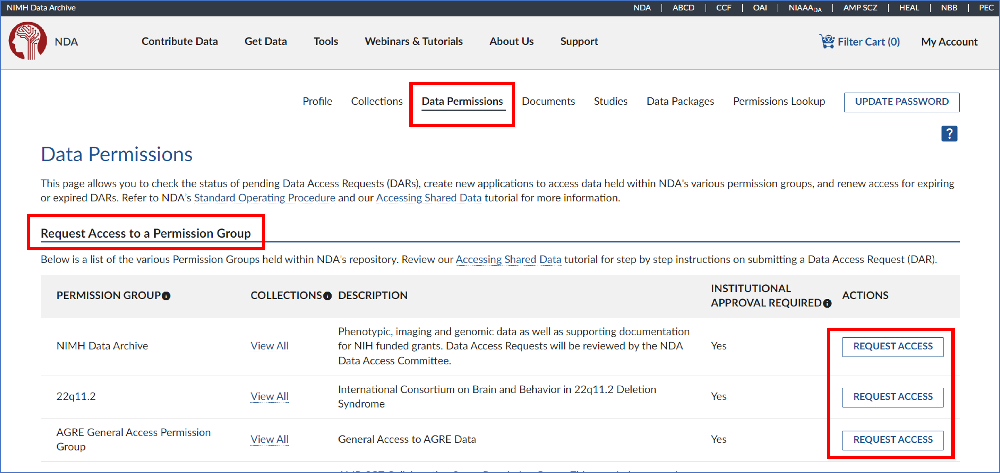

3. Read the instructions carefully to fully understand the process and timeline. Make sure you have selected the correct institutional sponsorship, then click 'Start Request' to begin your application.

3. Fill project specific fields— example responses:  
    1. **Name of Project**: “Psychiatric connectomes”  
        1. Not important, doesn’t have to match anywhere else  
    2. **Research purpose:** “Our research is looking at the relationship between biological biomarkers, such as MRI and fMRI, and behavioral markers such as clinical phenotypes and task-behavior. “  
4. Fill in the other two fields— USE THIS LANGUAGE for these questions:  
      
    **Data access plan**: “The data will be stored on a secure server, in a password protected partition on the Rutgers University Amarel computing cluster. The folder will only be accessible by those listed in this DUA.”  
      
    **Plan for deletion**: “All data that has been downloaded from this dataset will be deleted from all our local or cloud-based machines when research is completed, or this DUC is expired, whichever comes first.“   
      
5. Then add everyone who will access the data. On this page, make sure to add all individuals who will access, use, or analyze the data, regardless of their position title, or role in data usage. This includes any IT staff responsible for cleaning or managing the data.
    1. If the person has an NDA account: but you don’t see them on the list of “Known affiliated user” you have to ask them to follow steps 1.1.-1.3.
        1. Make sure to select the email associated with your collaborator’s NDA account. Don’t press ‘add new user’ unless your collaborator doesn’t have an NDA account already
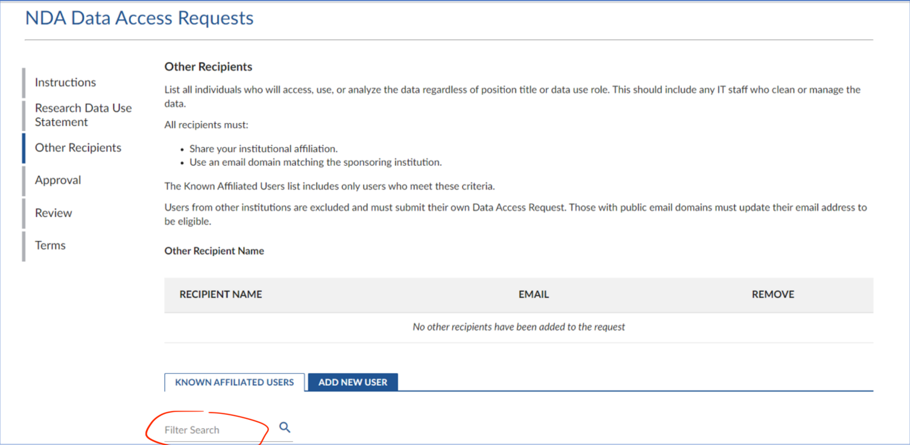  
  

6. For “Signing Official”, select Chrissa Pappannoiu ****[cp847@ored.rutgers.edu](mailto:cp847@ored.rutgers.edu)
    1. They will log into NDA to sign your eDAR.
    2. Email Signing official: 
    > “Hi Chrissa, 
    > I’m a researcher in the Holmes Lab, PI: Avram Holmes, and we’re applying for access to the NDA dataset [Enter dataset name]. The Data Access Request is within NDA for your signature. Thanks so much and please let me know if you have any questions.”
7. Review the details of your eDAR to ensure everything is correct and click ‘Next’ to proceed.
8. After reading the Terms and Conditions, check the boxes to certify your agreement, then click 'Confirm' to complete the process.
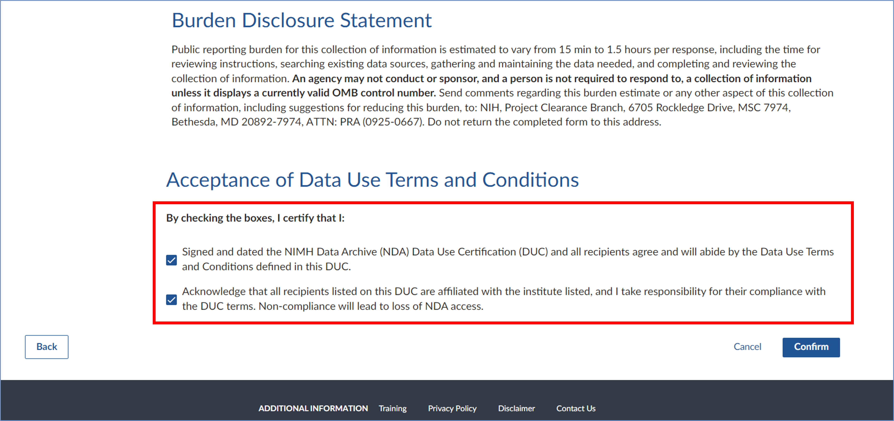
  
9. Wait to get granted access (~10 business days)  


### 3.2) Get added to your PI’s existing DAR for a collection/dataset
If additional individuals need data access after DAR approval, the lead recipient or new recipients must submit a new DAR using the “New Data Access Requests (DAR)” procedure (Steps in 3.1). The new DAR can reuse the same Research Data Use Statement if applicable.

### 3.3) Edit a DAR
1. Have the PI go to their Data Permissions dashboard and select 'View Request'.
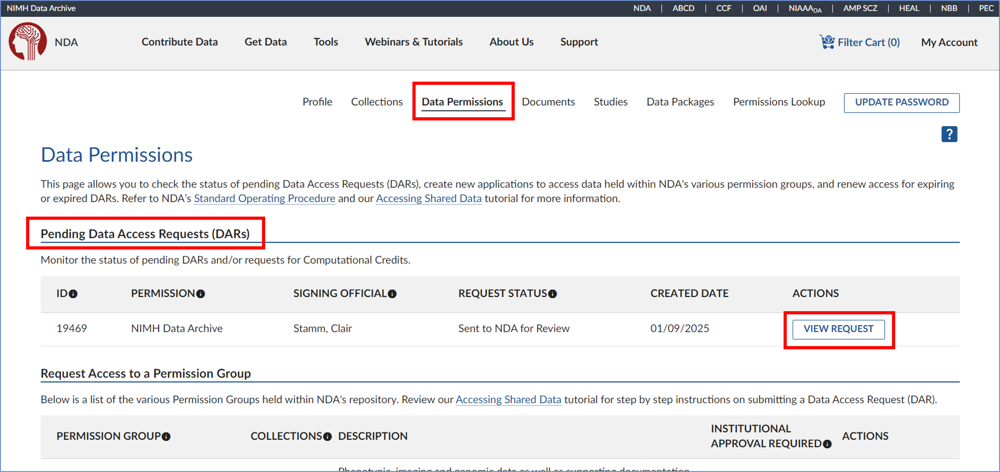
2. On the eDAR overview page, click 'Edit' in the top right corner.
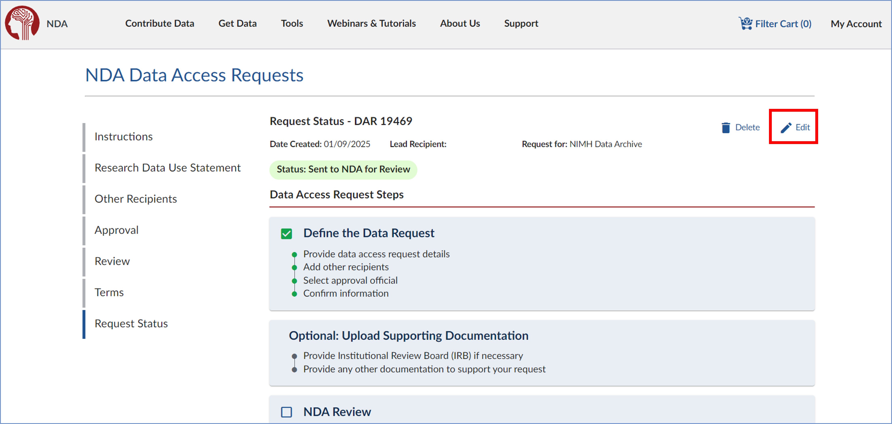
3. A prompt will appear asking, "Are you sure you want to edit this Data Access Request?" Read the message carefully, then click 'Yes' to proceed.
4. Once confirmed, you can edit the DAR. Click 'Start Request' to proceed.

### 3.4) Renewing an eDAR
1. Log into your NDA account with your eRA Commons username and password. Navigate to your Data Permissions Dashboard and select ‘Renew Access’ under the ‘Actions’ menu for the eDAR you wish to renew.
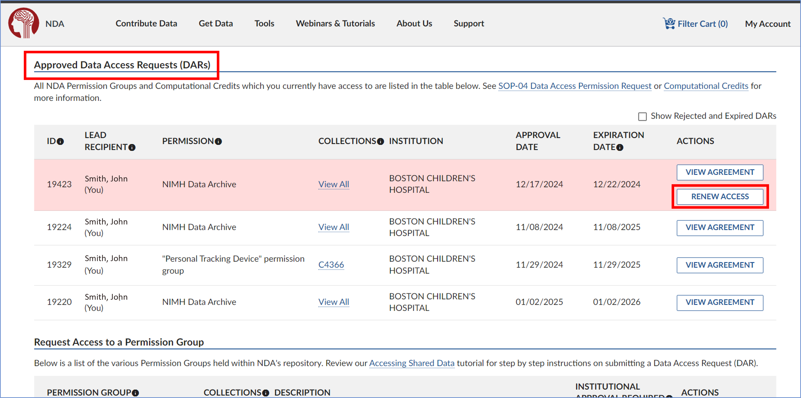
2. In the Research Data Use Statement section, review the information and make any necessary updates. Once you're done, click 'Next' to proceed.


# Data Downloads
## 2) Creating Python environment for Data Downloads

1. Create Conda environment

```bash
#first create a conda environemnt for the NDA downloader tool. Might not be needed, but was considered good practise the milgram cluster 
conda create --name NDA_download  python=3.11
conda activate NDA_download

#Do this every time
#install nda-tools package:
pip install nda-tools

#see if it worked 
conda list
```

## 3) Downloading Data from NDA to Compute Cluster

1. go to nda.nih.gov
2. sign in 
3. search the dataset you want
    1. Get Data > Text Search > “dataset name”
        
        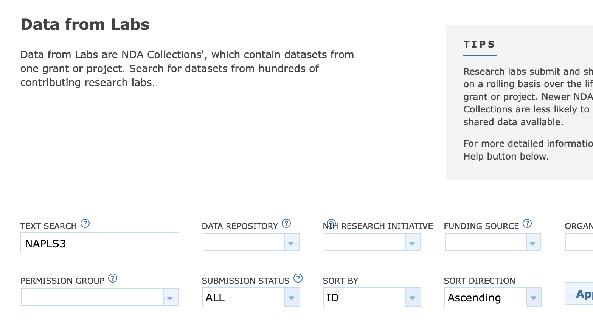
        
4. select it from the search results and press “Add to Workspace”
    
    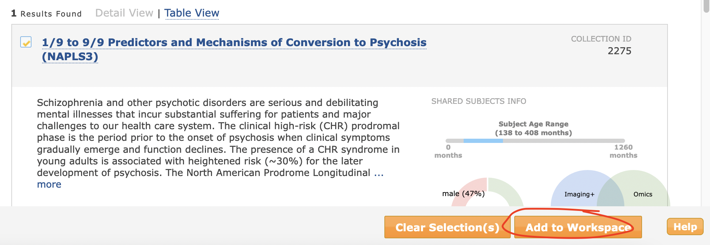
    
5. see that the number of subjects in the “**Filter Cart**” in the upper right hand corner is the appropriate amount. If so, press ‘Create Data Package/Add Data to Study’
    
    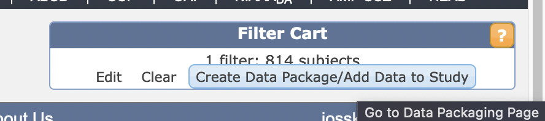
    
6. Press “Go to Data Packaging Page” (if it doesn’t automatically) and select from the checkboxes all the data you want
    1. on the left “Collections By Permission Group” is the collections/datasets and all their iterations
    2. on the right “Data Structure by Category” is the types of data within it
        1. deselect if you don’t want it
        
        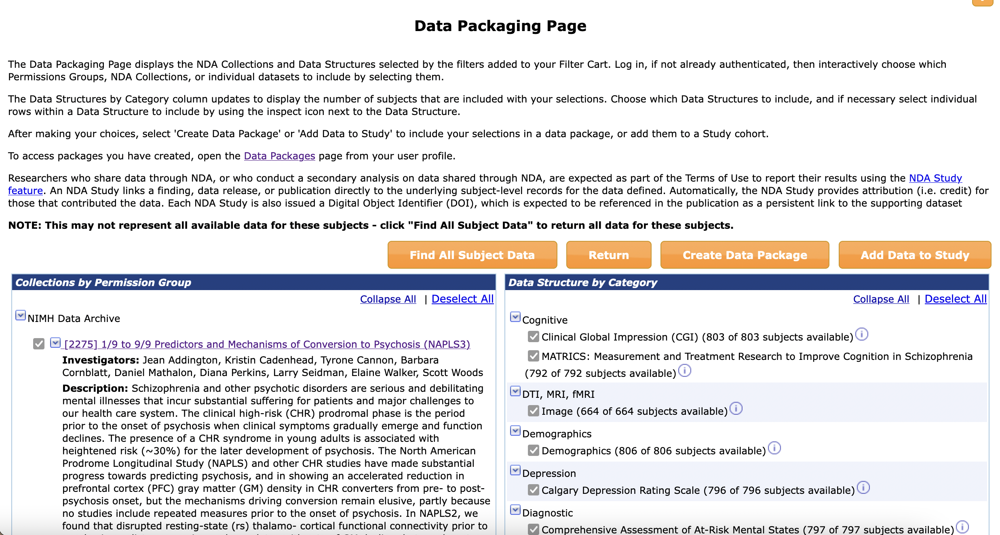
        
7. Press “Create Data Package” button
    1. Clear name so you can reference back
    2. Make SURE to check the box for “Include associated data files”
    3. press “Create Data Package” 
    
    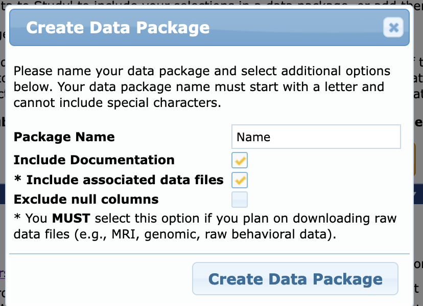
    
8. You should get a popup like this. Go to dashboard via link or go to your User Profile ([https://nda.nih.gov/user/dashboard/profile.html](https://nda.nih.gov/user/dashboard/profile.html)) and click on Data Packages
    
    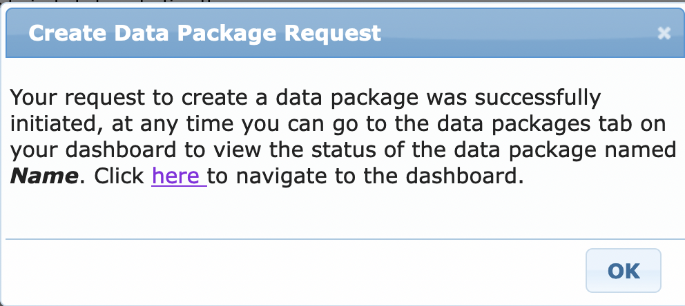
    
9. Your packages should look like this, including the one you just made. The just-made one will say Status: “Creating Package” for a couple minutes, but then will populate with Status: “Ready to Download” and the size
    
    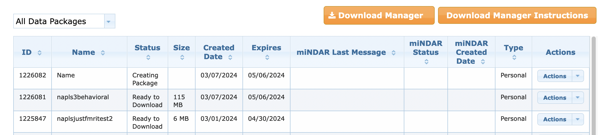
    
10. When it says “ready to download” and the size seems right, copy the Package ID Number in the first column for the package you want to download
11. Open text editor (BBEdit, Textedit, VSCode, etc.) and paste this code
    
    (downloadcmd is a command from the package nda-tools)
    
    ```bash
    
    downloadcmd -dp 1225580 -d /projects/f_ah1491_1/Open_Data/NAPLS3 -wt 5
    
    ```
    
- -wt = the number of files you download in parallel. You should use max 10.
- change 1225580 to YOUR PACKAGE ID
- change /projects/f_ah1491_1 to the FOLDER YOU WANT TO DOWNLOAD TO
1. Save this file as a NAME.sh file, and have NAME be relevant to the package you’re downloading
2. Go to terminal, input chmod `u+rwx [NAME.sh](http://NAME.sh)` to make sure you have execute permissions
3. Code Template:
    
    Just out file
    
    ```bash
    /path/to/my_script.sh 1>/path/to/my_script.out &
    ```
    
    Out file and error file
    
    ```bash
    /path/to/my_script.sh 1>/path/to/my_script.out 2>/path/to/my_script.err &
    ```
    
    This will run your script in the background (&) and save out the terminal outputs into a file with the same name but a different extension (.out) and the error files into that name but (.err)
    

1. It should prompt you here for your username and password from NDA. Make sure these are the credentials that link to the account where you created the data package!
2. Once the job starts running, you can check it’s running and its progress by entering `sacct`
    1. Your job should be listed in a table like this
    2. your job is the one that says ‘main’ at the top, in this example it’s ‘shell_dca+’ (which is the beginning of the [shellfile.sh](http://shellfile.sh) name). this is the one that should be ‘RUNNING’ and ‘COMPLETED’. if this one fails, the ‘batch’ or ‘extern’ files may say ‘COMPLETED’, but your job has still failed
        
        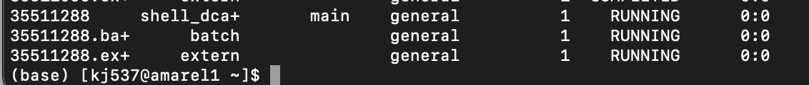
        

If it says “FAILED”:

1. Check the error file by displaying it, it’s called slurm.most.recent.err if you kept it as I have above, or it’s called however you defined in the [shellfile.sh](http://shellfile.sh) file
    
    vi slurm.most.recent.err
    
    (:q to quit the vi viewer)
    
    or 
    
    cat slurm.most.recent.err
    

Now that you see the problem, you can try to fix it! 

- if it says ‘permission denied’, try making sure both .sh files are fully rwx accessible to you, and the folders that hold those files are as well
- if it says ‘file cannot be found’, check all the filepaths in your files for errors, and make sure they line up exactly to where the files are
- if it is a new error or you can’t figure it out, ask other members of your lab or Rutgers’ Office of Advanced Research Computing (help@oarc.rutgers.edu)

## 4) More Information:

PDF Tutorial: [https://rutgers.box.com/s/fh8iv3luan3xonevzyijf185shpzavvm](https://rutgers.box.com/s/fh8iv3luan3xonevzyijf185shpzavvm)

Youtube Tutorial: [NDA Data Access Webinar](https://www.youtube.com/watch?v=53P6hEy-zaM&embeds_referring_euri=https%3A%2F%2Fwww.notion.so%2F&source_ve_path=MjM4NTE&feature=emb_title) 

[https://www.youtube.com/watch?v=53P6hEy-zaM](https://www.youtube.com/watch?v=53P6hEy-zaM)


## 4) NDA download In-Depth Tutorial

1. Open text editor (BBEdit, Textedit, VSCode, etc.) and paste the code you want to run via terminal
    
    (downloadcmd is a command from the package nda-tools)
    
    ```bash
    
    downloadcmd -dp 1225580 -d /projects/f_ah1491_1/Open_Data/NAPLS3 -wt 5
    
    ```
    
    - -wt = the number of files you download in parallel. You should use max 10.
    - change 1225580 to YOUR PACKAGE ID
    - change /projects/f_ah1491_1 to the FOLDER YOU WANT TO DOWNLOAD TO
2. Save this file as a NAME.sh file, and have NAME be relevant to the package you’re downloading
3. Create shell script
    1. Open a new file in text editor (BBEdit, Textedit, VSCode, etc.)
    2. paste this code:
    
    ```bash
    #! /bin/bash
    #SBATCH --partition=p_dz268_1 # CAHBIR partition
    #SBATCH --job-name=any-name # change to what you want the name to be 
    #SBATCH --nodes=1 # change depending on computational needs
    #SBATCH --ntasks=1 # change if parallelizing
    #SBATCH --cpus-per-task=1 # change depending on computational needs
    #SBATCH --mem=2000 # change depending on computational needs
    #SBATCH --time=48:00:00 # change depending on computational needs
    #SBATCH --output=slurm_%x.out # see below
    #SBATCH --error=slurm_%x.err # see below
    cd /download/folder  # where the file will be run from
    module purge
    
    # Activate the holmesenv virtual environment to use installed packages
    # If you want to use a different conda, create a different script like activate.sh which activates your desired conda
    /projects/f_ah1491_1/analysis_tools/holmesenv_conda/activate.sh 
    source ~/.bashrc

    srun /script/path/script.sh  # for bash script
    python3 /script/path/script.py # for python  
    ```
    
    - Change `slurm_%j.out` & `slurm_%j.err` to whatever you want your error/outfiles to be named. 
        - You can add filepaths before filenames so that the err and out files are saved to folders (ie batch_jobs/file.err or err/file.err, etc) but you must have any referenced folders CREATED before running the script
        - Renaming to `%x.out` will mean each time you run this job the slurm.out/slurm.err files will be replaced with the job-name, and will replace the current existing file, so the file would always the most recent run
            - This is recommended unless you're running jobs in parallel and want to save out each specific job instance log separately
            - Change job-name to change what will also autopopulate into the output/err folders, replacing `%x`
        - More % Options:
            - %x = Job name.
            - %j = jobid of the running job.
            - %N = short hostname. This will create a separate IO file per node.
            - %n = Node identifier relative to current job (e.g. "0" is the first node of the running job) This will create a separate IO file per node.
            - %s = stepid of the running job.
            - %t = task identifier (rank) relative to current job. This will create a separate IO file per task.
            - %u = User name.
    NOTE:
    - Change time=48:00:00 to however much time you think you’ll need. Max to request is 2 weeks, but the more time you request the longer your slurm job will sit in the queue before running.
        - To estimate timing, try downloading 1 subject file and time how long the download takes, then multiply that by number of subjects

    IMMEDIATE FAIL?
    - Check if your err and out files have any paths/folders-- if so, make sure those folders exist and you have rwx permissions to them
    - Make sure any files called have execute (x) permissions-- if not, run chmod (eg `chmod +x file.py`) for the relevant file, and then try running the slurm script again

14. Save this file as a SHELLNAME.sh file, naming it something relevant to the package + shell

1. Make sure both .sh files are in the SAME folder in your home directory, or *somewhere in amarel*, not on your local computer
    
    
    
2. open terminal
    1. run `cd /home/kj537/nda_downloads` ← replace with wherever your .sh files are saved
    2. run `sbatch SHELLNAME.sh`
3. It should prompt you here for your username and password from NDA. Make sure these are the credentials that link to the account where you created the data package!
4. Once the job starts running, you can check it’s running and its progress by entering `sacct`
    1. Your job should be listed in this table like this
        
        
        